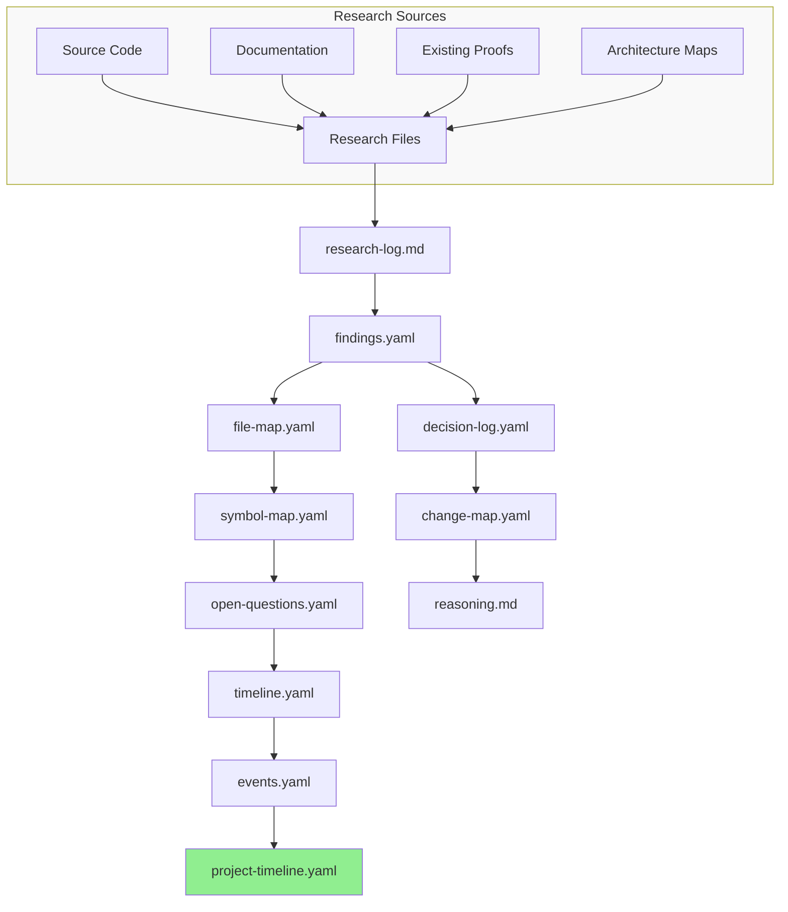

# TD Research State and Timeline Doctrine

**Document ID:** `TD_RESEARCH_AND_TIMELINE_DOCTRINE`  
**Version:** 1.0.0  
**Status:** ACTIVE  
**Author:** Anigma Governance Authority  
**Last Updated:** 2025-01-15  
**Applies To:** All TD tasks, epics, and research activities  

---

## 1. Purpose

This doctrine establishes the **Research State and Timeline System** for the Anigma project, defining how tasks track research state, inspected files/symbols, planned modifications, doctrine alignment, reasoning chains, canonical documentation effects, and timeline events.

### The Problem This Solves

Historically, Anigma relied on:
- **TD database** = execution queue (ephemeral, reset-prone)
- **Docs/proofs/** = evidence artifacts (durable, proof-only)
- **Docs/td/** = task descriptors (durable, structural)

**Missing:** A durable **task-memory layer** that captures:
- What was researched and discovered
- What files/symbols were inspected
- What modifications are planned
- How decisions align with doctrine
- Why certain approaches were chosen or rejected
- How the work affects canonical documentation
- When key events occurred and their rollup to project timeline

Without this, knowledge is lost across TD resets, agent handoffs, and context switches.

---

## 2. System Architecture

```
┌─────────────────────────────────────────────────────────────────┐
│                    DOCS-AS-CODE ARCHITECTURE                        │
├─────────────────────────────────────────────────────────────────┤
│                                                                   │
│  TD DATABASE              DOCS/                     PROOFS/        │
│  ─────────────────────────   ─────────────────────   ─────────    │
│  Executable queue          Task Memory Layer          Evidence     │
│  (ephemeral)               (DURABLE)                 (durable)   │
│                                                                   │
│  └─ td start/stop          Docs/td/                  Docs/proofs/ │
│  └─ td log                 │   │                         │        │
│  └─ td ready               │   ├── <status>/           │        │
│                            │   │   └── <epic>/          │        │
│                            │   │       ├── epic.md      │        │
│                            │   │       ├── epic.yaml    │        │
│                            │   │       ├── research/    │──┐     │
│                            │   │       │   │            │  │     │
│                            │   │       │   ├── research-log.md    │     │
│                            │   │       │   ├── findings.yaml      │     │
│                            │   │       │   ├── file-map.yaml      │     │
│                            │   │       │   ├── symbol-map.yaml    │     │
│                            │   │       │   └── open-questions.yaml│     │
│                            │   │       ├── decisions/   │──┐     │
│                            │   │       │   └── decision-log.yaml│  │     │
│                            │   │       ├── timeline/   │──┘     │
│                            │   │       │   ├── timeline.md       │        │
│                            │   │       │   └── events.yaml       │        │
│                            │   │       └── tasks/       │        │
│                            │   │           └── <task-id>/│        │
│                            │   │               ├── task.md       │        │
│                            │   │               ├── task.yaml     │        │
│                            │   │               ├── research.md   │──┐     │
│                            │   │               ├── change-map.yaml│  │     │
│                            │   │               ├── reasoning.md   │  │     │
│                            │   │               └── timeline.yaml │  │     │
│                            │   │                             │  │     │
│  Bootstrap ─────────────────┴───┴─────────────────────┴──┘   │
│      ↓                                                          │
│  Docs/timeline/                                                │
│  ├── README.md                                                  │
│  ├── project-timeline.yaml     ←─ Task events roll up here     │
│  ├── project-timeline.md                                       │
│  ├── decisions.yaml            ←─ Epic decisions roll up here │
│  └── canonical-doc-changes.yaml ←─ Doc effects roll up here    │
│                                                                   │
└─────────────────────────────────────────────────────────────────┘
```

### Data Flow



---

## 3. Research vs Proof

### Research State (DURABLE, TASK MEMORY)

**Purpose:** Capture the *journey* of understanding and planning

| Artifact | Purpose | When Created | When Updated |
|----------|---------|--------------|--------------|
| `research-log.md` | Narrative of investigation | First inspection | Every research session |
| `findings.yaml` | Structured discoveries | After initial review | As findings accumulate |
| `file-map.yaml` | Files inspected | When files identified | As more files found |
| `symbol-map.yaml` | Symbols inspected | When code reviewed | As symbols identified |
| `open-questions.yaml` | Unresolved questions | When questions arise | As questions answered/closed |
| `change-map.yaml` | Planned modifications | After doctrine alignment | As plan evolves |
| `reasoning.md` | Decision rationale chain | After options considered | As reasoning refined |

**Lifetime:** Created at `intake` or `source_review` stage, updated through `proof` stage, **retained** for historical reference even after task completion (per `gc_policy`).

### Proof (DURABLE, EVIDENCE)

**Purpose:** Capture the *outcome* - what was implemented and verified

| Artifact | Purpose | Location |
|----------|---------|----------|
| Proof documents | Task completion evidence | `Docs/proofs/<task-id>.md` |
| Test results | Verification outputs | `Docs/proofs/<task-id>-tests.md` |
| Validation outputs | Validator outputs | ` Docs/proofs/<task-id>-validation.md` |
| Evidence links | Links to artifacts | In task YAML `proof` field |

**Lifetime:** Created at `verification` or `proof` stage, **never modified** after task closure.

### Key Difference

| Aspect | Research State | Proof |
|--------|----------------|-------|
| **Purpose** | "How we got here" | "What we delivered" |
| **Mutability** | Evolves with understanding | Immutable after completion |
| **Audience** | Future maintainers, agents | Reviewers, auditors |
| **Location** | `Docs/td/<status>/<epic>/research/` and task folders | `Docs/proofs/` |
| **Schema** | `td-research.schema.json`, `td-change-map.schema.json` | No schema (free-form evidence) |
| **Validation** | Stage progression, YAML structure | File existence, link validity |

**Doctrine:** 
- Research state is **necessary but not sufficient** for completion
- Proof is **sufficient but not necessary** for research (you can research without completing)
- A task is complete **only when both research state is closed AND proof exists**

---

## 4. Change Maps vs Git Diffs

### Change Map (PLANNED)

**Purpose:** Declare *intent* - what we plan to modify and why

```yaml
# change-map.yaml
status: planned  # or in_progress, completed, abandoned
task_id: td-a84da2
affected_surface: SubprocessPooling
action: extend
files:
  - path: anigma/Sources/SubprocessPooling/Manager.swift
    rationale: "Add warm pool lifecycle management"
    line_ranges: []  # Empty until code_map stage
    symbols:
      - ProcessPool
      - SubprocessWorker
      
doctrine_alignment:
  - rule: "No direct Process spawning"
    reference: Docs/governance/DAEMON_RUNTIME_DOCTRINE.md
    status: compliant
    
verification_profiles:
  - p0-daemon-runtime
  - governance

expected_proof:
  - "SubprocessManagerTests.swift passes"
  - "validate_tiers.py passes"
```

### Git Diff (ACTUAL)

**Purpose:** Show *actual* changes made

```diff
diff --git a/anigma/Sources/SubprocessPooling/Manager.swift
+ class ProcessPool<W: Worker> {
+     func checkout() -> WorkerLease { ... }
+ }
```

### Key Differences

| Aspect | Change Map | Git Diff |
|--------|------------|----------|
| **When** | Before implementation | After implementation |
| **Content** | Intent, rationale, alignment | Actual code changes |
| **Granularity** | File, symbol, surface level | Line-by-line |
| **Doctrine** | Explicit alignment claims | Implicit (must be validated) |
| **Line Numbers** | Only when inspected (`code_map+` stage) | Always present |
| **Purpose** | Planning, review, estimation | Code review, audit |

**Doctrine:**
- Change maps are **commitment devices** - they force explicit declaration before modification
- Git diffs are **verification devices** - they show what actually changed
- **Both must exist** for any non-trivial change
- Change maps **must be updated** if the actual changes differ from the plan
- Line ranges **must not be invented** - only recorded when actually inspected

---

## 5. Doctrine Alignment

### What Must Be Recorded

For every task that modifies code or documentation, record:

1. **Doctrine Sources** - Which governance/architecture documents apply
2. **Alignment Status** - For each rule: compliant / needs_wavier / violation
3. **Waiver Rationale** - If seeking exception to doctrine
4. **Review Status** - Who approved the alignment (or that it's pending)

```yaml
# In change-map.yaml or decision-log.yaml
doctrine_alignment:
  - rule: "Tier 3 must not import Tier 1"
    reference: Docs/governance/TIER_BOUNDARY_DOCTRINE.md
    status: compliant
    verified_by: validate_tiers.py
    
  - rule: "No @_exported imports outside Tier 1 facades"
    reference: Docs/governance/EXPORTED_IMPORTS_DOCTRINE.md
    status: compliant
    verified_by: validate_exported_imports.py
    
  - rule: "All public APIs must have @_exported"
    reference: Docs/governance/PUBLIC_API_DOCTRINE.md
    status: needs_waiver
    rationale: "Internal daemon IPC does not need public API stability"
    waiver_requested: true
    waiver_approved: null
```

**Doctrine:**
- Doctrine alignment **must be recorded before implementation** begins
- All alignment claims **must reference specific doctrine documents**
- Non-compliant items **must have explicit waiver or be blocked**
- Alignment **must be re-verified** after changes are made

---

## 6. Canonical Documentation Effects

### How Tasks Can Modify Canonical Documentation

| Action | Effect Type | Recording Location | Approval Required |
|--------|-------------|-------------------|-------------------|
| Create new doc | addition | `canonical_doc_effects` in task YAML | None (if in scope) |
| Modify existing doc | modification | `canonical_doc_effects` in task YAML | Task owner |
| Delete doc | removal | `canonical_doc_effects` in task YAML | Epic owner |
| Move doc | relocation | `canonical_doc_effects` in task YAML | Architecture owner |
| Deprecate doc | deprecation | `canonical_doc_effects` in task YAML | Governance owner |

### canonical_doc_effects Field

```yaml
# In task.yaml or epic.yaml
canonical_doc_effects:
  - action: modify
    path: Docs/governance/DAEMON_RUNTIME_DOCTRINE.md
    section: "Process Pooling"
    change: "Add subprocess warm pool requirements"
    status: proposed  # or approved, implemented, reverted
    approved_by: null
    implemented_in: null  # Task ID that implemented this
    
  - action: add
    path: Docs/architecture/maps/logic-flows/subprocess-pooling-flow.mmd
    status: proposed
    approved_by: null
```

### Rollup to Global Timeline

Canonical documentation effects **roll up** to `Docs/timeline/canonical-doc-changes.yaml`:

```yaml
# Docs/timeline/canonical-doc-changes.yaml
- date: "2025-01-15"
  task_id: td-a84da2
  epic_id: p0-004
  action: add
  path: Docs/architecture/maps/logic-flows/subprocess-pooling-flow.mmd
  summary: "Added subprocess pooling logic flow diagram"
  status: implemented
  
- date: "2025-01-14"
  task_id: p1-validate-tiers-green-gate
  epic_id: p1-validate-tiers-green-gate
  action: modify
  path: Docs/governance/TIER_BOUNDARY_DOCTRINE.md
  summary: "Added green gate completion criteria"
  status: implemented
```

**Doctrine:**
- Every change to `Docs/` (except `Docs/td/` and `Docs/proofs/`) **must be recorded**
- Changes **must reference the task** that caused them
- Rollup **can be automated** but must be **verifiable**

---

## 7. Timeline Events and Rollup

### Timeline Event Types

| Type | Description | Example |
|------|-------------|---------|
| `research_start` | Research phase began | "Started source code review for P0-004" |
| `research_complete` | Research phase ended | "Completed doctrine alignment for td-a84da2" |
| `decision` | Architectural decision made | "Chosen SubprocessManager over ProcessPool" |
| `implementation_start` | Code modification began | "Started modifying SubprocessManager.swift" |
| `implementation_complete` | Code modification ended | "Completed warm pool lifecycle implementation" |
| `verification_start` | Verification began | "Started running integration tests" |
| `verification_complete` | Verification ended | "All tests passing, validators green" |
| `proof_created` | Proof artifact created | "Generated p0-004-phase1-proof.md" |
| `task_complete` | Task marked complete | "td-a84da2 marked done" |
| `epic_complete` | Epic marked complete | "p0-004 all phases complete" |
| `blocker_found` | Issue discovered | "Found tier violation in MediaCore import" |
| `blocker_resolved` | Issue resolved | "Fixed by refactoring to use contract interface" |

### Event Rollup Hierarchy

```
Task Timeline (task/timeline.yaml)
    ↓ Rollup
Epic Timeline (epic/timeline/events.yaml)
    ↓ Rollup
Project Timeline (Docs/timeline/project-timeline.yaml)
```

Each event has:
- `event_id`: Unique within its timeline file
- `timestamp`: ISO 8601 datetime
- `task_id`: The task that generated this event
- `epic_id`: The epic containing the task
- `type`: One of the event types above
- `summary`: Human-readable description
- `actor`: Who performed the action (agent, human, script)
- `evidence`: Link to proof or artifact
- `affected_docs`: List of Docs/ files affected
- `affected_code`: List of source files affected
- `canonical_effect`: Effect on canonical documentation
- `followups`: Related events or tasks

**Doctrine:**
- Events **must have unique IDs** within their timeline file
- Events **must reference valid task/epic IDs**
- Events **must have valid timestamps**
- Rollup **must preserve event identity** (same ID at all levels)

---

## 8. Agent Workflow

### Research Stage Progression

| Stage | Trigger | Required Artifacts | Exit Criteria |
|-------|---------|-------------------|---------------|
| `intake` | Task created | `task.yaml`, `task.md` | Task has ID, title, priority |
| `source_review` | Task claimed | `research-log.md` started | Docs/roadmaps/proofs identified |
| `code_map` | Source files identified | `file-map.yaml`, `symbol-map.yaml` | Files/symbols listed (line_ranges empty unless inspected) |
| `doctrine_alignment` | Files/symbols known | `change-map.yaml` with `doctrine_alignment` | All applicable doctrine rules addressed |
| `implementation_plan` | Doctrine aligned | `change-map.yaml` complete, `reasoning.md` | Approved shape, non-goals defined |
| `implementation` | Plan approved | Implementation started | Worktree active |
| `verification` | Implementation done | Test results, validator outputs | All verification profiles pass |
| `proof` | Verification passes | Proof artifacts in `Docs/proofs/` | All acceptance criteria met |
| `closed` | Proof reconciled | All artifacts complete | Status = done/complete |

### Agent Responsibilities by Stage

| Stage | Agent Must |
|-------|-----------|
| `intake` → `source_review` | Read task.md, understand scope, identify related docs |
| `source_review` → `code_map` | Identify relevant source files, create file-map.yaml |
| `code_map` → `doctrine_alignment` | Identify relevant symbols, check against doctrine |
| `doctrine_alignment` → `implementation_plan` | Record alignment, create change map, write reasoning |
| `implementation_plan` → `implementation` | Ensure plan is approved, start work |
| `implementation` → `verification` | Implement changes, update change map if plan deviated |
| `verification` → `proof` | Run all validators, capture outputs |
| `proof` → `closed` | Create proof artifact, update status |

### What Humans Should Read First

**For Reviewing a Task:**
1. `task.md` - Human context and handoff notes
2. `change-map.yaml` - What's planned to change
3. `reasoning.md` - Why these decisions were made
4. `decision-log.yaml` - Key decisions and their rationale

**For Auditing a Task:**
1. `Docs/proofs/<proof-file>.md` - Evidence of completion
2. `timeline.yaml` - What happened and when
3. `change-map.yaml` - What was actually modified
4. Proof links in `task.yaml`

**For Understanding Project State:**
1. `Docs/td/INDEX.md` - All tasks by status
2. `Docs/timeline/project-timeline.md` - Project history
3. `Docs/timeline/canonical-doc-changes.yaml` - Documentation evolution
4. `Docs/governance/` - Current doctrine

---

## 9. Context GC Interaction

### Research/Timeline Records and GC

| GC Policy | Research Files | Timeline Files | Decision Logs |
|-----------|----------------|----------------|---------------|
| `retain_all` | Kept | Kept | Kept |
| `compact_on_complete` | Kept (task memory) | Kept (history) | Kept (rationale) |
| `compact_on_done` | Compacted to epic level | Kept | Kept |
| `archive_only` | Archived with task | Archived with task | Archived with task |

**Doctrine:**
- Research state is **durable task memory** - GC policies apply but with bias toward retention
- Timeline events **roll up** - even if task artifacts are compacted, the event history remains
- Decision logs **are retained** - rationale must survive for future reference
- **Default for tasks:** `compact_on_complete` (retain research for 30 days after completion, then archive)
- **Default for epics:** `retain_all` (epic-level research is always retained)

### GC-Aware Fields

```yaml
# In task.yaml
gc_policy: compact_on_complete  # When to compact this task's artifacts
context_load_policy: lazy       # How much context to load initially

# In epic.yaml
gc_policy: retain_all            # Epic-level research is always kept
context_load_policy: eager      # Load full context for epics
```

---

## 10. Verification

### Validation Commands

```bash
# Validate research YAML files parse
python3 Scripts/validate_td_folder_system.py --check-research

# Validate all timeline YAML files
python3 Scripts/validate_td_folder_system.py --check-timeline

# Validate decision logs
python3 Scripts/validate_td_folder_system.py --check-decisions

# Validate change maps
python3 Scripts/validate_td_folder_system.py --check-change-maps

# Full validation
python3 Scripts/validate_td_folder_system.py --all-checks
```

### Schema Validation

All research artifacts must validate against their schemas:
- `Docs/schemas/td-research.schema.json` - research structures
- `Docs/schemas/td-change-map.schema.json` - change map structure
- `Docs/schemas/td-timeline-event.schema.json` - timeline event structure
- `Docs/schemas/td-decision.schema.json` - decision log structure

---

## 11. Glossary

| Term | Definition |
|------|------------|
| **Task Memory Layer** | The durable research state stored in `Docs/td/` that survives TD resets |
| **Research State** | The collection of research artifacts for a task/epic |
| **Change Map** | A planned modification declaration with doctrine alignment |
| **Timeline Event** | A recorded occurrence with task/epic Rollup |
| **Doctrine Alignment** | Explicit mapping of planned changes to governance rules |
| **Canonical Documentation Effects** | Changes to `Docs/` (excluding `td/` and `proofs/`) |
| **Rollup** | Aggregation of task-level events to epic and project timelines |
| **GC Policy** | Garbage collection policy for artifact retention |
| **Context Load Policy** | Strategy for loading task context (eager/lazy/on_demand) |

---

## 12. References

- [TD Source of Truth Doctrine](../TD_SOURCE_OF_TRUTH_DOCTRINE.md)
- [TD Context Garbage Collection](../TD_CONTEXT_GARBAGE_COLLECTION.md)
- [Verification Profiles Manifest](../../manifests/verification-profiles.yaml)
- [TD Folder System README](../../td/README.md)
- [Anigma Governance Index](../../governance/README.md)

---

## 13. Changelog

| Date | Author | Change |
|------|--------|--------|
| 2025-01-15 | Anigma Governance Authority | Initial version |

---

**Status:** ACTIVE  
**Next Review:** 2025-02-15  
**Owner:** Anigma Architecture Governance
