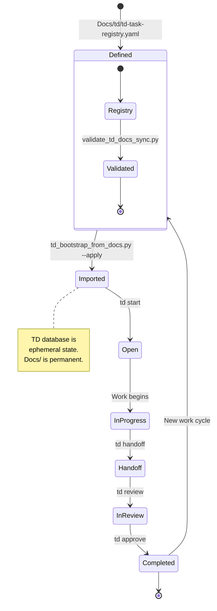

# TD Source-of-Truth Doctrine

**Document ID:** TD-DOCTRINE-2026-001  
**Version:** 1.0.0  
**Status:** CANONICAL  
**Owner:** Architecture Team  
**Canonical Path:** `Docs/governance/TD_SOURCE_OF_TRUTH_DOCTRINE.md`  
**Date:** 2026-05-02  

---

## Purpose

This doctrine establishes the **correct relationship** between the TD (task tracking) database and the Anigma documentation system. After a TD database reset on 2026-05-02, we use this as an opportunity to **fix the architecture**: TD is the *local execution queue*, Docs/ is the *durable source of truth*.

---

## Core Principle

> **Docs/ defines what must be done. TD tracks what is being done. Proofs/ proves what was done.**

This separation ensures:
- **Reproducibility**: TD can be rebuilt from Docs/ after any reset
- **Auditability**: All work is traceable through Docs/ → TD → Proofs/ chain
- **Clarity**: No confusion about where canonical truth lives
- **Resilience**: Local TD state loss is not a disaster

---

## Architecture Model

```
┌─────────────────────────────────────────────────────────────────┐
│                    DURABLE SOURCE OF TRUTH                        │
├─────────────────────────────────────────────────────────────────┤
│                                                                 │
│  Docs/                                                             │
│  ├── roadmaps/           ← Roadmap ordering, lane definitions   │
│  │   ├── MASTER_ROADMAP_2026.md                                    │
│  │   └── P0_CRITICAL_PATH.md                                       │
│  ├── manifests/          ← Machine-readable artifact catalog     │
│  │   ├── documentation-artifacts.yaml                             │
│  │   └── td-task-registry.yaml      ← CANONICAL TASK DEFINITIONS │
│  ├── schemas/            ← JSON Schema for task structure        │
│  │   └── td-task.schema.json                                       │
│  ├── td/                 ← Task documentation                     │
│  │   └── td-task-registry.yaml      ← Same as manifests/ entry   │
│  └── proofs/             ← Evidence of completed work              │
│      ├── p0-004-anigmad-subprocess-pooling.md                    │
│      ├── p1-validate-tiers-green-gate.md                          │
│      └── td-source-of-truth-recovery.md  ← THIS DOCTRINE PROOF   │
│                                                                 │
└─────────────────────────────────────────────────────────────────┘
                              │
                              ▼
┌─────────────────────────────────────────────────────────────────┐
│              EXECUTION / SYNCHRONIZATION LAYER                   │
├─────────────────────────────────────────────────────────────────┤
│                                                                 │
│  Scripts/                                                        │
│  ├── td_bootstrap_from_docs.py    ← Rebuild TD from Docs/        │
│  └── validate_td_docs_sync.py     ← Validate Docs/ ↔ TD sync     │
│                                                                 │
└─────────────────────────────────────────────────────────────────┘
                              │
                              ▼
┌─────────────────────────────────────────────────────────────────┐
│                  LOCAL EXECUTION STATE                           │
├─────────────────────────────────────────────────────────────────┤
│                                                                 │
│  .todos/issues.db         ← TD Database (ephemeral)              │
│  .todos/command_usage.jsonl                                       │
│                                                                 │
│  TD tracks:                                                      │
│  ✓ Current local queue                                           │
│  ✓ Task state (open/in_progress/in_review/done)                  │
│  ✓ Assignment and owner                                          │
│  ✓ Review workflow state                                         │
│  ✓ Worktree/session context                                      │
│                                                                 │
│  TD does NOT track:                                              │
│  ✗ Canonical roadmap ordering                                    │
│  ✗ Task acceptance criteria                                       │
│  ✗ Proof requirements                                            │
│  ✗ Architectural decisions                                        │
│  ✗ Historical completion evidence                                │
│                                                                 │
└─────────────────────────────────────────────────────────────────┘
```

---

## What Belongs Where

### Docs/ (Durable Source of Truth)

| Category | Location | Contains |
|----------|----------|----------|
| **Roadmap Ordering** | `Docs/roadmaps/` | Lane sequencing, phase ordering, dependency graphs |
| **Active Lanes** | `Docs/P0_CRITICAL_PATH.md` | What's P0 now, what blocks what |
| **Task Definitions** | `Docs/td/td-task-registry.yaml` | Canonical task IDs, titles, acceptance, proofs |
| **Task Schema** | `Docs/schemas/td-task.schema.json` | Format validation for task definitions |
| **Architecture Doctrine** | `Docs/governance/` | Rules governing all work |
| **Proof Documents** | `Docs/proofs/` | Evidence that work was completed correctly |
| **ADRs** | `Docs/ADR/` | Architecture Decision Records |

### TD Database (Local Execution State)

| Category | Location | Contains |
|----------|----------|----------|
| **Current Queue** | `.todos/issues.db` | Tasks currently being worked on |
| **Session State** | `.todos/sessions/` | Which session is working on what |
| **Worktree Context** | `.todos/` | Mapping of worktrees to epics/lanes |

### Scripts/ (Synchronization Bridge)

| Script | Purpose |
|--------|---------|
| `td_bootstrap_from_docs.py` | Import tasks from Docs/td/td-task-registry.yaml into TD |
| `validate_td_docs_sync.py` | Validate that TD and Docs/ are in sync |

---

## Why TD Must Be Reconstructible

### The Problem (Pre-2026-05-02)

TD was being used as the source of truth for:
- Roadmap definitions
- Task scoping
- Acceptance criteria
- Architectural decisions

This created critical failures:
1. **Single point of failure**: If TD database was lost, roadmap was lost
2. **No audit trail**: Completed tasks had no durable evidence
3. **No validation**: No way to check TD state against actual requirements
4. **Drift**: TD state diverged from documentation without detection

### The Solution (Post-2026-05-02)

**Docs/ is canonical. TD is derived.**

Benefits:
1. **Resilience**: TD reset → run bootstrap script → TD restored
2. **Auditability**: Every task has a source doc and proof artifact
3. **Validation**: `validate_td_docs_sync.py` detects drift
4. **Reproducibility**: Any developer can rebuild TD from Docs/

---

## Workflow

### Starting Work

```bash
# 1. Rebuild TD from Docs/ (after reset or fresh clone)
python3 Scripts/td_bootstrap_from_docs.py --apply

# 2. Start a task
td start p0-004

# 3. Do work...
# ... implementation happens ...

# 4. Handoff (required)
td handoff p0-004 --done "Implementation complete" --remaining "Needs review"

# 5. Submit for review
td review p0-004
```

### After TD Database Reset

```bash
# Reconstruct TD from canonical docs
python3 Scripts/td_bootstrap_from_docs.py --apply

# Verify sync
python3 Scripts/validate_td_docs_sync.py

# Continue working
```

### Completing Work

```bash
# In a different session
Session: ses_different_user

# Review and approve
td approve p0-004 --reason "Code reviewed, tests pass"
```

### Creating New Tasks

**DO THIS:**
```bash
# 1. Add task definition to canonical registry
# Edit Docs/td/td-task-registry.yaml
vim Docs/td/td-task-registry.yaml

# 2. Validate sync
python3 Scripts/validate_td_docs_sync.py

# 3. Import into TD
python3 Scripts/td_bootstrap_from_docs.py --apply
```

**DO NOT DO THIS:**
```bash
# ❌ Wrong: Creating tasks directly in TD without Docs/ entry
td add "Some task"
```

---

## Task Registry Structure

The canonical task registry (`Docs/td/td-task-registry.yaml`) defines all active tasks:

```yaml
version: "1.0"
source: Docs/td/td-task-registry.yaml
generated_for: td

lanes:
  p0-critical-path:
    title: "P0 Critical Path"
    description: "Blocking work for public release"
    owner: "Core Team"
    
  daemon-runtime-isolation:
    title: "Daemon Runtime Isolation"
    description: "Subprocess pooling and daemon Hardyfication"
    owner: "Daemon Team"

  publication-cleanup:
    title: "Publication Cleanup"
    description: "Prepare repository for public GitHub"
    owner: "Architecture Team"

tasks:
  - id: p0-004
    title: "anigmad Subprocess Pooling"
    priority: P0
    type: epic
    status: ready
    lane: daemon-runtime-isolation
    
    source_docs:
      - Docs/P0_CRITICAL_PATH.md
      - Docs/proofs/p0-004-anigmad-subprocess-pooling.md
    
    acceptance:
      - anigmad subprocess pool lifecycle is implemented
      - worker lease checkout/checkin is tested
      - crashed workers are detected and recycled or retired
      - shutdown reaps child processes deterministically
      - governance validators pass
    
    proof:
      - Docs/proofs/p0-004-anigmad-subprocess-pooling.md
    
    children:
      - td-a84da2
      - td-80575e
      - td-bfe7a3
      - td-0dfb09
      - td-73aea8
      - td-ce4439
```

---

## Bootstrap Script

`Scripts/td_bootstrap_from_docs.py` is the **authoritative bridge** between Docs/ and TD.

### Usage

```bash
# Dry run: Show what would be imported
python3 Scripts/td_bootstrap_from_docs.py --emit-commands

# Apply: Actually import into TD
python3 Scripts/td_bootstrap_from_docs.py --apply

# Validate existing TD state
python3 Scripts/td_bootstrap_from_docs.py --validate
```

### Behavior

1. **Parse** `Docs/td/td-task-registry.yaml`
2. **Validate** required fields (id, title, priority at minimum)
3. **Check** for existing TD tasks with matching IDs
4. **Skip** tasks already in TD (idempotent)
5. **Emit** `td create` commands for new tasks
6. **Apply** commands to TD database when `--apply` is used

### Idempotency

The script is **idempotent** by design:
- If a task exists in TD with the same ID → skip
- If a task exists with the same title but different ID → flag for manual review
- If a task in TD has no registry entry → flag as "ad hoc" (allowed but tracked)

---

## Sync Validator

`Scripts/validate_td_docs_sync.py` ensures Docs/ and TD stay in sync.

### Validation Rules

| Rule | Check | Severity |
|------|-------|----------|
| **SRC-001** | Every non-ad-hoc TD task has a registry entry | ERROR |
| **SRC-002** | Every registry task can be validated against td-task.schema.json | ERROR |
| **SRC-003** | Every completed task has a proof artifact in Docs/proofs/ | ERROR |
| **SRC-004** | Every proof path in registry points to existing file | ERROR |
| **SRC-005** | Every source_docs path in registry points to existing file | ERROR |
| **SRC-006** | Task IDs in registry are unique | ERROR |
| **SRC-007** | Child task IDs are listed in parent's children array | WARNING |
| **SRC-008** | Ad-hoc TD tasks are explicitly marked | INFO |

### Usage

```bash
# Validate current state
python3 Scripts/validate_td_docs_sync.py

# Validate with verbose output
python3 Scripts/validate_td_docs_sync.py --verbose

# Exit codes
# 0 = All checks pass
# 1 = Errors detected
# 2 = Warnings detected (only with --strict)
```

---

## Worktree Mapping

**Worktrees map to epics/lanes, NOT individual tasks.**

| Worktree | Maps To | TD Usage |
|----------|---------|----------|
| `anigma/` | Anigma core development | Multiple lanes |
| `scripts/` | Tooling and automation | Infrastructure lane |
| `docs/` | Documentation | Documentation lane |

**One worktree can contain multiple TD tasks from the same lane.**

This prevents:
- Worktree sprawl (one per task)
- Cross-context merge conflicts
- Difficulty tracking multi-file changes

---

## Handling Stale TD Tasks

### Scenario: Task exists in TD but not in Docs/

**Action:**
1. Check if task is ad-hoc (`td add` without registry entry)
2. If ad-hoc and still relevant → add to registry
3. If ad-hoc and no longer relevant → close with reason "stale - no registry entry"
4. If not ad-hoc → **ERROR** - registry is out of date, must be fixed

### Scenario: Task completed but no proof artifact

**Action:**
1. Check if proof exists but with different path
2. If proof exists → update registry
3. If no proof → **ERROR** - create proof before closing
4. Never close a task without proof

### Scenario: Registry task has no TD entry

**Action:**
1. Run bootstrap script to import
2. If import fails → fix registry entry
3. Never have a task only in registry without TD entry for active work

---

## Proof Requirements

Every completed task MUST have a proof document in `Docs/proofs/`.

### Proof Document Structure

```markdown
# <Task ID>: <Task Title>

**Task:** <task-id> — <title>
**Canonical Proof Path:** Docs/proofs/<task-id>.md
**Date:** YYYY-MM-DD
**Status:** COMPLETE

---

## Objective
<What this task accomplished>

## Evidence
- [ ] Code changes (list files)
- [ ] Tests passing (commands and results)
- [ ] Validators passing (commands and results)
- [ ] Artifacts created (list)
- [ ] No runtime source changes (if applicable)

## Validation
```bash
<commands that verify completion>
```

## Architecture Integrity
- [ ] No new runtime feature work introduced
- [ ] No validator weakening
- [ ] Tier boundaries respected
- [ ] All governance validators pass

---

## Conclusion
**Status:** COMPLETE / COMPLETED / VERIFIED
```

---

## Task Lifecycle



---

## Critical Path Preservation

The P0 critical path must always be reconstructible:

```bash
# Verify P0 critical path
python3 Scripts/validate_td_docs_sync.py --critical-path

# List P0 tasks from registry
python3 Scripts/td_bootstrap_from_docs.py --list-priority P0
```

---

## Migration: Existing Tasks

For tasks that existed before this doctrine (pre-2026-05-02):

1. **If task is active/complete with proof** → Add to registry
2. **If task is referenced in docs/roadmaps/** → Add to registry
3. **If task is only in old TD database** → Archive, don't migrate
4. **If task has proof but no registry** → Add registry entry pointing to existing proof

**Do not** migrate tasks that:
- Have no proof artifact
- Are not referenced in any canonical doc
- Were experimental/ad-hoc and abandoned

---

##bootstrap and Sync Workflow

### Daily (for active developers)
```bash
# Check sync before starting
git pull
python3 Scripts/validate_td_docs_sync.py

# If errors, run bootstrap
python3 Scripts/td_bootstrap_from_docs.py --apply
```

### CI/CD Integration
```yaml
# .github/workflows/validate-docs-sync.yaml
- name: Validate TD-Docs Sync
  run: python3 Scripts/validate_td_docs_sync.py
  
- name: Bootstrap TD (optional, for docs changes)
  if: contains(github.event.pull_request.body, 'docs:') || 
      contains(github.event.pull_request.body, 'td-TASK')
  run: python3 Scripts/td_bootstrap_from_docs.py --emit-commands
```

---

## Doctrine Compliance Checklist

- [x] TD is NOT the source of truth for roadmap
- [x] TD is NOT the source of truth for architecture
- [x] TD is NOT the source of truth for task acceptance criteria
- [x] TD IS the local execution queue
- [x] Docs/ IS the durable source of truth
- [x] Proofs/ IS the evidence of completion
- [x] Scripts/ BRIDGES Docs/ and TD
- [x] Bootstrap is idempotent
- [x] Validator catches drift

---

## References

| Reference | Path | Relationship |
|-----------|------|--------------|
| Architecture Doctrine | `Docs/governance/` | Governs this doctrine |
| Task Registry Schema | `Docs/schemas/td-task.schema.json` | Validates task definitions |
| Validation Script | `Scripts/validate_td_docs_sync.py` | Enforces this doctrine |
| Bootstrap Script | `Scripts/td_bootstrap_from_docs.py` | Implements this doctrine |

---

## Change History

| Version | Date | Author | Changes |
|---------|------|--------|---------|
| 1.0.0 | 2026-05-02 | Architecture Team | Initial canonical version |

---

## Approval

- **Canonical Status:** ACTIVE
- **Supersedes:** None (this is the first formal TD doctrine)
- **Reviewed By:** Architecture Team
- **Approved Date:** 2026-05-02
- **Next Review:** 2026-08-02

---

**Canonical Location:** `Docs/governance/TD_SOURCE_OF_TRUTH_DOCTRINE.md`  
**Document Classification:** CANONICAL — Source of truth for TD usage patterns  
**Change Control:** Standard PR review + architecture approval required  
**Related Proof:** `Docs/proofs/td-source-of-truth-recovery.md`
