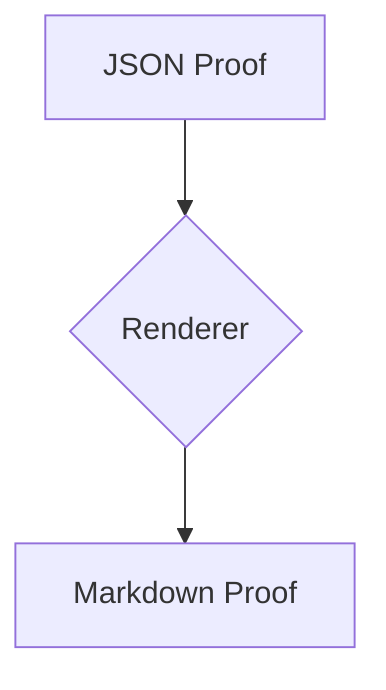

<!-- GENERATED FROM Docs/td/artifacts/td-json-first-artifacts-smoke/proof.json. Do not edit by hand. -->
<!-- Canonical artifact: Docs/td/artifacts/td-json-first-artifacts-smoke/proof.json -->
<!-- Renderer: Scripts/anigma_artifact_render.py -->

# Smoke Test Proof Artifact (Rich)

**Status**: DONE
**Task ID**: td-json-first-artifacts-smoke

## Summary
This artifact proves the rich JSON-first pipeline is operational.

## Diagrams
### Pipeline Architecture

## Changed Files
| Path | Risk | Reason |
|---|---|---|
| `Scripts/anigma_artifact_render.py` | medium | Initial renderer implementation |

## Validation Results
| Command | Build Status | Exit Code |
|---|---|---|
| `python3 Scripts/anigma_artifact_render.py validate --task-id td-json-first-artifacts-smoke` | CLEAN | 0 |

## Decisions
_Not recorded._