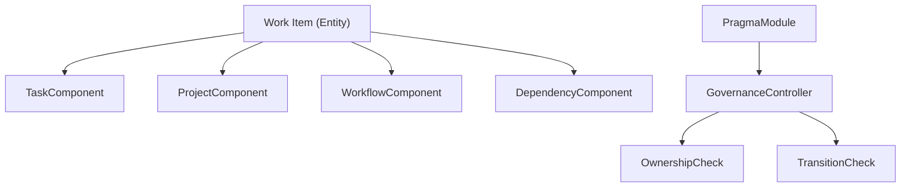

# PragmaModule

**The work management domain for the Anigma ecosystem.**

`PragmaModule` (from Greek *πρᾶγμα* – thing done, deed, business) provides the infrastructure for managing tasks, projects, initiatives, and goals. It implements a highly flexible, ECS-based work management system with built-in governance for permissions and workflow transitions.

## Architecture

Pragma models work items as ECS entities, allowing for dynamic composition of features through components:



## Core Concepts

### 1. Work Item Hierarchy
Pragma supports a multi-tier hierarchy to organize work from high-level vision to detailed execution:
- **Goal**: High-level objectives.
- **Initiative**: Large cross-team efforts.
- **Project**: Containers for specific deliverables.
- **Epic/Story**: Agile-style groupings of work.
- **Task/Subtask**: Individual units of work.

### 2. Workflow Engine
Work items follow state machines defined by `WorkflowDefinition`.
- **Status Categories**: `todo`, `inProgress`, `done`, `cancelled`.
- **Transitions**: Controlled movement between statuses, with support for required comments and automation triggers.
- **Presets**: Built-in "Simple" and "Software Development" workflows.

### 3. Governance Integration
Every mutation in Pragma is evaluated by the central `GovernanceController`:
- **WorkItemOwnershipCheck**: Validates that users have permission to modify items they don't own.
- **WorkflowTransitionCheck**: Enforces that status changes adhere to the defined state machine.

## Core Types

### Identifiers & Types
- `WorkItemId`: A type-safe UUID wrapper for work items.
- `WorkItemType`: Categorization enum (e.g., `.task`, `.bug`, `.milestone`).
- `WorkPriority`: Ordered levels from `.lowest` to `.critical`.

### Workflow Components
- `WorkflowStatus`: A specific state (e.g., "In Review") with color and category.
- `WorkflowTransition`: A valid path between two statuses.

## Usage

### Module Initialization
```swift
import PragmaModule

// Initialize with a governance controller
await PragmaModule.initialize(governance: governanceController)
```

### Creating a Task
```swift
let world = World()
let taskId = await world.createEntity()

// Add task-specific components
await world.addComponent(taskId, TaskComponent(
    title: "Implement Audit Log",
    type: .feature,
    priority: .high
))

// Apply a workflow
await world.addComponent(taskId, WorkflowComponent(
    definition: .software,
    currentStatusId: "todo"
))
```

### Validating a Transition
```swift
let proposal = WriteProposal(
    module: "Pragma",
    operation: "status_change",
    context: ["from_status": "todo", "to_status": "in_progress"]
)

let result = await governance.evaluate(proposal)
if result.isAllowed {
    // Proceed with status update
}
```

## Thread Safety

- **Actor Isolation**: Major management services are implemented as `actors`.
- **Value Types**: Most domain models are implemented as `structs` or `enums`.
- **Strict Concurrency**: Fully enabled across the module to ensure thread-safe work management.

## Dependencies

- **AnigmaCore**: ECS framework and governance primitives.
- **ContractsCore**: Audit logging and standardized event types.
- **Foundation**: Core types and utilities.

## See Also

- [Work Management Governance](../../Docs/governance/pragma-policy.md)
- [ECS Workflow Patterns](../../Docs/architecture/ecs-workflows.md)
