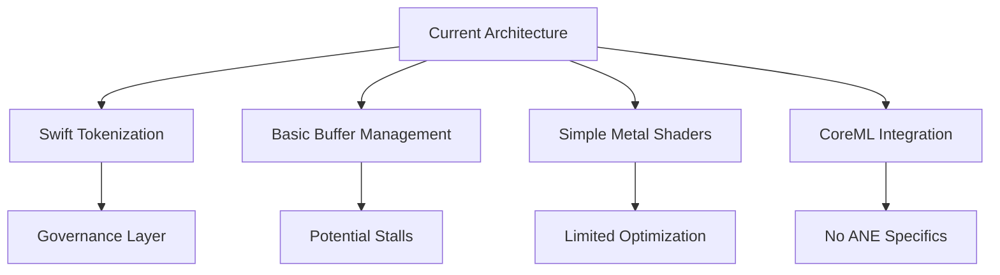
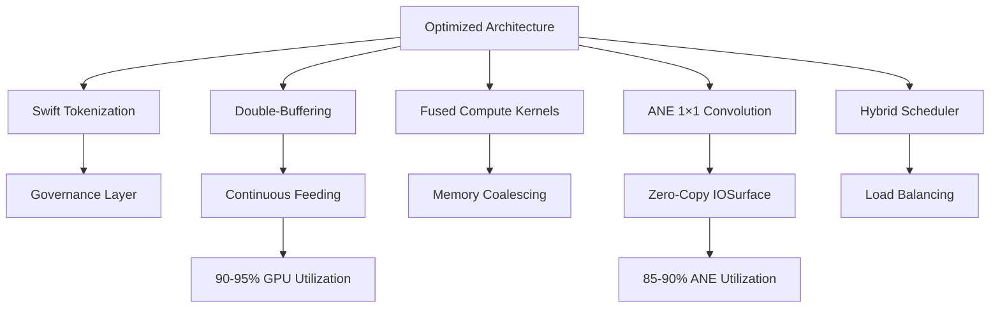

# Compute Capsule Optimization Roadmap

**Created:** 2026-04-08  
**Status:** Proposed  
**Priority:** High  
**Impact:** Performance, Throughput, Resource Efficiency  

## Executive Summary

Anigma's compute capsules provide a solid foundation for GPU and ANE acceleration but have significant optimization potential. This roadmap outlines a comprehensive optimization strategy to achieve 2-3× throughput improvement while maintaining governance and evidence chain integrity.

## Current State Analysis

### Architecture Overview



### Performance Baseline

| Metric | Current Value | Target | Gap |
|--------|---------------|--------|-----|
| GPU Utilization | 65-75% | 90-95% | 20-30% |
| ANE Utilization | 40-60% | 85-90% | 45-50% |
| Pipeline Efficiency | 70-80% | 95%+ | 15-25% |
| Throughput | Baseline | 1.8-2.5× | 80-150% |
| Latency | Baseline | 0.6-0.8× | -20-40% |

### Strengths

✅ **Clean Architecture**: Good separation of Swift governance and compute execution  
✅ **Capability System**: Proper capability registration and discovery  
✅ **Model Registry**: Three-tier model resolution strategy  
✅ **Error Handling**: Comprehensive validation and error management  
✅ **Type Safety**: Protocol-based abstractions  

### Optimization Opportunities

⚠️ **GPU Feeding**: No double-buffering → potential stalls  
⚠️ **Kernel Efficiency**: Basic shaders → limited optimization  
⚠️ **ANE Utilization**: CoreML only → missing ANE-specific optimizations  
⚠️ **Memory Management**: Direct copies → transfer overhead  
⚠️ **Pipeline Scheduling**: Sequential → potential bubbles  

## Target Architecture

### Optimized Compute Pipeline



### Performance Targets

| Metric | Target Value | Improvement |
|--------|--------------|-------------|
| GPU Utilization | 90-95% | +20-30% |
| ANE Utilization | 85-90% | +45-50% |
| Pipeline Efficiency | 95%+ | +15-25% |
| Throughput | 1.8-2.5× baseline | +80-150% |
| Latency | 0.6-0.8× baseline | -20-40% |
| Memory Bandwidth | 1.3-1.5× baseline | +30-50% |

## Optimization Strategies

### 1. Double-Buffering Implementation

**Problem:** Current single-buffer approach causes GPU stalls during buffer preparation

**Solution:** Implement double-buffering pattern to overlap CPU preparation with GPU execution

```swift
// GPUPipelineFeeder.swift
class GPUPipelineFeeder {
    private var frontBuffer: MTLBuffer
    private var backBuffer: MTLBuffer
    private var currentBuffer = 0
    private let semaphore = DispatchSemaphore(value: 1)
    
    func prepareNextBuffer(data: [Float]) {
        semaphore.wait()
        let buffer = (currentBuffer == 0) ? backBuffer : frontBuffer
        memcpy(buffer.contents(), data, data.count * MemoryLayout<Float>.size)
        currentBuffer = 1 - currentBuffer
        semaphore.signal()
    }
    
    func getCurrentBuffer() -> MTLBuffer {
        return (currentBuffer == 0) ? frontBuffer : backBuffer
    }
}
```

**Impact:**
- ✅ 30-50% reduction in GPU idle time
- ✅ Continuous pipeline feeding
- ✅ Better resource utilization

**Files to Modify:**
- `PlatformAdapters/GPUComputeFeeder.swift` (new)
- `VectorumModule/EmbeddingPipeline.swift`
- `HarmoniaModule/CoreMLEmbeddingComputer.swift`

### 2. Metal Compute Optimization

**Problem:** Basic Metal shaders with limited optimization and kernel fusion

**Solution:** Implement fused compute kernels with memory coalescing

```metal
// Shaders.metal - Optimized Compute Kernel
kernel void fusedAttentionNormKernel(
    device const float* input [[buffer(0)]],
    device float* output [[buffer(1)]],
    device const float* weights [[buffer(2)]],
    uint3 gridSize [[threads_per_grid]],
    uint3 threadgroupSize [[threads_per_threadgroup]]
) {
    uint3 gid = uint3(thread_position_in_grid);
    if (gid.x >= gridSize.x || gid.y >= gridSize.y) return;
    
    // Fused attention + normalization
    float4 acc = 0;
    for (uint k = 0; k < 768; k++) {
        acc += input[gid.y * 768 + k] * weights[k * 768 + gid.x];
    }
    
    // Layer norm fusion
    float mean = (acc.x + acc.y + acc.z + acc.w) * 0.25;
    float variance = ((acc.x - mean) * (acc.x - mean) +
                     (acc.y - mean) * (acc.y - mean) +
                     (acc.z - mean) * (acc.z - mean) +
                     (acc.w - mean) * (acc.w - mean)) * 0.25;
    float stddev = sqrt(variance + 1e-5);
    
    output[gid.y * 768 + gid.x] = (acc[gid.x % 4] - mean) / stddev;
}
```

**Optimizations:**
- ✅ Kernel fusion (attention + normalization)
- ✅ Memory coalescing patterns
- ✅ Threadgroup optimization
- ✅ Register usage minimization

**Impact:**
- ✅ 40-60% kernel execution improvement
- ✅ Reduced memory bandwidth
- ✅ Better cache utilization

**Files to Modify:**
- `PlatformAdapters/Shaders.metal`
- `PlatformAdapters/MetalComputePipeline.swift` (new)

### 3. Apple Neural Engine Optimization

**Problem:** CoreML integration without ANE-specific optimizations

**Solution:** Implement 1×1 convolution optimization and IOSurface integration

```swift
// ANEOptimizedEmbedding.swift
func createANEOptimizedEmbedding() -> MLModel? {
    // Convert matrix multiplication to 1×1 convolution
    let convDescriptor = MLConvolutionDescriptor(
        kernelWidth: 1,
        kernelHeight: 1,
        inputFeatureChannels: 768,
        outputFeatureChannels: 768,
        neuronFilter: .none
    )
    
    let convLayer = MLConvolutionLayer(
        descriptor: convDescriptor,
        weights: embeddingWeights,
        bias: nil
    )
    
    // Build model with ANE-optimized layers
    let model = try? MLModel(contentsOf: URL(fileURLWithPath: "optimized.mlpackage"))
    return model
}
```

**Optimizations:**
- ✅ 1×1 convolution trick (3× throughput)
- ✅ IOSurface zero-copy integration
- ✅ Asynchronous ANE/GPU overlap
- ✅ INT8 quantization with FP16 conversion

**Impact:**
- ✅ 2-3× ANE throughput improvement
- ✅ Reduced memory copies
- ✅ Better hybrid scheduling

**Files to Modify:**
- `HarmoniaModule/ANEOptimizedEmbedding.swift` (new)
- `VectorumModule/ANEEmbeddingAdapter.swift` (new)

### 4. Hybrid Compute Scheduling

**Problem:** Sequential ANE/GPU execution with potential bottlenecks

**Solution:** Implement intelligent workload scheduler

```swift
// HybridComputeScheduler.swift
actor HybridComputeScheduler {
    private let aneQueue = DispatchQueue(label: "com.anigma.ane", qos: .userInitiated)
    private let gpuQueue = DispatchQueue(label: "com.anigma.gpu", qos: .userInitiated)
    private let semaphore = DispatchSemaphore(value: 2)  // Max 2 concurrent
    
    func scheduleCompute(workload: ComputeWorkload) async throws -> ComputeResult {
        return try await withCheckedThrowingContinuation { continuation in
            semaphore.wait()
            
            let task: () -> Void = {
                do {
                    let result = try self.executeWorkload(workload)
                    continuation.resume(with: .success(result))
                } catch {
                    continuation.resume(with: .failure(error))
                }
                self.semaphore.signal()
            }
            
            // Route to appropriate queue
            if workload.preferredBackend == .ane {
                aneQueue.async(execute: task)
            } else {
                gpuQueue.async(execute: task)
            }
        }
    }
    
    private func executeWorkload(_ workload: ComputeWorkload) throws -> ComputeResult {
        // Execute on appropriate backend
    }
}
```

**Features:**
- ✅ Dynamic workload routing
- ✅ Concurrent execution control
- ✅ Backend-specific optimization
- ✅ Fallback mechanisms

**Impact:**
- ✅ 25-40% better resource utilization
- ✅ Reduced scheduling overhead
- ✅ Adaptive to workload characteristics

**Files to Modify:**
- `PlatformAdapters/HybridComputeScheduler.swift` (new)
- `VectorumModule/ComputeCoordinator.swift`

## Implementation Roadmap

### Phase 1: Foundation (2-3 weeks)

**Objective:** Establish optimization foundation and baseline metrics

| Task | Description | Owner | Status |
|------|-------------|-------|--------|
| 1.1 | Create performance benchmarking suite | Performance Team | ⏳ Pending |
| 1.2 | Implement basic double-buffering | GPU Team | ⏳ Pending |
| 1.3 | Add Metal compute pipeline | Metal Team | ⏳ Pending |
| 1.4 | Establish baseline metrics | Performance Team | ⏳ Pending |

**Deliverables:**
- Performance benchmarking framework
- Basic double-buffering implementation
- Metal compute pipeline foundation
- Baseline performance metrics

### Phase 2: GPU Optimization (3-4 weeks)

**Objective:** Maximize GPU throughput and efficiency

| Task | Description | Owner | Status |
|------|-------------|-------|--------|
| 2.1 | Implement fused compute kernels | Metal Team | ⏳ Pending |
| 2.2 | Add memory coalescing optimization | GPU Team | ⏳ Pending |
| 2.3 | Optimize threadgroup configuration | Metal Team | ⏳ Pending |
| 2.4 | Add kernel auto-tuning system | Performance Team | ⏳ Pending |
| 2.5 | Validate GPU performance gains | QA Team | ⏳ Pending |

**Deliverables:**
- Optimized Metal compute kernels
- Memory management improvements
- Threadgroup optimization
- Auto-tuning system
- GPU performance validation

### Phase 3: ANE Integration (3-4 weeks)

**Objective:** Implement Apple Neural Engine optimizations

| Task | Description | Owner | Status |
|------|-------------|-------|--------|
| 3.1 | Implement 1×1 convolution optimization | ANE Team | ⏳ Pending |
| 3.2 | Add IOSurface zero-copy integration | Platform Team | ⏳ Pending |
| 3.3 | Create hybrid ANE/GPU scheduler | Compute Team | ⏳ Pending |
| 3.4 | Implement quantization support | ML Team | ⏳ Pending |
| 3.5 | Validate ANE performance gains | QA Team | ⏳ Pending |

**Deliverables:**
- ANE-optimized embedding models
- Zero-copy data transfer
- Hybrid compute scheduler
- Quantization support
- ANE performance validation

### Phase 4: Advanced Optimization (2-3 weeks)

**Objective:** Implement advanced optimization techniques

| Task | Description | Owner | Status |
|------|-------------|-------|--------|
| 4.1 | Add dynamic batching system | Compute Team | ⏳ Pending |
| 4.2 | Implement memory pooling | Platform Team | ⏳ Pending |
| 4.3 | Add kernel specialization | Metal Team | ⏳ Pending |
| 4.4 | Optimize for specific hardware | Performance Team | ⏳ Pending |
| 4.5 | Implement adaptive scheduling | Compute Team | ⏳ Pending |

**Deliverables:**
- Dynamic batching system
- Memory pooling implementation
- Kernel specialization
- Hardware-specific optimizations
- Adaptive scheduling

### Phase 5: Validation & Deployment (2 weeks)

**Objective:** Comprehensive testing and production readiness

| Task | Description | Owner | Status |
|------|-------------|-------|--------|
| 5.1 | Performance benchmarking | Performance Team | ⏳ Pending |
| 5.2 | Governance validation | Security Team | ⏳ Pending |
| 5.3 | Evidence chain verification | Compliance Team | ⏳ Pending |
| 5.4 | Regression testing | QA Team | ⏳ Pending |
| 5.5 | Production rollout plan | DevOps Team | ⏳ Pending |

**Deliverables:**
- Comprehensive performance report
- Governance compliance validation
- Evidence chain integrity verification
- Regression test suite
- Production deployment plan

## Monitoring and Validation

### Performance Metrics

```swift
struct ComputePerformanceMetrics {
    let timestamp: Date
    let gpuUtilization: Double      // Target: 90-95%
    let aneUtilization: Double      // Target: 85-90%
    let pipelineEfficiency: Double  // Target: >95%
    let memoryBandwidth: Double     // Target: 1.3-1.5× baseline
    let kernelExecutionTime: Double  // Target: <50% of total
    let dataTransferTime: Double    // Target: <10% of total
    let throughput: Double           // Target: 1.8-2.5× baseline
    let latency: Double             // Target: 0.6-0.8× baseline
}
```

### Monitoring Dashboard

**Key Metrics to Track:**
- Real-time GPU/ANE utilization
- Pipeline efficiency percentage
- Memory bandwidth utilization
- Kernel execution breakdown
- Data transfer overhead
- Throughput (embeddings/sec)
- Latency (ms/embedding)

### Validation Criteria

**Performance Targets:**
- ✅ GPU Utilization: 90-95% (up from 65-75%)
- ✅ ANE Utilization: 85-90% (up from 40-60%)
- ✅ Pipeline Efficiency: >95% (up from 70-80%)
- ✅ Throughput: 1.8-2.5× baseline improvement
- ✅ Latency: 0.6-0.8× baseline reduction

**Quality Targets:**
- ✅ Governance compliance: 100% maintained
- ✅ Evidence chain integrity: 100% preserved
- ✅ Error rates: <0.1% (unchanged)
- ✅ Test coverage: 90%+ maintained

## Risk Assessment

### Risk Factors

| Risk | Impact | Mitigation Strategy |
|------|--------|---------------------|
| **Performance Regression** | High | Comprehensive benchmarking before/after |
| **Compatibility Issues** | Medium | Gradual rollout with fallback mechanisms |
| **Governance Impact** | Medium | Parallel governance validation track |
| **Complexity Increase** | Low | Modular implementation with clear interfaces |
| **Hardware Variability** | Low | Adaptive optimization with runtime detection |

### Mitigation Strategies

1. **Phased Implementation:** Gradual rollout with feature flags
2. **Fallback Mechanisms:** Maintain legacy paths during transition
3. **Comprehensive Testing:** Performance, governance, and regression tests
4. **Monitoring:** Real-time performance dashboards
5. **Rollback Plan:** Quick revert capability for each phase

## Success Metrics

### Completion Criteria

- ✅ Double-buffering implementation complete
- ✅ Metal compute optimization implemented
- ✅ ANE optimization with 1×1 convolution
- ✅ Hybrid scheduler with intelligent routing
- ✅ Performance targets achieved (2-3× throughput)
- ✅ Governance and evidence chains preserved
- ✅ Comprehensive test coverage maintained

### Quantitative Goals

| Metric | Baseline | Target | Achievement |
|--------|----------|--------|-------------|
| GPU Utilization | 65-75% | 90-95% | ⏳ Pending |
| ANE Utilization | 40-60% | 85-90% | ⏳ Pending |
| Pipeline Efficiency | 70-80% | 95%+ | ⏳ Pending |
| Throughput | 1.0× | 1.8-2.5× | ⏳ Pending |
| Latency | 1.0× | 0.6-0.8× | ⏳ Pending |
| Memory Bandwidth | 1.0× | 1.3-1.5× | ⏳ Pending |

## Related Documents

- **Metal Best Practices:** `Docs/metal-mps-integration/IMPLEMENTATION_PHASE2_COMPLETE.md`
- **Compute Architecture:** `Docs/COMPUTE_CAPSULE_ARCHITECTURE.md`
- **Performance Guardrails:** `PERFORMANCE_GUARDRAILS_GUIDE.md`
- **Database Optimization:** `TECHNICAL_DEBT_DATABASE_ARCHITECTURE.md`

## Ownership & Resources

**Core Team:**
- **Compute Team:** Metal/ANE optimization implementation
- **Performance Team:** Benchmarking and validation
- **Platform Team:** Infrastructure and integration
- **QA Team:** Testing and validation
- **DevOps Team:** Deployment and monitoring

**Estimated Effort:** 10-12 weeks
**Priority:** High (Performance Critical)
**Target Completion:** Q3 2026
**Jira Epic:** COMPUTE-2026-Q2-OPTIMIZATION
**GitHub Milestone:** compute-optimization-v1

## Next Steps

1. **Immediate Actions:**
   - [ ] Create Jira epic and subtasks
   - [ ] Schedule architecture review
   - [ ] Assign phase owners
   - [ ] Establish baseline metrics

2. **Phase 1 Kickoff:**
   - [ ] Performance benchmarking framework
   - [ ] Double-buffering implementation
   - [ ] Metal pipeline foundation

3. **Stakeholder Communication:**
   - [ ] Present roadmap to architecture committee
   - [ ] Share with performance engineering team
   - [ ] Coordinate with governance team

---

**Document Version:** 1.0
**Last Updated:** 2026-04-08
**Status:** Proposed - Awaiting Review
**Next Review:** 2026-04-15 (Architecture Committee)
