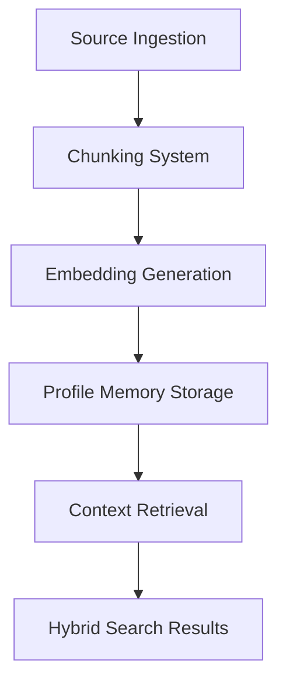
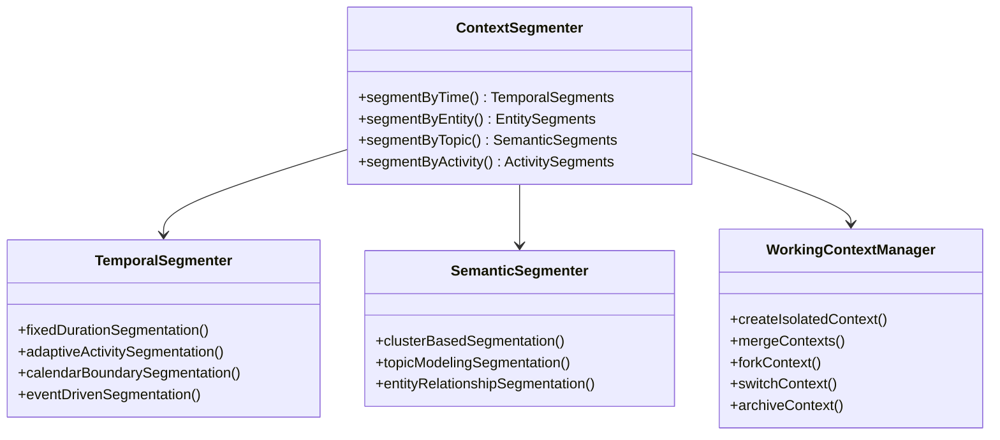
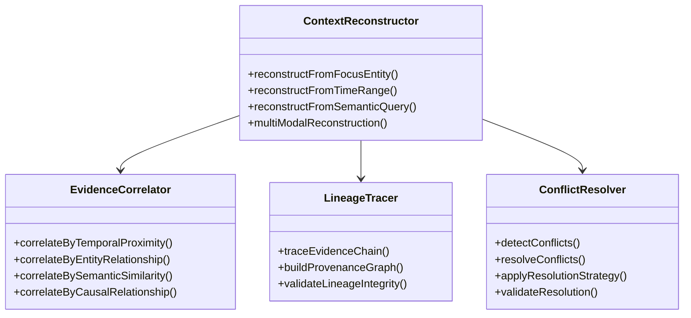

# Context Segmentation and Reconstruction Research

## Executive Summary

This research document analyzes episodic context segmentation, working context boundaries, and reconstruction semantics for Harmonia V3. It examines current Contextum architecture, industry best practices, and recommends patterns for efficient context management.

## Current Contextum Architecture Analysis

### 1. Current Context Handling

**Core Components Identified:**
- `ContextumModule`: Main context management system
- `ProfileMemory`: Entity-based fact storage with evidence tracking
- `SourceGraph`: Document and note graph structures
- `HybridSearchSystem`: Multi-modal context retrieval

**Current Context Flow:**


### 2. Current Limitations

**Segmentation Issues:**
- ❌ No explicit episodic context boundaries
- ❌ Limited temporal segmentation capabilities
- ❌ No working context isolation
- ❌ Basic conflict resolution only

**Reconstruction Challenges:**
- ❌ No systematic context reconstruction
- ❌ Limited lineage tracking
- ❌ Basic evidence correlation
- ❌ Manual conflict resolution

## Industry Best Practices Research

### 1. Context Segmentation Patterns

**Episodic Memory Patterns:**
```swift
struct EpisodicContext: Sendable {
    let episodeId: String
    let startTime: Date
    let endTime: Date
    let participantEntities: [EntityReference]
    let spatialContext: SpatialContext?
    let temporalContext: TemporalContext
    let semanticTags: [String]
    
    func contains(eventTime: Date) -> Bool {
        return startTime <= eventTime && eventTime <= endTime
    }
}
```

**Working Context Isolation:**
```swift
protocol WorkingContext: Sendable {
    var contextId: String { get }
    var creationTime: Date { get }
    var lastAccessed: Date { get set }
    var entityFocus: EntityReference { get }
    var relatedEntities: [EntityReference] { get }
    var accessControl: ContextAccessPolicy { get }
    
    func isolate() throws -> IsolatedContext
    func merge(with other: WorkingContext) throws -> MergedContext
    func fork() throws -> ForkedContext
}
```

### 2. Advanced Segmentation Techniques

**Temporal Segmentation:**
```swift
enum TemporalSegmentationStrategy: Sendable {
    case fixedDuration(Duration)
    case adaptiveActivity
    case calendarBoundaries
    case eventDriven
    
    func segment(timeline: [ContextEvent]) -> [TemporalSegment] {
        switch self {
        case .fixedDuration(let duration):
            return fixedDurationSegmentation(timeline, duration: duration)
        case .adaptiveActivity:
            return adaptiveActivitySegmentation(timeline)
        case .calendarBoundaries:
            return calendarBoundarySegmentation(timeline)
        case .eventDriven:
            return eventDrivenSegmentation(timeline)
        }
    }
}
```

**Semantic Segmentation:**
```swift
struct SemanticSegmenter: Sendable {
    private let embeddingModel: EmbeddingModel
    private let clusteringAlgorithm: ClusteringAlgorithm
    
    func segment(contexts: [ContextComponent]) async throws -> [SemanticCluster] {
        // 1. Generate embeddings for all context elements
        let embeddings = try await embeddingModel.embed(contexts)
        
        // 2. Apply clustering algorithm
        let clusters = clusteringAlgorithm.cluster(embeddings)
        
        // 3. Create semantic clusters
        return clusters.map { cluster in
            SemanticCluster(
                id: UUID().uuidString,
                center: cluster.center,
                members: cluster.members,
                semanticLabel: inferLabel(from: cluster.members)
            )
        }
    }
}
```

### 3. Context Reconstruction Patterns

**Lineage-Based Reconstruction:**
```swift
struct ContextReconstructor: Sendable {
    private let database: ContextumDatabase
    private let evidenceCorrelator: EvidenceCorrelator
    
    func reconstructContext(
        focusEntity: EntityReference,
        timeRange: ClosedRange<Date>? = nil,
        depth: Int = 3
    ) async throws -> ReconstructedContext {
        // 1. Retrieve core context elements
        let coreElements = try await retrieveCoreContext(focusEntity, timeRange: timeRange)
        
        // 2. Trace evidence lineage
        let evidenceChains = try await traceEvidenceLineage(coreElements, depth: depth)
        
        // 3. Correlate related entities
        let correlatedEntities = evidenceCorrelator.correlate(evidenceChains)
        
        // 4. Build context graph
        let contextGraph = buildContextGraph(
            coreElements: coreElements,
            evidenceChains: evidenceChains,
            correlatedEntities: correlatedEntities
        )
        
        return ReconstructedContext(
            focusEntity: focusEntity,
            contextGraph: contextGraph,
            confidenceScore: calculateConfidence(contextGraph),
            completenessScore: calculateCompleteness(contextGraph)
        )
    }
}
```

**Conflict-Aware Reconstruction:**
```swift
struct ConflictResolver: Sendable {
    enum ConflictResolutionStrategy: Sendable {
        case chronologicalPriority
        case confidenceWeighted
        case sourceAuthority
        case manualArbitration
        case evidenceCorroboration
    }
    
    func resolveConflicts(
        in context: ReconstructedContext,
        strategy: ConflictResolutionStrategy
    ) async throws -> ResolvedContext {
        let conflicts = detectConflicts(in: context)
        
        var resolvedContext = context
        for conflict in conflicts {
            let resolution = try resolveConflict(conflict, strategy: strategy)
            resolvedContext = try applyResolution(resolution, to: resolvedContext)
        }
        
        // Validate resolution
        try validateContextIntegrity(resolvedContext)
        
        return resolvedContext
    }
}
```

## Recommended Architecture for Harmonia V3

### 1. Context Segmentation System



### 2. Context Reconstruction System



### 3. Core Component Designs

**1. Episodic Context Manager**
```swift
public struct EpisodicContextManager: Sendable {
    private let database: ContextumDatabase
    private let segmenter: ContextSegmenter
    private let reconstructor: ContextReconstructor
    
    public init(database: ContextumDatabase) {
        self.database = database
        self.segmenter = ContextSegmenter()
        self.reconstructor = ContextReconstructor(database: database)
    }
    
    /// Create new episodic context
    public func createEpisode(
        focusEntity: EntityReference,
        participants: [EntityReference],
        spatialContext: SpatialContext? = nil,
        semanticTags: [String] = []
    ) async throws -> EpisodicContext {
        let episodeId = UUID().uuidString
        let startTime = Date()
        
        let episode = EpisodicContext(
            id: episodeId,
            focusEntity: focusEntity,
            participants: participants,
            startTime: startTime,
            spatialContext: spatialContext,
            semanticTags: semanticTags
        )
        
        try await database.createEpisode(episode)
        return episode
    }
    
    /// End episodic context
    public func endEpisode(
        episodeId: String,
        completionStatus: EpisodeCompletionStatus
    ) async throws {
        let endTime = Date()
        try await database.updateEpisode(
            episodeId: episodeId,
            endTime: endTime,
            status: completionStatus
        )
        
        // Trigger segmentation
        try await segmenter.segmentEpisode(episodeId: episodeId)
    }
    
    /// Reconstruct episodic context
    public func reconstructEpisode(
        episodeId: String,
        reconstructionDepth: Int = 3
    ) async throws -> ReconstructedEpisodicContext {
        try await reconstructor.reconstructEpisode(
            episodeId: episodeId,
            depth: reconstructionDepth
        )
    }
}
```

**2. Working Context System**
```swift
public actor WorkingContextSystem: Sendable {
    private let database: ContextumDatabase
    private var activeContexts: [String: WorkingContextComponent] = [:]
    private let contextLimit: Int
    
    public init(database: ContextumDatabase, contextLimit: Int = 5) {
        self.database = database
        self.contextLimit = contextLimit
    }
    
    /// Create isolated working context
    public func createContext(
        focusEntity: EntityReference,
        purpose: ContextPurpose,
        accessControl: ContextAccessPolicy
    ) async throws -> WorkingContextComponent {
        // Enforce context limits
        guard activeContexts.count < contextLimit else {
            throw ContextError.contextLimitExceeded(limit: contextLimit)
        }
        
        let contextId = UUID().uuidString
        let context = WorkingContextComponent(
            id: contextId,
            focusEntity: focusEntity,
            purpose: purpose,
            accessControl: accessControl,
            creationTime: Date(),
            lastAccessed: Date()
        )
        
        try await database.createWorkingContext(context)
        activeContexts[contextId] = context
        
        return context
    }
    
    /// Switch to different context
    public func switchContext(contextId: String) async throws -> WorkingContextComponent {
        guard let context = activeContexts[contextId] else {
            throw ContextError.contextNotFound(contextId: contextId)
        }
        
        // Update last accessed time
        let updatedContext = context.with(lastAccessed: Date())
        activeContexts[contextId] = updatedContext
        try await database.updateWorkingContext(updatedContext)
        
        return updatedContext
    }
    
    /// Merge contexts
    public func mergeContexts(
        sourceContextId: String,
        targetContextId: String,
        resolutionStrategy: ConflictResolutionStrategy
    ) async throws -> MergedContextResult {
        // Implementation would handle conflict resolution
        // and create unified context
    }
}
```

**3. Advanced Reconstruction Engine**
```swift
public struct AdvancedContextReconstructor: Sendable {
    private let database: ContextumDatabase
    private let embeddingService: EmbeddingService
    private let conflictResolver: ConflictResolver
    
    public init(
        database: ContextumDatabase,
        embeddingService: EmbeddingService
    ) {
        self.database = database
        self.embeddingService = embeddingService
        self.conflictResolver = ConflictResolver()
    }
    
    /// Multi-modal context reconstruction
    public func reconstructContext(
        query: ContextReconstructionQuery
    ) async throws -> ReconstructedContext {
        // Phase 1: Evidence gathering
        let temporalEvidence = try await gatherTemporalEvidence(query)
        let semanticEvidence = try await gatherSemanticEvidence(query)
        let relationalEvidence = try await gatherRelationalEvidence(query)
        
        // Phase 2: Evidence correlation
        let correlatedEvidence = try evidenceCorrelator.correlate(
            temporal: temporalEvidence,
            semantic: semanticEvidence,
            relational: relationalEvidence
        )
        
        // Phase 3: Context graph construction
        let contextGraph = try buildContextGraph(from: correlatedEvidence)
        
        // Phase 4: Conflict resolution
        let resolvedGraph = try conflictResolver.resolveConflicts(
            in: contextGraph,
            strategy: query.conflictResolutionStrategy
        )
        
        // Phase 5: Quality assessment
        let qualityMetrics = assessContextQuality(resolvedGraph)
        
        return ReconstructedContext(
            query: query,
            contextGraph: resolvedGraph,
            qualityMetrics: qualityMetrics,
            reconstructionTime: Date()
        )
    }
    
    private func gatherTemporalEvidence(
        _ query: ContextReconstructionQuery
    ) async throws -> TemporalEvidenceCollection {
        // Implementation would retrieve evidence
        // within specified time ranges
    }
    
    private func gatherSemanticEvidence(
        _ query: ContextReconstructionQuery
    ) async throws -> SemanticEvidenceCollection {
        // Implementation would use embeddings
        // to find semantically related evidence
    }
}
```

## Implementation Roadmap

### Phase 1: Core Segmentation (3-4 weeks)
- [ ] Implement `EpisodicContextManager` with basic episode tracking
- [ ] Add `TemporalSegmenter` with fixed duration segmentation
- [ ] Create `WorkingContextSystem` with context isolation
- [ ] Integrate with existing Contextum database schema
- [ ] Add basic context switching capabilities

### Phase 2: Advanced Reconstruction (4-6 weeks)
- [ ] Implement `ContextReconstructor` with lineage tracing
- [ ] Add `EvidenceCorrelator` with temporal and semantic correlation
- [ ] Create `ConflictResolver` with basic resolution strategies
- [ ] Implement context quality assessment metrics
- [ ] Add reconstruction API endpoints

### Phase 3: Semantic Enhancements (3-5 weeks)
- [ ] Implement `SemanticSegmenter` with clustering algorithms
- [ ] Add adaptive segmentation based on activity patterns
- [ ] Enhance reconstruction with semantic search
- [ ] Implement context completeness scoring
- [ ] Add semantic conflict resolution

### Phase 4: Production Integration (4-6 weeks)
- [ ] Performance optimization for large context graphs
- [ ] Add monitoring and alerting for context operations
- [ ] Implement backup and restore for context data
- [ ] Add governance and access control integration
- [ ] Create comprehensive testing suite

## Recommendations

### 1. Start with Episodic Foundation
Build core episode tracking before advanced segmentation:
- Implement basic temporal segmentation first
- Add entity-based context isolation
- Ensure data integrity in context operations

### 2. Prioritize Reconstruction Quality
Focus on accurate context reconstruction:
- Implement robust lineage tracing
- Add comprehensive evidence correlation
- Ensure conflict resolution capabilities
- Implement quality metrics

### 3. Semantic Enhancements
Add intelligent context understanding:
- Implement semantic clustering
- Add adaptive segmentation
- Enhance with embedding-based similarity
- Enable semantic search integration

### 4. Performance Optimization
Ensure scalability for production use:
- Optimize context graph operations
- Implement efficient indexing
- Add caching for frequent contexts
- Monitor and tune performance

### 5. Governance Integration
Maintain security and compliance:
- Add access control for contexts
- Implement audit logging
- Ensure data privacy compliance
- Add context lifecycle management

## Industry References

1. **Human Memory Models** - Cognitive psychology research on episodic memory
2. **Contextual AI Patterns** - Google's context management in AI systems
3. **Temporal Database Patterns** - Microsoft's temporal data management
4. **Knowledge Graph Reconstruction** - Facebook's entity-resolution systems
5. **Conflict Resolution Algorithms** - Academic research on evidence correlation
6. **Semantic Segmentation** - NLP research on topic modeling and clustering
7. **Working Memory Systems** - Cognitive architecture research (ACT-R, SOAR)
