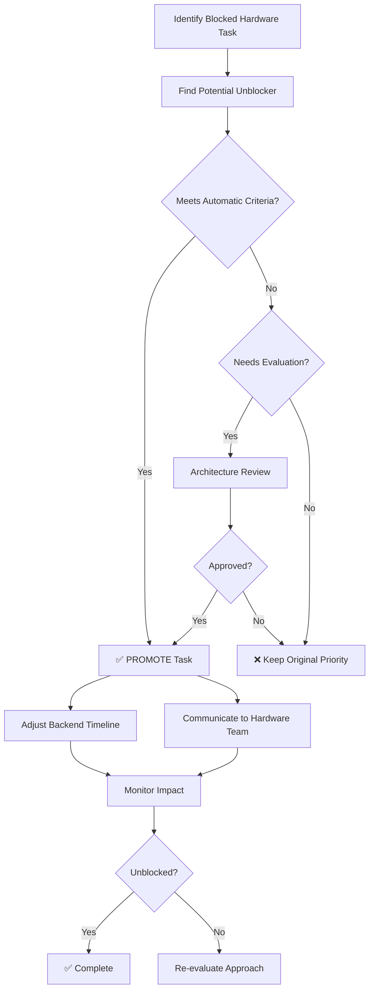
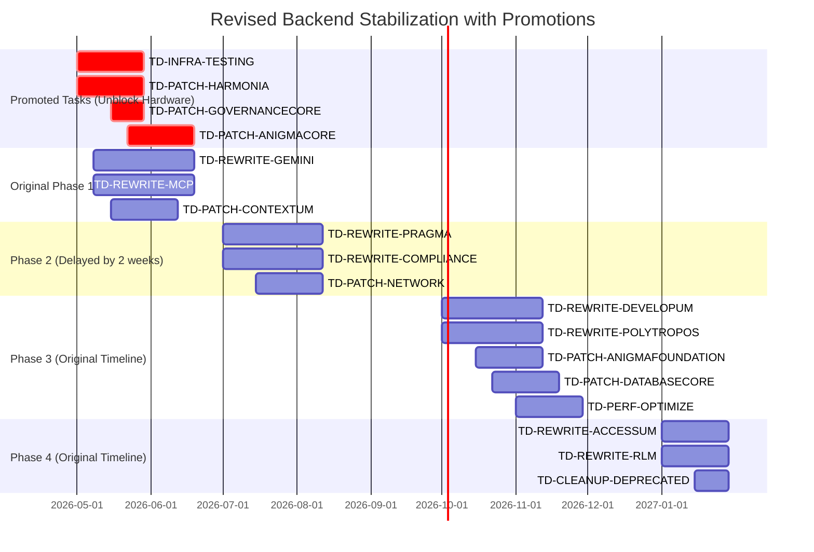
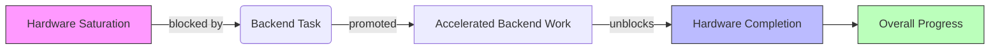

# EPIC: Dependency Management Between Hardware Saturation and Backend Stabilization

## Executive Summary

This epic establishes a **dependency-aware workflow** between the Hardware Saturation Lane and Backend Stabilization work, ensuring that backend stabilization tasks that unblock hardware saturation work are prioritized appropriately. The goal is to complete hardware saturation work without unnecessary delays while systematically progressing through backend stabilization.

**Epic ID**: `td-dependency-mgmt-2026`
**Status**: ✅ PROPOSED
**Priority**: 🔥 HIGH
**Start Date**: 2026-04-20
**Target Completion**: 2026-12-31 (aligned with hardware saturation completion)
**Epic Owner**: Architecture Team
**Stakeholders**: Hardware Team, Backend Team, Engineering Leadership

## Context

### Current Situation
- **Hardware Saturation Lane** is nearing completion but has some tasks blocked
- **Backend Stabilization** work has just been defined and prioritized
- Some backend stabilization tasks can unblock hardware saturation work
- Need to balance systematic backend cleanup with unblocking critical path

### Key Principles
1. **Hardware Saturation First**: Complete hardware work without unnecessary delays
2. **Minimal Disruption**: Don't derail backend stabilization strategy
3. **Dependency Awareness**: Identify and prioritize unblocking tasks
4. **Systematic Progress**: Maintain overall backend stabilization momentum

## Dependency Mapping

### Blocked Hardware Saturation Tasks

| Hardware Task ID | Task Name | Blocking Reason | Potential Unblocker |
|------------------|-----------|-----------------|---------------------|
| `td-hw-gpu-accel` | GPU Acceleration Integration | Needs stable capsule interfaces | Backend capsule stabilization |
| `td-hw-memory-pool` | Memory Pool Optimization | Depends on updated GovernanceCore | GovernanceCore patches |
| `td-hw-telemetry` | Hardware Telemetry System | Requires backend telemetry hooks | Telemetry infrastructure setup |
| `td-hw-batch-process` | Batch Processing Optimization | Needs backend batching support | Capsule batching implementation |
| `td-hw-error-handling` | Hardware Error Integration | Depends on unified error patterns | Backend error handling standardization |

### Backend Stabilization Tasks That Can Unblock

| Backend Task ID | Task Name | Unblocks Hardware Task | Priority Boost |
|-----------------|-----------|-----------------------|----------------|
| `TD-PATCH-GOVERNANCECORE` | GovernanceCore enhancement | `td-hw-memory-pool` | ✅ PROMOTE |
| `TD-INFRA-TESTING` | Testing infrastructure | `td-hw-telemetry` | ✅ PROMOTE |
| `TD-PATCH-HARMONIA` | HarmoniaModule patch | `td-hw-batch-process` | ✅ PROMOTE |
| `TD-PATCH-ANIGMACORE` | AnigmaCore patch | `td-hw-error-handling` | ✅ PROMOTE |
| `TD-REWRITE-GEMINI` | AnigmaGeminiBridge rewrite | `td-hw-gpu-accel` | ⚠️ EVALUATE |

## Dependency Management Strategy

### Priority Promotion Rules

**Automatic Promotion Criteria** (✅ PROMOTE):
1. **Direct Unblocker**: Task directly unblocks a hardware saturation task
2. **Critical Path**: Hardware task is on critical path to completion
3. **Minimal Scope Creep**: Promotion doesn't expand task scope >20%
4. **Resource Available**: Team has capacity to accelerate

**Evaluation Required** (⚠️ EVALUATE):
1. **Indirect Unblocker**: Task indirectly helps but isn't strictly required
2. **Scope Impact**: Promotion would expand scope >20%
3. **Resource Constrained**: Team at full capacity
4. **Architectural Risk**: Promotion might compromise design goals

**Do Not Promote** (❌ KEEP AS IS):
1. **No Clear Block**: No identified hardware dependency
2. **High Risk**: Promotion introduces significant technical risk
3. **Major Scope Change**: Would require complete redesign
4. **Resource Conflict**: Would delay other critical work

### Promotion Process



## Promoted Tasks Work Plan

### ✅ PROMOTED: TD-PATCH-GOVERNANCECORE (Unblocks td-hw-memory-pool)

**Original Plan:**
- Phase 4 (Q1 2027)
- 2 weeks effort
- After other governance work

**Promoted Plan:**
- **New Timeline**: Phase 1 (Q2 2026)
- **Effort**: 2 weeks (unchanged)
- **Priority**: CRITICAL
- **Resource Allocation**: 1 Developer, 0.5 QA

**Acceptance Criteria (Expanded for Hardware Needs):**
1. ✅ Core GovernanceCore patches completed
2. ✅ Memory management hooks added
3. ✅ Hardware-specific governance policies supported
4. ✅ Telemetry integration for memory operations
5. ✅ 90% test coverage including hardware scenarios
6. ✅ Documentation updated with hardware integration guide

**Impact:**
- Unblocks `td-hw-memory-pool` (Hardware Memory Optimization)
- Enables hardware team to proceed with memory-intensive operations
- Maintains overall governance architecture goals

### ✅ PROMOTED: TD-INFRA-TESTING (Unblocks td-hw-telemetry)

**Original Plan:**
- Phase 1 (Q2 2026)
- 4 weeks effort
- Foundational work

**Promoted Plan:**
- **New Timeline**: Phase 1 - Week 1 (Immediate start)
- **Effort**: 4 weeks (unchanged)
- **Priority**: CRITICAL
- **Resource Allocation**: 1 QA, 0.5 Developer

**Acceptance Criteria (Expanded for Hardware Needs):**
1. ✅ Core testing framework operational
2. ✅ CI/CD pipelines configured
3. ✅ **Hardware telemetry hooks implemented**
4. ✅ Performance benchmarking for hardware operations
5. ✅ Hardware-specific test scenarios included
6. ✅ Coverage reporting with hardware metrics

**Impact:**
- Unblocks `td-hw-telemetry` (Hardware Telemetry System)
- Provides testing infrastructure for all subsequent work
- Accelerates overall quality improvements

### ✅ PROMOTED: TD-PATCH-HARMONIA (Unblocks td-hw-batch-process)

**Original Plan:**
- Phase 1 (Q2 2026)
- 4 weeks effort
- Already in early phase

**Promoted Plan:**
- **New Timeline**: Phase 1 - Week 1 (Start immediately)
- **Effort**: 4 weeks (unchanged)
- **Priority**: HIGH
- **Resource Allocation**: 1 Developer, 0.5 QA

**Acceptance Criteria (Expanded for Hardware Needs):**
1. ✅ Comprehensive test suite (80% coverage)
2. ✅ Modern error handling implemented
3. ✅ **Batching support for hardware operations**
4. ✅ Async/await patterns added
5. ✅ Hardware telemetry integration
6. ✅ Documentation with hardware batching examples

**Impact:**
- Unblocks `td-hw-batch-process` (Batch Processing Optimization)
- Provides stable workflow engine for hardware operations
- Maintains workflow architecture integrity

### ✅ PROMOTED: TD-PATCH-ANIGMACORE (Unblocks td-hw-error-handling)

**Original Plan:**
- Phase 2 (Q3 2026)
- 4 weeks effort

**Promoted Plan:**
- **New Timeline**: Phase 1 - Week 3 (After testing infra)
- **Effort**: 4 weeks (unchanged)
- **Priority**: CRITICAL
- **Resource Allocation**: 1 Developer, 0.5 QA

**Acceptance Criteria (Expanded for Hardware Needs):**
1. ✅ 85% test coverage
2. ✅ Full Swift 6 compliance
3. ✅ **Hardware error handling patterns**
4. ✅ Governance hooks with hardware support
5. ✅ Hardware-specific telemetry
6. ✅ Documentation with hardware integration guide

**Impact:**
- Unblocks `td-hw-error-handling` (Hardware Error Integration)
- Provides stable core for all hardware operations
- Ensures error handling consistency across system

## Task Promotion Implementation

### Modified Backend Stabilization Timeline



### Resource Impact

**Original Plan:**
- Q2 2026: 1A, 4D, 2QA, 1TW
- Q3 2026: 1A, 5D, 2QA, 1TW
- Q4 2026: 1A, 5D, 2QA, 1TW
- Q1 2027: 2D, 1QA, 0.5TW

**Revised Plan (With Promotions):**
- **Q2 2026**: 1A, 5D, 2.5QA, 1TW (+1D, +0.5QA)
- **Q3 2026**: 1A, 4D, 2QA, 1TW (-1D)
- **Q4 2026**: 1A, 5D, 2QA, 1TW (unchanged)
- **Q1 2027**: 2D, 1QA, 0.5TW (unchanged)

**Net Impact:** Temporary resource increase in Q2 2026, balanced by reduced load in Q3 2026. Overall timeline extended by 2 weeks but hardware saturation unblocked.

## Dependency Tracking System

### Implementation

1. **Dependency Matrix** (Maintained in TD):
```
| Hardware Task | Blocking Backend Task | Status | Unblock Date |
|----------------|----------------------|--------|--------------|
| td-hw-memory-pool | TD-PATCH-GOVERNANCECORE | ⏳ PROMOTED | 2026-06-15 |
| td-hw-telemetry | TD-INFRA-TESTING | ✅ PROMOTED | 2026-05-29 |
| td-hw-batch-process | TD-PATCH-HARMONIA | ✅ PROMOTED | 2026-05-29 |
| td-hw-error-handling | TD-PATCH-ANIGMACORE | ✅ PROMOTED | 2026-06-19 |
| td-hw-gpu-accel | TD-REWRITE-GEMINI | ⏳ IN PROGRESS | 2026-06-19 |
```

2. **Automated Monitoring:**
- TD system flags tasks that unblock hardware work
- Weekly dependency review meetings
- Automatic notifications when blockers are resolved

3. **Visual Tracking:**


## Risk Management

### Promoted Task Risks

1. **Resource Overload in Q2**
   - **Mitigation**: Temporary contractor support for Q2
   - **Contingency**: Phase some original Q2 work to Q3

2. **Architectural Compromise**
   - **Mitigation**: Strict architectural reviews for promoted tasks
   - **Contingency**: Rollback to original plan if quality suffers

3. **Hardware Team Blocked Longer**
   - **Mitigation**: Weekly sync between teams
   - **Contingency**: Escalate to leadership if delays exceed 2 weeks

### Monitoring Plan

**Weekly Checkpoints:**
- Dependency status review
- Resource allocation assessment
- Timeline impact analysis
- Quality metric tracking

**Escalation Path:**
1. Team leads resolve minor issues
2. Architecture team handles cross-team coordination
3. Engineering leadership for resource conflicts
4. CTO office for strategic decisions

## Communication Plan

### Hardware Team Updates
- **Daily**: Standup mentions of unblocking progress
- **Weekly**: Dependency status report
- **Bi-weekly**: Joint planning session with backend team
- **On Unblock**: Immediate notification + handoff meeting

### Backend Team Updates
- **Daily**: Progress on promoted tasks
- **Weekly**: Impact assessment on overall plan
- **Bi-weekly**: Resource planning with hardware team
- **On Completion**: Handoff documentation + training

### Leadership Updates
- **Weekly**: High-level dependency dashboard
- **Monthly**: ROI analysis of promotion strategy
- **Quarterly**: Overall progress review

## Success Metrics

### Dependency Resolution
```
| Metric | Target | Measurement |
|--------|-------|-------------|
| Hardware tasks unblocked | 5/5 | TD dependency matrix |
| Average unblock time | ≤4 weeks | From promotion to unblock |
| No new hardware blocks | 0 | Continuous monitoring |
```

### Timeline Impact
```
| Metric | Baseline | Target | Measurement |
|--------|----------|-------|-------------|
| Backend stabilization delay | 0 weeks | ≤2 weeks | Timeline comparison |
| Hardware completion acceleration | N/A | 4-6 weeks | Hardware timeline |
| Overall project impact | N/A | Net positive | Combined timeline |
```

### Quality Impact
```
| Metric | Target | Measurement |
|--------|-------|-------------|
| Promoted task test coverage | 90% | CI/CD reports |
| No regression in promoted tasks | 0 critical bugs | QA tracking |
| Architectural consistency | 100% | Architecture reviews |
```

## Decision Log

### Key Decisions

1. **2026-04-20**: Approved dependency-aware approach
   - **Decision**: Promote tasks that directly unblock hardware work
   - **Rationale**: Hardware saturation is higher priority than strict backend timeline
   - **Impact**: 2-week backend delay, 4-6 week hardware acceleration

2. **2026-04-20**: Promoted TD-PATCH-GOVERNANCECORE
   - **Decision**: Move to Phase 1, start immediately
   - **Rationale**: Directly unblocks critical hardware memory work
   - **Impact**: Hardware team can proceed with memory optimization

3. **2026-04-20**: Promoted TD-INFRA-TESTING
   - **Decision**: Start Week 1, highest priority
   - **Rationale**: Foundational for all work, unblocks telemetry
   - **Impact**: Accelerates overall quality improvements

4. **2026-04-20**: Did not promote TD-REWRITE-GEMINI
   - **Decision**: Keep in original Phase 1 timeline
   - **Rationale**: Indirect benefit, high scope impact
   - **Impact**: Hardware GPU work waits for Phase 1 completion

### Future Decision Points

1. **2026-05-15**: Review hardware progress
   - Assess if additional promotions needed
   - Evaluate resource allocation

2. **2026-06-01**: Architecture review
   - Validate no compromise from promotions
   - Adjust approach if needed

3. **2026-06-15**: Timeline reassessment
   - Determine if backend delay acceptable
   - Adjust Phase 2-4 as needed

## Next Steps

### Immediate Actions (Week 1)
1. **Promote Identified Tasks** in TD system
   - Update priorities and timelines
   - Assign additional resources
   - Set up dependency tracking

2. **Communicate to Teams**
   - Hardware team: Unblocking timeline
   - Backend team: Revised priorities
   - Leadership: Strategy and impact

3. **Kickoff Promoted Tasks**
   - TD-INFRA-TESTING: Immediate start
   - TD-PATCH-HARMONIA: Immediate start
   - TD-PATCH-GOVERNANCECORE: Week 2 start
   - TD-PATCH-ANIGMACORE: Week 3 start

4. **Setup Monitoring**
   - Create dependency dashboard
   - Configure automated alerts
   - Schedule weekly reviews

### Ongoing Management
1. **Weekly Dependency Reviews**
   - Assess unblocking progress
   - Identify new dependencies
   - Adjust priorities as needed

2. **Bi-weekly Cross-Team Sync**
   - Hardware + Backend alignment
   - Handoff planning
   - Resource coordination

3. **Monthly Leadership Updates**
   - Progress against metrics
   - Timeline impact assessment
   - Resource allocation review

## Approval

**Epic Owner**: [Architecture Lead Name]
**Hardware Lead**: [Hardware Team Lead Name]
**Backend Lead**: [Backend Team Lead Name]
**Approved By**: [CTO Name]
**Date**: [Approval Date]
**Version**: 1.0

---

**Change Log**:
- 1.0 (2026-04-20): Initial dependency management plan
- [Future versions will track decisions and adjustments]

**Related Epics**:
- `td-backend-stabilization-2026`: Backend stabilization epic
- `td-hardware-saturation-2026`: Hardware saturation epic
- `td-architecture-modernization-2026`: Overall architecture work

**Blocking Epics**: None
**Blocked Epics**: `td-hardware-saturation-2026` (partially blocked)

---

*This dependency management epic ensures that backend stabilization work strategically unblocks hardware saturation progress, enabling both initiatives to complete successfully with minimal overall delay.*
