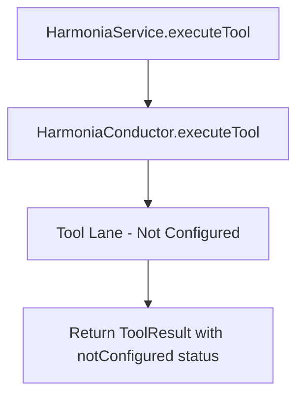
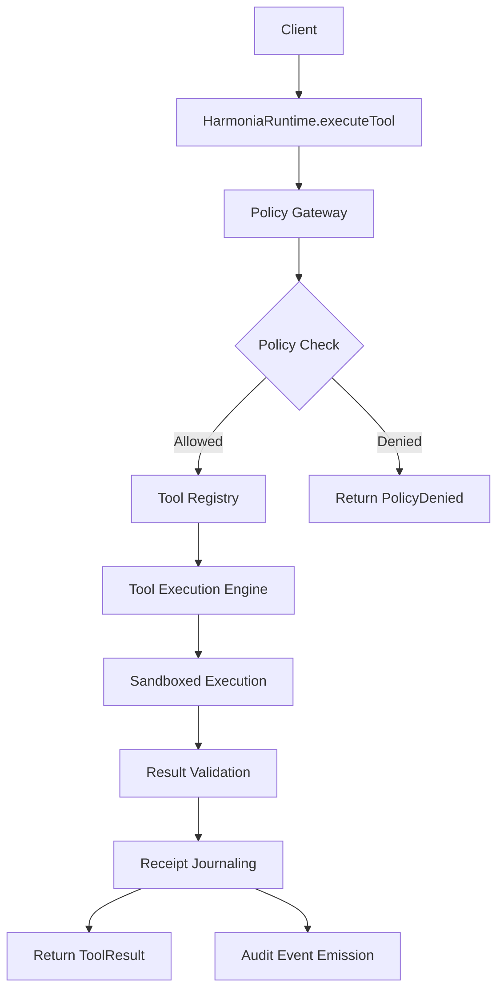

# Tool Execution Patterns Research

## Executive Summary

This research document analyzes tool execution patterns in Harmonia V2, examines industry best practices, and recommends approaches for integrating governed tool dispatch into HarmoniaRuntime.

## Current Harmonia V2 Tool Execution Architecture

### 1. Current Implementation Flow



### 2. Key Components

**HarmoniaService (Surface Layer)**
- Public API façade in `HarmoniaV2/HarmoniaSurface`
- `executeTool(name:arguments:userId:policyContext:)` method
- Creates execution context and delegates to conductor
- Returns `HarmoniaToolResult` with success/error status

**HarmoniaConductor (Orchestration Layer)**
- Execution control spine in `HarmoniaV2/HarmoniaOrchestration`
- `executeTool(name:arguments:context:policyContext:)` method
- Currently returns "tool lane is not configured" response
- Designed for future tool lane integration

### 3. Current Limitations

- **No actual tool execution**: All calls return `notConfigured` status
- **No tool registry**: No mechanism to register available tools
- **No governance integration**: Policy checks are stubbed
- **No receipt journaling**: No audit trail for tool executions
- **Limited error handling**: Basic validation only

## Industry Best Practices Research

### 1. Tool Execution Frameworks

**LangChain Tools Pattern**
- Tool registry with dynamic discovery
- Standardized tool interface with `run()` method
- Input/output schema validation
- Parallel tool execution support

**LlamaIndex Tool Abstraction**
- BaseTool class with execute() method
- Tool metadata (name, description, parameters)
- Async execution with timeout support
- Error handling and retry logic

**AutoGen Multi-Agent Tools**
- Agent-tool separation of concerns
- Tool use policy governance
- Concurrent tool execution
- Result aggregation and conflict resolution

### 2. Governance Patterns

**Policy-Based Access Control**
- Role-based tool access
- Context-aware policy evaluation
- Audit logging for all executions
- Rate limiting and quotas

**Sandboxed Execution**
- Containerized tool execution
- Resource limits (CPU, memory, timeout)
- Network access controls
- Filesystem isolation

**Observability Integration**
- Execution tracing
- Performance metrics
- Error classification
- Usage analytics

## Recommended Patterns for HarmoniaRuntime

### 1. Governed Tool Dispatch Architecture



### 2. Core Components Design

**1. Tool Registry**
```swift
protocol ToolProvider: Sendable {
    var toolName: String { get }
    var description: String { get }
    var parameters: [ToolParameter] { get }
    func execute(arguments: [String: Any], context: ToolExecutionContext) async throws -> ToolResult
}

struct ToolRegistry: Sendable {
    private var providers: [String: any ToolProvider] = [:]
    
    mutating func register(_ provider: any ToolProvider)
    func getProvider(for toolName: String) -> (any ToolProvider)?
    func listAvailableTools() -> [ToolMetadata]
}
```

**2. Policy Gateway**
```swift
struct ToolExecutionPolicy: Sendable {
    let toolName: String
    let userId: String?
    let policyContext: String
    let arguments: [String: Any]
}

protocol PolicyEvaluator: Sendable {
    func evaluate(policy: ToolExecutionPolicy) async throws -> PolicyDecision
}

enum PolicyDecision: Sendable {
    case allowed(reasonCode: String)
    case denied(reasonCode: String, message: String)
}
```

**3. Execution Engine**
```swift
struct ToolExecutionEngine: Sendable {
    private let registry: ToolRegistry
    private let policyEvaluator: PolicyEvaluator
    private let sandbox: ToolSandbox
    private let receiptJournal: ReceiptJournal
    
    func execute(
        toolName: String,
        arguments: [String: Any],
        userId: String?,
        policyContext: String
    ) async throws -> HarmoniaToolResult {
        // 1. Policy evaluation
        // 2. Tool lookup
        // 3. Sandboxed execution
        // 4. Result validation
        // 5. Receipt journaling
        // 6. Audit event emission
    }
}
```

### 3. Integration with HarmoniaRuntime

**Recommended Implementation Steps:**

1. **Phase 1: Registry & Policy Framework**
   - Implement `ToolRegistry` with basic provider management
   - Create `PolicyEvaluator` with configurable rules
   - Add tool metadata and discovery capabilities

2. **Phase 2: Execution Engine**
   - Build `ToolExecutionEngine` with policy gateway
   - Implement sandboxed execution wrapper
   - Add result validation and error handling

3. **Phase 3: Runtime Integration**
   - Wire engine into `HarmoniaRuntime.executeTool()`
   - Add receipt journaling integration
   - Implement audit event emission

4. **Phase 4: Observability & Governance**
   - Add execution tracing
   - Implement rate limiting
   - Add usage analytics
   - Integrate with governance dashboard

## Implementation Roadmap

### Short-Term (2-4 weeks)
- [ ] Research and document tool execution patterns ✅
- [ ] Design tool registry interface
- [ ] Implement basic policy evaluator
- [ ] Create tool execution engine skeleton
- [ ] Wire into HarmoniaRuntime.executeTool()

### Medium-Term (4-8 weeks)
- [ ] Implement sandboxed execution
- [ ] Add receipt journaling integration
- [ ] Build tool discovery and metadata
- [ ] Add basic observability

### Long-Term (8-12 weeks)
- [ ] Advanced governance features
- [ ] Parallel tool execution
- [ ] Result aggregation
- [ ] Conflict resolution

## Recommendations

1. **Start with Registry Pattern**: Implement tool registry first to enable dynamic tool discovery
2. **Policy-First Design**: Build governance integration from the beginning
3. **Sandboxed Execution**: Prioritize security isolation for all tool executions
4. **Observability Integration**: Ensure all executions are traced and audited
5. **Incremental Migration**: Move tools from V2 to runtime gradually

## References

- LangChain Tools Documentation
- LlamaIndex Tool Abstraction
- AutoGen Multi-Agent Systems
- OWASP Secure Coding Practices
- NIST Security Guidelines for Tool Execution
