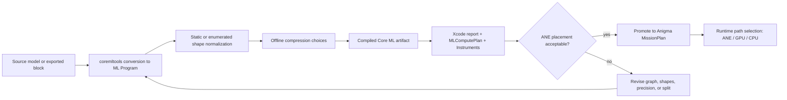
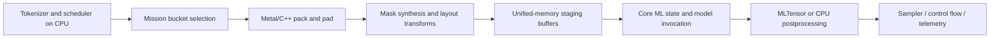

# Core ML to ANE for Anigma

## Executive summary

For a production-grade Anigma runtime, the central architectural fact is that the public, supported path to the Apple Neural Engine is still **Core ML**, not a standalone public ANE programming API. Public Apple materials describe Core ML as the framework that dispatches work across CPU, GPU, and Neural Engine, while most open-source Apple-silicon inference stacks from the community—such as MLX, MLX-LM, llama.cpp’s Metal backend, and vLLM Metal—primarily target CPU/GPU/Metal rather than a public ANE path. That means your best design is **Metal/C++ for canonicalization, packing, residency, and orchestration; Core ML as the ANE compiler/runtime; GPU paths as deliberate fallbacks or co-equal execution lanes, not as incidental spillover**. citeturn17view0turn8view8turn21search1turn21search0turn21search12turn21search4turn35view0

The workloads with the strongest public evidence for good Neural Engine outcomes are the ones Core ML already optimizes aggressively: **dense linear/conv subgraphs, MLPs, normalization, softmax-adjacent blocks, and compressed dense kernels**, especially when represented as an `mlprogram` with stable tensor types and stable shapes. Apple’s optimization guidance is unusually explicit on two points that matter for Anigma: **weight palettization typically works best on the Neural Engine**, and **W8A8 can deliver considerable latency gains on newer Neural Engine hardware such as A17 Pro and M4** because of a faster int8-int8 path. Stateful models also matter: Core ML’s state APIs let you keep KV cache on-device and update it in place across inference calls, which is the right abstraction for decode missions. citeturn9view0turn19view0turn36search0turn36search1turn8view2turn13view2turn13view4

The most important caveat is that **Apple does not publish a static public ANE whitelist by op**. What Apple *does* publish is the MIL op surface, the compilation/runtime model, Xcode performance reports with per-op compute-device support, and the `MLComputePlan` API. In practice, that means you should treat ANE placement as a **measured property of compiled graph segments**, not as something inferred from a single op name. This is especially relevant for transformer attention: Core ML now has a public fused `scaled_dot_product_attention` op for iOS 18/macOS 15 and newer, but Apple also says that fused SDPA “really shines” on Apple Silicon GPUs. For Anigma, the correct synthesis is not “force everything to ANE”; it is **let Core ML put ANE-friendly dense/compressed/stateful segments on ANE, but be willing to keep SDPA-heavy segments on GPU when that is the faster path**. citeturn8view10turn14view1turn17view0turn8view9turn26view0

Your Metal/C++ normalization layer should therefore optimize for **placement stability** more than for theoretical elegance. The public rules that matter most are: prefer `mlprogram`, prefer `float16` unless accuracy forces otherwise, use **EnumeratedShapes** where possible, keep range-dynamic shapes bounded, avoid introducing fully dynamic reshapes, use stateful models for KV cache, and validate every mission with Xcode performance reports, Instruments, and `MLComputePlan`. At the systems level, use unified-memory-aware staging, argument buffers, heaps, and residency sets to reduce control overhead and avoid redundant copies. Keep cryptography and security-sensitive operations out of Core ML entirely. citeturn27search1turn9view1turn11view0turn12view0turn10view4turn13view0turn23view3turn23view4turn33search0turn33search1turn33search3

## Assumptions and evidence model

This report assumes an Anigma architecture that runs decoder-style transformer workloads, possibly with vision or adapter branches, with **no fixed model size constraint** and with the freedom to target modern Apple OS baselines when needed. The key practical assumption is that if you want **stateful KV cache** and the public fused **SDPA** op, you are effectively targeting **iOS 18 / macOS 15 or newer**. If you must support older targets, the ANE-friendly subset narrows and the graph will often be forced into less optimal decompositions. citeturn8view2turn8view10

The evidence base for ANE placement has to be read correctly. Public Core ML documentation gives you: the **MIL op inventory**, conversion controls, typed execution semantics, flexible-shape rules, model compression modes, and profiling/inspection tools. Public Apple tooling then exposes *compiled* support status and estimated cost per operation through **Xcode performance reports**, **Instruments**, and **`MLComputePlan`**. Public docs do **not** give a single stable ANE op matrix. So the rigorous way to reason about Anigma is: **documented MIL support → compile with constrained shapes/types → inspect compute support/cost → accept or revise graph normalization**. citeturn8view4turn26view0turn8view9turn28search10turn35view0

The operating model is shown below. It is the architecture I would recommend if your goal is “reliably lowered to ANE via Core ML,” not merely “sometimes hits the ANE.”



This flow follows the public Core ML conversion/runtime model and Apple’s profiling workflow. citeturn27search8turn26view0turn8view8turn8view9turn35view0

## Core ML tasks and graph patterns most compatible with ANE

The table below is the most useful public approximation of “what can go to ANE” for Anigma. It combines Apple’s public MIL op surface, Core ML state/compression features, and Apple’s own runtime guidance. The critical distinction is between **“publicly supported graph representation exists”** and **“this tends to be a good ANE candidate”**. Those are related, but not identical. citeturn14view1turn14view3turn14view5turn14view8turn15view0turn15view3turn15view4turn16view0turn17view0turn26view0

| Anigma task or subgraph | Canonical Core ML / MIL representation | ANE outlook | Implication for Anigma |
|---|---|---|---|
| Q, K, V, and output projections | `linear`, `matmul`, bias add | Strong candidate | Treat as primary ANE missions when shapes and types are stable |
| Transformer MLP / FFN | `linear -> gelu/silu -> linear`, or gated MLP with elementwise `mul` | Strong candidate | Excellent target for palettization and W8A8 experiments |
| Convolutional encoders or conv-heavy vision blocks | `conv`, `conv_transpose`, elementwise activations | Strong candidate | Often very NE-friendly, especially with compressed weights |
| Layer normalization blocks | `layer_norm`, or canonical reduction/scale/add composition | Good candidate if canonicalized | Prefer explicit `layer_norm` over ad hoc decompositions where possible |
| Softmax and mask application | `softmax`, add/mul/broadcast, reduction ops | Usually follows surrounding segment | Keep masks shape-stable and cheap; don’t make them highly dynamic |
| Attention score/value mix | `scaled_dot_product_attention` on modern targets, or `matmul + softmax + matmul` | Mixed | Public Apple guidance highlights GPU upside for fused SDPA, so do not assume ANE is best here |
| KV cache read/update | `read_state`, `slice_update`, `coreml_update_state` | Supported and strategically important | Use Core ML state for decode missions; states reduce I/O overhead materially |
| Token / embedding lookup | `gather` family | Mixed, often memory-bound | Optimize layout and state flow, but do not expect this alone to drive ANE wins |
| Quantized dense path | weight/activation quantization, `quantize` / `dequantize`, compressed constants | Strong on newer NE hardware | W8A8 is especially worth testing on A17 Pro / M4 |
| Palettized dense path | `constexpr_lut_to_dense` and related compression ops | Strong on NE | Apple explicitly recommends palettization as often best on NE |
| Sparse or joint-compressed weights | `constexpr_sparse_to_dense`, joint sparse+quantized or sparse+palettized forms | Worth testing, model-dependent | Treat as tuning dimension, not as guaranteed latency win |
| Custom crypto, control logic, app orchestration | custom ops/layers, host code | Not an ANE target | Keep on CPU / system frameworks |

Sources for the table: public MIL ops, Core ML stateful model guidance, and Apple’s optimization recommendations. citeturn14view1turn14view3turn14view5turn14view7turn14view8turn15view0turn15view2turn15view3turn15view4turn15view7turn15view8turn16view0turn16view2turn16view3turn13view0turn13view1turn36search0turn36search1

For transformer-class models, the most relevant public MIL inventory is the following. This is not “the ANE whitelist”; it is the **public representation layer you can intentionally target** when building Anigma’s normalized graph surface. citeturn8view4turn14view1turn14view8turn15view4turn16view0

| Public MIL op family most relevant to transformers | Key public op names |
|---|---|
| Linear algebra | `linear`, `matmul`, `einsum` |
| Activations | `gelu`, `silu`, `sigmoid`, `softmax` |
| Normalization | `layer_norm`, `batch_norm`, `l2_norm` |
| Reductions | `reduce_mean`, `reduce_sum`, `reduce_max`, `reduce_log_sum_exp` |
| Elementwise | `add`, `mul`, `real_div`, `rsqrt`, `cast`, `clip`, `log` |
| Tensor transforms | `reshape`, `reshape_like`, `transpose`, `squeeze`, `expand_dims`, `slice_by_index`, `slice_by_size`, `concat` |
| Gather/scatter | `gather`, `gather_along_axis`, `gather_nd`, `scatter*` |
| States | `read_state`, `coreml_update_state` |
| KV-cache update | `slice_update` |
| Transformer fusion | `scaled_dot_product_attention` |
| Quantization | `quantize`, `dequantize` |
| Compression constants | `constexpr_blockwise_shift_scale`, `constexpr_lut_to_dense`, `constexpr_sparse_to_dense`, `constexpr_lut_to_sparse`, `constexpr_sparse_blockwise_shift_scale` |

This inventory comes directly from Apple’s public MIL op reference and optimization documentation. Placement still has to be validated post-compile. citeturn14view1turn14view3turn14view5turn14view8turn15view0turn15view2turn15view3turn15view4turn15view5turn15view7turn15view8turn16view0

A crucial Anigma-specific conclusion follows from Apple’s own wording on SDPA. Because Apple explicitly says the fused SDPA op “really shines on Apple Silicon GPUs,” you should expect many strong hybrid designs where **projection/MLP/norm segments are pushed toward ANE**, but **attention-score and value-mixing segments stay on GPU** when long context or shape flexibility makes that the better compiled plan. In other words, **the winning architecture is often not “ANE-first everywhere,” but “ANE-first where dense/compressed segments dominate, GPU-first where fused attention dominates.”** citeturn8view10turn26view0

## Constraints that preserve ANE placement

The most important structural choice is to prefer **`mlprogram`** over the legacy neural-network format. Apple’s public docs make clear that ML Programs are the future-facing representation, give you typed execution, better control over precision, support modern compression APIs, and expose the public MIL op surface directly. Because ANE/GPU partitioning happens after conversion, `mlprogram` is the right vehicle if you want controlled shaping and post-conversion introspection. citeturn27search1turn27search3turn9view1

On precision, the safe default for ANE-oriented work is **typed `float16`** unless you have a known accuracy reason to force `float32`. Apple states that the defaults are chosen for performance and that portions of models typically run in float16; ML Programs respect explicit tensor types as the **minimum precision**. In practice, that means a float16-typed `mlprogram` is usually the correct baseline for ANE experiments, while a float32-typed model is a debugging or accuracy-preservation tool rather than the primary deployment format. citeturn9view1turn27search5

Shape policy is where many ANE deployments win or lose. Apple’s guidance is unusually direct here: **EnumeratedShapes provide the best performance**, because the model can be optimized on-device for a finite set of input shapes; you can provide **up to 128 shapes**; the **default shape is preallocated** and therefore gets the fastest first prediction. If you need flexibility, bounded `RangeDim` is preferable to free-form dynamism, and Apple explicitly warns that unbounded ranges are not allowed for `mlprogram`. Just as importantly, Apple’s FAQ says that if you convert a fixed-shape NE-capable model to flexible inputs, you should use **EnumeratedShapes** and avoid introducing dynamic layers unsupported on the Neural Engine, such as converting a static reshape into a **fully dynamic reshape**. citeturn11view0turn11view1turn11view3turn11view4turn10view4

For flexible models that still need Neural Engine placement, Apple also gives one very specific runtime hint: setting the **reshape-frequency optimization hint to `Infrequent`** can allow flexible-shaped models to run on the Neural Engine on iOS 17.4 or later. That is highly actionable for Anigma. If your decode missions change sequence length frequently but in a controlled bucketing scheme, you should still keep the actual menu of shapes small and stable, then load with the reshape-frequency hint where relevant. citeturn12view0turn12view1

Stateful decode missions come with their own constraints. Public Core ML state support starts at **iOS 18 / macOS 15**, and state is defined with concrete `StateType` tensor shapes. In other words, your KV cache is not a vaguely dynamic object from Core ML’s point of view; it is a **typed, shaped resident buffer** that Core ML reads and updates in place. That is exactly what you want for decode missions. It also implies that **cache extent is a mission-planning concern**: sequence ceilings, head-grouping choices, and cache eviction policies should be decided *before* conversion, because state shape is part of the compiled model’s contract. citeturn8view2turn13view0turn13view4turn13view5

The public docs do **not** provide a formal ANE alignment law such as “dimension X must be divisible by Y.” That absence matters. So the rigorous recommendation is not to encode urban legends into Anigma, but to adopt an explicit **bucketing-and-padding** policy that turns arbitrary model-facing dimensions into a **small finite shape alphabet**. This gives the compiler something stable to optimize, preserves eligibility for EnumeratedShapes, reduces dynamic reshape pressure, and makes performance-report verification reproducible. Stated differently: **pad to bucketed mission shapes because the compiler likes finite menus, not because Apple publicly guarantees a hidden ANE multiple.** citeturn11view0turn11view1turn10view4turn12view0

The following table captures the shape/type rules Anigma should treat as contractual versus heuristic. The “recommended transform” column is the crucial implementation bridge from your dynamic app world to the compiled Core ML world. citeturn11view0turn11view1turn12view0turn10view4turn9view1

| Constraint class | Public status | Recommended transform in Anigma |
|---|---|---|
| `mlprogram` only for modern features | Contractual | Export all ANE-targeted functions as `mlprogram` |
| Stateful models require iOS 18 / macOS 15+ | Contractual | Gate stateful KV missions on modern OS baselines |
| SDPA fused op requires modern deployment target | Contractual | Export separate modern-target functions for attention |
| EnumeratedShapes best for performance, up to 128 | Contractual | Define decode/prefill bucket sets explicitly |
| Default enumerated shape preallocates memory | Contractual | Pick the statistically dominant bucket as default |
| Multiple enumerated inputs match by index on iOS 18+ | Contractual | Keep paired input buckets aligned by position |
| Fully dynamic reshape can break NE placement | Contractual risk | Canonicalize all reshape patterns before conversion |
| Unbounded `RangeDim` not allowed for `mlprogram` | Contractual | Never ship ANE-targeted ML Programs with unbounded ranges |
| Float16 is the normal performance baseline | Strong public guidance | Normalize external data to float16 where model allows |
| Exact hidden ANE alignment multiple | Not public | Use bucket/pad discipline and verify with Xcode rather than assume folklore |

## Conversion and verification methods

For Anigma, the highest-value conversion pattern is: **export mission-sized functions or blocks, not giant opaque graphs first**. Public Core ML tooling makes it easy to convert traced/exported PyTorch or TensorFlow models, but the runtime is easier to steer if your units of compilation map to real mission categories such as prefill, decode, vision encode, adapter-specific branches, or split blocks for MLP versus attention. Apple also supports **multi-function models**, which is useful if you want shared weights with multiple mission entry points or adapter variants. citeturn27search1turn24search0turn8view10

A good baseline conversion sketch for a stateful decode model looks like this:

```python
import coremltools as ct
import numpy as np

seq_bucket = ct.EnumeratedShapes(
    shapes=[
        (1, 1),      # decode
        (1, 128),    # short prefill
        (1, 512),    # medium prefill
        (1, 2048),   # long prefill
    ],
    default=(1, 1),
)

mask_bucket = ct.EnumeratedShapes(
    shapes=[
        (1, 1, 1),
        (1, 128, 128),
        (1, 512, 512),
        (1, 2048, 2048),
    ],
    default=(1, 1, 1),
)

states = [
    ct.StateType(
        wrapped_type=ct.TensorType(shape=(n_layers, n_heads, max_ctx, head_dim), dtype=np.float16),
        name="k_cache",
    ),
    ct.StateType(
        wrapped_type=ct.TensorType(shape=(n_layers, n_heads, max_ctx, head_dim), dtype=np.float16),
        name="v_cache",
    ),
]

mlmodel = ct.convert(
    traced_or_exported_model,
    convert_to="mlprogram",
    minimum_deployment_target=ct.target.macOS15,
    inputs=[
        ct.TensorType(shape=seq_bucket, dtype=np.int32, name="input_ids"),
        ct.TensorType(shape=mask_bucket, dtype=np.float16, name="causal_mask"),
    ],
    states=states,
    compute_units=ct.ComputeUnit.ALL,
)
mlmodel.save("anigma_decode.mlpackage")
```

This pattern is directly aligned with Apple’s public guidance on ML Programs, EnumeratedShapes, and stateful models. citeturn27search1turn10view0turn11view0turn13view4turn13view5

For compression, Apple’s own guidance suggests three experiment tracks, not one. First, try **palettization** for dense ANE-oriented paths. Second, try **W8A8** on newer hardware if your missions are mostly or fully on Neural Engine. Third, treat sparse and joint-compressed variants as explicit ablations, not as assumed wins. For example, Apple explicitly recommends palettization on NE, and recommends activation quantization only when the model is mostly on NE because CPU/GPU paths can slow down if activations must be dequantized at runtime. Apple also notes that for iOS 18 / macOS 15, **per-block** weight quantization is especially useful on GPU, while for NE it recommends **per-channel scales**. citeturn9view0turn19view0turn36search0turn36search1turn36search3

Two conversion rules are non-negotiable if you want reliable ANE placement. First, use **composite operators** whenever you hit an unsupported source op and can rewrite it as existing MIL ops. Apple explicitly recommends this because composite operators compile down to the hardware backends, while custom operators are a last resort. Second, avoid **custom layers** for any ANE-targeted modern path, because Apple documents that custom layers are supported only on the legacy `neuralnetwork` backend and are **not available for ML Programs**. That makes them structurally hostile to a modern ANE-first design. citeturn20search0turn20search1turn8view3

Verification should be automated into Anigma’s build and CI loop. Xcode performance reports now show **per-operation compute-unit usage**, **estimated time**, and **compute-device support/hints**. `MLComputePlan` exposes model structure, compute-device usage, and estimated cost programmatically for compiled models. Instruments adds live **Core ML** and **Neural Engine** traces, and Apple’s async-prediction talk adds another useful signal: for ML Programs, load events can tell you whether you hit a **cached** specialization or did a fresh **prepare and cache** pass. Those three tools together are sufficient to make “ANE placement stability” a testable artifact rather than a guess. citeturn8view9turn8view8turn26view0turn28search10turn35view0

## Metal/C++ normalization pipeline and Anigma mission design

The cleanest separation of responsibility for Anigma is this: **Core ML decides compiled compute-device placement; Metal/C++ decides whether the graph presented to Core ML is stable enough to place well**. That is the right role for Metal in this system. Public Apple guidance on Metal-cpp, unified memory, argument buffers, resource heaps, and residency sets supports exactly this kind of front-end normalization layer. citeturn23view2turn32view0turn23view3turn23view4turn33search0turn33search1

A practical normalization pipeline looks like this:



This division matches Apple’s own description of MLTensor as a convenient glue layer for common math and transformation work outside the model, while still allowing low-level APIs when needed. citeturn24search0turn25search0

On the Metal side, Anigma should standardize a small set of reusable transforms: **tensor packing**, **bucket padding**, **mask generation**, **axis/layout transforms**, and optional **state compaction or staging copies**. These are the places where Metal gives you real leverage without fighting Core ML. Because Apple silicon uses unified memory, CPU-visible staging, Metal buffers, and Core ML model resources all contribute to the same footprint budget. That makes it particularly important to do these transforms **once**, in as few buffers as possible, and to avoid late-stage host reformatting in Swift. citeturn32view0turn17view0turn34view0

The strongest public resource-management advice is also unusually clear. For bindless-style resource management, Apple recommends grouping **read-only resources** in **large heaps**, then calling `useHeap` once per encoder; for **writable resources**, allocate them individually and call `useResource` with the correct usage flags so Metal can manage synchronization efficiently. In Metal 4, Apple adds **argument tables** and **residency sets**; it recommends creating argument tables ahead of encoding, preferring **fewer residency sets with more resources each**, and attaching long-lived residency sets to the **command queue** when they change infrequently. Those are exactly the patterns you want for Anigma’s rope tables, precomputed masks, static adapter metadata, staging LUTs, and model-adjacent read-only buffers. citeturn33search13turn23view3turn23view4

A metal-cpp-oriented sketch for the normalization layer can therefore stay very small and very mechanical:

```cpp
enum class MissionType {
    Prefill,
    Decode,
    VisionEncode,
    AdapterSwitch,
    CachePersist,
    Crypto
};

enum class ExecutionPath {
    CoreML_ANE,
    CoreML_GPU,
    Metal_GPU,
    CPU
};

struct ResidencyBudget {
    size_t weightsBytes;
    size_t kvBytes;
    size_t stagingBytes;
    size_t heapBytes;
    size_t maxInflightMissions;
};

struct MissionPlan {
    MissionType type;
    ExecutionPath preferredPath;
    std::string functionName;
    ShapeBucket bucket;
    ResidencyBudget budget;
    bool useState;
    bool usePalettizedWeights;
    bool useW8A8;
};

struct MissionReceipt {
    ExecutionPath actualPath;
    double loadMs;
    double predictMs;
    size_t peakFootprintBytes;
    bool specializationCacheHit;
    std::string fallbackReason;
};

MissionReceipt runMission(const MissionPlan& plan, const MissionInput& in) {
    auto packed = metalNormalizer.packPadAndTransform(in, plan.bucket);
    residencyManager.makeResident(plan, packed);

    switch (planner.choosePath(plan, telemetry)) {
        case ExecutionPath::CoreML_ANE:
            return coremlRunner.predict(plan.functionName, packed, /*state=*/true);
        case ExecutionPath::CoreML_GPU:
            return coremlRunner.predict(plan.functionName, packed, /*state=*/true);
        case ExecutionPath::Metal_GPU:
            return metalFallback.run(plan, packed);
        case ExecutionPath::CPU:
        default:
            return cpuFallback.run(plan, packed);
    }
}
```

This is not a speculative architecture; it is the natural systems expression of the public Core ML and Metal APIs. citeturn23view2turn23view3turn23view4turn33search13turn35view0

The mission-selection policy should be explicit rather than emergent. My recommendation is:

| Mission type | Preferred execution path | Why |
|---|---|---|
| Short decode with stable bucket and state | Core ML on ANE if report is clean | Best chance of low-power, low-overhead stateful execution |
| Short or medium prefill where MLP/projection cost dominates | Core ML on ANE | Dense/compressed blocks are the strongest ANE candidates |
| Long-context attention-heavy prefill | Core ML on GPU, or Metal/MPSGraph fallback | Apple explicitly highlights GPU upside for fused SDPA |
| Conv-heavy vision encoder | Core ML on ANE | Convolutional graphs are often strong NE territory |
| Adapter/function switch with shared base | Multi-function Core ML model | Lets you reuse weights cleanly |
| KV-cache persistence or disk spill | CPU + I/O, optionally GPU-assisted copies | Not an ANE task; should remain mission plumbing |
| Tokenization, sampling, control flow | CPU, optionally MLTensor for simple math | Better fit for app/runtime logic |
| Cryptography and integrity | CPU + CryptoKit / Secure Enclave | Must not be pushed through Core ML |

The last row matters more than it may seem. Public Apple security docs position **CryptoKit** and the **Secure Enclave** as the right frameworks for hashes, encryption, signatures, key protection, and hardware-isolated cryptographic execution. The public BLAKE3 documentation likewise describes BLAKE3 as a cryptographic hash / MAC / KDF / XOF family. That makes the answer for Anigma straightforward: **BLAKE3, message authentication, key derivation, encryption, and signature workflows should remain on CPU-side vetted crypto paths, not Core ML and not ANE.** Even if you *could* approximate pieces of crypto with tensor math, that would be the wrong security boundary. citeturn30search0turn30search1turn30search7turn29search0turn29search2turn29search4

## Performance, portability, and roadmap

For memory budgeting, the single most important Apple-silicon fact is unified memory. Apple’s profiling guidance explicitly notes that accessed Metal resources on Apple silicon count toward dirty physical memory because CPU and GPU share the same fast unified memory pool. That means your Anigma budget must include **weights + Core ML specialization artifacts + KV cache + preprocessing buffers + concurrent I/O buffers + adapter data** in one integrated footprint. If you over-concurrency decode or prefill missions, you will pay for it immediately in peak footprint. citeturn32view0turn34view1

KV-cache strategy should therefore be mission-aware. Apple’s public stateful-model example shows a large improvement from stateful KV reuse versus stateless recomputation, and the WWDC24 Core ML deployment talk shows meaningful end-to-end speedup from using state rather than passing cache through inputs/outputs. For Anigma, the correct policy is: keep a **resident decode state** for hot missions, use finite cache ceilings per bucket, and make eviction/spill a first-class planner action rather than an emergency response. If your product needs many concurrent agents or long-context persistence, that is where on-disk or quantized cache strategies become relevant—but they remain outside the ANE compiler proper. citeturn13view2turn24search0

On compression tradeoffs, the public Apple guidance is strong enough to drive a real roadmap. **Palettization** should be your first ANE-oriented ablation because Apple says it typically works best on the Neural Engine for runtime memory and latency gains. **W8A8** should be your first hardware-specific ablation on **A17 Pro and M4**, because Apple says those chips have a faster int8-int8 Neural Engine path and shows substantial latency gains on that class of hardware. For weight quantization on iOS 18 / macOS 15, Apple further distinguishes the favored mode by backend: **per-block** is especially attractive on GPU, while **per-channel** is the recommended option on NE. citeturn36search0turn36search1turn36search3

Portability across Apple Silicon generations should be handled by an explicit test matrix rather than by a single “Mac path.” Public Apple docs make the capability boundaries clear enough to define a minimum viable matrix:

| Hardware / OS band | Highest-priority experiments | Expectation |
|---|---|---|
| A16 and older NE generations | fp16 + palettization first; flexible-shape discipline | W8A8 gains less certain; verify carefully |
| A17 Pro | W8A8, stateful decode, EnumeratedShapes buckets | Strongest iPhone-class NE case for int8-int8 |
| M1 / M2 / M3 on macOS 15+ | fp16 + stateful KV + palettization; hybrid SDPA/GPU tests | Good general-purpose Apple-silicon baseline |
| M4 family | W8A8, palettization, stateful decode, split attention experiments | Best public NE case for compressed integer paths |
| Pre-iOS 18 / pre-macOS 15 targets | No stateful Core ML KV, no public fused SDPA op | Expect weaker or more fragmented deployment options |

This matrix follows Apple’s documented availability for stateful models, fused SDPA, and W8A8 improvements. citeturn8view2turn8view10turn19view0turn36search0turn36search1

The implementation roadmap I would prioritize for Anigma is the following:

| Milestone | What to build | Tests | Success criteria |
|---|---|---|---|
| Baseline graph canonicalization | Export one decoder block and one MLP block as `mlprogram` fp16 | Xcode report + `MLComputePlan` | No unsupported dynamic reshape; clean op support view |
| Bucketed mission surface | Enumerated prefill/decode buckets and default-shape selection | Cold-load and warm-load runs | Cached loads dominate after first specialization; stable latency per bucket |
| Stateful decode | `StateType` KV cache with in-place updates | Repeated token decoding | Clear decode speedup and no host-side KV shuttling |
| Compression ablations | fp16 vs palettized vs W8A8 vs sparse/joint compression | Accuracy + latency per hardware band | Pick one profile per hardware generation rather than one global default |
| Metal/C++ normalizer | pack/pad/mask/layout kernels with heaps and residency policy | Memory and copy profiling | One-pass preparation, bounded staging overhead, minimal Swift glue |
| Hybrid split policy | Explicit ANE vs GPU path for SDPA-heavy missions | Long-context synthetic traces | Planner chooses stable faster path instead of forcing one backend |
| Runtime telemetry | MissionReceipt, specialization-cache signal, op-support deltas | Regression suite | Every mission records actual path, fallback reason, and footprint |
| Cross-generation release gate | Matrix across representative iPhone/Mac generations | CI or lab runs | No hardware band ships without a proven compression and path profile |

All of these milestones map directly onto public Apple APIs or tools; none of them require unsupported ANE access. citeturn26view0turn8view9turn35view0turn23view3turn23view4

## Prioritized sources

The source list below is ordered by how useful each source is for actually implementing Anigma, not by general background value. Citations function as the requested links.

**Highest-priority official Apple sources**

- Core ML overview, Xcode integration, performance reports, and generative-model support. citeturn17view0turn8view8
- **Bring your machine learning and AI models to Apple silicon** from WWDC24, for stateful KV cache, fused SDPA, and modern large-model preparation. citeturn8view10
- **Deploy machine learning and AI models on-device with Core ML** from WWDC24, for MLTensor, state usage, multi-function models, and operation-level performance tooling. citeturn24search0turn8view9
- Coremltools guides for **ML Programs**, **Typed Execution**, **Flexible Input Shapes**, **Stateful Models**, **Custom Operators**, and **Composite Operators**. citeturn27search1turn27search3turn9view1turn11view0turn12view0turn8view2turn8view3turn20search0turn20search1
- Coremltools optimization docs for **palettization**, **quantization**, **W8A8**, **joint compression**, and hardware-specific guidance. citeturn9view0turn19view0turn19view1turn36search0turn36search1turn36search3
- `MLComputePlan`, Xcode performance reports, and Instruments/Core ML runtime lifecycle guidance. citeturn26view0turn8view9turn28search10turn35view0

**Highest-priority Metal sources**

- Metal-cpp overview for a low-overhead C++ entry point. citeturn23view2
- Metal 4 overview and machine-learning pass/encoder material, including Tensor support and `MTL4MachineLearningCommandEncoder`. citeturn23view1turn31search0turn31search2turn31search1
- Apple’s resource-management guidance: argument buffers, heaps, residency, and queue-level residency sets. citeturn33search0turn33search1turn33search13turn23view3turn23view4
- Apple’s memory and unified-memory profiling guidance for Apple silicon. citeturn32view0turn32view1

**Priority community and research sources**

- MLX and MLX-LM, to understand what the non-ANE Apple-silicon community stack actually optimizes for today. citeturn21search1turn21search0
- llama.cpp’s Metal backend and MLC-LLM, as reference points for GPU-first deployment patterns. citeturn21search12turn21search2
- vLLM Metal and the 2026 paper on **Native LLM and MLLM Inference at Scale on Apple Silicon**, for current community thinking on Apple-silicon serving and batching. citeturn21search4turn21search7turn5search8turn6academia10
- The 2025 comparative study of MLX, MLC-LLM, llama.cpp, Ollama, and PyTorch MPS, for practical tradeoff context on Apple silicon. citeturn6academia9
- Orion and related reverse-engineering work, useful as research context for hidden ANE constraints, but not as a production deployment path for supported apps. citeturn5search10turn5search6turn5search14

**Security sources for the CPU/Secure Enclave boundary**

- Apple CryptoKit and Secure Enclave documentation. citeturn30search0turn30search1turn30search7
- Official BLAKE3 documentation, to keep cryptographic hashing in the proper systems boundary rather than trying to route it through ML compilers. citeturn29search0turn29search2turn29search4

In short, the right Anigma strategy is to use **entity["company","Apple Inc.","technology company"]’s** public stack exactly according to its strengths: **Core ML for ANE compilation and stateful execution, Metal/C++ for normalization and memory discipline, GPU paths for SDPA-heavy or highly dynamic segments, and CPU/Secure Enclave for crypto and control flow**. If you optimize for that separation, your “missions” become a real compiler/runtime contract instead of an ad hoc pile of kernels. citeturn17view0turn23view2turn30search0turn30search1turn36search1