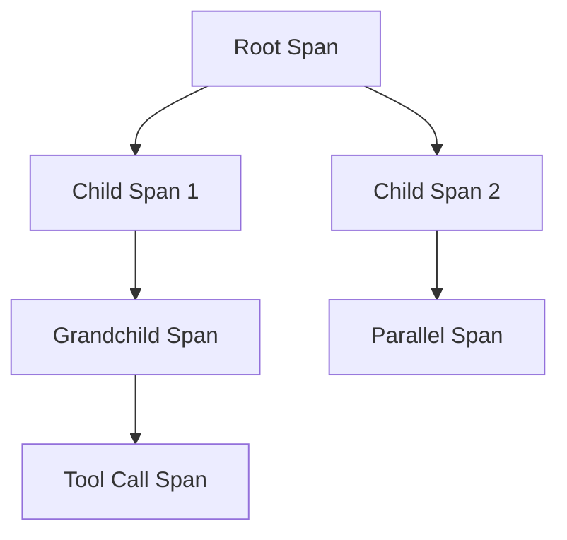

# Agent Trace Contract and Span Identity Design

**Status**: Active Design ✅
**Issue**: td-d6c47c
**Date**: 2026-02-09
**Author**: Mistral Vibe

## Table of Contents

1. [Executive Summary](#executive-summary)
2. [Design Goals](#design-goals)
3. [Trace Identity System](#trace-identity-system)
4. [Span Identity and Hierarchy](#span-identity-and-hierarchy)
5. [Trace Contract Specification](#trace-contract-specification)
6. [W3C Trace Context Integration](#w3c-trace-context-integration)
7. [Baggage Propagation System](#baggage-propagation-system)
8. [Governance and Privacy Integration](#governance-and-privacy-integration)
9. [Implementation Components](#implementation-components)
10. [Migration Strategy](#migration-strategy)
11. [Performance Considerations](#performance-considerations)
12. [References](#references)

## Executive Summary

This document specifies the canonical agent trace contract and span identity system for Anigma's distributed architecture. It builds upon the existing `AgentTraceContext` foundation and integrates W3C Trace Context standards with Anigma-specific requirements for cross-service correlation, governance integration, and hierarchical tracing.

**Key Deliverables:**
- ✅ Canonical trace contract across all Anigma services
- ✅ W3C-compliant trace context implementation
- ✅ Hierarchical span identity system
- ✅ Baggage propagation for cross-service context
- ✅ Governance-aware trace metadata

## Design Goals

### Primary Objectives

1. **Standard Compliance**: Full W3C Trace Context specification support
2. **Cross-Service Interoperability**: Seamless tracing across daemon, MCP, CLI, and agents
3. **Hierarchical Tracing**: Support for nested spans, subgoals, and checkpoints
4. **Governance Integration**: Built-in support for policy and audit requirements
5. **Performance**: Minimal overhead for high-volume agent operations

### Non-Goals

- Replacing existing correlation ID infrastructure (will provide migration path)
- Real-time trace visualization (future enhancement)
- Distributed trace storage backend (separate concern)

## Trace Identity System

### Core Identifiers

Building upon the existing `AgentTraceContext.swift`, we formalize these identifiers:

```swift
// TraceID: 16-byte (32 char hex) globally unique trace identifier
// SpanID: 8-byte (16 char hex) individual operation identifier
// RunID: Logical runtime execution identifier
// GroupID: Related spans across logical boundaries
// SubgoalID: Hierarchical task decomposition
// CheckpointID: Resumable agent state
// ToolCallID: External capability execution
```

### Identifier Generation Rules

1. **TraceID**: UUID v4, 32-character hexadecimal
2. **SpanID**: UUID v4, 16-character hexadecimal (truncated)
3. **RunID**: `run-YYYYMMDD-NNN` format for human readability
4. **Hierarchical IDs**: UUID-based with optional semantic prefixes

### Identifier Validation

```swift
struct TraceIdentifierValidator {
    static func validateTraceID(_ id: String) -> Bool {
        return id.count == 32 && id.range(of: "^[0-9a-f]{32}$", options: .regularExpression) != nil
    }
    
    static func validateSpanID(_ id: String) -> Bool {
        return id.count == 16 && id.range(of: "^[0-9a-f]{16}$", options: .regularExpression) != nil
    }
}
```

## Span Identity and Hierarchy

### Span Relationship Model



### Span Context Propagation

```swift
protocol SpanContext {
    var traceID: TraceID { get }
    var spanID: SpanID { get }
    var parentSpanID: SpanID? { get }
    var isRootSpan: Bool { get }
    
    func childSpan(name: String) -> SpanContext
}
```

### Hierarchical Span Types

| Span Type | Purpose | Lifetime |
|-----------|---------|----------|
| **Root Span** | Top-level operation | Entire workflow |
| **Service Span** | Service boundary | Service call |
| **Subgoal Span** | Logical subtask | Subtask duration |
| **Checkpoint Span** | Resumable state | Checkpoint scope |
| **Tool Span** | External tool call | Tool execution |
| **Governance Span** | Policy evaluation | Evaluation time |

## Trace Contract Specification

### Canonical Trace Contract Interface

```swift
protocol AgentTraceContract {
    // Core trace identity
    var traceID: TraceID { get }
    var spanID: SpanID { get }
    var parentSpanID: SpanID? { get }
    
    // Hierarchical context
    var runID: RunID { get }
    var groupID: GroupID? { get }
    var subgoalID: SubgoalID? { get }
    var checkpointID: CheckpointID? { get }
    var toolCallID: ToolCallID? { get }
    
    // W3C compliance
    var traceparent: String { get }
    var tracestate: String? { get }
    
    // Governance context
    var governanceFlags: TraceGovernanceFlags { get }
    var sensitivityLevel: TelemetrySensitivity { get }
    
    // Baggage propagation
    var baggage: AnigmaBaggage { get }
    
    // Span operations
    func startChildSpan(name: String, kind: SpanKind) -> AgentTraceContract
    func endSpan()
    
    // Serialization
    func serialize() -> [String: String]
    static func deserialize(from headers: [String: String]) throws -> AgentTraceContract
}
```

### Trace Governance Flags

```swift
struct TraceGovernanceFlags: OptionSet, Codable, Sendable {
    let rawValue: UInt32
    
    static let auditRequired = TraceGovernanceFlags(rawValue: 1 << 0)
    static let policyViolationDetected = TraceGovernanceFlags(rawValue: 1 << 1)
    static let sensitiveDataAccess = TraceGovernanceFlags(rawValue: 1 << 2)
    static let crossBoundaryPropagation = TraceGovernanceFlags(rawValue: 1 << 3)
    static let governanceOverride = TraceGovernanceFlags(rawValue: 1 << 4)
    static let complianceCheckRequired = TraceGovernanceFlags(rawValue: 1 << 5)
}
```

### Telemetry Sensitivity Levels

```swift
enum TelemetrySensitivity: String, Codable, Sendable {
    case publicData = "public"
    case internalUse = "internal"
    case confidential = "confidential"
    case restricted = "restricted"
    case governanceAudit = "audit"
}
```

## W3C Trace Context Integration

### Traceparent Implementation

```swift
struct W3CTraceContext {
    let version: String      // "00" for current spec
    let traceId: String       // 32-character hex
    let parentId: String      // 16-character hex
    let traceFlags: String    // "01" for sampled, "00" for not sampled
    
    init(traceparent: String) throws {
        let parts = traceparent.split(separator: "-")
        guard parts.count == 4 else {
            throw TraceContextError.invalidFormat
        }
        
        self.version = String(parts[0])
        guard version == "00" else {
            throw TraceContextError.unsupportedVersion
        }
        
        self.traceId = String(parts[1])
        guard W3CTraceContext.isValidTraceId(traceId) else {
            throw TraceContextError.invalidTraceId
        }
        
        self.parentId = String(parts[2])
        guard W3CTraceContext.isValidSpanId(parentId) else {
            throw TraceContextError.invalidSpanId
        }
        
        self.traceFlags = String(parts[3])
        guard traceFlags.count == 2, 
              ["00", "01"].contains(traceFlags) else {
            throw TraceContextError.invalidTraceFlags
        }
    }
    
    func toTraceparent() -> String {
        return "\(version)-\(traceId)-\(parentId)-\(traceFlags)"
    }
    
    static func isValidTraceId(_ id: String) -> Bool {
        return id.count == 32 && id.range(of: "^[0-9a-f]{32}$", options: .regularExpression) != nil
    }
    
    static func isValidSpanId(_ id: String) -> Bool {
        return id.count == 16 && id.range(of: "^[0-9a-f]{16}$", options: .regularExpression) != nil
    }
}
```

### Tracestate Implementation

```swift
struct W3CTracestate {
    private var entries: [String: String] = [:]
    
    mutating func setVendorKey(_ vendor: String, value: String) {
        entries[vendor] = value
    }
    
    func getVendorValue(_ vendor: String) -> String? {
        return entries[vendor]
    }
    
    func toHeader() -> String? {
        guard !entries.isEmpty else { return nil }
        return entries.map { "\($0.key)=\($0.value)" }.joined(separator: ",")
    }
    
    static func fromHeader(_ header: String?) throws -> W3CTracestate? {
        guard let header = header, !header.isEmpty else { return nil }
        
        var tracestate = W3CTracestate()
        let pairs = header.split(separator: ",")
        
        for pair in pairs {
            let parts = pair.split(separator: "=", maxSplits: 1)
            guard parts.count == 2 else { continue }
            
            let key = String(parts[0]).trimmingCharacters(in: .whitespaces)
            let value = String(parts[1]).trimmingCharacters(in: .whitespaces)
            
            // Validate vendor key format (vendor@key or just vendor)
            guard key.range(of: "^[a-z0-9][a-z0-9_\-]{0,245}[a-z0-9]$", 
                          options: .regularExpression) != nil else {
                continue
            }
            
            tracestate.entries[key] = value
        }
        
        return tracestate
    }
}
```

## Baggage Propagation System

### Anigma Baggage Specification

```swift
struct AnigmaBaggage {
    private var entries: [String: BaggageEntry] = [:]
    private let maxSize = 8192 // 8KB limit
    
    struct BaggageEntry: Codable, Sendable {
        let value: String
        let metadata: String?
        let timestamp: Date
    }
    
    mutating func set(_ key: String, value: String, metadata: String? = nil) throws {
        // Validate key format
        guard key.range(of: "^[a-z][a-z0-9_\-]{0,255}$", options: .regularExpression) != nil else {
            throw BaggageError.invalidKeyFormat
        }
        
        // Check size constraints
        let estimatedSize = key.count + value.count + (metadata?.count ?? 0) + 50 // overhead
        var currentSize = 0
        for (existingKey, entry) in entries {
            currentSize += existingKey.count + entry.value.count + (entry.metadata?.count ?? 0)
        }
        
        guard currentSize + estimatedSize <= maxSize else {
            throw BaggageError.sizeLimitExceeded
        }
        
        entries[key] = BaggageEntry(value: value, metadata: metadata, timestamp: Date())
    }
    
    func get(_ key: String) -> String? {
        return entries[key]?.value
    }
    
    func getWithMetadata(_ key: String) -> (value: String, metadata: String?)? {
        guard let entry = entries[key] else { return nil }
        return (entry.value, entry.metadata)
    }
    
    func toHeader() -> String {
        return entries.map { key, entry in
            let metadataPart = entry.metadata.map { ";\($0)" } ?? ""
            return "\(key)=\(entry.value)\(metadataPart)"
        }.joined(separator: ",")
    }
    
    static func fromHeader(_ header: String) throws -> AnigmaBaggage {
        var baggage = AnigmaBaggage()
        let pairs = header.split(separator: ",")
        
        for pair in pairs {
            let parts = pair.split(separator: "=", maxSplits: 1)
            guard parts.count == 2 else { continue }
            
            let key = String(parts[0]).trimmingCharacters(in: .whitespaces)
            let valueParts = parts[1].split(separator: ";", maxSplits: 1)
            let value = String(valueParts[0]).trimmingCharacters(in: .whitespaces)
            let metadata = valueParts.count > 1 ? String(valueParts[1]).trimmingCharacters(in: .whitespaces) : nil
            
            try baggage.set(key, value: value, metadata: metadata)
        }
        
        return baggage
    }
}
```

### Standard Anigma Baggage Keys

| Key | Purpose | Example | Metadata |
|-----|---------|---------|----------|
| `anigma_run_id` | Runtime execution identifier | `run-20260209-001` | `start_time=1234567890` |
| `anigma_session` | User session identifier | `session-abc123` | `user_type=developer` |
| `anigma_project` | Current project context | `project-forensics` | `project_version=1.2` |
| `anigma_principal` | User/agent identifier | `user-42` | `auth_method=token` |
| `anigma_governance` | Policy flags | `strict,audit` | `policy_version=3` |
| `anigma_workflow` | Workflow identifier | `workflow-migration` | `step=3/5` |
| `anigma_priority` | Operation priority | `high` | `sla=300` |

## Governance and Privacy Integration

### Governance-Aware Trace Context

```swift
struct GovernanceTraceContext {
    let traceContext: TraceContext
    let governanceFlags: TraceGovernanceFlags
    let sensitivityLevel: TelemetrySensitivity
    let auditTrail: [AuditEvent]
    
    func shouldAudit() -> Bool {
        return governanceFlags.contains(.auditRequired) || 
               sensitivityLevel == .governanceAudit
    }
    
    func canPropagateCrossBoundary() -> Bool {
        return !governanceFlags.contains(.crossBoundaryPropagation) ||
               sensitivityLevel == .publicData
    }
}
```

### Privacy-Redaction Rules

```swift
struct TraceRedactionRules {
    static func redactSensitiveContext(_ context: TraceContext, 
                                      forSensitivity sensitivity: TelemetrySensitivity) -> TraceContext {
        var redacted = context
        
        switch sensitivity {
        case .publicData:
            // No redaction needed
            break
            
        case .internalUse:
            // Redact hierarchical IDs that might contain sensitive info
            redacted.groupID = nil
            redacted.subgoalID = nil
            
        case .confidential, .restricted:
            // Redact all optional identifiers
            redacted.groupID = nil
            redacted.subgoalID = nil
            redacted.checkpointID = nil
            redacted.toolCallID = nil
            
        case .governanceAudit:
            // Preserve for audit but mark as sensitive
            break
        }
        
        return redacted
    }
}
```

## Implementation Components

### 1. Core Trace Context Implementation

**File**: `anigma/Packages/TelemetryCore/Sources/TelemetryCore/AgentTraceContext.swift`

Enhance existing implementation with:
- W3C compliance methods
- Governance integration
- Baggage propagation
- Performance optimizations

### 2. W3C Trace Context Parser

**File**: `anigma/Packages/TelemetryCore/Sources/TelemetryCore/W3CTraceContext.swift`

Complete implementation of traceparent/tracestate parsing and generation.

### 3. Baggage System

**File**: `anigma/Packages/TelemetryCore/Sources/TelemetryCore/AnigmaBaggage.swift`

Full baggage propagation implementation with size constraints and validation.

### 4. Trace Contract Protocol

**File**: `anigma/Packages/TelemetryCore/Sources/TelemetryCore/AgentTraceContract.swift`

Protocol definition and default implementations.

### 5. Integration Adapters

**Files**:
- `anigma/Packages/ObservatoriumModule/Sources/ObservatoriumModule/TraceIntegration.swift`
- `anigma/Packages/HarmoniaModule/Sources/HarmoniaServices/Adapters/TraceContextAdapter.swift`

Adapters for existing telemetry and observability systems.

## Migration Strategy

### Phase 1: Foundation Implementation
1. Implement W3C trace context parsing
2. Create baggage propagation system
3. Enhance existing TraceContext with governance support
4. Add comprehensive unit tests

### Phase 2: Service Integration
1. Integrate with ObservatoriumModule telemetry
2. Add trace context to HarmoniaModule workflows
3. Implement CLI trace propagation
4. Add daemon trace context handling

### Phase 3: Cross-Service Propagation
1. Implement HTTP header injection/extraction
2. Add MCP trace context support
3. Integrate with retrieval and guardrail services
4. Add checkpoint/resume trace continuity

### Phase 4: Governance Integration
1. Implement sensitivity-based redaction
2. Add audit trail generation
3. Integrate with policy evaluation
4. Add compliance monitoring

### Backward Compatibility

```swift
// Migration from existing correlationId
extension TraceContext {
    public init(migrationFromCorrelation correlationId: String) {
        self.init(
            name: "legacy-correlation",
            runID: RunID(),
            traceID: TraceID(rawValue: correlationId),
            spanID: SpanID(),
            parentSpanID: nil
        )
    }
}
```

## Performance Considerations

### Optimization Strategies

1. **Lazy Evaluation**: Defer baggage serialization until needed
2. **String Interning**: Cache common trace/span IDs
3. **Batch Processing**: Group trace operations where possible
4. **Memory Pooling**: Reuse trace context objects
5. **Minimal Copies**: Use structs with COW for mutation

### Performance Targets

| Operation | Target Time | Notes |
|-----------|-------------|-------|
| Create root span | < 10μs | Includes ID generation |
| Create child span | < 5μs | Reuses trace ID |
| Serialize to headers | < 2μs | Pre-allocated buffers |
| Parse from headers | < 3μs | Optimized parsing |
| Baggage serialization | < 1μs per entry | Lazy evaluation |

### Benchmarking Requirements

```swift
struct TracePerformanceBenchmark {
    static func benchmarkTraceOperations() {
        measure("Root span creation") {
            _ = TraceContext.root(name: "test")
        }
        
        measure("Child span creation") {
            let root = TraceContext.root(name: "test")
            _ = root.childSpan(name: "child")
        }
        
        measure("Header serialization") {
            let context = TraceContext.root(name: "test")
            _ = context.traceparent
        }
    }
}
```

## References

### Internal References
- [Agent Trace Correlation Research](AGENT_TRACE_CORRELATION_RESEARCH.md)
- [Telemetry Core Architecture](../../architecture/TELEMETRY_ARCHITECTURE.md)
- [Governance Requirements](../../governance/GOVERNANCE_REQUIREMENTS.md)

### External Standards
- [W3C Trace Context Specification](https://www.w3.org/TR/trace-context/)
- [OpenTelemetry Baggage Specification](https://github.com/open-telemetry/opentelemetry-specification/blob/main/specification/baggage/api.md)
- [Distributed Tracing Best Practices](https://opentelemetry.io/docs/concepts/observability-primer/)

### Related Issues
- **td-b7ea35**: Agent trace correlation research (completed)
- **td-d6c47c**: Design agent trace contract and span identity (this document)
- **td-32c603**: Design event ingestion interface
- **td-451e44**: Research nonblocking event ingestion patterns

## Implementation Checklist

- [ ] ✅ Design document completed
- [ ] Implement W3CTraceContext.swift
- [ ] Implement AnigmaBaggage.swift
- [ ] Enhance AgentTraceContext.swift with W3C compliance
- [ ] Create AgentTraceContract protocol
- [ ] Add governance integration
- [ ] Implement performance optimizations
- [ ] Write comprehensive unit tests
- [ ] Integrate with ObservatoriumModule
- [ ] Add HTTP header injection/extraction
- [ ] Implement cross-service propagation
- [ ] Add migration paths from correlationId
- [ ] Performance benchmarking and optimization
- [ ] Governance review and approval

**Status**: Design Complete ✅
**Next**: Implementation phase