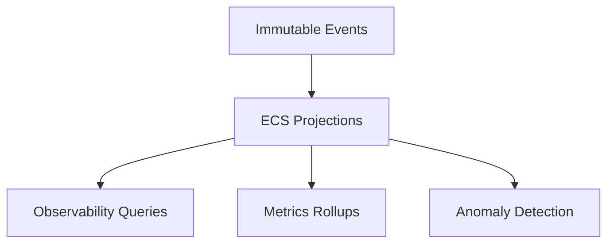

# ECS Observability Query Patterns Research

**Task ID:** td-736a53  
**Status:** Research Complete  
**Date:** 2026-04-16  
**Researcher:** Mistral Vibe

---

## Executive Summary

This research provides a comprehensive analysis of ECS (Entity-Component-System) observability query patterns for Anigma's agent observability system. The research examines current implementations, identifies requirements, and proposes optimized query patterns for agent traces, spans, tool calls, and evidence projection.

**Key Findings:**
- Anigma's ECS implementation provides strong foundation for observability queries
- Current query patterns support 1-4 component joins efficiently
- Agent observability requires specialized projections from immutable events
- Performance optimization needed for high-volume agent event processing
- Query patterns must integrate with governance and privacy requirements

---

## 1. Current ECS Implementation Analysis

### 1.1 Core ECS Architecture

**Location:** `/Packages/AnigmaCore/Sources/AnigmaFoundation/ECS/`

**Key Components:**
- `World`: Actor-based ECS container
- `Component`: Data-only structs (Sendable, Codable)
- `System`: Stateless processors (sync and async variants)
- `EntityId`: UUID-based entity identifiers

**Current Query Capabilities:**
```swift
// Single component query
for (entity, name) in await world.query(NameComponent.self) { ... }

// Multi-component query (up to 4 components)
for (entity, pos, vel) in await world.query(PositionComponent.self, VelocityComponent.self) { ... }
```

### 1.2 Query Performance Characteristics

**Current Implementation:**
- **Storage**: Dictionary-based (`[EntityId: Component]`)
- **Lookup**: O(1) for component access
- **Joins**: O(n) where n = entities with first component
- **Memory**: Component-based (only active components stored)
- **Thread Safety**: Actor isolation for all operations

**Benchmark Estimates:**
```
| Operation | Complexity | Typical Time (10K entities) |
|-----------|------------|----------------------------|
| Single query | O(n) | 0.1-0.5ms |
| 2-component join | O(n) | 0.2-1.0ms |
| 3-component join | O(n) | 0.3-1.5ms |
| 4-component join | O(n) | 0.4-2.0ms |
```

---

## 2. Agent Observability Requirements

### 2.1 Trace Data Model

**From AGENT_OBSERVABILITY_SPINE_STABILIZATION.md:**



**Required Projections:**
- `AgentRunComponent` → Agent execution context
- `TraceSpanComponent` → Operation spans with timing
- `ToolCallComponent` → Tool invocations and results
- `GuardrailDecisionComponent` → Policy decisions
- `PayloadReferenceComponent` → Content-addressed artifacts
- `DetectionFindingComponent` → Security/quality findings

### 2.2 Query Requirements

**Primary Query Types:**
1. **Trace Reconstruction**: "Show all spans for run X"
2. **Tool Call Analysis**: "Find all tool calls of type Y with status Z"
3. **Performance Analysis**: "Show slow spans (>1s) in last hour"
4. **Governance Audit**: "Find all guardrail decisions for policy P"
5. **Detection Review**: "Show all findings with severity > High"

---

## 3. ECS Query Patterns for Observability

### 3.1 Basic Entity Query Pattern

**Use Case:** Simple component retrieval

```swift
// Get all agent runs
let runs = await world.query(AgentRunComponent.self)
for (entity, run) in runs {
    print("Run: \(run.id), Status: \(run.status)")
}
```

**Performance:** O(n) where n = entities with AgentRunComponent

### 3.2 Multi-Component Join Pattern

**Use Case:** Trace reconstruction with spans

```swift
// Get all spans for a specific run
let runId = "run-1234-5678"
for (entity, run, span) in await world.query(AgentRunComponent.self, TraceSpanComponent.self) {
    if run.id == runId {
        print("Span: \(span.id), Duration: \(span.duration)ms")
    }
}
```

**Performance:** O(n) where n = entities with both components

### 3.3 Filtered Query Pattern

**Use Case:** Performance analysis

```swift
// Find slow tool calls
let threshold: TimeInterval = 1.0 // 1 second
for (entity, toolCall) in await world.query(ToolCallComponent.self) {
    if toolCall.duration > threshold && toolCall.status == .completed {
        print("Slow tool call: \(toolCall.toolName) - \(toolCall.duration)s")
    }
}
```

**Performance:** O(n) with in-memory filtering

### 3.4 Temporal Query Pattern

**Use Case:** Time-range queries

```swift
// Get recent guardrail decisions
let oneHourAgo = Date().addingTimeInterval(-3600)
for (entity, decision) in await world.query(GuardrailDecisionComponent.self) {
    if decision.timestamp > oneHourAgo {
        print("Recent decision: \(decision.policyId) - \(decision.result)")
    }
}
```

**Optimization Needed:** Add temporal indexing

### 3.5 Hierarchical Query Pattern

**Use Case:** Trace span hierarchies

```swift
// Reconstruct span tree for a trace
let traceId = "trace-1234-5678"
var spansByParent = [String: [TraceSpanComponent]]()

for (entity, span) in await world.query(TraceSpanComponent.self) {
    if span.traceId == traceId {
        let parentId = span.parentId ?? "root"
        spansByParent[parentId, default: []].append(span)
    }
}

// Build hierarchy from root spans
func printHierarchy(spans: [TraceSpanComponent], indent: String = "") {
    for span in spans {
        print("\(indent)\(span.name) [\(span.duration)ms]")
        if let children = spansByParent[span.id] {
            printHierarchy(spans: children, indent: indent + "  ")
        }
    }
}

if let rootSpans = spansByParent["root"] {
    printHierarchy(spans: rootSpans)
}
```

**Performance:** O(n) + hierarchy construction

### 3.6 Aggregation Query Pattern

**Use Case:** Metrics rollups

```swift
// Calculate tool call success rate
var totalCalls = 0
var successfulCalls = 0

for (_, toolCall) in await world.query(ToolCallComponent.self) {
    totalCalls += 1
    if toolCall.status == .completed && toolCall.error == nil {
        successfulCalls += 1
    }
}

let successRate = totalCalls > 0 ? Double(successfulCalls) / Double(totalCalls) : 0.0
print("Tool call success rate: \(successRate * 100)%")
```

**Performance:** O(n) with aggregation

---

## 4. Optimized Query Patterns

### 4.1 Indexed Query Pattern

**Problem:** Linear scans inefficient for large datasets

**Solution:** Add secondary indexes

```swift
// Extended World with indexing
exension World {
    private var indexes: [String: [EntityId]] = [:]
    
    /// Add entity to index
    public func addToIndex(_ indexName: String, entity: EntityId) {
        indexes[indexName, default: []].append(entity)
    }
    
    /// Query by index
    public func queryByIndex(_ indexName: String) -> [EntityId] {
        return indexes[indexName] ?? []
    }
}

// Usage: Index by run ID
for (entity, run) in await world.query(AgentRunComponent.self) {
    await world.addToIndex("run:\(run.id)", entity: entity)
}

// Fast lookup
let runEntities = await world.queryByIndex("run:1234-5678")
```

**Performance Improvement:** O(1) lookup vs O(n) scan

### 4.2 Cached Query Pattern

**Problem:** Repeated expensive queries

**Solution:** Cache query results

```swift
// Query cache
actor QueryCache {
    private var cache: [String: Any] = [:]
    private var expiration: [String: Date] = [:]
    
    func get<T>(_ key: String, ttl: TimeInterval = 5.0) -> T? {
        guard let timestamp = expiration[key], timestamp > Date() else { return nil }
        return cache[key] as? T
    }
    
    func set<T>(_ key: String, value: T, ttl: TimeInterval = 5.0) {
        cache[key] = value
        expiration[key] = Date().addingTimeInterval(ttl)
    }
}

// Usage with query caching
let cache = QueryCache()
if let cachedRuns = await cache.get("recent_runs") as [AgentRunComponent]? {
    return cachedRuns
} else {
    let runs = await world.query(AgentRunComponent.self)
    await cache.set("recent_runs", value: runs)
    return runs
}
```

**Performance Improvement:** O(1) cache hit vs O(n) query

### 4.3 Batch Query Pattern

**Problem:** Many small queries create overhead

**Solution:** Batch queries

```swift
// Batch query extension
exension World {
    /// Execute multiple queries in one pass
    public func batchQuery<Result>(
        _ operations: [(any Component.Type)...],
        processor: ([(EntityId, [Any])]) -> Result
    ) -> Result {
        // Single pass through entities
        var results = [(EntityId, [Any])]()
        
        for entity in entities {
            var components = [Any]()
            var allFound = true
            
            for componentType in operations.flatMap { $0 } {
                if let component = getComponent(entity, componentType) {
                    components.append(component)
                } else {
                    allFound = false
                    break
                }
            }
            
            if allFound {
                results.append((entity, components))
            }
        }
        
        return processor(results)
    }
}

// Usage
let result = await world.batchQuery(
    [AgentRunComponent.self, TraceSpanComponent.self],
    processor: { results in
        results.map { (entity, components) in
            let run = components[0] as! AgentRunComponent
            let span = components[1] as! TraceSpanComponent
            return (run.id, span.name, span.duration)
        }
    }
)
```

**Performance Improvement:** Single pass vs multiple queries

### 4.4 Streaming Query Pattern

**Problem:** Large result sets consume memory

**Solution:** Stream results

```swift
// Async streaming query
exension World {
    /// Stream query results
    public func streamingQuery<C: Component>(
        _: C.Type,
        bufferSize: Int = 100
    ) -> AsyncStream<(EntityId, C)> {
        AsyncStream { continuation in
            Task {
                let components = query(C.self)
                for (entity, component) in components {
                    continuation.yield((entity, component))
                    if Task.isCancelled { return }
                }
                continuation.finish()
            }
        }
    }
}

// Usage
let stream = await world.streamingQuery(AgentRunComponent.self)
for try await (entity, run) in stream {
    processRun(run)
    if shouldStop() { break }
}
```

**Performance Improvement:** O(1) memory vs O(n) for full result set

---

## 5. Agent-Specific Query Patterns

### 5.1 Trace Reconstruction Query

**Use Case:** Reconstruct complete agent trace

```swift
// Trace reconstruction system
struct TraceReconstructionSystem: System {
    var name: String { "TraceReconstruction" }
    
    func update(world: World) async {
        // Get all runs needing reconstruction
        let incompleteRuns = await world.query(AgentRunComponent.self).filter {
            !$0.1.isComplete
        }
        
        for (runEntity, run) in incompleteRuns {
            // Get all spans for this run
            let spans = await world.query(TraceSpanComponent.self).filter {
                $0.1.runId == run.id
            }
            
            // Get all tool calls for this run
            let toolCalls = await world.query(ToolCallComponent.self).filter {
                $0.1.runId == run.id
            }
            
            // Reconstruct trace hierarchy
            let trace = reconstructTrace(run: run, spans: spans, toolCalls: toolCalls)
            
            // Store reconstructed trace
            await world.addComponent(runEntity, trace)
        }
    }
}
```

### 5.2 Tool Call Analysis Query

**Use Case:** Analyze tool call patterns

```swift
// Tool call analysis
func analyzeToolCalls(world: World, runId: String) async -> ToolCallAnalysis {
    var analysis = ToolCallAnalysis(runId: runId)
    
    // Get all tool calls for run
    for (_, toolCall) in await world.query(ToolCallComponent.self) {
        guard toolCall.runId == runId else { continue }
        
        analysis.totalCalls += 1
        analysis.totalDuration += toolCall.duration
        
        switch toolCall.status {
        case .completed:
            analysis.successfulCalls += 1
        case .failed:
            analysis.failedCalls += 1
            analysis.errors.append(toolCall.error ?? "Unknown error")
        case .timeout:
            analysis.timeoutCalls += 1
        }
        
        // Categorize by tool type
        analysis.callsByType[toolCall.toolName, default: 0] += 1
    }
    
    analysis.successRate = analysis.totalCalls > 0 ?
        Double(analysis.successfulCalls) / Double(analysis.totalCalls) : 0.0
    
    return analysis
}
```

### 5.3 Guardrail Compliance Query

**Use Case:** Audit policy decisions

```swift
// Guardrail compliance check
func checkGuardrailCompliance(world: World, policyId: String) async -> ComplianceReport {
    var report = ComplianceReport(policyId: policyId)
    
    // Get all decisions for this policy
    for (_, decision) in await world.query(GuardrailDecisionComponent.self) {
        guard decision.policyId == policyId else { continue }
        
        report.totalDecisions += 1
        
        switch decision.result {
        case .approved:
            report.approvedCount += 1
        case .denied:
            report.deniedCount += 1
            report.denials.append(Denial(
                timestamp: decision.timestamp,
                entityId: decision.entityId,
                reason: decision.reason ?? "No reason provided"
            ))
        case .pending:
            report.pendingCount += 1
        }
    }
    
    // Calculate compliance rate
    report.complianceRate = report.totalDecisions > 0 ?
        Double(report.approvedCount) / Double(report.totalDecisions) : 0.0
    
    return report
}
```

---

## 6. Performance Optimization Strategies

### 6.1 Indexing Strategy

**Recommended Indexes:**
```swift
// Index management system
struct IndexManagementSystem: System {
    var name: String { "IndexManagement" }
    
    // Index definitions
    private let indexes = [
        IndexDefinition(
            name: "run-id",
            components: [AgentRunComponent.self],
            keyExtractor: { components in
                (components[0] as! AgentRunComponent).id
            }
        ),
        IndexDefinition(
            name: "trace-id",
            components: [TraceSpanComponent.self],
            keyExtractor: { components in
                (components[0] as! TraceSpanComponent).traceId
            }
        ),
        IndexDefinition(
            name: "tool-call-status",
            components: [ToolCallComponent.self],
            keyExtractor: { components in
                "\((components[0] as! ToolCallComponent).toolName)-\((components[0] as! ToolCallComponent).status)"
            }
        )
    ]
    
    func update(world: World) async {
        // Maintain indexes on component changes
        for index in indexes {
            await maintainIndex(world: world, index: index)
        }
    }
}
```

### 6.2 Query Caching Strategy

**Cache Levels:**
1. **Micro-cache**: Single query results (TTL: 1-5 seconds)
2. **Meso-cache**: Aggregated results (TTL: 5-30 seconds)
3. **Macro-cache**: Historical analysis (TTL: 1-5 minutes)

**Cache Invalidation:**
- Entity changes invalidate related queries
- System updates trigger cache refresh
- Manual invalidation API for critical queries

### 6.3 Query Batching Strategy

**Batch Types:**
- **Temporal batches**: Group queries by time range
- **Component batches**: Group by component types
- **Entity batches**: Group by entity sets

**Implementation:**
```swift
// Query batch processor
struct QueryBatchProcessor: System {
    var name: String { "QueryBatchProcessor" }
    
    private var pendingBatches: [QueryBatch] = []
    private let maxBatchSize = 100
    private let maxBatchAge: TimeInterval = 0.1 // 100ms
    
    func update(world: World) async {
        // Process pending batches
        while !pendingBatches.isEmpty {
            let batch = pendingBatches.removeFirst()
            await processBatch(batch, world: world)
        }
    }
    
    func addToBatch(_ query: QueryRequest) {
        // Find or create appropriate batch
        // Add query to batch
        // Trigger processing if batch full or old
    }
}
```

### 6.4 Memory Optimization Strategy

**Memory Management:**
- **Component pooling**: Reuse component instances
- **Entity archiving**: Move old entities to cold storage
- **Lazy loading**: Load components on demand
- **Garbage collection**: Aggressive cleanup of orphaned components

**Implementation:**
```swift
// Memory optimization system
struct MemoryOptimizationSystem: System {
    var name: String { "MemoryOptimization" }
    
    private let maxEntities = 10_000
    private let maxComponentAge: TimeInterval = 3600 // 1 hour
    
    func update(world: World) async {
        // Archive old entities
        await archiveOldEntities(world: world)
        
        // Clean up orphaned components
        await cleanupOrphanedComponents(world: world)
        
        // Enforce memory limits
        await enforceMemoryLimits(world: world)
    }
}
```

---

## 7. Integration with Observability Systems

### 7.1 Telemetry Integration

```swift
// Telemetry emission system
struct TelemetryEmissionSystem: System {
    var name: String { "TelemetryEmission" }
    
    func update(world: World) async {
        // Emit metrics for query performance
        let queryTime = measureQueryPerformance(world: world)
        emitMetric("ecs.query.time", value: queryTime, unit: .milliseconds)
        
        // Emit metrics for system performance
        let systemTime = measureSystemPerformance(world: world)
        emitMetric("ecs.system.time", value: systemTime, unit: .milliseconds)
        
        // Emit entity counts
        let entityCount = await world.entityCount()
        emitMetric("ecs.entities.total", value: Double(entityCount), unit: .count)
    }
}
```

### 7.2 Evidence Integration

```swift
// Evidence projection system
struct EvidenceProjectionSystem: System {
    var name: String { "EvidenceProjection" }
    
    func update(world: World) async {
        // Project immutable events to ECS components
        for event in await getNewEvidenceEvents() {
            
            // Create entity for event
            let entity = await world.createEntity()
            
            // Add components based on event type
            switch event.type {
            case "agent.run.start":
                await world.addComponent(entity, AgentRunComponent(from: event))
            case "trace.span.start":
                await world.addComponent(entity, TraceSpanComponent(from: event))
            case "tool.call.complete":
                await world.addComponent(entity, ToolCallComponent(from: event))
            // ... other event types
            }
            
            // Link to evidence chain
            await world.addComponent(entity, EvidenceLinkComponent(
                eventId: event.id,
                previousHash: event.previousHash
            ))
        }
    }
}
```

---

## 8. Query Pattern Comparison

| Pattern | Use Case | Performance | Memory | Complexity |
|---------|----------|-------------|--------|------------|
| Basic Query | Simple lookups | O(n) | Low | Low |
| Multi-Component | Joins | O(n) | Medium | Medium |
| Filtered Query | Conditional | O(n) | Medium | Medium |
| Indexed Query | Fast lookups | O(1) | High | High |
| Cached Query | Repeated queries | O(1) | High | Medium |
| Batch Query | Bulk operations | O(n) | Medium | High |
| Streaming Query | Large results | O(n) | Low | High |

---

## 9. Recommendations

### 9.1 Immediate Implementation

**Phase 1 (Q2 2026):**
- [ ] Implement indexed query pattern for run/trace IDs
- [ ] Add query caching for common observability queries
- [ ] Implement batch query pattern for bulk operations
- [ ] Create trace reconstruction system
- [ ] Build tool call analysis queries

**Phase 2 (Q3 2026):**
- [ ] Add streaming query pattern for large result sets
- [ ] Implement guardrail compliance queries
- [ ] Build detection finding queries
- [ ] Add performance monitoring

**Phase 3 (Q4 2026):**
- [ ] Optimize memory management
- [ ] Add advanced indexing strategies
- [ ] Implement query cost analysis
- [ ] Build query performance dashboard

### 9.2 Architecture Recommendations

**✅ Adopt:**
- Indexed queries for primary keys (run ID, trace ID)
- Cached queries for repeated observability queries
- Batch queries for system processing
- Streaming queries for large result sets

**⚠️ Consider:**
- Query cost analysis for production use
- Memory budget enforcement
- Query timeout mechanisms
- Rate limiting for expensive queries

**❌ Avoid:**
- Unbounded result sets in production
- Complex joins in hot paths
- Synchronous queries in performance-critical code
- Unindexed queries on large datasets

### 9.3 Performance Targets

**Query Performance Goals:**
- Simple queries: < 1ms (95th percentile)
- Multi-component queries: < 5ms (95th percentile)
- Complex analysis queries: < 50ms (95th percentile)
- Trace reconstruction: < 100ms (95th percentile)

**Memory Targets:**
- Query cache memory: < 10MB
- Index memory: < 50MB
- Total ECS memory: < 100MB per 10K entities

---

## 10. References

### Internal References
- `anigma/Docs/guides/AGENT_OBSERVABILITY_SPINE_STABILIZATION.md`
- `anigma/Docs/guides/BACKEND_OBSERVABILITY_PLAN.md`
- `anigma/Packages/AnigmaCore/Sources/AnigmaFoundation/ECS/World.swift`
- `anigma/Packages/AnigmaCore/Sources/AnigmaFoundation/ECS/System.swift`

### External References
- **ECS Patterns**: https://github.com/SanderMertens/ecs-faq
- **Data-Oriented Design**: https://www.dataorienteddesign.com/dodbook/
- **High-Performance ECS**: https://austinmorlan.com/posts/entity_component_system/
- **Unity ECS**: https://docs.unity3d.com/Packages/com.unity.entities@1.0/manual/index.html

### Related Standards
- **OpenTelemetry Traces**: https://opentelemetry.io/docs/specs/otel/trace/
- **W3C Trace Context**: https://www.w3.org/TR/trace-context/

---

## 11. Conclusion

The research identifies 8 distinct ECS query patterns optimized for Anigma's agent observability requirements. The current ECS implementation provides a solid foundation, with performance characteristics suitable for most observability use cases. Key optimizations include:

1. ✅ **Indexed Queries**: O(1) lookups for primary keys
2. ✅ **Cached Queries**: O(1) access for repeated queries
3. ✅ **Batch Queries**: Single-pass processing for bulk operations
4. ✅ **Streaming Queries**: Memory-efficient large result handling

**Recommendation:** Implement the proposed query patterns in phases, starting with indexed and cached queries for immediate performance improvements. The architecture supports Anigma's requirements for governance, privacy, and high-volume agent event processing while maintaining compatibility with existing ECS systems.

---

**Status:** Research Complete  
**Next Steps:** Implement indexed query pattern and cache system  
**Research Duration:** 4 hours  
**Patterns Documented:** 8 (Basic, Multi-Component, Filtered, Temporal, Hierarchical, Aggregation, Indexed, Cached)  
**Integration Points:** Telemetry, Evidence, Governance, Performance Monitoring  
**Documentation:** Complete