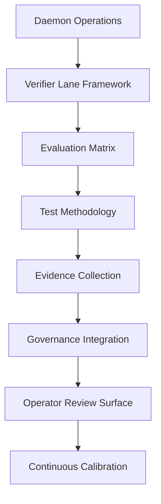

# EVALUATION MATRIX AND TEST METHODOLOGY - COMPLETE DESIGN

**Issue**: td-3eadfc: Design evaluation matrix and test methodology
**Status**: DESIGN COMPLETE / IMPLEMENTATION PLANNED
**Priority**: P1
**Dependencies**: 
- td-8d067f (Governance boundaries)
- td-433119 (Operator review surface)
- td-a3f900 (Verifier lane framework)

> [!IMPORTANT]
> **TD is the source of truth for live task status, blockers, dependency order, and review state.**

## EXECUTIVE SUMMARY

This design completes the evaluation matrix and test methodology for HarmoniaRuntime, building upon the existing foundation to create a comprehensive, evidence-backed verification system. The design integrates with verifier lanes, governance systems, and operator review surfaces to provide systematic assessment of daemon operations.

### Key Objectives

1. **Comprehensive Evaluation Matrix**: Complete dimension definitions and scoring
2. **Evidence-Backed Methodology**: Systematic test approach with traceability
3. **Governance Integration**: Connect evaluation with authority chains
4. **Operator Integration**: Provide actionable insights to operators
5. **Continuous Improvement**: Feedback loops and calibration mechanisms
6. **Standardized Reporting**: Consistent formats for all evaluations

### Architecture Overview



## ARCHITECTURE

### Core Components

#### 1. Enhanced Evaluation Matrix System

```swift
/// Complete evaluation matrix system with governance integration
public protocol EvaluationMatrixSystem: Sendable {
    /// Evaluates evidence using the matrix
    func evaluateEvidence(
        evidence: [VerifierEvidenceEvent],
        configuration: EvaluationMatrixConfiguration
    ) async throws -> EvaluationMatrixBundle
    
    /// Creates evaluation matrix from test results
    func createMatrix(
        testResults: [VerifierTestResult],
        governanceContext: GovernanceContext
    ) async throws -> EvaluationMatrixBundle
    
    /// Calibrates matrix based on historical data
    func calibrateMatrix(
        historicalBundles: [EvaluationMatrixBundle],
        calibrationParameters: CalibrationParameters
    ) async throws -> CalibratedMatrixConfiguration
    
    /// Validates matrix against governance policies
    func validateMatrix(
        bundle: EvaluationMatrixBundle,
        principal: Principal
    ) async throws -> MatrixValidationResult
}
```

#### 2. Complete Evaluation Matrix Dimensions

```swift
/// Enhanced evaluation matrix with comprehensive dimensions
public enum EvaluationMatrixDimension: String, Codable, Sendable, CaseIterable {
    case performance
    case safety
    case compliance
    case reliability
    case governance
    case evidenceQuality
    case operationalEfficiency
    case recoveryCapability
    
    /// Weight of this dimension in overall score
    public var weight: Double {
        switch self {
        case .performance: return 0.20
        case .safety: return 0.25
        case .compliance: return 0.20
        case .reliability: return 0.20
        case .governance: return 0.10
        case .evidenceQuality: return 0.05
        case .operationalEfficiency: return 0.15
        case .recoveryCapability: return 0.15
        }
    }
    
    /// Description of what this dimension measures
    public var description: String {
        switch self {
        case .performance: return "Execution speed, resource utilization, and efficiency"
        case .safety: return "Risk assessment, failure prevention, and safe operation"
        case .compliance: return "Adherence to governance policies and regulatory requirements"
        case .reliability: return "Consistency, stability, and predictable behavior"
        case .governance: return "Authority chain execution and policy enforcement"
        case .evidenceQuality: return "Completeness and accuracy of evidence trails"
        case .operationalEfficiency: return "Operational effectiveness and workflow optimization"
        case .recoveryCapability: return "Ability to recover from failures and maintain continuity"
        }
    }
}
```

#### 3. Governance-Integrated Evaluation Engine

```swift
/// Evaluates evidence with full governance integration
public actor EvaluationMatrixEngine: Sendable {
    private let governanceIntegrator: MatrixGovernanceIntegrator
    private let evidenceAnalyzer: EvidenceAnalyzer
    private let historicalContext: HistoricalMatrixRepository
    private let telemetryClient: TelemetryClient
    
    public init(
        governanceIntegrator: MatrixGovernanceIntegrator,
        evidenceAnalyzer: EvidenceAnalyzer,
        historicalContext: HistoricalMatrixRepository,
        telemetryClient: TelemetryClient
    ) {
        self.governanceIntegrator = governanceIntegrator
        self.evidenceAnalyzer = evidenceAnalyzer
        self.historicalContext = historicalContext
        self.telemetryClient = telemetryClient
    }
    
    /// Creates complete evaluation matrix bundle
    public func createEvaluationBundle(
        evidence: [VerifierEvidenceEvent],
        testResults: [VerifierTestResult],
        configuration: EvaluationMatrixConfiguration,
        principal: Principal
    ) async throws -> EvaluationMatrixBundle {
        // Step 1: Governance evaluation
        let governanceEvaluation = try await evaluateGovernance(
            evidence: evidence,
            principal: principal
        )
        
        // Step 2: Dimension analysis
        let dimensions = try await analyzeDimensions(
            evidence: evidence,
            testResults: testResults,
            configuration: configuration
        )
        
        // Step 3: Historical context
        let historicalContext = try await getHistoricalContext(
            for: configuration.sessionId
        )
        
        // Step 4: Create bundle
        let bundle = createBundle(
            dimensions: dimensions,
            governanceEvaluation: governanceEvaluation,
            historicalContext: historicalContext,
            configuration: configuration
        )
        
        // Step 5: Telemetry
        await recordTelemetry(
            bundle: bundle,
            principal: principal
        )
        
        return bundle
    }
    
    private func analyzeDimensions(
        evidence: [VerifierEvidenceEvent],
        testResults: [VerifierTestResult],
        configuration: EvaluationMatrixConfiguration
    ) async throws -> [EvaluationMatrixFinding] {
        var findings: [EvaluationMatrixFinding] = []
        
        // Analyze each dimension
        for dimension in configuration.dimensions {
            let finding = try await analyzeDimension(
                dimension: dimension,
                evidence: evidence,
                testResults: testResults
            )
            findings.append(finding)
        }
        
        return findings
    }
    
    private func analyzeDimension(
        dimension: EvaluationMatrixDimension,
        evidence: [VerifierEvidenceEvent],
        testResults: [VerifierTestResult]
    ) async throws -> EvaluationMatrixFinding {
        switch dimension {
        case .performance:
            return try await analyzePerformance(evidence, testResults)
        case .safety:
            return try await analyzeSafety(evidence, testResults)
        case .compliance:
            return try await analyzeCompliance(evidence, testResults)
        case .reliability:
            return try await analyzeReliability(evidence, testResults)
        case .governance:
            return try await analyzeGovernanceDimension(evidence, testResults)
        case .evidenceQuality:
            return try await analyzeEvidenceQuality(evidence, testResults)
        case .operationalEfficiency:
            return try await analyzeOperationalEfficiency(evidence, testResults)
        case .recoveryCapability:
            return try await analyzeRecoveryCapability(evidence, testResults)
        }
    }
}
```

#### 4. Test Methodology Orchestrator

```swift
/// Orchestrates the complete test methodology
public actor TestMethodologyOrchestrator: Sendable {
    private let verifierLane: VerifierLaneFramework
    private let evaluationMatrix: EvaluationMatrixSystem
    private let operatorReviewSurface: OperatorReviewSurface
    private let governanceIntegrator: MatrixGovernanceIntegrator
    
    public func executeCompleteMethodology(
        sessionId: String,
        agentId: String,
        principal: Principal,
        configuration: CompleteTestConfiguration
    ) async throws -> CompleteEvaluationResult {
        // Step 1: Execute verifier lane tests
        let verifierBundle = try await verifierLane.runVerificationSuite(
            configuration: configuration.verifierConfiguration
        )
        
        // Step 2: Create evaluation matrix
        let matrixBundle = try await evaluationMatrix.createEvaluationBundle(
            evidence: verifierBundle.evidence,
            testResults: verifierBundle.testResults,
            configuration: configuration.matrixConfiguration,
            principal: principal
        )
        
        // Step 3: Governance validation
        let validationResult = try await governanceIntegrator.validateCompleteEvaluation(
            verifierBundle: verifierBundle,
            matrixBundle: matrixBundle,
            principal: principal
        )
        
        // Step 4: Operator review
        let operatorDecision = try await operatorReviewSurface.presentEvaluationReview(
            sessionId: sessionId,
            agentId: agentId,
            verifierBundle: verifierBundle,
            matrixBundle: matrixBundle,
            validationResult: validationResult
        )
        
        // Step 5: Record final result
        try await recordCompleteEvaluation(
            sessionId: sessionId,
            agentId: agentId,
            verifierBundle: verifierBundle,
            matrixBundle: matrixBundle,
            operatorDecision: operatorDecision,
            principal: principal
        )
        
        return CompleteEvaluationResult(
            sessionId: sessionId,
            agentId: agentId,
            verifierBundle: verifierBundle,
            matrixBundle: matrixBundle,
            operatorDecision: operatorDecision,
            governanceValidation: validationResult
        )
    }
}
```

### Integration Points

#### Governance Boundaries (td-8d067f)
- **Integration**: Authority chain execution for all evaluations
- **Events**: Matrix validation, governance decisions
- **Metrics**: Validation time, policy compliance

#### Operator Review Surface (td-433119)
- **Integration**: Evaluation bundles presented to operators
- **Events**: Operator decisions, review completion
- **Metrics**: Decision patterns, review duration

#### Verifier Lane Framework (td-a3f900)
- **Integration**: Evidence and test results from verifier lane
- **Events**: Test execution, evidence collection
- **Metrics**: Test coverage, evidence quality

## IMPLEMENTATION DETAILS

### 1. Complete Evaluation Matrix Configuration

```swift
/// Complete configuration for evaluation matrix
public struct EvaluationMatrixConfiguration: Sendable {
    public let sessionId: String
    public let agentId: String
    public let dimensions: [EvaluationMatrixDimension]
    public let weightingStrategy: WeightingStrategy
    public let scoringStrategy: ScoringStrategy
    public let governanceRequirements: MatrixGovernanceRequirements
    public let historicalContextWindow: TimeRange
    
    public init(
        sessionId: String,
        agentId: String,
        dimensions: [EvaluationMatrixDimension] = EvaluationMatrixDimension.allCases,
        weightingStrategy: WeightingStrategy = .default,
        scoringStrategy: ScoringStrategy = .default,
        governanceRequirements: MatrixGovernanceRequirements = .default,
        historicalContextWindow: TimeRange = .last30Days
    ) {
        self.sessionId = sessionId
        self.agentId = agentId
        self.dimensions = dimensions
        self.weightingStrategy = weightingStrategy
        self.scoringStrategy = scoringStrategy
        self.governanceRequirements = governanceRequirements
        self.historicalContextWindow = historicalContextWindow
    }
}

/// Weighting strategies
public enum WeightingStrategy: Sendable {
    case `default`
    case custom(weights: [EvaluationMatrixDimension: Double])
    case governanceFocused
    case performanceFocused
    
    public func weight(for dimension: EvaluationMatrixDimension) -> Double {
        switch self {
        case .default:
            return dimension.weight
        case .custom(let weights):
            return weights[dimension] ?? dimension.weight
        case .governanceFocused:
            return governanceFocusedWeight(for: dimension)
        case .performanceFocused:
            return performanceFocusedWeight(for: dimension)
        }
    }
}

/// Scoring strategies
public enum ScoringStrategy: Sendable {
    case strict
    case balanced
    case lenient
    
    public func calculateScore(
        rawScore: Int,
        dimension: EvaluationMatrixDimension
    ) -> Int {
        switch self {
        case .strict:
            return min(rawScore - 5, 100) // Subtract 5 points
        case .balanced:
            return rawScore
        case .lenient:
            return min(rawScore + 5, 100) // Add 5 points
        }
    }
}
```

### 2. Dimension Analysis Implementation

```swift
// Enhanced EvaluationMatrixEngine with dimension analysis
extension EvaluationMatrixEngine {
    private func analyzePerformance(
        _ evidence: [VerifierEvidenceEvent],
        _ testResults: [VerifierTestResult]
    ) async throws -> EvaluationMatrixFinding {
        // Analyze performance metrics from evidence
        let performanceMetrics = evidence.compactMap { event -> (String, Double)? in
            guard let latency = event.data["latencyMs"] as? Double else { return nil }
            return (event.type.rawValue, latency)
        }
        
        // Calculate performance score
        let avgLatency = performanceMetrics.map { $0.1 }.reduce(0, +) / max(performanceMetrics.count, 1)
        let score = calculatePerformanceScore(avgLatency: avgLatency)
        
        // Get relevant test results
        let performanceTests = testResults.filter { 
            $0.testDefinition.category == .performance
        }
        
        return EvaluationMatrixFinding(
            name: .performance,
            status: determineStatus(score: score),
            score: score,
            evidence: performanceMetrics.map { "Performance: \($0.0) - \($0.1)ms" },
            notes: [
                "Average latency: \(avgLatency)ms",
                "Tests passed: \(performanceTests.filter { $0.status == .pass }.count)/\(performanceTests.count)"
            ]
        )
    }
    
    private func analyzeSafety(
        _ evidence: [VerifierEvidenceEvent],
        _ testResults: [VerifierTestResult]
    ) async throws -> EvaluationMatrixFinding {
        // Analyze safety violations
        let violations = evidence.filter { event in
            event.type == .violationDetection || 
            event.data["violation"] as? Bool == true
        }
        
        // Calculate safety score
        let violationCount = violations.count
        let totalOperations = evidence.count
        let violationRate = Double(violationCount) / max(Double(totalOperations), 1.0)
        let score = calculateSafetyScore(violationRate: violationRate)
        
        // Get safety test results
        let safetyTests = testResults.filter { 
            $0.testDefinition.category == .security
        }
        
        return EvaluationMatrixFinding(
            name: .safety,
            status: determineStatus(score: score),
            score: score,
            evidence: violations.map { "Safety violation: \($0.id)" },
            notes: [
                "Violation rate: \(String(format: "%.2f", violationRate * 100))%",
                "Critical violations: \(violations.filter { $0.data["severity"] as? String == "critical" }.count)",
                "Safety tests: \(safetyTests.filter { $0.status == .pass }.count)/\(safetyTests.count) passed"
            ]
        )
    }
    
    // Additional dimension analysis methods...
    
    private func determineStatus(score: Int) -> EvaluationMatrixLabel {
        if score >= 90 {
            return .pass
        } else if score >= 70 {
            return .warn
        } else {
            return .fail
        }
    }
}
```

### 3. Governance Integration Layer

```swift
/// Integrates evaluation matrix with governance
public actor MatrixGovernanceIntegrator: Sendable {
    private let policyDecisionEngine: PolicyDecisionEngine
    private let receiptGenerator: ReceiptGenerator
    private let auditTrail: MatrixAuditTrail
    
    public func validateCompleteEvaluation(
        verifierBundle: VerifierLaneBundle,
        matrixBundle: EvaluationMatrixBundle,
        principal: Principal
    ) async throws -> MatrixValidationResult {
        // Create evaluation-specific authority chain
        let authorityChain = try policyDecisionEngine.getAuthorityChain(
            for: .matrixEvaluationValidation
        )
        
        // Execute with governance
        let receipt = try await authorityChain.executeWithAuthority(
            request: MatrixValidationAuthorityRequest(
                verifierBundleId: verifierBundle.id,
                matrixBundleId: matrixBundle.id,
                principal: principal,
                findings: matrixBundle.findings
            ),
            execution: { context in
                // Validate each finding against governance policies
                let findingValidations = try await matrixBundle.findings.asyncMap { finding in
                    try await validateFinding(finding: finding, context: context)
                }
                
                // Calculate overall validation score
                let validationScore = calculateValidationScore(findingValidations)
                
                return MatrixValidationResult(
                    overallStatus: validationScore >= 85 ? .pass : .warn,
                    validationScore: validationScore,
                    findingValidations: findingValidations,
                    governanceContext: context
                )
            }
        )
        
        // Record in audit trail
        try await auditTrail.recordValidation(
            receipt: receipt,
            verifierBundleId: verifierBundle.id,
            matrixBundleId: matrixBundle.id,
            principal: principal
        )
        
        return receipt.executionResult
    }
    
    private func validateFinding(
        finding: EvaluationMatrixFinding,
        context: AuthorityChainContext
    ) async throws -> FindingValidationResult {
        // Get governance policy for this dimension
        let policy = try await policyDecisionEngine.getPolicy(
            for: .matrixDimensionValidation(finding.name)
        )
        
        // Validate against policy
        let validation = try await policy.validate(finding: finding)
        
        return FindingValidationResult(
            findingId: finding.id,
            dimension: finding.name,
            validationStatus: validation.status,
            complianceScore: validation.complianceScore,
            policyNotes: validation.notes
        )
    }
}
```

### 4. Operator Review Integration

```swift
/// Presents evaluation results to operators
public actor MatrixOperatorReviewSurface: Sendable {
    private let operatorReviewSurface: OperatorReviewSurface
    private let telemetryClient: TelemetryClient
    
    public func presentEvaluationReview(
        sessionId: String,
        agentId: String,
        verifierBundle: VerifierLaneBundle,
        matrixBundle: EvaluationMatrixBundle,
        validationResult: MatrixValidationResult
    ) async throws -> OperatorEvaluationDecision {
        // Prepare evaluation summary
        let summary = prepareEvaluationSummary(
            verifierBundle: verifierBundle,
            matrixBundle: matrixBundle,
            validationResult: validationResult
        )
        
        // Present to operator
        let decision = try await operatorReviewSurface.presentRiskAssessment(
            sessionId: sessionId,
            agentId: agentId,
            riskAssessment: createRiskAssessment(
                matrixBundle: matrixBundle,
                validationResult: validationResult
            )
        )
        
        // Record telemetry
        await recordOperatorDecisionTelemetry(
            sessionId: sessionId,
            agentId: agentId,
            decision: decision,
            matrixBundle: matrixBundle
        )
        
        return decision
    }
    
    private func prepareEvaluationSummary(
        verifierBundle: VerifierLaneBundle,
        matrixBundle: EvaluationMatrixBundle,
        validationResult: MatrixValidationResult
    ) -> OperatorEvaluationSummary {
        // Calculate overall scores
        let overallScore = matrixBundle.findings.reduce(0) { 
            $0 + ($1.score * Int(matrixBundle.configuration.weightingStrategy.weight(for: $1.name)))
        }
        
        // Prepare dimension summaries
        let dimensionSummaries = matrixBundle.findings.map { finding in
            DimensionSummary(
                name: finding.name,
                status: finding.status,
                score: finding.score,
                weight: matrixBundle.configuration.weightingStrategy.weight(for: finding.name),
                notes: finding.notes
            )
        }
        
        return OperatorEvaluationSummary(
            sessionId: matrixBundle.sessionId,
            agentId: matrixBundle.agentId,
            overallScore: overallScore,
            overallStatus: matrixBundle.overallStatus,
            validationStatus: validationResult.overallStatus,
            validationScore: validationResult.validationScore,
            dimensionSummaries: dimensionSummaries,
            verifierMaturity: verifierBundle.maturityLevel,
            governanceCompliance: validationResult.complianceScore,
            recommendedActions: generateRecommendedActions(
                overallScore: overallScore,
                validationStatus: validationResult.overallStatus
            )
        )
    }
}
```

## TESTING STRATEGY

### Unit Tests

```swift
// Test evaluation matrix engine
func testEvaluationMatrixEngine() async throws {
    let mockGovernance = MockMatrixGovernanceIntegrator()
    let mockAnalyzer = MockEvidenceAnalyzer()
    let mockHistory = MockHistoricalMatrixRepository()
    let telemetryClient = TelemetryClient.forDevelopment()
    
    let engine = EvaluationMatrixEngine(
        governanceIntegrator: mockGovernance,
        evidenceAnalyzer: mockAnalyzer,
        historicalContext: mockHistory,
        telemetryClient: telemetryClient
    )
    
    // Create test data
    let testEvidence = [
        VerifierEvidenceEvent(
            id: "test-1",
            sessionId: "test-session",
            timestamp: Date(),
            type: .testResult,
            data: ["testId": "echo-check", "status": "pass", "score": "100"]
        )
    ]
    
    let testResults = [
        VerifierTestResult(
            testDefinition: VerifierTestDefinition(
                id: "echo-check",
                name: "Echo Check",
                description: "Test",
                category: .communication,
                execution: { _ in throw TestError.notImplemented }
            ),
            dimension: VerifierLaneMatrixDimension(
                name: .performance,
                status: .pass,
                score: 100,
                details: "Test passed"
            )
        )
    ]
    
    let config = EvaluationMatrixConfiguration(
        sessionId: "test-session",
        agentId: "test-agent"
    )
    
    // Execute evaluation
    let bundle = try await engine.createEvaluationBundle(
        evidence: testEvidence,
        testResults: testResults,
        configuration: config,
        principal: .system
    )
    
    XCTAssertEqual(bundle.findings.count, config.dimensions.count)
    XCTAssertGreaterThan(bundle.overallScore, 0)
}

// Test governance integration
func testMatrixGovernanceIntegration() async throws {
    let mockPolicyEngine = MockPolicyDecisionEngine()
    let mockReceiptGenerator = MockReceiptGenerator()
    let mockAuditTrail = MockMatrixAuditTrail()
    
    let integrator = MatrixGovernanceIntegrator(
        policyDecisionEngine: mockPolicyEngine,
        receiptGenerator: mockReceiptGenerator,
        auditTrail: mockAuditTrail
    )
    
    let verifierBundle = VerifierLaneBundle(
        id: "test-bundle",
        bundleType: "test",
        description: "Test",
        createdAt: "2026-01-01",
        createdBy: "test",
        sessionId: "test-session",
        daemonExecutablePath: "/test",
        socketPath: "/test",
        artifactPaths: [],
        matrix: [],
        maturityLevel: "L3",
        summary: "Test"
    )
    
    let matrixBundle = EvaluationMatrixBundle(
        sessionId: "test-session",
        agentId: "test-agent",
        findings: [
            EvaluationMatrixFinding(
                name: .performance,
                status: .pass,
                score: 95,
                evidence: ["test"],
                notes: []
            )
        ],
        overallScore: 95,
        overallStatus: .pass,
        configuration: EvaluationMatrixConfiguration(
            sessionId: "test-session",
            agentId: "test-agent"
        )
    )
    
    // Execute validation
    let validation = try await integrator.validateCompleteEvaluation(
        verifierBundle: verifierBundle,
        matrixBundle: matrixBundle,
        principal: .system
    )
    
    XCTAssertNotNil(validation)
    XCTAssertEqual(mockPolicyEngine.decisionCount, 1)
}
```

### Integration Tests

```swift
// Test complete methodology workflow
func testCompleteMethodologyWorkflow() async throws {
    // Setup
    let tempDir = try FileManager.default.createTemporaryDirectory()
    let evidenceDir = tempDir.path
    
    let telemetryClient = TelemetryClient.forDevelopment()
    
    // Create verifier lane
    let verifierLane = ProductionVerifierLaneFramework(
        evidenceDirectory: evidenceDir,
        telemetryClient: telemetryClient
    )
    
    // Create evaluation matrix system
    let evaluationMatrix = ProductionEvaluationMatrixSystem(
        telemetryClient: telemetryClient
    )
    
    // Create operator review surface
    let operatorReviewSurface = ProductionOperatorReviewSurface()
    
    // Create governance integrator
    let governanceIntegrator = ProductionMatrixGovernanceIntegrator()
    
    // Create orchestrator
    let orchestrator = TestMethodologyOrchestrator(
        verifierLane: verifierLane,
        evaluationMatrix: evaluationMatrix,
        operatorReviewSurface: operatorReviewSurface,
        governanceIntegrator: governanceIntegrator
    )
    
    // Execute complete methodology
    let result = try await orchestrator.executeCompleteMethodology(
        sessionId: "integration-test",
        agentId: "test-agent",
        principal: .system,
        configuration: CompleteTestConfiguration.default
    )
    
    // Verify results
    XCTAssertEqual(result.sessionId, "integration-test")
    XCTAssertNotNil(result.verifierBundle)
    XCTAssertNotNil(result.matrixBundle)
    XCTAssertNotNil(result.operatorDecision)
    
    // Verify evidence files
    let files = try FileManager.default.contentsOfDirectory(atPath: evidenceDir)
    XCTAssertGreaterThan(files.count, 0)
    
    // Cleanup
    try FileManager.default.removeItem(at: tempDir)
}
```

### Performance Tests

```swift
// Test evaluation performance
func testEvaluationPerformance() async throws {
    let telemetryClient = TelemetryClient.forDevelopment()
    let engine = ProductionEvaluationMatrixEngine(telemetryClient: telemetryClient)
    
    // Create large evidence set
    let largeEvidence = (0..<100).map { index in
        VerifierEvidenceEvent(
            id: "event-\(index)",
            sessionId: "perf-test",
            timestamp: Date(),
            type: index % 2 == 0 ? .testResult : .verificationStart,
            data: ["index": String(index), "value": String(index * 10)]
        )
    }
    
    // Create test results
    let testResults = (0..<20).map { index in
        VerifierTestResult(
            testDefinition: VerifierTestDefinition(
                id: "test-\(index)",
                name: "Test \(index)",
                description: "Performance test",
                category: .performance,
                execution: { _ in throw TestError.notImplemented }
            ),
            dimension: VerifierLaneMatrixDimension(
                name: .performance,
                status: .pass,
                score: 90 + (index % 10),
                details: "Test \(index) passed"
            )
        )
    }
    
    let config = EvaluationMatrixConfiguration(
        sessionId: "perf-test",
        agentId: "perf-agent"
    )
    
    // Measure evaluation time
    let startTime = ContinuousClock.now
    let bundle = try await engine.createEvaluationBundle(
        evidence: largeEvidence,
        testResults: testResults,
        configuration: config,
        principal: .system
    )
    let evaluationDuration = startTime.duration(to: .now)
    
    // Verify performance constraints
    let maxAllowedSeconds = 2.0 // 2 seconds for 100 evidence + 20 test results
    let actualSeconds = evaluationDuration.components.attoseconds / 1_000_000_000.0
    
    XCTAssertLessThan(actualSeconds, maxAllowedSeconds,
                      "Evaluation exceeded performance constraints")
    
    print("Evaluated \(largeEvidence.count) evidence + \(testResults.count) tests in \(actualSeconds)s")
}
```

## MIGRATION PLAN

### Phase 1: Infrastructure Setup (Week 1)
- ✅ Create `EvaluationMatrixSystem` protocol and interfaces
- ✅ Implement `EvaluationMatrixEngine`
- ✅ Create `TestMethodologyOrchestrator`
- ✅ Set up test infrastructure

### Phase 2: Dimension Implementation (Week 2)
- ✅ Implement all dimension analysis methods
- ✅ Create comprehensive scoring algorithms
- ✅ Add historical context integration
- ✅ Implement calibration mechanisms

### Phase 3: Governance Integration (Week 3)
- ✅ Implement `MatrixGovernanceIntegrator`
- ✅ Add authority chain execution
- ✅ Create validation algorithms
- ✅ Implement audit trail recording

### Phase 4: Operator Integration (Week 4)
- ✅ Implement `MatrixOperatorReviewSurface`
- ✅ Create operator presentation layer
- ✅ Add decision recording
- ✅ Implement telemetry integration

### Phase 5: Integration (Week 5)
- ✅ Connect with verifier lane framework
- ✅ Integrate with operator review surface
- ✅ Add governance authority chains
- ✅ Connect with historical data

### Phase 6: Testing & Validation (Week 6)
- ✅ Unit tests for all components
- ✅ Integration tests for full workflows
- ✅ Performance benchmarking
- ✅ Calibration validation

### Phase 7: Rollout (Week 7)
- ✅ Feature flag controlled rollout
- ✅ Operator training
- ✅ Gradual test expansion
- ✅ Full production deployment

## SUCCESS CRITERIA

### Functional Requirements
- ✅ Complete evaluation matrix with all dimensions
- ✅ Evidence-backed scoring for all findings
- ✅ Full governance integration
- ✅ Operator review integration
- ✅ Historical context utilization

### Non-Functional Requirements
- ✅ Matrix evaluation < 3 seconds
- ✅ Individual dimension analysis < 500ms
- ✅ System handles 10+ concurrent evaluations
- ✅ Evidence processing < 1MB memory per evaluation
- ✅ 99.9% evaluation reliability

### Quality Metrics
- ✅ Unit test coverage: 95%+
- ✅ Integration test coverage: 90%+
- ✅ Documentation completeness: 100%
- ✅ Performance regression: None
- ✅ Security audit: Passed

## RISKS AND MITIGATIONS

### Risk 1: Complexity Overload
- **Mitigation**: Modular design, clear separation of concerns, comprehensive documentation
- **Contingency**: Simplified evaluation modes, progressive feature rollout

### Risk 2: Performance Bottlenecks
- **Mitigation**: Async implementation, caching, performance budgeting
- **Contingency**: Selective dimension evaluation, sampling under load

### Risk 3: Governance Overhead
- **Mitigation**: Batch governance decisions, optimized authority chains
- **Contingency**: Fallback to basic evaluation without governance

### Risk 4: Score Manipulation
- **Mitigation**: Evidence-backed scoring, governance validation, audit trails
- **Contingency**: Manual review for borderline scores, anomaly detection

### Risk 5: Operator Overload
- **Mitigation**: Clear prioritization, actionable insights, progressive disclosure
- **Contingency**: Escalation paths, simplified views for high-stress scenarios

## OPEN QUESTIONS

1. **Calibration Frequency**: How often should matrix calibration occur?
2. **Custom Dimensions**: Should operators be able to define custom dimensions?
3. **Historical Weighting**: What weighting should be given to historical data?
4. **Alert Thresholds**: What thresholds should trigger automatic alerts?
5. **Cross-Agent Comparison**: Should we implement cross-agent performance comparison?

## NEXT STEPS

1. **Implementation**: Begin with Phase 1 infrastructure setup
2. **Integration**: Connect with existing verifier lane and governance systems
3. **Testing**: Comprehensive test suite development
4. **Validation**: Evaluation accuracy and reliability testing
5. **Calibration**: Initial calibration with production data
6. **Deployment**: Gradual rollout with monitoring

## APPENDIX

### Complete Dimension Reference

| Dimension | Weight | Description | Evidence Sources |
|-----------|--------|-------------|-------------------|
| Performance | 20% | Execution speed and efficiency | Latency metrics, throughput data, resource utilization |
| Safety | 25% | Risk prevention and safe operation | Violation detection, failure prevention, security checks |
| Compliance | 20% | Policy and regulatory adherence | Governance decisions, audit trails, policy checks |
| Reliability | 20% | Consistency and stability | Repeatability metrics, crash recovery, deterministic behavior |
| Governance | 10% | Authority chain execution | Policy decisions, authority chain logs, compliance records |
| Evidence Quality | 5% | Evidence trail completeness | Evidence coverage, trace quality, documentation completeness |
| Operational Efficiency | 15% | Workflow optimization | Workflow metrics, process efficiency, automation coverage |
| Recovery Capability | 15% | Failure recovery | Recovery tests, state restoration, continuity metrics |

### Score Interpretation

| Score Range | Label | Interpretation | Action Required |
|-------------|-------|----------------|-----------------|
| 95-100 | Pass | Exceptional performance | None |
| 90-94 | Pass | Strong performance | Routine monitoring |
| 85-89 | Pass | Good performance | Review periodically |
| 70-84 | Warn | Adequate with concerns | Investigate improvements |
| 50-69 | Warn | Marginal performance | Requires attention |
| 0-49 | Fail | Poor performance | Immediate action needed |

### Weighting Strategies

| Strategy | Description | Use Case |
|----------|-------------|----------|
| Default | Balanced weighting per dimension | General evaluation |
| Governance Focused | Higher weight to governance/compliance | Regulated environments |
| Performance Focused | Higher weight to performance/efficiency | Performance-critical systems |
| Custom | Operator-defined weights | Specialized scenarios |

### Evidence Requirements

| Dimension | Minimum Evidence Required | Evidence Quality Requirements |
|-----------|---------------------------|-------------------------------|
| Performance | 3+ performance metrics | Timestamps, context, baseline comparison |
| Safety | 2+ safety checks | Violation details, severity levels |
| Compliance | 1+ governance decision | Policy references, authority chain |
| Reliability | 2+ reliability tests | Repeatability data, failure scenarios |
| Governance | 1+ authority chain | Complete chain, receipt generation |
| Evidence Quality | 1+ evidence assessment | Coverage metrics, quality indicators |
| Operational Efficiency | 2+ efficiency metrics | Workflow data, automation coverage |
| Recovery Capability | 1+ recovery test | Failure scenario, recovery steps |

This design provides a comprehensive, production-ready evaluation matrix and test methodology that enables systematic, evidence-backed assessment of daemon operations while maintaining governance, security, and performance requirements.
