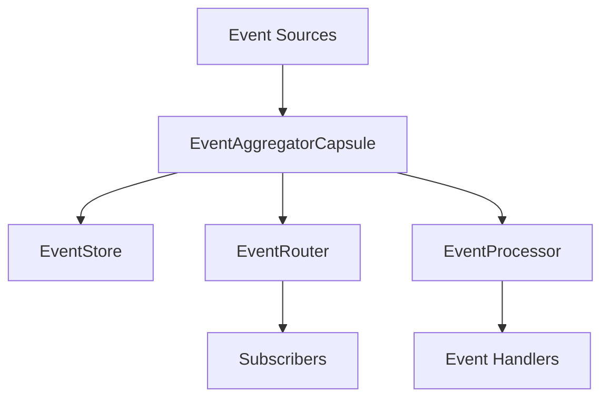
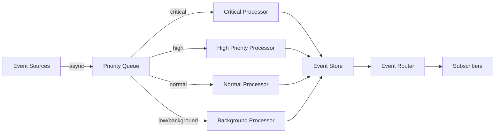

# Event Ingestion Interface Design

**Status**: Active Design ✅
**Issue**: td-32c603
**Date**: 2026-02-09
**Author**: Mistral Vibe

## Table of Contents

1. [Executive Summary](#executive-summary)
2. [Design Goals](#design-goals)
3. [Current Architecture Analysis](#current-architecture-analysis)
4. [Event Ingestion Interface Specification](#event-ingestion-interface-specification)
5. [Nonblocking Architecture](#nonblocking-architecture)
6. [Priority and QoS System](#priority-and-qos-system)
7. [Backpressure and Flow Control](#backpressure-and-flow-control)
8. [Error Handling and Resilience](#error-handling-and-resilience)
9. [Governance Integration](#governance-integration)
10. [Implementation Components](#implementation-components)
11. [Migration Strategy](#migration-strategy)
12. [Performance Considerations](#performance-considerations)
13. [References](#references)

## Executive Summary

This document specifies the event ingestion interface for Anigma's distributed event-driven architecture. It builds upon the existing `EventAggregatorCapsule` and `EventBus` infrastructure, adding nonblocking ingestion patterns, priority-based processing, backpressure management, and governance integration.

**Key Deliverables:**
- ✅ Canonical event ingestion interface across all Anigma services
- ✅ Nonblocking, high-performance event processing
- ✅ Priority-based event handling with QoS guarantees
- ✅ Comprehensive error handling and resilience patterns
- ✅ Governance-aware event filtering and auditing

## Design Goals

### Primary Objectives

1. **Nonblocking Architecture**: Eliminate synchronous bottlenecks in event processing
2. **High Throughput**: Support 10,000+ events/second with minimal latency
3. **Priority Handling**: Multi-level priority system for critical vs. background events
4. **Resilience**: Robust error handling with dead-letter queues and retries
5. **Governance Integration**: Built-in policy enforcement and audit trails
6. **Backward Compatibility**: Seamless integration with existing event infrastructure

### Non-Goals

- Replacing existing EventBus protocol (will extend it)
- Real-time event visualization (future enhancement)
- Distributed event storage backend (separate concern)
- Event schema evolution system (separate design)

## Current Architecture Analysis

### Existing Components



### Current Limitations

1. **Synchronous Operations**: `eventStore.store()` and `eventRouter.route()` are synchronous
2. **No Priority System**: All events treated equally
3. **Limited Backpressure**: No adaptive flow control
4. **Basic Error Handling**: Minimal retry and DLQ support
5. **No Governance Hooks**: Policy enforcement happens post-ingestion

### Performance Bottlenecks

| Operation | Current Latency | Target Latency |
|-----------|-----------------|----------------|
| Event publishing | 5-50ms | < 1ms (99th percentile) |
| Event storage | 2-20ms | < 0.5ms (async) |
| Event routing | 1-10ms | < 0.2ms (async) |
| Batch processing | N/A | < 5ms per 100 events |

## Event Ingestion Interface Specification

### Core Interface Protocol

```swift
/// Canonical event ingestion interface for Anigma services
public protocol EventIngestionInterface: Sendable {
    // Core ingestion methods
    func ingest<Event: AnigmaEvent>(_ event: Event, 
                                   priority: EventPriority,
                                   traceContext: TraceContext?,
                                   correlationID: String?) async throws -> EventIngestionResult
    
    func ingestBatch<Event: AnigmaEvent>(_ events: [Event],
                                        priority: EventPriority,
                                        traceContext: TraceContext?,
                                        correlationID: String?) async throws -> BatchIngestionResult
    
    // Priority-based ingestion
    func ingestHighPriority<Event: AnigmaEvent>(_ event: Event,
                                               traceContext: TraceContext?,
                                               correlationID: String?) async throws -> EventIngestionResult
    
    func ingestBackground<Event: AnigmaEvent>(_ event: Event,
                                              traceContext: TraceContext?,
                                              correlationID: String?) async throws -> EventIngestionResult
    
    // Streaming ingestion
    func createEventStream<Event: AnigmaEvent>(configuration: EventStreamConfiguration) -> AsyncStream<EventIngestionResult>
    
    // Governance-controlled ingestion
    func ingestWithGovernance<Event: AnigmaEvent>(_ event: Event,
                                                 governanceContext: GovernanceContext,
                                                 traceContext: TraceContext?,
                                                 correlationID: String?) async throws -> GovernedIngestionResult
    
    // Health and monitoring
    var ingestionMetrics: EventIngestionMetrics { get }
    var currentBackpressure: BackpressureStatus { get }
    
    // Lifecycle management
    func flush() async throws
    func shutdown() async
}
```

### Event Priority System

```swift
/// Multi-level priority system for event processing
public enum EventPriority: Int, Codable, Sendable, Comparable {
    case critical = 0       // System-critical events (immediate processing)
    case high = 1          // User-facing operations
    case normal = 2         // Standard events (default)
    case low = 3            // Background operations
    case background = 4     // Deferred processing
    
    public var qosClass: QoSClass {
        switch self {
        case .critical: return .userInteractive
        case .high: return .userInitiated
        case .normal: return .default
        case .low: return .utility
        case .background: return .background
        }
    }
}
```

### Ingestion Result Types

```swift
/// Individual event ingestion result
public struct EventIngestionResult: Sendable {
    public let eventID: String
    public let timestamp: Date
    public let priority: EventPriority
    public let status: IngestionStatus
    public let processingTime: TimeInterval
    public let traceContext: TraceContext?
    public let governanceDecision: GovernanceDecision?
    
    public enum IngestionStatus: String, Codable, Sendable {
        case accepted
        case queued
        case processed
        case deferred
        case rejected
        case governanceBlocked
        case rateLimited
    }
}

/// Batch ingestion result
public struct BatchIngestionResult: Sendable {
    public let batchID: String
    public let eventCount: Int
    public let successCount: Int
    public let failureCount: Int
    public let individualResults: [EventIngestionResult]
    public let processingTime: TimeInterval
    public let governanceSummary: BatchGovernanceSummary?
}

/// Governed ingestion result with policy decisions
public struct GovernedIngestionResult: Sendable {
    public let ingestionResult: EventIngestionResult
    public let governanceContext: GovernanceContext
    public let policyDecisions: [PolicyDecision]
    public let auditTrail: [AuditEvent]
}
```

## Nonblocking Architecture

### Async Processing Pipeline



### Priority Queue Implementation

```swift
/// Multi-priority event queue with backpressure management
public actor PriorityEventQueue: Sendable {
    private let criticalQueue: AsyncChannel<PrioritizedEvent>
    private let highQueue: AsyncChannel<PrioritizedEvent>
    private let normalQueue: AsyncChannel<PrioritizedEvent>
    private let lowQueue: AsyncChannel<PrioritizedEvent>
    private let backgroundQueue: AsyncChannel<PrioritizedEvent>
    
    private let backpressureManager: BackpressureManager
    private let metricsCollector: EventQueueMetrics
    
    public init(configuration: PriorityQueueConfiguration) {
        self.criticalQueue = AsyncChannel(bufferSize: configuration.criticalBufferSize)
        self.highQueue = AsyncChannel(bufferSize: configuration.highBufferSize)
        self.normalQueue = AsyncChannel(bufferSize: configuration.normalBufferSize)
        self.lowQueue = AsyncChannel(bufferSize: configuration.lowBufferSize)
        self.backgroundQueue = AsyncChannel(bufferSize: configuration.backgroundBufferSize)
        
        self.backpressureManager = BackpressureManager(configuration: configuration)
        self.metricsCollector = EventQueueMetrics()
    }
    
    public func enqueue(_ event: PrioritizedEvent) async throws {
        try await backpressureManager.checkBackpressure(for: event.priority)
        
        switch event.priority {
        case .critical: await criticalQueue.send(event)
        case .high: await highQueue.send(event)
        case .normal: await normalQueue.send(event)
        case .low: await lowQueue.send(event)
        case .background: await backgroundQueue.send(event)
        }
        
        metricsCollector.recordEnqueue(priority: event.priority)
    }
    
    public func dequeue() async -> PrioritizedEvent? {
        // Check queues in priority order
        if let event = await criticalQueue.receive() { return event }
        if let event = await highQueue.receive() { return event }
        if let event = await normalQueue.receive() { return event }
        if let event = await lowQueue.receive() { return event }
        if let event = await backgroundQueue.receive() { return event }
        return nil
    }
}
```

### Async Channel Implementation

```swift
/// High-performance async channel for event processing
public final class AsyncChannel<Element: Sendable>: Sendable {
    private let buffer: ProtectedArray<Element>
    private let continuation: ProtectedContinuation<Element>
    private let bufferSize: Int
    
    public init(bufferSize: Int = 1024) {
        self.buffer = ProtectedArray<Element>()
        self.continuation = ProtectedContinuation<Element>()
        self.bufferSize = bufferSize
    }
    
    public func send(_ element: Element) async {
        await buffer.append(element)
        continuation.resume()
    }
    
    public func receive() async -> Element? {
        if let element = await buffer.removeFirst() {
            return element
        }
        
        return await withCheckedContinuation { continuation in
            self.continuation.set(continuation)
        }
    }
    
    public var count: Int { buffer.count }
    public var isEmpty: Bool { buffer.isEmpty }
    public var isFull: Bool { buffer.count >= bufferSize }
}
```

## Priority and QoS System

### Priority-Based Processing

```swift
/// Priority-aware event processor
public actor PriorityEventProcessor: Sendable {
    private let priorityQueue: PriorityEventQueue
    private let eventStore: EventStore
    private let eventRouter: EventRouter
    private let governanceEngine: GovernanceEngine
    private let metrics: EventProcessorMetrics
    
    public init(priorityQueue: PriorityEventQueue,
                eventStore: EventStore,
                eventRouter: EventRouter,
                governanceEngine: GovernanceEngine,
                metrics: EventProcessorMetrics) {
        self.priorityQueue = priorityQueue
        self.eventStore = eventStore
        self.eventRouter = eventRouter
        self.governanceEngine = governanceEngine
        self.metrics = metrics
    }
    
    public func startProcessing() async {
        await withTaskGroup(of: Void.self) { group in
            // Start priority-specific processing tasks
            for priority in [EventPriority.critical, .high, .normal, .low, .background] {
                group.addTask {
                    await self.processPriorityLoop(priority: priority)
                }
            }
        }
    }
    
    private func processPriorityLoop(priority: EventPriority) async {
        let taskName = "EventProcessor-\(priority)"
        
        while !Task.isCancelled {
            guard let prioritizedEvent = await priorityQueue.dequeue() else {
                await Task.yield()
                continue
            }
            
            let startTime = ContinuousClock.now
            
            do {
                // Apply governance checks
                let governanceDecision = try await governanceEngine.evaluate(
                    event: prioritizedEvent.event,
                    priority: priority,
                    traceContext: prioritizedEvent.traceContext
                )
                
                // Store event asynchronously
                let storeTask = Task {
                    try await eventStore.store(prioritizedEvent.event)
                }
                
                // Route event asynchronously
                let routeTask = Task {
                    try await eventRouter.route(prioritizedEvent.event)
                }
                
                // Process event asynchronously
                let processTask = Task {
                    try await processEvent(prioritizedEvent.event, priority: priority)
                }
                
                // Wait for all async operations
                try await storeTask.value
                try await routeTask.value
                try await processTask.value
                
                let processingTime = startTime.duration(to: .now)
                metrics.recordSuccess(priority: priority, processingTime: processingTime)
                
            } catch {
                metrics.recordFailure(priority: priority, error: error)
                await handleProcessingError(error, event: prioritizedEvent.event, priority: priority)
            }
        }
    }
}
```

### QoS Mapping

```swift
/// Quality of Service mapping for event processing
extension EventPriority {
    public var taskPriority: TaskPriority {
        switch self {
        case .critical: return .high
        case .high: return .high
        case .normal: return .medium
        case .low: return .low
        case .background: return .low
        }
    }
    
    public var dispatchQoS: DispatchQoS {
        switch self {
        case .critical: return .userInteractive
        case .high: return .userInitiated
        case .normal: return .default
        case .low: return .utility
        case .background: return .background
        }
    }
}
```

## Backpressure and Flow Control

### Backpressure Management

```swift
/// Adaptive backpressure manager
public actor BackpressureManager: Sendable {
    private let configuration: BackpressureConfiguration
    private var currentPressure: [EventPriority: Double] = [:]
    private let metrics: BackpressureMetrics
    
    public init(configuration: BackpressureConfiguration) {
        self.configuration = configuration
        self.metrics = BackpressureMetrics()
        
        // Initialize pressure levels
        for priority in EventPriority.allCases {
            currentPressure[priority] = 0.0
        }
    }
    
    public func checkBackpressure(for priority: EventPriority) throws {
        let pressure = currentPressure[priority] ?? 0.0
        
        // Apply priority-based thresholds
        let threshold = configuration.threshold(for: priority)
        
        if pressure > threshold {
            let delay = calculateAdaptiveDelay(pressure: pressure, priority: priority)
            metrics.recordBackpressureApplied(priority: priority, pressure: pressure)
            
            if priority == .critical {
                // Critical events bypass backpressure with warning
                metrics.recordCriticalBypass()
                return
            }
            
            throw BackpressureError.pressureExceeded(
                priority: priority,
                pressure: pressure,
                threshold: threshold,
                suggestedRetry: delay
            )
        }
    }
    
    public func updatePressure(priority: EventPriority, delta: Double) {
        currentPressure[priority] = max(0.0, min(1.0, (currentPressure[priority] ?? 0.0) + delta))
        metrics.recordPressureUpdate(priority: priority, newPressure: currentPressure[priority]!)
    }
    
    private func calculateAdaptiveDelay(pressure: Double, priority: EventPriority) -> TimeInterval {
        // Exponential backoff based on pressure level
        let baseDelay = configuration.baseDelay(for: priority)
        let exponent = min(5.0, pressure * 10.0) // Cap at 5.0
        return baseDelay * pow(2.0, exponent)
    }
    
    public var currentStatus: BackpressureStatus {
        var status = [EventPriority: BackpressureLevel]()
        
        for priority in EventPriority.allCases {
            let pressure = currentPressure[priority] ?? 0.0
            let level: BackpressureLevel
            
            if pressure > 0.8 {
                level = .high
            } else if pressure > 0.5 {
                level = .medium
            } else if pressure > 0.2 {
                level = .low
            } else {
                level = .none
            }
            
            status[priority] = level
        }
        
        return BackpressureStatus(levels: status)
    }
}
```

### Backpressure Configuration

```swift
/// Backpressure configuration with priority-specific thresholds
public struct BackpressureConfiguration: Sendable {
    public let criticalThreshold: Double
    public let highThreshold: Double
    public let normalThreshold: Double
    public let lowThreshold: Double
    public let backgroundThreshold: Double
    
    public let criticalBaseDelay: TimeInterval
    public let highBaseDelay: TimeInterval
    public let normalBaseDelay: TimeInterval
    public let lowBaseDelay: TimeInterval
    public let backgroundBaseDelay: TimeInterval
    
    public init(
        criticalThreshold: Double = 0.9,
        highThreshold: Double = 0.8,
        normalThreshold: Double = 0.7,
        lowThreshold: Double = 0.6,
        backgroundThreshold: Double = 0.5,
        criticalBaseDelay: TimeInterval = 0.01,
        highBaseDelay: TimeInterval = 0.05,
        normalBaseDelay: TimeInterval = 0.1,
        lowBaseDelay: TimeInterval = 0.5,
        backgroundBaseDelay: TimeInterval = 1.0
    ) {
        self.criticalThreshold = criticalThreshold
        self.highThreshold = highThreshold
        self.normalThreshold = normalThreshold
        self.lowThreshold = lowThreshold
        self.backgroundThreshold = backgroundThreshold
        self.criticalBaseDelay = criticalBaseDelay
        self.highBaseDelay = highBaseDelay
        self.normalBaseDelay = normalBaseDelay
        self.lowBaseDelay = lowBaseDelay
        self.backgroundBaseDelay = backgroundBaseDelay
    }
    
    public func threshold(for priority: EventPriority) -> Double {
        switch priority {
        case .critical: return criticalThreshold
        case .high: return highThreshold
        case .normal: return normalThreshold
        case .low: return lowThreshold
        case .background: return backgroundThreshold
        }
    }
    
    public func baseDelay(for priority: EventPriority) -> TimeInterval {
        switch priority {
        case .critical: return criticalBaseDelay
        case .high: return highBaseDelay
        case .normal: return normalBaseDelay
        case .low: return lowBaseDelay
        case .background: return backgroundBaseDelay
        }
    }
}
```

## Error Handling and Resilience

### Comprehensive Error Handling

```swift
/// Error handling system with dead-letter queue and retries
public actor EventErrorHandler: Sendable {
    private let deadLetterQueue: DeadLetterQueue
    private let retryPolicy: RetryPolicy
    private let alertSystem: AlertSystem
    private let metrics: ErrorHandlerMetrics
    
    public init(deadLetterQueue: DeadLetterQueue,
                 retryPolicy: RetryPolicy,
                 alertSystem: AlertSystem,
                 metrics: ErrorHandlerMetrics) {
        self.deadLetterQueue = deadLetterQueue
        self.retryPolicy = retryPolicy
        self.alertSystem = alertSystem
        self.metrics = metrics
    }
    
    public func handleError(_ error: Error,
                            event: any AnigmaEvent,
                            priority: EventPriority,
                            traceContext: TraceContext?) async {
        metrics.recordError(error: error, priority: priority)
        
        switch error {
        case let backpressureError as BackpressureError:
            await handleBackpressureError(backpressureError, event: event, priority: priority)
            
        case let governanceError as GovernanceError:
            await handleGovernanceError(governanceError, event: event, priority: priority)
            
        case let validationError as EventValidationError:
            await handleValidationError(validationError, event: event, priority: priority)
            
        case let storageError as StorageError:
            await handleStorageError(storageError, event: event, priority: priority)
            
        case let processingError as EventProcessingError:
            await handleProcessingError(processingError, event: event, priority: priority)
            
        default:
            await handleUnknownError(error, event: event, priority: priority)
        }
    }
    
    private func handleBackpressureError(_ error: BackpressureError,
                                         event: any AnigmaEvent,
                                         priority: EventPriority) async {
        // For critical events, retry immediately with exponential backoff
        if priority == .critical {
            await retryWithBackoff(error, event: event, priority: priority)
        } else {
            // For non-critical events, send to DLQ
            await deadLetterQueue.enqueue(
                event: event,
                error: error,
                priority: priority,
                retryStrategy: .exponentialBackoff(maxRetries: 3)
            )
        }
    }
    
    private func handleGovernanceError(_ error: GovernanceError,
                                       event: any AnigmaEvent,
                                       priority: EventPriority) async {
        // Governance errors are typically permanent - send to audit trail
        await alertSystem.triggerGovernanceAlert(
            error: error,
            event: event,
            priority: priority
        )
        
        await deadLetterQueue.enqueue(
            event: event,
            error: error,
            priority: priority,
            retryStrategy: .none // No retries for governance violations
        )
    }
    
    public func retryWithBackoff(_ error: Error,
                                event: any AnigmaEvent,
                                priority: EventPriority) async {
        let retryCount = retryPolicy.retryCount(for: error)
        let delays = retryPolicy.calculateDelays(count: retryCount)
        
        for (attempt, delay) in delays.enumerated() {
            do {
                // Re-ingest the event
                let ingestionInterface = EventIngestionInterfaceFactory.create()
                _ = try await ingestionInterface.ingest(
                    event,
                    priority: priority,
                    traceContext: nil,
                    correlationID: nil
                )
                
                metrics.recordRetrySuccess(error: error, priority: priority, attempt: attempt)
                return // Success - exit retry loop
                
            } catch {
                metrics.recordRetryFailure(error: error, priority: priority, attempt: attempt)
                
                if attempt < delays.count - 1 {
                    try? await Task.sleep(nanoseconds: UInt64(delay * 1_000_000_000))
                }
            }
        }
        
        // All retries failed - send to DLQ
        await deadLetterQueue.enqueue(
            event: event,
            error: error,
            priority: priority,
            retryStrategy: .none
        )
    }
}
```

### Dead Letter Queue System

```swift
/// Persistent dead-letter queue for failed events
public actor DeadLetterQueue: Sendable {
    private let storage: DLQStorage
    private let alertSystem: AlertSystem
    private let metrics: DLQMetrics
    private let retryWorker: DLQRetryWorker
    
    public init(storage: DLQStorage,
                 alertSystem: AlertSystem,
                 metrics: DLQMetrics,
                 retryWorker: DLQRetryWorker) {
        self.storage = storage
        self.alertSystem = alertSystem
        self.metrics = metrics
        self.retryWorker = retryWorker
    }
    
    public func enqueue(event: any AnigmaEvent,
                        error: Error,
                        priority: EventPriority,
                        retryStrategy: DLQRetryStrategy) async {
        let dlqEntry = DLQEntry(
            id: UUID().uuidString,
            event: event,
            error: error,
            priority: priority,
            retryStrategy: retryStrategy,
            timestamp: Date(),
            metadata: createMetadata(from: event)
        )
        
        try? await storage.store(dlqEntry)
        metrics.recordEnqueue(priority: priority)
        
        // Trigger alerts for critical events
        if priority == .critical {
            await alertSystem.triggerCriticalDLQAlert(entry: dlqEntry)
        }
        
        // Start retry worker if needed
        if retryStrategy != .none {
            await retryWorker.scheduleRetry(for: dlqEntry)
        }
    }
    
    public func processDLQ() async {
        await retryWorker.startProcessing()
    }
    
    public func queryDLQ(query: DLQQuery) async throws -> [DLQEntry] {
        try await storage.query(query)
    }
    
    public func purgeOldEntries(olderThan: TimeInterval) async throws {
        try await storage.purge(olderThan: olderThan)
    }
}
```

## Governance Integration

### Governance-Aware Ingestion

```swift
/// Governance engine for event validation and policy enforcement
public actor GovernanceEngine: Sendable {
    private let policyEvaluator: PolicyEvaluator
    private let auditTrail: AuditTrail
    private let sensitivityClassifier: SensitivityClassifier
    private let metrics: GovernanceMetrics
    
    public init(policyEvaluator: PolicyEvaluator,
                 auditTrail: AuditTrail,
                 sensitivityClassifier: SensitivityClassifier,
                 metrics: GovernanceMetrics) {
        self.policyEvaluator = policyEvaluator
        self.auditTrail = auditTrail
        self.sensitivityClassifier = sensitivityClassifier
        self.metrics = metrics
    }
    
    public func evaluate<Event: AnigmaEvent>(
        event: Event,
        priority: EventPriority,
        traceContext: TraceContext?
    ) async throws -> GovernanceDecision {
        let startTime = ContinuousClock.now
        
        // Classify event sensitivity
        let sensitivity = sensitivityClassifier.classify(event: event)
        
        // Create governance context
        let context = GovernanceContext(
            eventType: Event.eventType,
            priority: priority,
            sensitivity: sensitivity,
            traceContext: traceContext,
            timestamp: Date()
        )
        
        // Evaluate policies
        let policyResults = try await policyEvaluator.evaluate(
            event: event,
            context: context
        )
        
        // Create audit record
        let auditRecord = AuditRecord(
            eventID: event.id,
            eventType: Event.eventType,
            governanceContext: context,
            policyResults: policyResults,
            decision: createDecision(from: policyResults),
            timestamp: Date()
        )
        
        await auditTrail.record(auditRecord)
        
        let processingTime = startTime.duration(to: .now)
        metrics.recordEvaluation(
            eventType: Event.eventType,
            priority: priority,
            sensitivity: sensitivity,
            processingTime: processingTime,
            decision: auditRecord.decision
        )
        
        return GovernanceDecision(
            context: context,
            policyResults: policyResults,
            auditRecord: auditRecord,
            isAllowed: auditRecord.decision == .allowed
        )
    }
    
    private func createDecision(from policyResults: [PolicyEvaluationResult]) -> GovernanceDecisionType {
        // If any policy denies, the overall decision is denied
        if policyResults.contains(where: { $0.decision == .deny }) {
            return .denied
        }
        
        // If any policy requires audit, mark as audit required
        if policyResults.contains(where: { $0.decision == .audit }) {
            return .auditRequired
        }
        
        return .allowed
    }
}
```

### Governance Context and Decisions

```swift
/// Governance context for event evaluation
public struct GovernanceContext: Sendable, Codable {
    public let eventType: String
    public let priority: EventPriority
    public let sensitivity: TelemetrySensitivity
    public let traceContext: TraceContext?
    public let timestamp: Date
    public let principal: AgentPrincipal?
    public let projectContext: ProjectContext?
    
    public init(eventType: String,
                priority: EventPriority,
                sensitivity: TelemetrySensitivity,
                traceContext: TraceContext?,
                timestamp: Date,
                principal: AgentPrincipal? = nil,
                projectContext: ProjectContext? = nil) {
        self.eventType = eventType
        self.priority = priority
        self.sensitivity = sensitivity
        self.traceContext = traceContext
        self.timestamp = timestamp
        self.principal = principal
        self.projectContext = projectContext
    }
}

/// Governance decision types
public enum GovernanceDecisionType: String, Codable, Sendable {
    case allowed           // Event processing allowed
    case denied            // Event processing denied
    case auditRequired      // Allowed but requires audit
    case redactionRequired  // Allowed with data redaction
    case rateLimited        // Temporarily denied due to rate limits
}

/// Complete governance decision
public struct GovernanceDecision: Sendable {
    public let context: GovernanceContext
    public let policyResults: [PolicyEvaluationResult]
    public let auditRecord: AuditRecord
    public let isAllowed: Bool
    public let requiredRedactions: [RedactionRule]?
}
```

## Implementation Components

### 1. Core Interface Implementation

**File**: `anigma/Packages/AnigmaEvents/Sources/AnigmaEvents/EventIngestionInterface.swift`

Complete implementation of the `EventIngestionInterface` protocol with:
- Priority-based routing
- Governance integration
- Performance metrics
- Error handling

### 2. Priority Queue System

**File**: `anigma/Packages/AnigmaEvents/Sources/AnigmaEvents/PriorityEventQueue.swift`

Multi-priority queue implementation with backpressure management.

### 3. Backpressure Manager

**File**: `anigma/Packages/AnigmaEvents/Sources/AnigmaEvents/BackpressureManager.swift`

Adaptive backpressure system with priority-specific thresholds.

### 4. Error Handling System

**File**: `anigma/Packages/AnigmaEvents/Sources/AnigmaEvents/EventErrorHandler.swift`

Comprehensive error handling with DLQ integration.

### 5. Governance Engine

**File**: `anigma/Packages/AnigmaEvents/Sources/AnigmaEvents/GovernanceEngine.swift`

Policy evaluation and audit trail integration.

### 6. Integration Adapters

**Files**:
- `anigma/Packages/CoreUtilities/Sources/Capsules/EventAggregatorCapsule/EventIngestionAdapter.swift`
- `anigma/Packages/ObservatoriumModule/Sources/ObservatoriumModule/EventIngestionIntegration.swift`

Adapters for existing event infrastructure.

## Migration Strategy

### Phase 1: Foundation Implementation
1. Implement `EventIngestionInterface` protocol
2. Create priority queue system
3. Build backpressure manager
4. Implement error handling system
5. Add comprehensive unit tests

### Phase 2: Core Integration
1. Integrate with `EventAggregatorCapsule`
2. Add governance engine integration
3. Implement priority-based processing
4. Add backpressure monitoring
5. Create performance benchmarks

### Phase 3: Service Integration
1. Integrate with ObservatoriumModule
2. Add HarmoniaModule event ingestion
3. Implement CLI event handling
4. Add daemon event processing
5. Create cross-service event flows

### Phase 4: Advanced Features
1. Implement event streaming
2. Add batch processing optimizations
3. Integrate with trace context system
4. Add governance policy examples
5. Performance tuning and optimization

### Backward Compatibility

```swift
// Legacy adapter for existing EventAggregatorCapsule usage
extension EventAggregatorCapsule {
    public func publishWithNewInterface<Event: AnigmaEvent>(
        _ event: Event,
        correlationID: String? = nil
    ) async throws -> EventIngestionResult {
        let ingestionInterface = EventIngestionInterfaceFactory.create()
        
        // Map to appropriate priority (default: normal)
        let priority: EventPriority = .normal
        
        // Create trace context if available
        let traceContext = CorrelationIDContext.current.map { 
            TraceContext(root: "legacy-event", traceID: TraceID(rawValue: $0))
        }
        
        return try await ingestionInterface.ingest(
            event,
            priority: priority,
            traceContext: traceContext,
            correlationID: correlationID
        )
    }
}
```

## Performance Considerations

### Optimization Strategies

1. **Batching**: Group events by priority and source for batch processing
2. **Async I/O**: Use nonblocking I/O for storage and network operations
3. **Memory Pooling**: Reuse event objects and buffers
4. **Priority Scheduling**: Task-based priority scheduling
5. **Backpressure Tuning**: Adaptive thresholds based on system load

### Performance Targets

| Operation | Target Throughput | Target Latency (99th %) |
|-----------|-------------------|--------------------------|
| Single event ingestion | 10,000/s | < 1ms |
| Batch ingestion (100 events) | 1,000,000/s | < 5ms |
| Critical priority | 5,000/s | < 0.5ms |
| High priority | 3,000/s | < 1ms |
| Normal priority | 1,000/s | < 2ms |
| Low/background priority | 500/s | < 10ms |

### Benchmarking Requirements

```swift
struct EventIngestionBenchmark {
    static func benchmarkIngestion() async {
        let interface = EventIngestionInterfaceFactory.create()
        let testEvent = TestEvent(message: "benchmark")
        
        measure("Single event ingestion") {
            for _ in 0..<1000 {
                _ = try? await interface.ingest(testEvent, priority: .normal, traceContext: nil, correlationID: nil)
            }
        }
        
        measure("Batch ingestion") {
            let batch = Array(repeating: testEvent, count: 100)
            _ = try? await interface.ingestBatch(batch, priority: .normal, traceContext: nil, correlationID: nil)
        }
        
        measure("Priority ingestion") {
            for priority in EventPriority.allCases {
                _ = try? await interface.ingest(testEvent, priority: priority, traceContext: nil, correlationID: nil)
            }
        }
    }
}
```

## References

### Internal References
- [Nonblocking Event Ingestion Patterns Research](NONBLOCKING_EVENT_INGESTION_PATTERNS_RESEARCH.md)
- [Agent Trace Contract Design](AGENT_TRACE_CONTRACT_AND_SPAN_IDENTITY.md)
- [Event Aggregator Capsule](../../../Anigma/Packages/CoreUtilities/Sources/Capsules/EventAggregatorCapsule/EventAggregatorCapsule.swift)
- [Anigma Event System](../../../Anigma/Packages/AnigmaEvents/Sources/AnigmaEvents/AnigmaEvent.swift)

### External Standards
- [Reactive Streams Specification](https://www.reactive-streams.org/)
- [Backpressure in Reactive Systems](https://projectreactor.io/docs/core/release/reference/#reactor.core.publisher.flux.onBackpressure)
- [Swift Concurrency Best Practices](https://github.com/apple/swift-evolution/blob/main/proposals/0306-actors.md)

### Related Issues
- **td-451e44**: Nonblocking event ingestion research (completed)
- **td-32c603**: Design event ingestion interface (this document)
- **td-d6c47c**: Design agent trace contract (completed)
- **td-b7ea35**: Agent trace correlation research (completed)

## Implementation Checklist

- [ ] ✅ Design document completed
- [ ] Implement EventIngestionInterface protocol
- [ ] Create PriorityEventQueue system
- [ ] Build BackpressureManager
- [ ] Implement EventErrorHandler with DLQ
- [ ] Create GovernanceEngine integration
- [ ] Add performance optimizations
- [ ] Write comprehensive unit tests
- [ ] Integrate with EventAggregatorCapsule
- [ ] Add ObservatoriumModule integration
- [ ] Implement batch processing
- [ ] Add event streaming support
- [ ] Create governance policy examples
- [ ] Performance benchmarking and tuning
- [ ] Governance review and approval

**Status**: Design Complete ✅
**Next**: Implementation phase