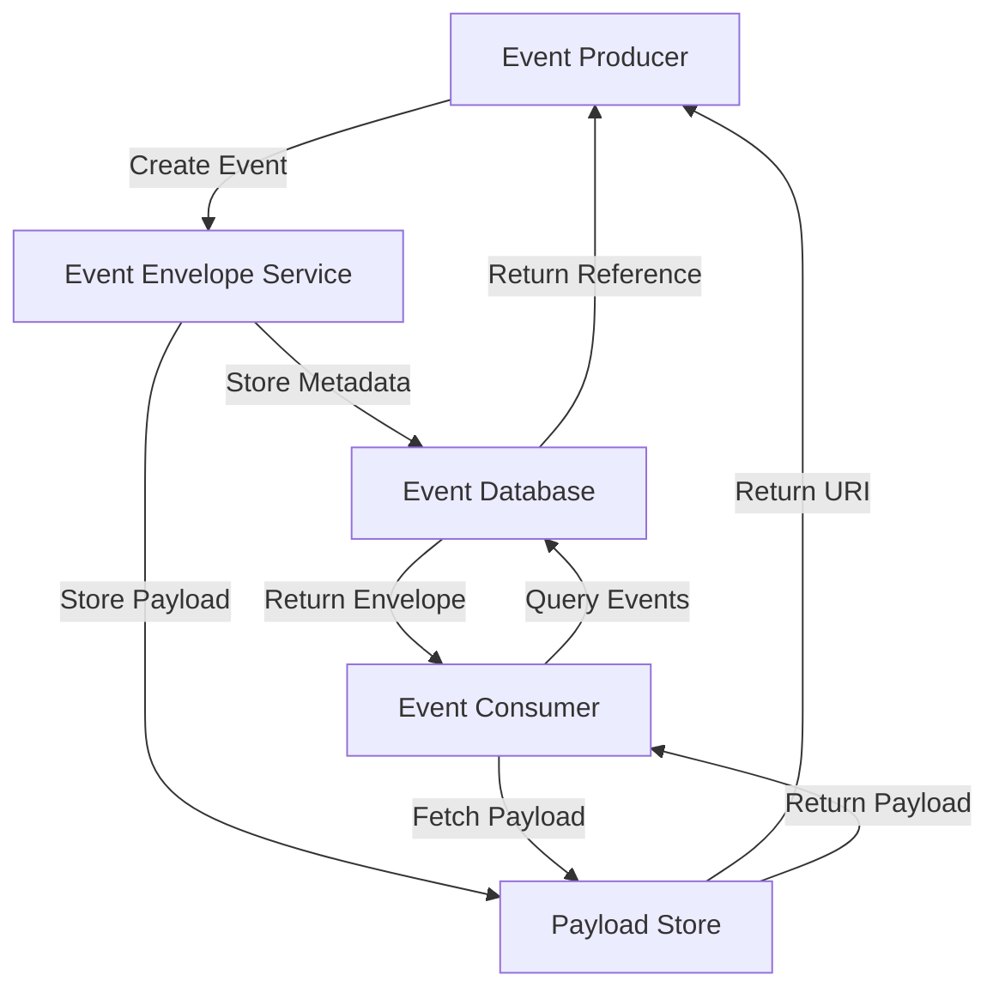
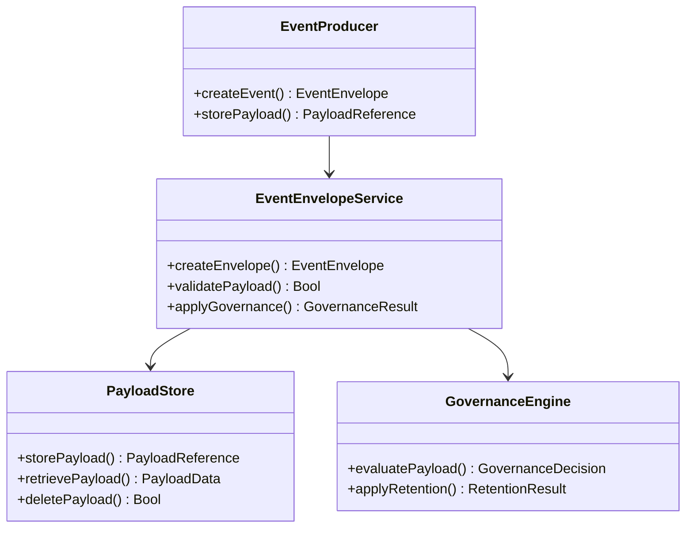
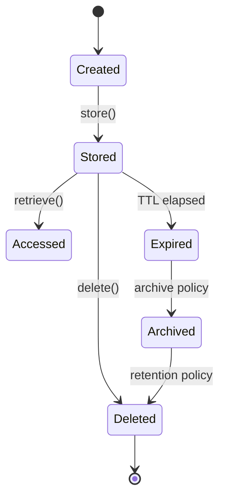

# Event Payload Artifact Specification

**Status**: Active Design ✅
**Issue**: td-3fa3ea
**Date**: 2026-02-09
**Author**: Mistral Vibe

## Table of Contents

1. [Executive Summary](#executive-summary)
2. [Current Event Infrastructure](#current-event-infrastructure)
3. [Design Goals](#design-goals)
4. [Payload Artifact Architecture](#payload-artifact-architecture)
5. [Payload Reference System](#payload-reference-system)
6. [Content Addressing](#content-addressing)
7. [Storage Locations](#storage-locations)
8. [Payload Lifecycle](#payload-lifecycle)
9. [Governance Integration](#governance-integration)
10. [Privacy and Redaction](#privacy-and-redaction)
11. [Implementation Patterns](#implementation-patterns)
12. [Integration with Existing Systems](#integration-with-existing-systems)
13. [Performance Considerations](#performance-considerations)
14. [Migration Plan](#migration-plan)
15. [References](#references)

## Executive Summary

This design document specifies the event payload artifact system for Anigma's observability spine. It defines how event payloads are stored, referenced, governed, and accessed while maintaining privacy, integrity, and performance requirements.

**Key Objectives:**
- ✅ Separate event metadata from payload data
- ✅ Implement content-addressed payload storage
- ✅ Support multiple storage backends
- ✅ Enforce governance and retention policies
- ✅ Maintain privacy and redaction capabilities
- ✅ Integrate with CloudEvents envelope system

## Current Event Infrastructure

### TelemetryCore Analysis

```swift
// Current TelemetryEvent structure
public struct TelemetryEvent: Sendable, Identifiable {
    public let id: String
    public let category: TelemetryCategory
    public let name: String
    public let timestamp: Date
    public let privacyClassification: PrivacyClassification
    public let values: [String: TelemetryValue]  // Inline payload
}
```

**Current Limitations:**
- ❌ Payloads stored inline (no separation)
- ❌ No content addressing
- ❌ Limited storage options
- ❌ No governance integration
- ❌ Basic privacy controls

### CloudEvents Integration

```swift
// CloudEvents envelope with payload reference
public struct CloudEventEnvelope: Sendable, Codable {
    // ... metadata fields
    public let payload: PayloadReference  // Separate payload reference
    public let data: [String: AnyCodable]?  // Metadata only
}

public struct PayloadReference: Sendable, Codable {
    public let hash: String  // Content address
    public let reference: String  // artifact:// URI
    public let size: Int  // Payload size
    public let mime: String  // Content type
    public let storage: StorageLocation  // Storage backend
}
```

**Current Strengths:**
- ✅ Event envelope structure defined
- ✅ Payload reference system designed
- ✅ Content addressing planned
- ✅ Multiple storage locations supported

## Design Goals

### Primary Requirements

1. **Separation of Concerns**: Event metadata ≠ Payload data
2. **Content Addressing**: Immutable payloads with cryptographic hashes
3. **Storage Flexibility**: Multiple backend options
4. **Governance Integration**: Policy enforcement for payloads
5. **Privacy Compliance**: Redaction and access control
6. **Performance**: Efficient storage and retrieval

### Non-Goals

- ❌ Real-time payload processing
- ❌ Payload transformation services
- ❌ Cross-agent payload sharing
- ❌ External payload marketplaces

## Payload Artifact Architecture

### System Overview



### Component Diagram



## Payload Reference System

### PayloadReference Structure

```swift
/// Immutable reference to event payload data
public struct PayloadReference: Sendable, Codable, Hashable {
    /// Cryptographic hash of payload content (SHA256 or BLAKE3)
    public let hash: String
    
    /// Content-addressed URI (artifact://, content://, database://)
    public let reference: String
    
    /// Payload size in bytes
    public let size: Int
    
    /// MIME type of payload content
    public let mime: String
    
    /// Storage backend location
    public let storage: StorageLocation
    
    /// Integrity verification method
    public let integrity: IntegrityMethod
    
    /// Retention policy for payload
    public let retention: RetentionPolicy
    
    /// Governance classification
    public let governance: PayloadGovernance
    
    public init(
        hash: String,
        reference: String,
        size: Int,
        mime: String,
        storage: StorageLocation,
        integrity: IntegrityMethod = .sha256,
        retention: RetentionPolicy = .governed,
        governance: PayloadGovernance = .restricted
    ) {
        self.hash = hash
        self.reference = reference
        self.size = size
        self.mime = mime
        self.storage = storage
        self.integrity = integrity
        self.retention = retention
        self.governance = governance
    }
}
```

### Enums and Types

```swift
/// Storage backend locations
public enum StorageLocation: String, Sendable, Codable {
    case inline      // Small payloads embedded in event
    case artifact    // Artifact store (local file system)
    case database    // Database BLOB storage
    case external    // External storage (S3, etc.)
    case ephemeral   // Temporary/memory-only storage
}

/// Integrity verification methods
public enum IntegrityMethod: String, Sendable, Codable {
    case sha256      // SHA-256 hash
    case blake3      // BLAKE3 hash
    case signature   // Cryptographic signature
    case none        // No integrity check
}

/// Retention policies
public enum RetentionPolicy: String, Sendable, Codable {
    case permanent   // Never delete
    case temporary   // Delete after TTL
    case governed    // Follow governance rules
    case ephemeral   // Delete immediately after use
}

/// Governance classifications
public enum PayloadGovernance: String, Sendable, Codable {
    case `public`    // No restrictions
    case `internal`  // Internal use only
    case restricted  // Governance approval required
    case sensitive   // Special handling required
}
```

## Content Addressing

### Hashing Algorithm Selection

| Algorithm | Security | Speed | Use Case |
|-----------|----------|-------|----------|
| **SHA-256** | High | Medium | General purpose, security-critical |
| **BLAKE3** | High | Fast | High-performance, large payloads |
| **SHA-1** | Low | Fast | Legacy compatibility (deprecated) |
| **MD5** | None | Fastest | Checksums only (deprecated) |

### Content Addressing Implementation

```swift
/// Content addressing service
public struct ContentAddressingService {
    private let hashAlgorithm: HashAlgorithm
    
    public init(algorithm: HashAlgorithm = .blake3) {
        self.hashAlgorithm = algorithm
    }
    
    /// Generate content address for payload
    public func generateAddress(for data: Data) throws -> String {
        switch hashAlgorithm {
        case .sha256:
            return try SHA256.hash(data: data).hexString()
        case .blake3:
            return try BLAKE3.hash(data: data).hexString()
        }
    }
    
    /// Verify payload integrity
    public func verifyIntegrity(
        data: Data,
        expectedHash: String
    ) throws -> Bool {
        let actualHash = try generateAddress(for: data)
        return actualHash == expectedHash
    }
    
    /// Generate payload reference
    public func createReference(
        for data: Data,
        mimeType: String,
        storage: StorageLocation,
        governance: PayloadGovernance
    ) throws -> PayloadReference {
        let hash = try generateAddress(for: data)
        let size = data.count
        
        let reference: String
        switch storage {
        case .inline:
            reference = "inline://\(hash)"
        case .artifact:
            reference = "artifact://payloads/\(hash)"
        case .database:
            reference = "database://payloads/\(hash)"
        case .external:
            reference = "external://payloads/\(hash)"
        case .ephemeral:
            reference = "ephemeral://\(hash)"
        }
        
        return PayloadReference(
            hash: hash,
            reference: reference,
            size: size,
            mime: mimeType,
            storage: storage,
            integrity: hashAlgorithm.integrityMethod,
            governance: governance
        )
    }
}

public enum HashAlgorithm {
    case sha256
    case blake3
    
    var integrityMethod: IntegrityMethod {
        switch self {
        case .sha256: return .sha256
        case .blake3: return .blake3
        }
    }
}
```

### URI Scheme Specification

| Scheme | Format | Example |
|--------|--------|---------|
| **inline** | `inline://<hash>` | `inline://sha256-abc123` |
| **artifact** | `artifact://<path>/<hash>` | `artifact://payloads/sha256-abc123` |
| **database** | `database://<table>/<hash>` | `database://payloads/sha256-abc123` |
| **external** | `external://<bucket>/<hash>` | `external://s3-payloads/sha256-abc123` |
| **ephemeral** | `ephemeral://<hash>` | `ephemeral://sha256-abc123` |

## Storage Locations

### Storage Backend Comparison

| Backend | Latency | Scalability | Use Case |
|---------|---------|-------------|----------|
| **Inline** | Instant | Poor | Small metadata (<1KB) |
| **Artifact** | Low | High | General payloads (1KB-10MB) |
| **Database** | Medium | Medium | Transactional payloads |
| **External** | High | Excellent | Large payloads (>10MB) |
| **Ephemeral** | Instant | None | Temporary processing |

### Storage Interface

```swift
/// Unified payload storage interface
public protocol PayloadStorage {
    /// Store payload data
    func store(
        data: Data,
        reference: PayloadReference,
        governanceContext: GovernanceContext
    ) async throws -> PayloadReference
    
    /// Retrieve payload data
    func retrieve(
        reference: PayloadReference,
        governanceContext: GovernanceContext
    ) async throws -> Data
    
    /// Delete payload data
    func delete(
        reference: PayloadReference,
        governanceContext: GovernanceContext
    ) async throws -> Bool
    
    /// Check payload existence
    func exists(
        reference: PayloadReference
    ) async throws -> Bool
    
    /// Get payload metadata
    func metadata(
        reference: PayloadReference
    ) async throws -> PayloadMetadata
}

/// Payload metadata
public struct PayloadMetadata: Sendable, Codable {
    public let reference: PayloadReference
    public let createdAt: Date
    public let accessedAt: Date?
    public let expiresAt: Date?
    public let governanceStatus: GovernanceStatus
    public let retentionStatus: RetentionStatus
}
```

### Storage Implementations

```swift
// Inline storage (for small payloads)
public struct InlinePayloadStorage: PayloadStorage {
    public func store(
        data: Data,
        reference: PayloadReference,
        governanceContext: GovernanceContext
    ) async throws -> PayloadReference {
        // Validate size limits
        guard data.count <= 1024 else {
            throw PayloadError.sizeExceeded
        }
        
        // Store in memory cache
        InlinePayloadCache.shared.set(reference, data: data)
        
        return reference
    }
    
    public func retrieve(
        reference: PayloadReference,
        governanceContext: GovernanceContext
    ) async throws -> Data {
        guard let data = InlinePayloadCache.shared.get(reference) else {
            throw PayloadError.notFound
        }
        
        return data
    }
    
    // Other methods...
}

// Artifact storage (file system)
public struct ArtifactPayloadStorage: PayloadStorage {
    private let basePath: String
    
    public init(basePath: String = "./payloads") {
        self.basePath = basePath
    }
    
    public func store(
        data: Data,
        reference: PayloadReference,
        governanceContext: GovernanceContext
    ) async throws -> PayloadReference {
        // Create directory structure
        let path = try createStoragePath(for: reference)
        
        // Write to file
        try data.write(to: URL(fileURLWithPath: path))
        
        return reference
    }
    
    private func createStoragePath(for reference: PayloadReference) throws -> String {
        // Parse artifact URI
        let parts = reference.reference.replacingOccurrences(of: "artifact://", with: "")
        
        // Create directory
        let directory = URL(fileURLWithPath: basePath)
            .appendingPathComponent(parts.components(separatedBy: "/").dropLast().joined(separator: "/"))
        
        try FileManager.default.createDirectory(at: directory, withIntermediateDirectories: true)
        
        return directory.appendingPathComponent(reference.hash).path
    }
    
    // Other methods...
}
```

## Payload Lifecycle

### Lifecycle States



### Lifecycle Management

```swift
/// Payload lifecycle manager
public actor PayloadLifecycleManager {
    private let storage: PayloadStorage
    private let governance: GovernanceEngine
    private let retention: RetentionPolicyEngine
    
    public init(
        storage: PayloadStorage,
        governance: GovernanceEngine,
        retention: RetentionPolicyEngine
    ) {
        self.storage = storage
        self.governance = governance
        self.retention = retention
    }
    
    /// Complete payload lifecycle
    public func managePayload(
        data: Data,
        context: PayloadContext
    ) async throws -> PayloadReference {
        // 1. Generate content address
        let reference = try generateReference(data, context: context)
        
        // 2. Apply governance policies
        try await applyGovernance(reference, context: context)
        
        // 3. Store payload
        let storedReference = try await storage.store(
            data: data,
            reference: reference,
            governanceContext: context.governance
        )
        
        // 4. Schedule retention
        try await scheduleRetention(storedReference, context: context)
        
        return storedReference
    }
    
    private func generateReference(
        _ data: Data,
        context: PayloadContext
    ) throws -> PayloadReference {
        let addressing = ContentAddressingService()
        return try addressing.createReference(
            for: data,
            mimeType: context.mimeType,
            storage: context.storage,
            governance: context.governance
        )
    }
    
    private func applyGovernance(
        _ reference: PayloadReference,
        context: PayloadContext
    ) async throws {
        let decision = try await governance.evaluatePayload(
            reference: reference,
            context: context
        )
        
        guard decision == .approved else {
            throw GovernanceError.payloadRejected(reason: decision.reason)
        }
    }
    
    private func scheduleRetention(
        _ reference: PayloadReference,
        context: PayloadContext
    ) async throws {
        try await retention.schedule(
            reference: reference,
            policy: reference.retention,
            context: context
        )
    }
}
```

## Governance Integration

### Governance Policy Engine

```swift
/// Payload governance engine
public struct PayloadGovernanceEngine {
    private let policyStore: PolicyStore
    
    public init(policyStore: PolicyStore = GovernancePolicyStore()) {
        self.policyStore = policyStore
    }
    
    /// Evaluate payload against governance policies
    public func evaluatePayload(
        reference: PayloadReference,
        context: PayloadContext
    ) async throws -> GovernanceDecision {
        // Get applicable policies
        let policies = try await policyStore.getPolicies(
            for: reference.governance,
            context: context
        )
        
        // Evaluate each policy
        for policy in policies {
            let result = try await evaluatePolicy(policy, reference: reference, context: context)
            
            if !result.isCompliant {
                return GovernanceDecision(
                    status: .denied,
                    reason: result.violationReason,
                    policyId: policy.id
                )
            }
        }
        
        return GovernanceDecision(
            status: .approved,
            reason: "All policies satisfied",
            policyId: nil
        )
    }
    
    private func evaluatePolicy(
        _ policy: GovernancePolicy,
        reference: PayloadReference,
        context: PayloadContext
    ) async throws -> PolicyEvaluationResult {
        // Policy-specific evaluation
        switch policy.type {
        case .sizeLimit:
            return evaluateSizeLimit(policy, reference: reference)
        case .contentType:
            return evaluateContentType(policy, reference: reference)
        case .retention:
            return evaluateRetention(policy, reference: reference)
        case .privacy:
            return evaluatePrivacy(policy, reference: reference, context: context)
        }
    }
}

/// Governance decision
public struct GovernanceDecision: Sendable, Codable {
    public let status: DecisionStatus
    public let reason: String
    public let policyId: String?
    
    public enum DecisionStatus: String, Sendable, Codable {
        case approved, denied, pending, exempt
    }
}
```

### Policy Types

```swift
/// Governance policy types
public enum GovernancePolicyType: String, Sendable, Codable {
    case sizeLimit      // Maximum payload size
    case contentType    // Allowed MIME types
    case retention      // Retention period
    case privacy        // Privacy classification
    case accessControl  // Access permissions
    case encryption     // Encryption requirements
}

/// Example size limit policy
public struct SizeLimitPolicy: GovernancePolicy {
    public let id: String
    public let type: GovernancePolicyType = .sizeLimit
    public let maxSize: Int  // Bytes
    public let governanceLevel: PayloadGovernance
    
    public func evaluate(reference: PayloadReference) -> PolicyEvaluationResult {
        guard reference.size <= maxSize else {
            return PolicyEvaluationResult(
                isCompliant: false,
                violationReason: "Payload size \(reference.size) exceeds limit \(maxSize)"
            )
        }
        
        return PolicyEvaluationResult(
            isCompliant: true,
            violationReason: nil
        )
    }
}
```

## Privacy and Redaction

### Privacy Classification

```swift
/// Privacy handling for payloads
public struct PayloadPrivacyHandler {
    private let redactionEngine: RedactionEngine
    private let privacyClassifier: PrivacyClassifier
    
    public init(
        redactionEngine: RedactionEngine = PIIRedactionEngine(),
        privacyClassifier: PrivacyClassifier = MLPrivacyClassifier()
    ) {
        self.redactionEngine = redactionEngine
        self.privacyClassifier = privacyClassifier
    }
    
    /// Classify payload privacy level
    public func classifyPrivacy(
        data: Data,
        mimeType: String
    ) async throws -> PrivacyClassification {
        // Content-based classification
        if mimeType.hasPrefix("text/") || mimeType.hasPrefix("application/json") {
            guard let text = String(data: data, encoding: .utf8) else {
                return .restricted
            }
            
            return try await privacyClassifier.classifyText(text)
        }
        
        // Binary content classification
        return try await privacyClassifier.classifyBinary(data, mimeType: mimeType)
    }
    
    /// Apply privacy redaction
    public func applyRedaction(
        data: Data,
        classification: PrivacyClassification,
        redactionLevel: RedactionLevel
    ) async throws -> Data {
        // Text content redaction
        if let text = String(data: data, encoding: .utf8) {
            let redactedText = try await redactionEngine.redact(
                text: text,
                classification: classification,
                level: redactionLevel
            )
            return redactedText.data(using: .utf8) ?? data
        }
        
        // Binary content redaction (limited)
        return try await redactionEngine.redactBinary(
            data: data,
            classification: classification,
            level: redactionLevel
        )
    }
}

/// Redaction levels
public enum RedactionLevel: String, Sendable, Codable {
    case none        // No redaction
    case minimal     // PII only
    case standard    // PII + sensitive
    case strict      // All potentially sensitive
    case complete    // Full redaction
}
```

### Redaction Patterns

```swift
// PII redaction patterns
public struct PIIRedactionEngine {
    private static let piiPatterns: [RedactionPattern] = [
        // Email addresses
        RedactionPattern(
            regex: #"\b[A-Za-z0-9._%+-]+@[A-Za-z0-9.-]+\.[A-Za-z]{2,}\b"#,
            replacement: "[EMAIL_REDACTED]",
            type: .email
        ),
        
        // Credit card numbers
        RedactionPattern(
            regex: #"\b(?:\d[ -]*?){13,16}\b"#,
            replacement: "[CC_REDACTED]",
            type: .creditCard
        ),
        
        // Social security numbers
        RedactionPattern(
            regex: #"\b\d{3}-\d{2}-\d{4}\b"#,
            replacement: "[SSN_REDACTED]",
            type: .ssn
        ),
        
        // Phone numbers
        RedactionPattern(
            regex: #"\b(?:\(?\d{3}\)?[\s.-]?\d{3}[\s.-]?\d{4})\b"#,
            replacement: "[PHONE_REDACTED]",
            type: .phone
        )
    ]
    
    public func redact(
        text: String,
        classification: PrivacyClassification,
        level: RedactionLevel
    ) async throws -> String {
        var result = text
        
        // Apply redaction patterns based on level
        for pattern in Self.piiPatterns {
            if shouldRedact(pattern.type, classification: classification, level: level) {
                result = result.replacingOccurrences(
                    of: pattern.regex,
                    with: pattern.replacement,
                    options: .regularExpression
                )
            }
        }
        
        return result
    }
    
    private func shouldRedact(
        _ type: PIIType,
        classification: PrivacyClassification,
        level: RedactionLevel
    ) -> Bool {
        // Strict redaction for sensitive classifications
        if classification == .restricted && level != .none {
            return true
        }
        
        // Standard redaction for internal
        if classification == .internal && level >= .standard {
            return true
        }
        
        // Minimal redaction for public
        if classification == .public && level >= .strict {
            return true
        }
        
        return false
    }
}
```

## Implementation Patterns

### Event with Payload Reference

```swift
/// Event envelope with separate payload reference
public struct EventEnvelope: Sendable, Codable {
    public let id: String
    public let source: String
    public let type: String
    public let timestamp: Date
    public let traceId: String?
    public let spanId: String?
    
    /// Separate payload reference
    public let payload: PayloadReference
    
    /// Event metadata (no sensitive data)
    public let metadata: [String: AnyCodable]
    
    public init(
        id: String = UUID().uuidString,
        source: String,
        type: String,
        timestamp: Date = Date(),
        traceId: String? = nil,
        spanId: String? = nil,
        payload: PayloadReference,
        metadata: [String: AnyCodable] = [:]
    ) {
        self.id = id
        self.source = source
        self.type = type
        self.timestamp = timestamp
        self.traceId = traceId
        self.spanId = spanId
        self.payload = payload
        self.metadata = metadata
    }
}
```

### Payload Storage Factory

```swift
/// Payload storage factory
public struct PayloadStorageFactory {
    public static func createStorage(
        for location: StorageLocation,
        configuration: StorageConfiguration
    ) -> PayloadStorage {
        switch location {
        case .inline:
            return InlinePayloadStorage()
            
        case .artifact:
            return ArtifactPayloadStorage(
                basePath: configuration.artifactBasePath
            )
            
        case .database:
            return DatabasePayloadStorage(
                databasePath: configuration.databasePath
            )
            
        case .external:
            return ExternalPayloadStorage(
                endpoint: configuration.externalEndpoint,
                credentials: configuration.externalCredentials
            )
            
        case .ephemeral:
            return EphemeralPayloadStorage()
        }
    }
}

/// Storage configuration
public struct StorageConfiguration: Sendable {
    public let artifactBasePath: String
    public let databasePath: String
    public let externalEndpoint: String
    public let externalCredentials: ExternalCredentials
    public let cacheSize: Int
    
    public init(
        artifactBasePath: String = "./payloads",
        databasePath: String = "./anigma.db",
        externalEndpoint: String = "",
        externalCredentials: ExternalCredentials = .none,
        cacheSize: Int = 100
    ) {
        self.artifactBasePath = artifactBasePath
        self.databasePath = databasePath
        self.externalEndpoint = externalEndpoint
        self.externalCredentials = externalCredentials
        self.cacheSize = cacheSize
    }
}
```

### Event Creation with Payload

```swift
/// Event creation workflow
public struct EventCreator {
    private let payloadStorage: PayloadStorage
    private let governanceEngine: GovernanceEngine
    private let privacyHandler: PayloadPrivacyHandler
    
    public init(
        payloadStorage: PayloadStorage,
        governanceEngine: GovernanceEngine,
        privacyHandler: PayloadPrivacyHandler
    ) {
        self.payloadStorage = payloadStorage
        self.governanceEngine = governanceEngine
        self.privacyHandler = privacyHandler
    }
    
    /// Create event with payload
    public func createEvent(
        source: String,
        type: String,
        payloadData: Data,
        mimeType: String,
        governanceContext: GovernanceContext,
        storageLocation: StorageLocation
    ) async throws -> EventEnvelope {
        // 1. Classify privacy
        let privacyClassification = try await privacyHandler.classifyPrivacy(
            data: payloadData,
            mimeType: mimeType
        )
        
        // 2. Create payload reference
        let addressing = ContentAddressingService()
        let payloadReference = try addressing.createReference(
            for: payloadData,
            mimeType: mimeType,
            storage: storageLocation,
            governance: governanceContext.governanceLevel
        )
        
        // 3. Apply governance
        let governanceDecision = try await governanceEngine.evaluatePayload(
            reference: payloadReference,
            context: governanceContext
        )
        
        guard governanceDecision.status == .approved else {
            throw EventCreationError.governanceDenied(
                reason: governanceDecision.reason
            )
        }
        
        // 4. Store payload
        let storedReference = try await payloadStorage.store(
            data: payloadData,
            reference: payloadReference,
            governanceContext: governanceContext
        )
        
        // 5. Create event envelope
        return EventEnvelope(
            source: source,
            type: type,
            payload: storedReference,
            metadata: [
                "privacy": privacyClassification.rawValue,
                "governance": governanceContext.governanceLevel.rawValue,
                "storage": storageLocation.rawValue
            ]
        )
    }
}
```

## Integration with Existing Systems

### TelemetryCore Integration

```swift
/// Enhanced TelemetryEvent with payload reference
extension TelemetryEvent {
    /// Create telemetry event with external payload
    public static func withPayload(
        category: TelemetryCategory,
        name: String,
        payloadReference: PayloadReference,
        privacyClassification: PrivacyClassification = .restricted,
        additionalValues: [String: TelemetryValue] = [:]
    ) -> TelemetryEvent {
        var values = additionalValues
        
        // Add payload reference to values
        values["payload_hash"] = .string(payloadReference.hash)
        values["payload_reference"] = .string(payloadReference.reference)
        values["payload_size"] = .int(payloadReference.size)
        values["payload_mime"] = .string(payloadReference.mime)
        values["payload_storage"] = .string(payloadReference.storage.rawValue)
        
        return TelemetryEvent(
            category: category,
            name: name,
            privacyClassification: privacyClassification,
            values: values
        )
    }
    
    /// Extract payload reference from telemetry event
    public func payloadReference() -> PayloadReference? {
        guard let hash = values["payload_hash"]?.stringValue,
              let reference = values["payload_reference"]?.stringValue,
              let size = values["payload_size"]?.intValue,
              let mime = values["payload_mime"]?.stringValue,
              let storageRaw = values["payload_storage"]?.stringValue,
              let storage = StorageLocation(rawValue: storageRaw) else {
            return nil
        }
        
        return PayloadReference(
            hash: hash,
            reference: reference,
            size: size,
            mime: mime,
            storage: storage
        )
    }
}
```

### CloudEvents Integration

```swift
/// CloudEvents extension for payload artifacts
extension CloudEventEnvelope {
    /// Initialize with payload artifact
    public init(
        source: String,
        type: String,
        payload: PayloadData,
        governanceContext: GovernanceContext,
        storage: StorageLocation = .artifact
    ) async throws {
        // Create content address
        let addressing = ContentAddressingService()
        let payloadReference = try addressing.createReference(
            for: payload.data,
            mimeType: payload.mimeType,
            storage: storage,
            governance: governanceContext.governanceLevel
        )
        
        // Store payload
        let storage = PayloadStorageFactory.createStorage(for: storage)
        let storedReference = try await storage.store(
            data: payload.data,
            reference: payloadReference,
            governanceContext: governanceContext
        )
        
        // Create envelope
        self.init(
            source: source,
            type: type,
            payload: storedReference,
            data: [
                "mime_type": .string(payload.mimeType),
                "size": .int(payload.data.count),
                "governance": .string(governanceContext.governanceLevel.rawValue)
            ]
        )
    }
    
    /// Retrieve payload data
    public func retrievePayload(
        storage: PayloadStorage,
        governanceContext: GovernanceContext
    ) async throws -> PayloadData {
        let data = try await storage.retrieve(
            reference: payload,
            governanceContext: governanceContext
        )
        
        return PayloadData(
            data: data,
            mimeType: payload.mime
        )
    }
}

/// Payload data container
public struct PayloadData: Sendable {
    public let data: Data
    public let mimeType: String
    
    public init(data: Data, mimeType: String) {
        self.data = data
        self.mimeType = mimeType
    }
}
```

### Security Events Integration

```swift
/// Security event with governed payload
extension SecurityEventDetails {
    /// Create security event with payload artifact
    public static func withGovernedPayload(
        engineType: String?,
        zone: String?,
        capability: String?,
        doctrineRule: String?,
        reason: String,
        attemptedAction: String?,
        blockedAction: String?,
        payload: PayloadData,
        governanceContext: GovernanceContext,
        storage: StorageLocation = .artifact
    ) async throws -> SecurityEventDetails {
        // Store payload
        let addressing = ContentAddressingService()
        let payloadReference = try addressing.createReference(
            for: payload.data,
            mimeType: payload.mimeType,
            storage: storage,
            governance: governanceContext.governanceLevel
        )
        
        let storage = PayloadStorageFactory.createStorage(for: storage)
        _ = try await storage.store(
            data: payload.data,
            reference: payloadReference,
            governanceContext: governanceContext
        )
        
        // Create event details with payload reference
        var metadata: [String: String] = [:]
        metadata["payload_hash"] = payloadReference.hash
        metadata["payload_reference"] = payloadReference.reference
        metadata["payload_size"] = "\(payloadReference.size)"
        metadata["payload_mime"] = payloadReference.mime
        metadata["payload_storage"] = payloadReference.storage.rawValue
        
        return SecurityEventDetails(
            engineType: engineType,
            zone: zone,
            capability: capability,
            doctrineRule: doctrineRule,
            reason: reason,
            attemptedAction: attemptedAction,
            blockedAction: blockedAction,
            metadata: metadata
        )
    }
}
```

## Performance Considerations

### Performance Metrics

| Operation | Target Latency | Optimization Strategy |
|-----------|---------------|----------------------|
| Payload storage | < 50ms | Caching, batching |
| Payload retrieval | < 30ms | Caching, indexing |
| Content addressing | < 10ms | BLAKE3 hashing |
| Governance evaluation | < 20ms | Policy caching |
| Privacy classification | < 15ms | ML model optimization |

### Optimization Techniques

```swift
/// Payload caching layer
public actor PayloadCache {
    private let storage: PayloadStorage
    private var cache: [PayloadReference: Data] = [:]
    private let maxCacheSize: Int
    
    public init(storage: PayloadStorage, maxCacheSize: Int = 100) {
        self.storage = storage
        self.maxCacheSize = maxCacheSize
    }
    
    /// Get payload with caching
    public func get(_ reference: PayloadReference) async throws -> Data {
        // Check cache first
        if let cached = cache[reference] {
            return cached
        }
        
        // Retrieve from storage
        let data = try await storage.retrieve(
            reference: reference,
            governanceContext: .default
        )
        
        // Cache result
        if cache.count < maxCacheSize {
            cache[reference] = data
        }
        
        return data
    }
    
    /// Invalidate cache entry
    public func invalidate(_ reference: PayloadReference) {
        cache.removeValue(forKey: reference)
    }
    
    /// Clear cache
    public func clear() {
        cache.removeAll()
    }
}

/// Batching for payload operations
public struct BatchPayloadOperator {
    private let storage: PayloadStorage
    
    public init(storage: PayloadStorage) {
        self.storage = storage
    }
    
    /// Batch store payloads
    public func batchStore(
        payloads: [PayloadData],
        governanceContext: GovernanceContext
    ) async throws -> [PayloadReference] {
        let addressing = ContentAddressingService()
        
        // Generate references
        let references = try payloads.map { payload in
            try addressing.createReference(
                for: payload.data,
                mimeType: payload.mimeType,
                storage: .artifact,  // Default for batch
                governance: governanceContext.governanceLevel
            )
        }
        
        // Store in parallel
        try await withThrowingTaskGroup(of: PayloadReference.self) { group in
            for (payload, reference) in zip(payloads, references) {
                group.addTask {
                    try await self.storage.store(
                        data: payload.data,
                        reference: reference,
                        governanceContext: governanceContext
                    )
                    return reference
                }
            }
            
            // Collect results
            var results = [PayloadReference]()
            for try await reference in group {
                results.append(reference)
            }
            
            return results
        }
    }
}
```

### Memory Management

```swift
/// Payload memory management
public struct PayloadMemoryManager {
    private let maxMemoryUsage: Int  // Bytes
    private var currentUsage: Int = 0
    private let queue = DispatchQueue(label: "payload.memory.manager")
    
    public init(maxMemoryUsage: Int = 100 * 1024 * 1024) {  // 100MB default
        self.maxMemoryUsage = maxMemoryUsage
    }
    
    /// Track payload memory allocation
    public func allocate(_ size: Int) -> Bool {
        queue.sync {
            guard currentUsage + size <= maxMemoryUsage else {
                return false
            }
            currentUsage += size
            return true
        }
    }
    
    /// Free payload memory
    public func free(_ size: Int) {
        queue.sync {
            currentUsage = max(0, currentUsage - size)
        }
    }
    
    /// Check memory availability
    public func canAllocate(_ size: Int) -> Bool {
        queue.sync {
            return currentUsage + size <= maxMemoryUsage
        }
    }
    
    /// Get current memory usage
    public func currentUsage() -> Int {
        queue.sync {
            return currentUsage
        }
    }
}
```

## Migration Plan

### Phase 1: Assessment and Design

**Tasks:**
- ✅ Analyze current event payload patterns
- ✅ Design payload artifact system
- ✅ Define storage backends
- ✅ Specify governance integration

**Deliverables:**
- Payload artifact specification (this document)
- Storage backend implementations
- Governance policy definitions

### Phase 2: Infrastructure Setup

**Tasks:**
- 🚧 Implement content addressing service
- 🚧 Create storage backends (artifact, database)
- 🚧 Build governance integration
- 🚧 Add privacy redaction system

**Deliverables:**
- ContentAddressingService
- PayloadStorage implementations
- GovernanceEngine integration
- PrivacyHandler implementation

### Phase 3: Integration

**Tasks:**
- 🔄 Integrate with TelemetryCore
- 🔄 Add CloudEvents payload support
- 🔄 Update SecurityEventsManager
- 🔄 Add ECS projection support

**Deliverables:**
- Enhanced TelemetryEvent with payload references
- CloudEvents payload integration
- Security event payload artifacts
- ECS payload components

### Phase 4: Migration

**Tasks:**
- 🔄 Migrate existing inline payloads
- 🔄 Update event producers
- 🔄 Modify event consumers
- 🔄 Add backward compatibility

**Approach:**
1. **Dual Mode**: Support both inline and artifact payloads
2. **Gradual Migration**: Migrate critical paths first
3. **Backward Compatibility**: Maintain inline payload support
4. **Monitoring**: Track migration progress

### Phase 5: Optimization

**Tasks:**
- 📊 Add performance monitoring
- 📊 Implement caching layer
- 📊 Add batch operations
- 📊 Optimize memory usage

**Deliverables:**
- Payload caching system
- Batch operations support
- Memory management
- Performance metrics

## References

### Industry Standards

- [CloudEvents Specification](https://github.com/cloudevents/spec)
- [OpenTelemetry Semantic Conventions](https://opentelemetry.io/docs/specs/semconv/)
- [RFC 3986 - URI Specification](https://www.rfc-editor.org/rfc/rfc3986)
- [Content Addressable Storage](https://en.wikipedia.org/wiki/Content-addressable_storage)

### Anigma Internal References

- `TelemetryEvent.swift` - Current telemetry infrastructure
- `CloudEventEnvelope.swift` - CloudEvents implementation
- `SecurityEventsManager.swift` - Security event system
- `CLOUDEVENTS_EVENT_ENVELOPE_RESEARCH.md` - Event envelope research
- `AGENT_OBSERVABILITY_SPINE_STABILIZATION.md` - Observability spine design

### Related Issues

- **td-3fa3ea**: Event payload artifact specification (this document)
- **td-32c603**: Design event ingestion interface
- **td-d6c47c**: Design agent trace contract
- **td-f2d283**: Design security event taxonomy
- **td-16ca40**: Agent observability spine stabilization

## Next Steps

### Immediate Actions

1. **Implement Content Addressing**: Create ContentAddressingService
2. **Build Storage Backends**: Implement artifact and database storage
3. **Add Governance Integration**: Connect with GovernanceEngine
4. **Implement Privacy Handling**: Create redaction system
5. **Design Payload Lifecycle**: Build lifecycle management

### Short-Term Goals

1. **Integrate with TelemetryCore**: Enhance TelemetryEvent
2. **Add CloudEvents Support**: Extend CloudEventEnvelope
3. **Update Security Events**: Add payload artifacts
4. **Implement Caching**: Add performance optimization
5. **Add Monitoring**: Track system metrics

### Long-Term Goals

1. **Complete Migration**: Move all events to artifact payloads
2. **Add External Storage**: Implement S3/compatible storage
3. **Enhance Governance**: Add advanced policy types
4. **Improve Privacy**: Add ML-based classification
5. **Optimize Performance**: Continuous performance tuning

**Status**: Design complete ✅
**Next**: Implementation phase
