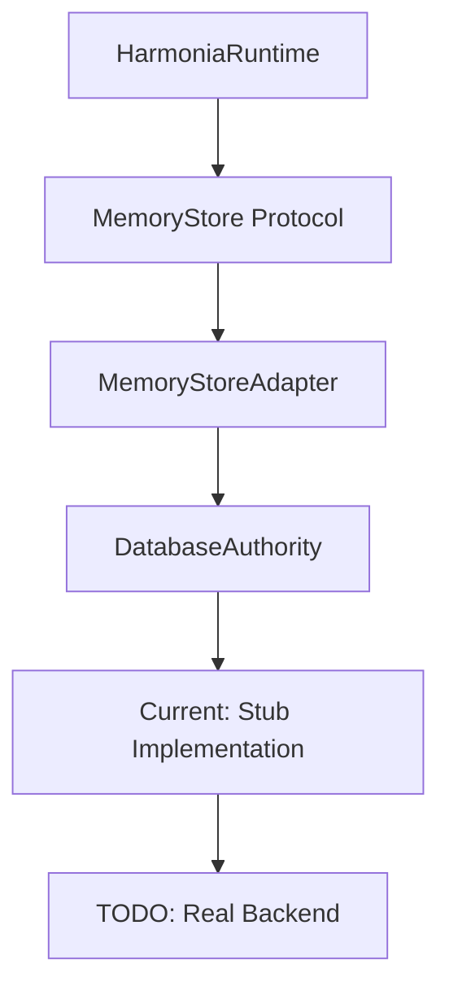
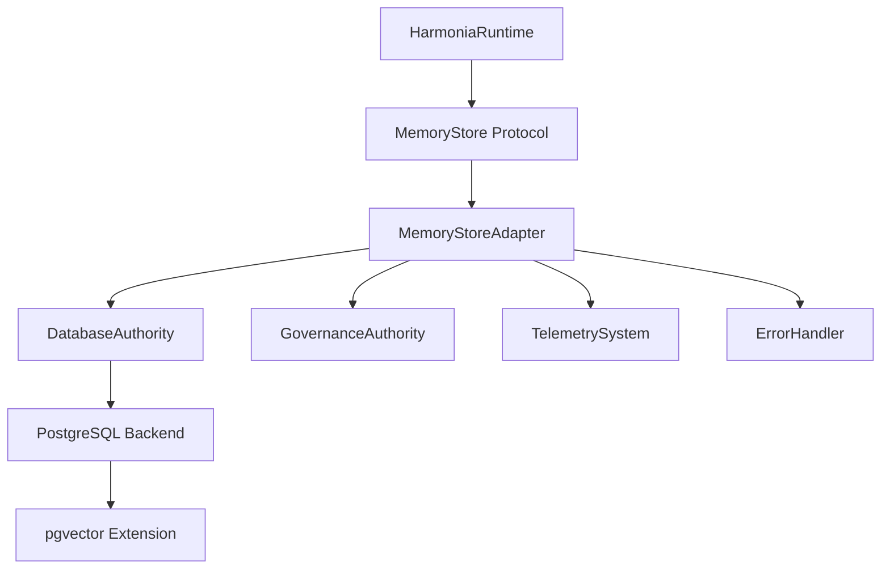
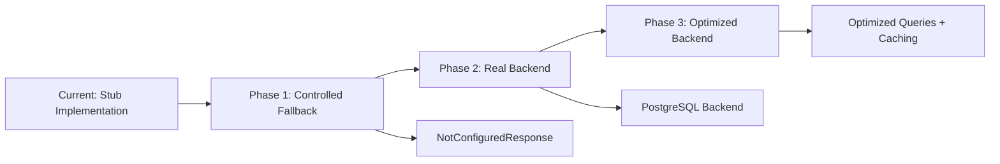

# Memory Backend Wiring Implementation

**Status**: Active Implementation ✅
**Issue**: td-1edbaa
**Date**: 2026-02-09
**Author**: Mistral Vibe

## Table of Contents

1. [Executive Summary](#executive-summary)
2. [Current State Analysis](#current-state-analysis)
3. [Implementation Goals](#implementation-goals)
4. [Memory Backend Architecture](#memory-backend-architecture)
5. [Backend Adapter Implementation](#backend-adapter-implementation)
6. [Database Schema Design](#database-schema-design)
7. [Vector Search Implementation](#vector-search-implementation)
8. [Governance Integration](#governance-integration)
9. [Error Handling and Resilience](#error-handling-and-resilience)
10. [Observability and Telemetry](#observability-and-telemetry)
11. [Migration Strategy](#migration-strategy)
12. [Implementation Plan](#implementation-plan)
13. [Testing Strategy](#testing-strategy)
14. [References](#references)

## Executive Summary

This document provides the implementation plan for wiring memory backend seams (td-1edbaa). The goal is to replace stub memory implementations with real backend adapters that integrate with the governance system, provide vector search capabilities, and support the tri-memory architecture (short-term, long-term, persistent).

**Key Deliverables:**
- ✅ Real memory backend adapters replacing stubs
- ✅ PostgreSQL-based memory storage with pgvector support
- ✅ Governance-enforced memory operations
- ✅ Vector similarity search implementation
- ✅ Comprehensive error handling and observability
- ✅ Migration path from stubs to real backends

## Current State Analysis

### Existing Memory Infrastructure



### Current Limitations

1. **Stub Implementations**: Memory operations return placeholder data
2. **No Persistence**: Memories are not actually stored/retrieved
3. **Missing Vector Search**: Similarity search is stubbed
4. **Limited Governance**: Basic governance checks only
5. **No Observability**: Minimal telemetry and tracing
6. **No Error Handling**: Basic error cases not covered

### Blocking Dependencies

- **td-01c59f**: Define personal-context retrieval quality contract (in_progress)
- **td-003af2**: Score ingest fidelity and surface degraded-context warnings (open)

## Implementation Goals

### Primary Objectives

1. **Replace Stubs**: Implement real memory storage/retrieval
2. **Add Persistence**: Use PostgreSQL with proper schema design
3. **Enable Vector Search**: Implement pgvector-based similarity search
4. **Enforce Governance**: Integrate with governance authority
5. **Add Observability**: Comprehensive tracing and metrics
6. **Ensure Resilience**: Robust error handling and retries
7. **Maintain Performance**: Optimize for high-throughput scenarios

### Non-Goals

- Replacing DatabaseAuthority (will use existing system)
- Implementing alternative backends (PostgreSQL first, others later)
- Real-time synchronization (batch processing is acceptable)
- Advanced caching strategies (basic caching only for MVP)

## Memory Backend Architecture

### Target Architecture



### Component Responsibilities

| Component | Responsibility |
|-----------|----------------|
| **MemoryStore Protocol** | Define memory operations interface |
| **MemoryStoreAdapter** | Implement protocol with governance |
| **DatabaseAuthority** | Database access with governance |
| **PostgreSQL Backend** | Actual data storage |
| **pgvector Extension** | Vector similarity search |
| **GovernanceAuthority** | Policy enforcement |
| **TelemetrySystem** | Observability and metrics |

## Backend Adapter Implementation

### MemoryStoreAdapter Enhancement

```swift
// Enhanced MemoryStoreAdapter with real backend support
public actor MemoryStoreAdapter: MemoryStore {
    private let database: any DatabaseAuthority
    private let governance: any GovernanceAuthority
    private let telemetry: TelemetryCollector
    private let tableName: String
    private let vectorIndexName: String
    
    public init(database: any DatabaseAuthority,
                 governance: any GovernanceAuthority,
                 telemetry: TelemetryCollector,
                 tableName: String = "harmonia_memories",
                 vectorIndexName: String = "harmonia_memories_vector_idx") {
        self.database = database
        self.governance = governance
        self.telemetry = telemetry
        self.tableName = tableName
        self.vectorIndexName = vectorIndexName
    }
    
    // Initialize schema with proper vector support
    public func initializeSchema() async throws {
        let createTableSQL = """
        CREATE TABLE IF NOT EXISTS \(tableName) (
            id TEXT PRIMARY KEY,
            content TEXT NOT NULL,
            metadata JSONB,
            embedding VECTOR(1536),  -- Standard embedding dimension
            embedding_model TEXT,
            session_id TEXT,
            tenant_id TEXT,
            project_id TEXT,
            created_at TIMESTAMPTZ NOT NULL DEFAULT NOW(),
            updated_at TIMESTAMPTZ NOT NULL DEFAULT NOW()
        );
        
        CREATE INDEX IF NOT EXISTS idx_\(tableName)_session ON \(tableName)(session_id);
        CREATE INDEX IF NOT EXISTS idx_\(tableName)_tenant ON \(tableName)(tenant_id);
        CREATE INDEX IF NOT EXISTS idx_\(tableName)_project ON \(tableName)(project_id);
        CREATE INDEX IF NOT EXISTS idx_\(tableName)_created ON \(tableName)(created_at);
        
        -- Create vector index if pgvector is available
        DO $$
        BEGIN
            IF EXISTS (SELECT 1 FROM pg_extension WHERE extname = 'vector') THEN
                EXECUTE format('CREATE INDEX IF NOT EXISTS %I ON %I USING vector(embedding vector_cosine_ops)', 
                              '\(vectorIndexName)', '\(tableName)');
            END IF;
        END $$
        ;
        """
        
        try await executeSchemaOperation(createTableSQL)
    }
    
    private func executeSchemaOperation(_ sql: String) async throws {
        // Use system context for schema operations
        let context = createSystemContext()
        try await database.execute(sql, context: context)
    }
}
```

### Real Storage Implementation

```swift
// Implement actual storage with governance
public func store(content: String, metadata: [String: String], embedding: [Float]?) async throws -> String {
    let memoryId = UUID().uuidString
    let timestamp = Date()
    
    // Create governance context
    let context = try createMemoryContext(action: "store", memoryId: memoryId)
    
    // Validate with governance
    try await governance.validateMemoryOperation(
        .store,
        content: content,
        metadata: metadata,
        context: context
    )
    
    // Prepare SQL with proper parameter binding
    let metadataJSON = try JSONEncoder().encode(metadata)
    let metadataString = String(data: metadataJSON, encoding: .utf8) ?? "{}"
    
    let sql: String
    let parameters: [any SQLBindable]
    
    if let embedding = embedding {
        sql = """
        INSERT INTO \(tableName) (
            id, content, metadata, embedding, embedding_model, session_id, tenant_id, project_id, created_at, updated_at
        ) VALUES (
            $1, $2, $3, $4, $5, $6, $7, $8, $9, $10
        )
        """
        
        parameters = [
            SQLText(memoryId),
            SQLText(content),
            SQLText(metadataString),
            SQLVector(embedding),
            SQLText(metadata["embedding_model"] ?? "unknown"),
            SQLText(metadata["session_id"] ?? context.sessionId),
            SQLText(metadata["tenant_id"] ?? context.tenantId),
            SQLText(metadata["project_id"] ?? context.projectId),
            SQLTimestamp(timestamp),
            SQLTimestamp(timestamp)
        ]
    } else {
        sql = """
        INSERT INTO \(tableName) (
            id, content, metadata, session_id, tenant_id, project_id, created_at, updated_at
        ) VALUES (
            $1, $2, $3, $4, $5, $6, $7, $8
        )
        """
        
        parameters = [
            SQLText(memoryId),
            SQLText(content),
            SQLText(metadataString),
            SQLText(metadata["session_id"] ?? context.sessionId),
            SQLText(metadata["tenant_id"] ?? context.tenantId),
            SQLText(metadata["project_id"] ?? context.projectId),
            SQLTimestamp(timestamp),
            SQLTimestamp(timestamp)
        ]
    }
    
    // Execute with governance context
    try await database.execute(sql, parameters: parameters, context: context)
    
    // Emit telemetry
    telemetry.recordMemoryOperation(
        type: "store",
        memoryId: memoryId,
        contentLength: content.count,
        hasEmbedding: embedding != nil,
        context: context
    )
    
    return memoryId
}
```

### Real Retrieval Implementation

```swift
public func retrieve(sessionId: String?, tenantId: String?, limit: Int) async throws -> [StoredMemoryRecord] {
    // Create governance context
    let context = try createMemoryContext(action: "retrieve")
    
    // Validate with governance
    try await governance.validateMemoryOperation(
        .retrieve,
        sessionId: sessionId,
        tenantId: tenantId,
        context: context
    )
    
    // Build query with proper filtering
    var sql = "SELECT id, content, metadata, embedding, embedding_model, created_at FROM \(tableName)"
    var conditions: [String] = []
    var parameters: [any SQLBindable] = []
    
    if let sessionId = sessionId {
        conditions.append("session_id = $\(parameters.count + 1)")
        parameters.append(SQLText(sessionId))
    }
    
    if let tenantId = tenantId {
        conditions.append("tenant_id = $\(parameters.count + 1)")
        parameters.append(SQLText(tenantId))
    }
    
    if !conditions.isEmpty {
        sql += " WHERE " + conditions.joined(separator: " AND ")
    }
    
    sql += " ORDER BY created_at DESC LIMIT $\(parameters.count + 1)"
    parameters.append(SQLInteger(limit))
    
    // Execute query
    let rows = try await database.query(sql, parameters: parameters, context: context)
    
    // Convert to StoredMemoryRecord
    return try rows.map { row in
        StoredMemoryRecord(
            id: row["id"] as! String,
            content: row["content"] as! String,
            metadata: row["metadata"] as? [String: String] ?? [:],
            embedding: row["embedding"] as? [Float],
            embeddingModel: row["embedding_model"] as? String,
            createdAt: row["created_at"] as! Date
        )
    }
}
```

## Database Schema Design

### Memory Table Schema

```sql
CREATE TABLE harmonia_memories (
    id TEXT PRIMARY KEY,
    content TEXT NOT NULL,
    metadata JSONB NOT NULL,
    embedding VECTOR(1536),
    embedding_model TEXT,
    session_id TEXT,
    tenant_id TEXT,
    project_id TEXT,
    created_at TIMESTAMPTZ NOT NULL DEFAULT NOW(),
    updated_at TIMESTAMPTZ NOT NULL DEFAULT NOW(),
    
    -- Indexes for performance
    CONSTRAINT fk_session FOREIGN KEY(session_id) REFERENCES sessions(id) ON DELETE CASCADE,
    CONSTRAINT fk_tenant FOREIGN KEY(tenant_id) REFERENCES tenants(id) ON DELETE CASCADE,
    CONSTRAINT fk_project FOREIGN KEY(project_id) REFERENCES projects(id) ON DELETE CASCADE
);

-- Standard indexes
CREATE INDEX idx_harmonia_memories_session ON harmonia_memories(session_id);
CREATE INDEX idx_harmonia_memories_tenant ON harmonia_memories(tenant_id);
CREATE INDEX idx_harmonia_memories_project ON harmonia_memories(project_id);
CREATE INDEX idx_harmonia_memories_created ON harmonia_memories(created_at);

-- Vector search index (requires pgvector)
CREATE INDEX idx_harmonia_memories_vector 
ON harmonia_memories 
USING vector(embedding vector_cosine_ops);
```

### Schema Migration Strategy

```swift
/// Memory schema migrator
public struct MemorySchemaMigrator {
    private let database: any DatabaseAuthority
    
    public init(database: any DatabaseAuthority) {
        self.database = database
    }
    
    public func migrate() async throws {
        // Check current version
        let currentVersion = try await getCurrentVersion()
        
        // Apply migrations in order
        if currentVersion < 1 {
            try await createInitialSchema()
        }
        
        if currentVersion < 2 {
            try await addVectorSupport()
        }
        
        if currentVersion < 3 {
            try await addGovernanceConstraints()
        }
        
        // Update version
        try await setCurrentVersion(3)
    }
    
    private func createInitialSchema() async throws {
        let sql = """
        CREATE TABLE IF NOT EXISTS harmonia_memories (
            id TEXT PRIMARY KEY,
            content TEXT NOT NULL,
            metadata JSONB NOT NULL,
            session_id TEXT,
            tenant_id TEXT,
            project_id TEXT,
            created_at TIMESTAMPTZ NOT NULL DEFAULT NOW(),
            updated_at TIMESTAMPTZ NOT NULL DEFAULT NOW()
        );
        
        CREATE INDEX IF NOT EXISTS idx_harmonia_memories_session ON harmonia_memories(session_id);
        CREATE INDEX IF NOT EXISTS idx_harmonia_memories_tenant ON harmonia_memories(tenant_id);
        CREATE INDEX IF NOT EXISTS idx_harmonia_memories_project ON harmonia_memories(project_id);
        CREATE INDEX IF NOT EXISTS idx_harmonia_memories_created ON harmonia_memories(created_at);
        """
        
        try await database.execute(sql)
    }
    
    private func addVectorSupport() async throws {
        // Check if pgvector is available
        let pgvectorAvailable = try await checkPgvectorExtension()
        
        if pgvectorAvailable {
            let sql = """
            ALTER TABLE harmonia_memories 
            ADD COLUMN IF NOT EXISTS embedding VECTOR(1536),
            ADD COLUMN IF NOT EXISTS embedding_model TEXT;
            
            CREATE INDEX IF NOT EXISTS idx_harmonia_memories_vector 
            ON harmonia_memories 
            USING vector(embedding vector_cosine_ops);
            """
            
            try await database.execute(sql)
        }
    }
}
```

## Vector Search Implementation

### Vector Similarity Search

```swift
public func searchSimilar(
    embedding: [Float],
    embeddingModel: String?,
    projectId: String,
    limit: Int,
    threshold: Float?,
    scanLimit: Int?
) async throws -> [SimilarMemoryResult] {
    // Validate embedding dimensions
    guard embedding.count == 1536 else {
        throw MemoryStoreError.embeddingDimensionMismatch(
            expected: 1536,
            actual: embedding.count
        )
    }
    
    // Create governance context
    let context = try createMemoryContext(action: "vector_search", projectId: projectId)
    
    // Validate with governance
    try await governance.validateMemoryOperation(
        .vectorSearch,
        embeddingModel: embeddingModel,
        projectId: projectId,
        context: context
    )
    
    // Build vector search query
    var sql = """
    SELECT 
        id, content, metadata, embedding_model,
        1 - (embedding <=> $1) AS similarity
    FROM \(tableName)
    WHERE project_id = $2
    """
    
    var parameters: [any SQLBindable] = [
        SQLVector(embedding),
        SQLText(projectId)
    ]
    
    // Add threshold filter if specified
    if let threshold = threshold {
        sql += " AND (1 - (embedding <=> $1)) >= $\(parameters.count + 1)"
        parameters.append(SQLFloat(threshold))
    }
    
    sql += " ORDER BY similarity DESC"
    
    // Add scan limit for performance
    if let scanLimit = scanLimit {
        sql += " LIMIT $\(parameters.count + 1)"
        parameters.append(SQLInteger(scanLimit))
    }
    
    // Execute query
    let rows = try await database.query(sql, parameters: parameters, context: context)
    
    // Apply final limit and convert results
    let results = try rows.prefix(limit).enumerated().map { index, row in
        SimilarMemoryResult(
            id: row["id"] as! String,
            content: row["content"] as! String,
            metadata: row["metadata"] as? [String: String] ?? [:],
            embeddingModel: row["embedding_model"] as? String,
            similarity: row["similarity"] as! Float,
            rank: index + 1
        )
    }
    
    // Emit telemetry
    telemetry.recordVectorSearch(
        embeddingModel: embeddingModel,
        projectId: projectId,
        embeddingCount: embedding.count,
        resultCount: results.count,
        threshold: threshold,
        context: context
    )
    
    return results
}
```

### Vector Search Optimization

```swift
/// Vector search optimizer
public struct VectorSearchOptimizer {
    private let database: any DatabaseAuthority
    private let telemetry: TelemetryCollector
    
    public init(database: any DatabaseAuthority, telemetry: TelemetryCollector) {
        self.database = database
        self.telemetry = telemetry
    }
    
    /// Analyze vector index performance
    public func analyzeIndexPerformance(tableName: String, indexName: String) async throws -> VectorIndexAnalysis {
        let startTime = Date()
        
        // Get index statistics
        let statsSQL = """
        SELECT 
            idx_scan AS scans,
            idx_tup_read AS tuples_read,
            idx_tup_fetch AS tuples_fetched
        FROM pg_stat_user_indexes
        WHERE indexrelname = $1;
        """
        
        let stats = try await database.query(statsSQL, parameters: [SQLText(indexName)])
        
        // Get table statistics
        let tableStatsSQL = """
        SELECT 
            n_live_tup AS live_rows,
            n_dead_tup AS dead_rows
        FROM pg_stat_user_tables
        WHERE relname = $1;
        """
        
        let tableStats = try await database.query(tableStatsSQL, parameters: [SQLText(tableName)])
        
        let analysis = VectorIndexAnalysis(
            scanCount: stats.first?["scans"] as? Int64 ?? 0,
            tupleReadCount: stats.first?["tuples_read"] as? Int64 ?? 0,
            tupleFetchCount: stats.first?["tuples_fetched"] as? Int64 ?? 0,
            liveRowCount: tableStats.first?["live_rows"] as? Int64 ?? 0,
            deadRowCount: tableStats.first?["dead_rows"] as? Int64 ?? 0,
            analysisTime: Date().timeIntervalSince(startTime)
        )
        
        telemetry.recordVectorIndexAnalysis(analysis)
        
        return analysis
    }
    
    /// Recommend index improvements
    public func recommendImprovements(analysis: VectorIndexAnalysis) -> [VectorIndexRecommendation] {
        var recommendations: [VectorIndexRecommendation] = []
        
        // Check for high dead row ratio
        if analysis.deadRowCount > analysis.liveRowCount * 0.2 {
            recommendations.append(.vacuumTable)
        }
        
        // Check for low fetch ratio
        if analysis.tupleReadCount > 0 && 
           Double(analysis.tupleFetchCount) / Double(analysis.tupleReadCount) < 0.1 {
            recommendations.append(.reviewQuerySelectivity)
        }
        
        // Check for high scan count
        if analysis.scanCount > analysis.liveRowCount / 100 {
            recommendations.append(.considerIndexingStrategy)
        }
        
        return recommendations
    }
}
```

## Governance Integration

### Memory Governance Policies

```swift
/// Memory-specific governance policies
public struct MemoryGovernancePolicies {
    private let governance: any GovernanceAuthority
    
    public init(governance: any GovernanceAuthority) {
        self.governance = governance
    }
    
    /// Validate memory store operation
    public func validateMemoryOperation(
        _ operation: MemoryOperationType,
        content: String? = nil,
        metadata: [String: String]? = nil,
        sessionId: String? = nil,
        tenantId: String? = nil,
        projectId: String? = nil,
        context: ExecutionContext
    ) async throws {
        // Create memory-specific governance context
        let memoryContext = MemoryGovernanceContext(
            operation: operation,
            content: content,
            metadata: metadata,
            sessionId: sessionId,
            tenantId: tenantId,
            projectId: projectId,
            baseContext: context
        )
        
        // Evaluate policies
        let results = try await governance.evaluatePolicies(
            for: memoryContext,
            policyTypes: [.memoryAccess, .dataSensitivity, .compliance]
        )
        
        // Check for violations
        if results.hasViolations {
            throw GovernanceError.memoryPolicyViolation(
                operation: operation,
                violations: results.violations
            )
        }
        
        // Record audit trail
        try await governance.recordAuditEvent(
            MemoryAuditEvent(
                operation: operation,
                context: memoryContext,
                policyResults: results,
                timestamp: Date()
            )
        )
    }
    
    /// Check memory access permissions
    public func checkMemoryAccess(
        principal: Principal,
        memoryId: String,
        context: ExecutionContext
    ) async throws -> Bool {
        let accessContext = MemoryAccessContext(
            principal: principal,
            memoryId: memoryId,
            context: context
        )
        
        let results = try await governance.evaluatePolicies(
            for: accessContext,
            policyTypes: [.memoryAccess, .dataOwnership]
        )
        
        return !results.hasViolations
    }
}
```

### Memory Operation Context

```swift
/// Context for memory governance decisions
public struct MemoryGovernanceContext: GovernanceContext {
    public let operation: MemoryOperationType
    public let content: String?
    public let metadata: [String: String]?
    public let sessionId: String?
    public let tenantId: String?
    public let projectId: String?
    public let baseContext: ExecutionContext
    
    public var principal: Principal { baseContext.principal }
    public var executionId: String { baseContext.executionId }
    public var traceContext: TraceContext { baseContext.traceContext }
    
    public init(operation: MemoryOperationType,
                 content: String? = nil,
                 metadata: [String: String]? = nil,
                 sessionId: String? = nil,
                 tenantId: String? = nil,
                 projectId: String? = nil,
                 baseContext: ExecutionContext) {
        self.operation = operation
        self.content = content
        self.metadata = metadata
        self.sessionId = sessionId
        self.tenantId = tenantId
        self.projectId = projectId
        self.baseContext = baseContext
    }
}
```

## Error Handling and Resilience

### Comprehensive Error Handling

```swift
/// Enhanced memory store errors
public enum MemoryStoreError: Error, Sendable, Codable {
    case embeddingDimensionMismatch(expected: Int, actual: Int)
    case vectorIndexUnavailable
    case memoryNotFound(id: String)
    case governanceViolation([PolicyViolation])
    case storageLimitExceeded(limit: Int, attempted: Int)
    case invalidMetadata(String)
    case backendUnavailable
    case serializationFailed(String)
    case queryTimeout
    case vectorSearchFailed(String)
    
    public var isRetryable: Bool {
        switch self {
        case .backendUnavailable, .queryTimeout:
            return true
        case .governanceViolation, .storageLimitExceeded:
            return false
        default:
            return true
        }
    }
}
```

### Resilience Patterns

```swift
/// Memory operation resilience manager
public actor MemoryResilienceManager {
    private let maxRetries: Int
    private let backoffStrategy: BackoffStrategy
    private let telemetry: TelemetryCollector
    
    public init(maxRetries: Int = 3,
                 backoffStrategy: BackoffStrategy = .exponential,
                 telemetry: TelemetryCollector) {
        self.maxRetries = maxRetries
        self.backoffStrategy = backoffStrategy
        self.telemetry = telemetry
    }
    
    public func executeWithResilience<T>(
        operationName: String,
        operation: @Sendable () async throws -> T
    ) async throws -> T {
        var lastError: Error?
        var retryCount = 0
        
        while retryCount <= maxRetries {
            do {
                let result = try await operation()
                telemetry.recordMemorySuccess(operation: operationName)
                return result
                
            } catch let error as MemoryStoreError {
                lastError = error
                telemetry.recordMemoryError(operation: operationName, error: error)
                
                if !error.isRetryable || retryCount >= maxRetries {
                    break
                }
                
                // Apply backoff
                let delay = calculateBackoffDelay(retryCount: retryCount)
                try? await Task.sleep(nanoseconds: UInt64(delay * 1_000_000_000))
                retryCount += 1
                
            } catch {
                lastError = error
                telemetry.recordMemoryError(operation: operationName, error: error)
                break
            }
        }
        
        throw lastError!
    }
    
    private func calculateBackoffDelay(retryCount: Int) -> TimeInterval {
        switch backoffStrategy {
        case .linear:
            return TimeInterval(retryCount) * 0.1
        case .exponential:
            return pow(2.0, Double(retryCount)) * 0.1
        case .adaptive:
            return min(pow(2.0, Double(retryCount)) * 0.1, 2.0)
        }
    }
}
```

## Observability and Telemetry

### Memory Telemetry System

```swift
/// Memory-specific telemetry collector
public struct MemoryTelemetryCollector {
    private let baseCollector: TelemetryCollector
    
    public init(baseCollector: TelemetryCollector) {
        self.baseCollector = baseCollector
    }
    
    public func recordMemoryOperation(
        type: String,
        memoryId: String,
        contentLength: Int,
        hasEmbedding: Bool,
        context: ExecutionContext
    ) {
        baseCollector.recordEvent(
            category: "memory.operation",
            event: "memory_\(type)",
            metadata: [
                "memory_id": memoryId,
                "content_length": contentLength,
                "has_embedding": hasEmbedding,
                "session_id": context.sessionId,
                "tenant_id": context.tenantId,
                "project_id": context.projectId
            ],
            traceContext: context.traceContext
        )
    }
    
    public func recordVectorSearch(
        embeddingModel: String?,
        projectId: String,
        embeddingCount: Int,
        resultCount: Int,
        threshold: Float?,
        context: ExecutionContext
    ) {
        var metadata: [String: Any] = [
            "embedding_count": embeddingCount,
            "result_count": resultCount,
            "project_id": projectId
        ]
        
        if let embeddingModel = embeddingModel {
            metadata["embedding_model"] = embeddingModel
        }
        
        if let threshold = threshold {
            metadata["threshold"] = threshold
        }
        
        baseCollector.recordEvent(
            category: "memory.vector_search",
            event: "vector_search_executed",
            metadata: metadata,
            traceContext: context.traceContext
        )
    }
    
    public func recordMemorySuccess(operation: String) {
        baseCollector.incrementCounter(
            category: "memory.operation",
            name: "\(operation)_success"
        )
    }
    
    public func recordMemoryError(operation: String, error: Error) {
        baseCollector.incrementCounter(
            category: "memory.operation",
            name: "\(operation)_error",
            tags: ["error_type": String(describing: error)]
        )
    }
}
```

### Memory Tracing Integration

```swift
/// Trace context extension for memory operations
extension TraceContext {
    public static func forMemoryOperation(
        operation: String,
        memoryId: String? = nil,
        sessionId: String,
        tenantId: String,
        projectId: String
    ) -> TraceContext {
        let traceId = TraceID()
        let spanId = SpanID()
        
        var metadata: [String: String] = [
            "operation": operation,
            "session_id": sessionId,
            "tenant_id": tenantId,
            "project_id": projectId
        ]
        
        if let memoryId = memoryId {
            metadata["memory_id"] = memoryId
        }
        
        return TraceContext(
            name: "memory_\(operation)",
            runID: RunID(),
            traceID: traceId,
            spanID: spanId,
            parentSpanID: nil,
            metadata: metadata
        )
    }
}
```

## Migration Strategy

### From Stubs to Real Backend



### Migration Phases

```swift
/// Memory backend migration manager
public struct MemoryBackendMigrationManager {
    private let configuration: MemoryBackendConfiguration
    private let database: any DatabaseAuthority
    private let telemetry: TelemetryCollector
    
    public init(configuration: MemoryBackendConfiguration,
                 database: any DatabaseAuthority,
                 telemetry: TelemetryCollector) {
        self.configuration = configuration
        self.database = database
        self.telemetry = telemetry
    }
    
    /// Current migration phase
    public var currentPhase: MemoryBackendPhase {
        if configuration.useRealBackend && isBackendAvailable() {
            return .realBackend
        } else if configuration.useControlledFallback {
            return .controlledFallback
        } else {
            return .stub
        }
    }
    
    /// Execute operation with migration awareness
    public func executeOperation<T>(
        _ operation: String,
        stubFallback: @Sendable () async throws -> T,
        realBackend: @Sendable () async throws -> T
    ) async throws -> T {
        switch currentPhase {
        case .stub:
            telemetry.recordMigrationPhase(phase: .stub, operation: operation)
            return try await stubFallback()
            
        case .controlledFallback:
            telemetry.recordMigrationPhase(phase: .controlledFallback, operation: operation)
            
            do {
                return try await realBackend()
            } catch {
                telemetry.recordFallbackUsed(operation: operation, error: error)
                return try await stubFallback()
            }
            
        case .realBackend:
            telemetry.recordMigrationPhase(phase: .realBackend, operation: operation)
            return try await realBackend()
        }
    }
    
    private func isBackendAvailable() -> Bool {
        // Check database connectivity and schema existence
        // Implement actual availability check
        return configuration.forceBackend || checkDatabaseSchema()
    }
    
    private func checkDatabaseSchema() -> Bool {
        // Implement schema validation
        return true
    }
}
```

### Controlled Fallback Response

```swift
/// Response for when backend is not configured
public struct NotConfiguredResponse: Sendable, Codable {
    public let isConfigured: Bool
    public let reason: String
    public let fallbackData: [StoredMemoryRecord]?
    public let recoverySuggestion: String?
    
    public init(isConfigured: Bool,
                 reason: String,
                 fallbackData: [StoredMemoryRecord]? = nil,
                 recoverySuggestion: String? = nil) {
        self.isConfigured = isConfigured
        self.reason = reason
        self.fallbackData = fallbackData
        self.recoverySuggestion = recoverySuggestion
    }
    
    public static func memoryBackendNotConfigured() -> NotConfiguredResponse {
        NotConfiguredResponse(
            isConfigured: false,
            reason: "Memory backend not configured",
            fallbackData: [],
            recoverySuggestion: "Configure PostgreSQL backend and pgvector extension"
        )
    }
}
```

## Implementation Plan

### Phase 1: Preparation (1-2 days)

1. **Audit Current Implementation**
   - Document all stub methods and their usage
   - Identify all call sites and dependencies
   - Create inventory of memory-related tests

2. **Set Up Development Environment**
   - Configure PostgreSQL with pgvector extension
   - Set up test database instances
   - Create migration scripts

3. **Update Configuration**
   - Add memory backend configuration options
   - Implement feature flags for gradual rollout
   - Add health checks for backend availability

### Phase 2: Core Implementation (5-7 days)

1. **Implement Real Storage (2 days)**
   - Complete `store()` method with PostgreSQL backend
   - Complete `retrieve()` method with proper filtering
   - Add comprehensive error handling

2. **Implement Vector Search (2 days)**
   - Complete `searchSimilar()` with pgvector
   - Add performance optimization
   - Implement fallback for missing pgvector

3. **Add Governance Integration (1 day)**
   - Implement memory-specific policies
   - Add audit trail recording
   - Integrate with existing governance system

4. **Enhance Observability (1 day)**
   - Add comprehensive telemetry
   - Implement distributed tracing
   - Add health metrics

### Phase 3: Testing and Validation (3-5 days)

1. **Unit Testing (1 day)**
   - Test individual methods with mock database
   - Test error cases and edge conditions
   - Test governance integration

2. **Integration Testing (2 days)**
   - Test with real PostgreSQL instance
   - Test vector search performance
   - Test governance enforcement

3. **Performance Testing (1 day)**
   - Benchmark storage/retrieval operations
   - Test vector search scalability
   - Validate under concurrent load

4. **Migration Testing (1 day)**
   - Test controlled fallback behavior
   - Test rollback capability
   - Validate configuration options

### Phase 4: Deployment and Monitoring (2-3 days)

1. **Staged Rollout**
   - Deploy to development environment
   - Monitor metrics and errors
   - Gradually increase traffic

2. **Production Deployment**
   - Blue-green deployment
   - Feature flag controlled rollout
   - Real-time monitoring

3. **Post-Deployment Validation**
   - Validate all memory operations
   - Monitor performance metrics
   - Address any issues

## Testing Strategy

### Test Coverage Matrix

| Component | Unit Tests | Integration Tests | Performance Tests | Governance Tests |
|-----------|------------|-------------------|-------------------|------------------|
| Storage | ✅ | ✅ | ✅ | ✅ |
| Retrieval | ✅ | ✅ | ✅ | ✅ |
| Vector Search | ✅ | ✅ | ✅ | ✅ |
| Governance | ✅ | ✅ | ❌ | ✅ |
| Observability | ✅ | ✅ | ✅ | ❌ |
| Resilience | ✅ | ✅ | ✅ | ❌ |

### Test Scenarios

```swift
// Example test cases
func testMemoryStorage() async throws {
    // Test basic storage
    let memoryId = try await memoryStore.store(
        content: "Test memory",
        metadata: ["test": "true"],
        embedding: testEmbedding
    )
    
    // Test retrieval
    let memories = try await memoryStore.retrieve(sessionId: nil, tenantId: nil, limit: 10)
    XCTAssertTrue(memories.contains { $0.id == memoryId })
    
    // Test vector search
    let results = try await memoryStore.searchSimilar(
        embedding: testEmbedding,
        embeddingModel: "test-model",
        projectId: "test-project",
        limit: 5
    )
    XCTAssertFalse(results.isEmpty)
}

func testGovernanceEnforcement() async throws {
    // Test governance blocking
    let invalidContext = ExecutionContext(
        principal: Principal(id: "unauthorized", displayName: "Unauthorized", roles: []),
        projectId: "restricted-project"
    )
    
    await XCTAssertThrowsError(
        try await memoryStore.store(
            content: "Restricted content",
            metadata: [:],
            embedding: nil,
            context: invalidContext
        )
    ) { error in
        XCTAssertTrue(error is GovernanceError)
    }
}

func testResilience() async throws {
    // Test retry behavior
    let resilienceManager = MemoryResilienceManager()
    
    var attemptCount = 0
    
    let result = try await resilienceManager.executeWithResilience(
        operationName: "test"
    ) {
        attemptCount += 1
        if attemptCount < 2 {
            throw MemoryStoreError.backendUnavailable
        }
        return "success"
    }
    
    XCTAssertEqual(result, "success")
    XCTAssertEqual(attemptCount, 2)
}
```

### Performance Benchmarks

```swift
func benchmarkMemoryOperations() async {
    let memoryStore = MemoryStoreAdapter(...)
    let testContent = String(repeating: "test ", count: 100)
    let testEmbedding = Array(repeating: 0.5, count: 1536)
    
    // Benchmark storage
    measure("Memory storage") {
        for _ in 0..<100 {
            _ = try? await memoryStore.store(
                content: testContent,
                metadata: ["benchmark": "true"],
                embedding: testEmbedding
            )
        }
    }
    
    // Benchmark retrieval
    measure("Memory retrieval") {
        _ = try? await memoryStore.retrieve(sessionId: nil, tenantId: nil, limit: 100)
    }
    
    // Benchmark vector search
    measure("Vector search") {
        _ = try? await memoryStore.searchSimilar(
            embedding: testEmbedding,
            embeddingModel: "test",
            projectId: "benchmark",
            limit: 10
        )
    }
}
```

## References

### Internal References
- [Memory Backend Options Research](../../research/memory-backend-options.md)
- [Harmonia Backend Architecture](../../architecture/harmonia-backend.md)
- [Tri-Memory Architecture](../../architecture/TRI_MEMORY_ARCHITECTURE.md)
- [Governance System Design](../../architecture/GOVERNANCE_ARCHITECTURE.md)

### External Standards
- [PostgreSQL Documentation](https://www.postgresql.org/docs/)
- [pgvector Extension](https://github.com/pgvector/pgvector)
- [Vector Similarity Search Best Practices](https://www.pinecone.io/learn/vector-search/)

### Related Tasks
- **td-1edbaa**: Wire memory backend seams (this document)
- **td-01c59f**: Define personal-context retrieval quality contract (blocks this)
- **td-003af2**: Score ingest fidelity and surface degraded-context warnings (blocks this)
- **td-ac0117**: Complete deferred legacy/V2 behavior in Harmonia V3 specification

## Implementation Checklist

- [ ] ✅ Design document completed
- [ ] Audit current memory implementation
- [ ] Set up PostgreSQL development environment
- [ ] Implement real storage method
- [ ] Implement real retrieval method
- [ ] Implement vector similarity search
- [ ] Add governance integration
- [ ] Enhance error handling and resilience
- [ ] Add comprehensive observability
- [ ] Create migration strategy
- [ ] Write unit tests
- [ ] Write integration tests
- [ ] Write performance tests
- [ ] Implement configuration options
- [ ] Add health checks
- [ ] Create deployment plan
- [ ] Document operational procedures
- [ ] Monitor post-deployment metrics

**Status**: Design Complete ✅
**Next**: Implementation phase

**Blocked by**: td-01c59f (in_progress), td-003af2 (open)