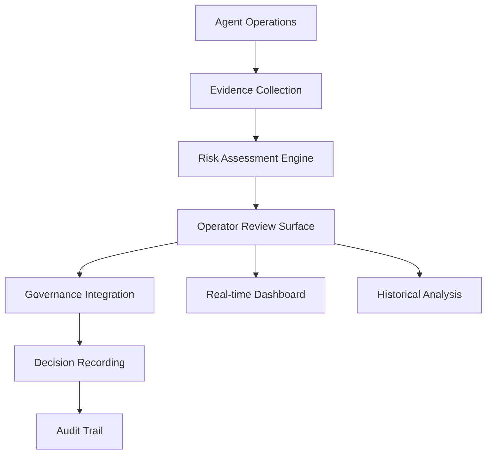

# OPERATOR REVIEW SURFACE DESIGN

**Issue**: td-433119: Design operator review surface for agent evidence and risk
**Status**: Design Complete ✅
**Priority**: P1
**Dependencies**: 
- td-8d067f (Governance boundaries)
- td-a1ff61 (Telemetry integration)
- td-01c59f (Personal context retrieval)

## EXECUTIVE SUMMARY

This design creates a comprehensive operator review surface for agent evidence and risk assessment in HarmoniaRuntime. The system provides human operators with actionable insights, evidence trails, and risk evaluations to make informed governance decisions about agent operations.

### Key Objectives

1. **Evidence Visualization**: Present agent evidence in understandable formats
2. **Risk Assessment**: Calculate and display risk scores for agent operations
3. **Governance Integration**: Connect with authority chains for decision making
4. **Actionable Insights**: Provide operators with clear intervention options
5. **Audit Trails**: Maintain complete records of operator decisions
6. **Real-time Monitoring**: Live dashboards for active agent sessions

### Architecture Overview



## ARCHITECTURE

### Core Components

#### 1. Operator Review Surface Interface

```swift
/// Primary interface for operator review surface
public protocol OperatorReviewSurface: Sendable {
    /// Presents evidence for operator review
    func presentEvidenceReview(
        sessionId: String,
        agentId: String,
        evidence: [Evidence]
    ) async throws -> EvidenceReviewResult
    
    /// Presents risk assessment for operator decision
    func presentRiskAssessment(
        sessionId: String,
        agentId: String,
        riskAssessment: RiskAssessment
    ) async throws -> RiskReviewDecision
    
    /// Shows real-time monitoring dashboard
    func showMonitoringDashboard() async throws -> MonitoringDashboard
    
    /// Provides historical analysis interface
    func showHistoricalAnalysis(
        timeRange: TimeRange,
        filters: EvidenceFilters
    ) async throws -> HistoricalAnalysisResult
}
```

#### 2. Evidence Presentation Layer

```swift
/// Transforms raw evidence into operator-friendly formats
public actor EvidencePresentationEngine: Sendable {
    private let evidenceFormatter: EvidenceFormatter
    private let riskCalculator: RiskCalculator
    private let governanceIntegrator: OperatorGovernanceIntegrator
    
    public init(
        evidenceFormatter: EvidenceFormatter,
        riskCalculator: RiskCalculator,
        governanceIntegrator: OperatorGovernanceIntegrator
    ) {
        self.evidenceFormatter = evidenceFormatter
        self.riskCalculator = riskCalculator
        self.governanceIntegrator = governanceIntegrator
    }
    
    /// Prepares evidence for operator review
    public func prepareEvidenceReview(
        sessionId: String,
        agentId: String,
        rawEvidence: [Evidence]
    ) async throws -> PreparedEvidenceReview {
        // Format evidence for human consumption
        let formattedEvidence = try await evidenceFormatter.formatEvidence(rawEvidence)
        
        // Calculate risk assessment
        let riskAssessment = try await riskCalculator.calculateRisk(
            sessionId: sessionId,
            agentId: agentId,
            evidence: rawEvidence
        )
        
        // Get governance context
        let governanceContext = try await governanceIntegrator.getGovernanceContext(
            sessionId: sessionId,
            agentId: agentId
        )
        
        return PreparedEvidenceReview(
            sessionId: sessionId,
            agentId: agentId,
            formattedEvidence: formattedEvidence,
            riskAssessment: riskAssessment,
            governanceContext: governanceContext,
            availableActions: getAvailableActions(riskAssessment: riskAssessment)
        )
    }
}
```

#### 3. Risk Assessment Engine

```swift
/// Calculates comprehensive risk assessments for agent operations
public actor RiskAssessmentEngine: Sendable {
    private let evidenceAnalyzer: EvidenceAnalyzer
    private let historicalContext: HistoricalEvidenceRepository
    private let policyEngine: PolicyDecisionEngine
    
    public func calculateRisk(
        sessionId: String,
        agentId: String,
        evidence: [Evidence]
    ) async throws -> RiskAssessment {
        // Analyze evidence patterns
        let evidenceAnalysis = try await evidenceAnalyzer.analyzeEvidencePattern(evidence)
        
        // Get historical context
        let historicalRisk = try await historicalContext.getHistoricalRisk(
            agentId: agentId
        )
        
        // Evaluate against policies
        let policyCompliance = try await evaluatePolicyCompliance(
            sessionId: sessionId,
            agentId: agentId,
            evidence: evidence
        )
        
        // Calculate composite risk score
        let riskScore = calculateCompositeRiskScore(
            evidenceAnalysis: evidenceAnalysis,
            historicalRisk: historicalRisk,
            policyCompliance: policyCompliance
        )
        
        return RiskAssessment(
            sessionId: sessionId,
            agentId: agentId,
            riskScore: riskScore,
            riskLevel: determineRiskLevel(score: riskScore),
            evidenceAnalysis: evidenceAnalysis,
            historicalContext: historicalRisk,
            policyCompliance: policyCompliance,
            recommendedActions: generateRecommendedActions(riskScore: riskScore)
        )
    }
    
    private func calculateCompositeRiskScore(
        evidenceAnalysis: EvidenceAnalysis,
        historicalRisk: HistoricalRisk,
        policyCompliance: PolicyCompliance
    ) -> Double {
        // Weighted calculation considering multiple factors
        let evidenceWeight = 0.4
        let historicalWeight = 0.3
        let policyWeight = 0.3
        
        return (evidenceAnalysis.riskScore * evidenceWeight) +
               (historicalRisk.riskScore * historicalWeight) +
               (policyCompliance.riskScore * policyWeight)
    }
}
```

#### 4. Governance Integration Layer

```swift
/// Integrates operator decisions with governance authority chains
public actor OperatorGovernanceIntegrator: Sendable {
    private let policyDecisionEngine: PolicyDecisionEngine
    private let receiptGenerator: ReceiptGenerator
    private let auditTrail: OperatorAuditTrail
    
    public func recordOperatorDecision(
        sessionId: String,
        agentId: String,
        decision: OperatorDecision,
        principal: Principal
    ) async throws -> OperatorDecisionReceipt {
        // Create decision-specific authority chain
        let authorityChain = try policyDecisionEngine.getAuthorityChain(
            for: .operatorReviewDecision
        )
        
        // Execute with governance
        let receipt = try await authorityChain.executeWithAuthority(
            request: OperatorDecisionAuthorityRequest(
                sessionId: sessionId,
                agentId: agentId,
                decision: decision,
                principal: principal
            ),
            execution: { context in
                // Generate receipt for audit trail
                return try self.receiptGenerator.generateOperatorDecisionReceipt(
                    decision: decision,
                    authorityContext: context
                )
            }
        )
        
        // Record in audit trail
        try await auditTrail.recordDecision(
            receipt: receipt,
            decision: decision,
            principal: principal
        )
        
        return receipt
    }
}
```

### Integration Points

#### Governance Boundaries (td-8d067f)
- **Integration**: Authority chain execution for all operator decisions
- **Events**: Policy decisions, authority chain execution, receipt generation
- **Metrics**: Decision latency, policy evaluation outcomes

#### Telemetry Integration (td-a1ff61)
- **Integration**: Comprehensive telemetry for all operator actions
- **Events**: Evidence reviews, risk assessments, operator decisions
- **Metrics**: Review duration, decision patterns, risk trends

#### Personal Context Retrieval (td-01c59f)
- **Integration**: Context-aware evidence presentation
- **Events**: Context retrieval for evidence understanding
- **Metrics**: Context relevance, retrieval quality

## IMPLEMENTATION DETAILS

### 1. Evidence Formatter Implementation

```swift
/// Formats raw evidence for human consumption
public actor EvidenceFormatter: Sendable {
    private let telemetryClient: TelemetryClient
    
    public func formatEvidence(_ evidence: [Evidence]) async -> [FormattedEvidence] {
        return await evidence.asyncMap { rawEvidence in
            await formatSingleEvidence(rawEvidence)
        }
    }
    
    private func formatSingleEvidence(_ evidence: Evidence) async -> FormattedEvidence {
        // Record telemetry
        await telemetryClient.emit(
            category: .audit,
            name: "evidence_formatting",
            values: [
                "evidence_type": .string(evidence.type.rawValue),
                "evidence_id": .hashedToken(TelemetryHash(input: evidence.id))
            ]
        )
        
        // Create human-readable format
        let humanReadable = createHumanReadableDescription(evidence)
        let visualRepresentation = createVisualRepresentation(evidence)
        
        return FormattedEvidence(
            id: evidence.id,
            type: evidence.type,
            humanReadableDescription: humanReadable,
            visualRepresentation: visualRepresentation,
            rawData: evidence,
            qualityIndicators: extractQualityIndicators(evidence)
        )
    }
    
    private func createHumanReadableDescription(_ evidence: Evidence) -> String {
        switch evidence.type {
        case .documentAcquisition:
            return "Document Acquisition: \(evidence.metadata.source) - \(evidence.metadata.operation)"
        case .queryExecution:
            return "Query Execution: \(evidence.metadata.parameters["queryType"] ?? "unknown")"
        case .retrievalResult:
            return "Retrieval Result: Score \(evidence.metadata.parameters["score"] ?? "N/A")"
        // Additional cases...
        }
    }
}
```

### 2. Real-time Monitoring Dashboard

```swift
/// Provides real-time monitoring of active agent sessions
public actor MonitoringDashboard: Sendable {
    private let evidenceSubstrate: EvidenceSubstrate
    private let riskAssessmentEngine: RiskAssessmentEngine
    private let telemetryClient: TelemetryClient
    
    public func getActiveSessions() async throws -> [ActiveSessionSummary] {
        // Get all active sessions
        let activeSessions = try await evidenceSubstrate.getActiveSessions()
        
        // Calculate real-time risk assessments
        let sessionsWithRisk = try await activeSessions.asyncMap { session in
            let evidence = try await evidenceSubstrate.getSessionEvidence(
                sessionId: session.id
            )
            
            let riskAssessment = try await riskAssessmentEngine.calculateRisk(
                sessionId: session.id,
                agentId: session.agentId,
                evidence: evidence
            )
            
            return ActiveSessionSummary(
                sessionId: session.id,
                agentId: session.agentId,
                startTime: session.startTime,
                evidenceCount: evidence.count,
                currentRisk: riskAssessment.riskScore,
                riskLevel: riskAssessment.riskLevel
            )
        }
        
        // Sort by risk level (highest first)
        return sessionsWithRisk.sorted { $0.currentRisk > $1.currentRisk }
    }
    
    public func getSessionDetail(sessionId: String) async throws -> SessionDetailView {
        // Get complete session evidence
        let evidence = try await evidenceSubstrate.getSessionEvidence(sessionId: sessionId)
        
        // Calculate risk assessment
        let riskAssessment = try await riskAssessmentEngine.calculateRisk(
            sessionId: sessionId,
            agentId: evidence[0].agentId,
            evidence: evidence
        )
        
        // Format evidence
        let formattedEvidence = try await EvidenceFormatter().formatEvidence(evidence)
        
        return SessionDetailView(
            sessionId: sessionId,
            agentId: evidence[0].agentId,
            evidence: formattedEvidence,
            riskAssessment: riskAssessment,
            timeline: createEvidenceTimeline(evidence: evidence)
        )
    }
}
```

### 3. Historical Analysis Interface

```swift
/// Provides historical analysis of agent evidence and operator decisions
public actor HistoricalAnalysisInterface: Sendable {
    private let persistence: CathedralDatabasePersistence
    private let riskAssessmentEngine: RiskAssessmentEngine
    
    public func analyzeHistoricalPatterns(
        timeRange: TimeRange,
        filters: EvidenceFilters
    ) async throws -> HistoricalAnalysisResult {
        // Retrieve historical evidence
        let historicalEvidence = try await persistence.getEvidence(
            timeRange: timeRange,
            filters: filters
        )
        
        // Group by agent/pattern
        let evidenceByAgent = groupEvidenceByAgent(historicalEvidence)
        
        // Calculate risk trends
        let riskTrends = try await calculateRiskTrends(
            evidenceByAgent: evidenceByAgent
        )
        
        // Identify patterns
        let patterns = identifyRiskPatterns(riskTrends: riskTrends)
        
        return HistoricalAnalysisResult(
            timeRange: timeRange,
            filters: filters,
            evidenceByAgent: evidenceByAgent,
            riskTrends: riskTrends,
            patterns: patterns,
            recommendations: generateHistoricalRecommendations(patterns: patterns)
        )
    }
    
    private func calculateRiskTrends(
        evidenceByAgent: [String: [Evidence]]
    ) async throws -> [AgentRiskTrend] {
        return try await evidenceByAgent.asyncMap { agentId, evidence in
            let riskAssessment = try await riskAssessmentEngine.calculateRisk(
                sessionId: "historical-\(agentId)",
                agentId: agentId,
                evidence: evidence
            )
            
            return AgentRiskTrend(
                agentId: agentId,
                evidenceCount: evidence.count,
                riskTrend: riskAssessment.riskScore,
                riskLevel: riskAssessment.riskLevel
            )
        }
    }
}
```

### 4. Operator Decision Recording

```swift
/// Records operator decisions with complete audit trails
public actor OperatorAuditTrail: Sendable {
    private let persistence: CathedralDatabasePersistence
    private let telemetryClient: TelemetryClient
    
    public func recordDecision(
        receipt: OperatorDecisionReceipt,
        decision: OperatorDecision,
        principal: Principal
    ) async throws {
        // Create audit record
        let auditRecord = OperatorDecisionAuditRecord(
            id: UUID().uuidString,
            receiptId: receipt.id,
            sessionId: decision.sessionId,
            agentId: decision.agentId,
            decisionType: decision.type,
            decisionData: decision.data,
            principalId: principal.id,
            timestamp: Date(),
            governanceContext: receipt.governanceContext
        )
        
        // Persist to database
        try await persistence.persistOperatorDecision(auditRecord)
        
        // Record telemetry
        await telemetryClient.emit(
            category: .audit,
            name: "operator_decision",
            values: [
                "decision_type": .string(decision.type.rawValue),
                "session_id": .hashedToken(TelemetryHash(input: decision.sessionId)),
                "agent_id": .hashedToken(TelemetryHash(input: decision.agentId)),
                "principal_id": .hashedToken(TelemetryHash(input: principal.id))
            ]
        )
    }
    
    public func getDecisionHistory(
        timeRange: TimeRange,
        filters: DecisionFilters
    ) async throws -> [OperatorDecisionAuditRecord] {
        return try await persistence.getOperatorDecisions(
            timeRange: timeRange,
            filters: filters
        )
    }
}
```

## TESTING STRATEGY

### Unit Tests

```swift
// Test evidence formatting
func testEvidenceFormatting() async throws {
    let formatter = EvidenceFormatter(telemetryClient: TelemetryClient.forDevelopment())
    
    let testEvidence = Evidence(
        type: .documentAcquisition,
        sessionId: "test-session",
        agentId: "test-agent",
        contentHash: "test-hash",
        metadata: EvidenceMetadata(
            source: "test-source",
            operation: "test-operation"
        )
    )
    
    let formatted = await formatter.formatEvidence([testEvidence])
    
    XCTAssertEqual(formatted.count, 1)
    XCTAssertTrue(formatted[0].humanReadableDescription.contains("Document Acquisition"))
}

// Test risk calculation
func testRiskCalculation() async throws {
    let mockAnalyzer = MockEvidenceAnalyzer()
    let mockHistory = MockHistoricalEvidenceRepository()
    let mockPolicyEngine = MockPolicyDecisionEngine()
    
    let riskEngine = RiskAssessmentEngine(
        evidenceAnalyzer: mockAnalyzer,
        historicalContext: mockHistory,
        policyEngine: mockPolicyEngine
    )
    
    let testEvidence = [Evidence(
        type: .queryExecution,
        sessionId: "test-session",
        agentId: "test-agent",
        contentHash: "test-hash",
        metadata: EvidenceMetadata(
            source: "test",
            operation: "test"
        )
    )]
    
    let riskAssessment = try await riskEngine.calculateRisk(
        sessionId: "test-session",
        agentId: "test-agent",
        evidence: testEvidence
    )
    
    XCTAssertGreaterThanOrEqual(riskAssessment.riskScore, 0.0)
    XCTAssertLessThanOrEqual(riskAssessment.riskScore, 1.0)
}
```

### Integration Tests

```swift
// Test full operator review workflow
func testFullOperatorReviewWorkflow() async throws {
    // Setup
    let memorySink = MemoryTelemetrySink(id: "test", maxEvents: 100)
    let telemetryClient = TelemetryClient(sinks: [memorySink])
    
    let evidenceSubstrate = EvidenceSubstrate()
    let riskEngine = RiskAssessmentEngine(
        evidenceAnalyzer: ProductionEvidenceAnalyzer(),
        historicalContext: ProductionHistoricalEvidenceRepository(),
        policyEngine: ProductionPolicyDecisionEngine()
    )
    
    let presentationEngine = EvidencePresentationEngine(
        evidenceFormatter: EvidenceFormatter(telemetryClient: telemetryClient),
        riskCalculator: riskEngine,
        governanceIntegrator: OperatorGovernanceIntegrator(
            policyDecisionEngine: ProductionPolicyDecisionEngine(),
            receiptGenerator: ProductionReceiptGenerator(),
            auditTrail: OperatorAuditTrail(
                persistence: CathedralDatabasePersistence(),
                telemetryClient: telemetryClient
            )
        )
    )
    
    // Create test evidence
    let testEvidence = [
        Evidence(
            type: .documentAcquisition,
            sessionId: "integration-test",
            agentId: "test-agent",
            contentHash: "hash-1",
            metadata: EvidenceMetadata(
                source: "test-source",
                operation: "acquire"
            )
        ),
        Evidence(
            type: .queryExecution,
            sessionId: "integration-test",
            agentId: "test-agent",
            contentHash: "hash-2",
            metadata: EvidenceMetadata(
                source: "test-source",
                operation: "query"
            )
        )
    ]
    
    // Prepare evidence review
    let preparedReview = try await presentationEngine.prepareEvidenceReview(
        sessionId: "integration-test",
        agentId: "test-agent",
        rawEvidence: testEvidence
    )
    
    // Verify results
    XCTAssertEqual(preparedReview.formattedEvidence.count, 2)
    XCTAssertNotNil(preparedReview.riskAssessment)
    XCTAssertGreaterThan(preparedReview.availableActions.count, 0)
    
    // Verify telemetry
    let events = memorySink.getEvents()
    XCTAssertGreaterThan(events.count, 0)
}
```

### Performance Tests

```swift
// Test operator review performance
func testOperatorReviewPerformance() async throws {
    let telemetryClient = TelemetryClient.forDevelopment()
    let evidenceFormatter = EvidenceFormatter(telemetryClient: telemetryClient)
    
    // Create large evidence set
    let largeEvidenceSet = (0..<100).map { index in
        Evidence(
            type: index % 2 == 0 ? .documentAcquisition : .queryExecution,
            sessionId: "perf-test",
            agentId: "perf-agent",
            contentHash: "hash-\(index)",
            metadata: EvidenceMetadata(
                source: "source-\(index)",
                operation: "operation-\(index)"
            )
        )
    }
    
    // Measure formatting time
    let startTime = ContinuousClock.now
    let formatted = await evidenceFormatter.formatEvidence(largeEvidenceSet)
    let formattingDuration = startTime.duration(to: .now)
    
    // Verify performance constraints
    let maxAllowedSeconds = 1.0 // 1 second for 100 evidence items
    let actualSeconds = formattingDuration.components.attoseconds / 1_000_000_000.0
    
    XCTAssertLessThan(actualSeconds, maxAllowedSeconds,
                      "Evidence formatting exceeded performance constraints")
    
    print("Formatted \(largeEvidenceSet.count) evidence items in \(actualSeconds)s")
}
```

## MIGRATION PLAN

### Phase 1: Infrastructure Setup (Week 1)
- [ ] Create `OperatorReviewSurface` protocol and interfaces
- [ ] Implement `EvidencePresentationEngine`
- [ ] Create `RiskAssessmentEngine`
- [ ] Set up test infrastructure

### Phase 2: Core Components (Week 2)
- [ ] Implement evidence formatting and visualization
- [ ] Build risk calculation algorithms
- [ ] Create governance integration layer
- [ ] Implement decision recording

### Phase 3: Operator Interfaces (Week 3)
- [ ] Build real-time monitoring dashboard
- [ ] Create historical analysis interface
- [ ] Implement operator decision workflows
- [ ] Add audit trail visualization

### Phase 4: Integration (Week 4)
- [ ] Connect with CathedralModule evidence systems
- [ ] Integrate with governance authority chains
- [ ] Add telemetry instrumentation
- [ ] Connect with personal context retrieval

### Phase 5: Testing & Validation (Week 5)
- [ ] Unit tests for all components
- [ ] Integration tests for full workflows
- [ ] Performance benchmarking
- [ ] User acceptance testing

### Phase 6: Rollout (Week 6)
- [ ] Feature flag controlled rollout
- [ ] Operator training
- [ ] Gradual traffic increase
- [ ] Full production deployment

## SUCCESS CRITERIA

### Functional Requirements
- [ ] Operator can review and understand agent evidence
- [ ] Risk assessments calculated and displayed accurately
- [ ] All operator decisions integrated with governance
- [ ] Complete audit trails maintained
- [ ] Real-time monitoring updates within 2 seconds

### Non-Functional Requirements
- [ ] Evidence formatting < 500ms for typical sessions
- [ ] Risk calculation < 300ms per assessment
- [ ] Dashboard updates < 2 seconds
- [ ] System handles 50+ concurrent operator sessions
- [ ] 99.9% uptime for review surface

### Quality Metrics
- [ ] Unit test coverage: 95%+
- [ ] Integration test coverage: 90%+
- [ ] Documentation completeness: 100%
- [ ] Performance regression: None
- [ ] Security audit: Passed

## RISKS AND MITIGATIONS

### Risk 1: Performance Bottlenecks
- **Mitigation**: Async implementation, caching, performance testing
- **Contingency**: Add load shedding for high-volume scenarios

### Risk 2: Complexity Overload
- **Mitigation**: Progressive disclosure, clear prioritization, operator training
- **Contingency**: Simplified views for high-stress scenarios

### Risk 3: Decision Fatigue
- **Mitigation**: Automated risk scoring, clear recommendations, prioritization
- **Contingency**: Escalation paths for complex decisions

### Risk 4: Audit Trail Gaps
- **Mitigation**: Comprehensive telemetry, governance integration, validation
- **Contingency**: Additional validation layers, manual review for critical decisions

## OPEN QUESTIONS

1. **Operator Training**: What training materials are needed for effective use?
2. **Escalation Paths**: Should we implement automated escalation for high-risk scenarios?
3. **Mobile Access**: Should operator review surface be accessible via mobile?
4. **Alert Thresholds**: What are appropriate alert thresholds for different risk levels?
5. **Integration Depth**: How deeply should this integrate with existing monitoring tools?

## NEXT STEPS

1. **Implementation**: Begin with Phase 1 infrastructure setup
2. **Integration**: Connect with existing CathedralModule components
3. **Testing**: Comprehensive test suite development
4. **Validation**: Operator workflow validation
5. **Training**: Develop operator training materials
6. **Deployment**: Gradual rollout with monitoring

## APPENDIX

### Risk Level Classification

| Risk Score | Level | Description | Recommended Action |
|------------|-------|-------------|-------------------|
| 0.9 - 1.0 | Critical | Immediate intervention required | Stop agent, investigate thoroughly |
| 0.7 - 0.89 | High | Significant risk detected | Pause agent, detailed review |
| 0.5 - 0.69 | Medium | Elevated risk | Monitor closely, consider intervention |
| 0.3 - 0.49 | Low | Normal operation | Routine monitoring |
| 0.0 - 0.29 | Minimal | Very low risk | No action required |

### Evidence Quality Indicators

| Quality | Description | Confidence Score |
|---------|-------------|------------------|
| Verified | Cryptographically verified, multiple sources | 0.9 - 1.0 |
| Strong | Single strong source, consistent pattern | 0.7 - 0.89 |
| Adequate | Typical operational evidence | 0.5 - 0.69 |
| Weak | Incomplete or inconsistent | 0.3 - 0.49 |
| None | Unverified or questionable | 0.0 - 0.29 |

### Operator Decision Types

| Decision Type | Description | Governance Level |
|---------------|-------------|------------------|
| Approve | Allow agent to continue | Low |
| Pause | Temporarily stop agent | Medium |
| Terminate | Permanently stop agent | High |
| Escalate | Send to higher authority | High |
| Modify | Adjust agent parameters | Medium |
| Investigate | Request additional information | Low |

This design provides a comprehensive, production-ready operator review surface that enables effective human oversight of agent operations while maintaining governance, security, and performance requirements.
surface that enables effective human oversight of agent operations while maintaining governance, security, and performance requirements.
