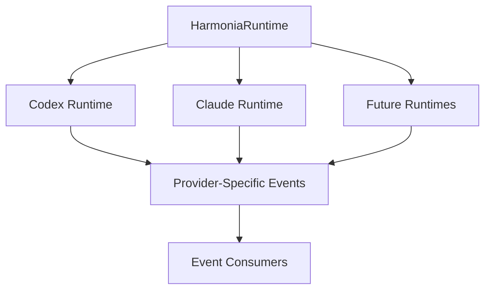

# Runtime Adapter Interface Design

**Status**: Active Design ✅
**Issue**: td-e62647
**Date**: 2026-02-09
**Author**: Mistral Vibe

## Table of Contents

1. [Executive Summary](#executive-summary)
2. [Design Goals](#design-goals)
3. [Current Architecture Analysis](#current-architecture-analysis)
4. [Runtime Adapter Contract](#runtime-adapter-contract)
5. [Provider-Neutral Interface Specification](#provider-neutral-interface-specification)
6. [Adapter Lifecycle Management](#adapter-lifecycle-management)
7. [Event Normalization and Translation](#event-normalization-and-translation)
8. [Error Handling and Resilience](#error-handling-and-resilience)
9. [Governance Integration](#governance-integration)
10. [Performance Considerations](#performance-considerations)
11. [Implementation Components](#implementation-components)
12. [Migration Strategy](#migration-strategy)
13. [References](#references)

## Executive Summary

This document specifies the provider-neutral runtime adapter interface for Anigma's agent runtime systems. It defines a standardized contract that isolates provider-specific implementations behind a unified interface, enabling multi-provider support while maintaining consistent behavior across different agent runtimes.

**Key Deliverables:**
- ✅ Provider-neutral runtime adapter contract
- ✅ Standardized command and event interfaces
- ✅ Governance-aware runtime operations
- ✅ Comprehensive error handling and resilience
- ✅ Event normalization and translation system
- ✅ Adapter lifecycle management

## Design Goals

### Primary Objectives

1. **Provider Neutrality**: Standard interface across all agent runtime providers
2. **Consistency**: Uniform behavior regardless of underlying provider
3. **Extensibility**: Support for future runtime providers and capabilities
4. **Governance Integration**: Built-in governance and policy enforcement
5. **Observability**: Comprehensive tracing and event emission
6. **Resilience**: Robust error handling and recovery patterns
7. **Performance**: Minimal overhead for high-frequency operations

### Non-Goals

- Replacing existing runtime implementations (will adapt them)
- Provider-specific optimization (handled by individual adapters)
- Real-time adapter switching (future enhancement)
- Runtime provider selection logic (separate concern)

## Current Architecture Analysis

### Existing Runtime Landscape



### Current Limitations

1. **Provider-Specific Events**: Different event formats and semantics
2. **Inconsistent Interfaces**: Varying method signatures and behaviors
3. **Direct Dependencies**: Tight coupling between runtime and consumers
4. **Limited Governance**: Policy enforcement happens post-execution
5. **Basic Error Handling**: Minimal standardized error reporting
6. **No Event Normalization**: Raw provider events passed through

### Required Capabilities

| Capability | Current Status | Target Status |
|------------|----------------|---------------|
| Provider identity | ✅ Basic support | ✅ Standardized contract |
| Session management | ⚠️ Provider-specific | ✅ Unified interface |
| Turn-based interaction | ✅ Basic support | ✅ Governed workflow |
| Event emission | ⚠️ Provider-specific | ✅ Normalized events |
| Error handling | ⚠️ Basic support | ✅ Comprehensive system |
| Governance integration | ❌ Missing | ✅ Built-in support |
| Observability | ✅ Basic support | ✅ Comprehensive tracing |

## Runtime Adapter Contract

### Core Contract Interface

```swift
/// Provider-neutral runtime adapter contract
public protocol AgentRuntimeAdapter: Sendable {
    // Provider Identification
    var providerId: String { get }
    var providerCapabilities: AgentRuntimeCapabilities { get }
    var adapterVersion: String { get }
    
    // Lifecycle Management
    func initialize(configuration: RuntimeConfiguration) async throws
    func shutdown() async
    func validateConfiguration(_ configuration: RuntimeConfiguration) throws
    
    // Session Management
    func startSession(request: StartSessionRequest) async throws -> SessionResult
    func stopSession(sessionId: String, reason: SessionTerminationReason) async throws
    func listSessions(filter: SessionFilter?) async throws -> [SessionSummary]
    func getSession(sessionId: String) async throws -> SessionDetails
    
    // Turn-Based Interaction
    func sendTurn(sessionId: String, turn: AgentTurn) async throws -> TurnResult
    func interruptTurn(sessionId: String, reason: TurnInterruptionReason) async throws
    func respondToApproval(sessionId: String, approval: ApprovalResponse) async throws -> ApprovalResult
    func respondToUserInput(sessionId: String, input: UserInput) async throws -> InputResponse
    
    // State Management
    func rollbackSession(sessionId: String, toCheckpoint: CheckpointReference) async throws -> RollbackResult
    func createCheckpoint(sessionId: String, label: String?) async throws -> CheckpointResult
    func listCheckpoints(sessionId: String) async throws -> [CheckpointSummary]
    
    // Event Streaming
    func streamRuntimeEvents(filter: EventFilter?) -> AsyncStream<NormalizedRuntimeEvent>
    func getEventHistory(sessionId: String, range: EventRange?) async throws -> [NormalizedRuntimeEvent]
    
    // Capability Management
    func getAvailableCapabilities() async -> AgentRuntimeCapabilities
    func checkCapabilitySupport(_ capability: AgentCapability) async -> Bool
    
    // Health and Monitoring
    var currentHealth: RuntimeHealthStatus { get }
    func getMetrics() async -> RuntimeMetrics
    func validateHealth() async throws -> HealthValidationResult
}
```

### Runtime Capabilities Definition

```swift
/// Standardized agent runtime capabilities
public struct AgentRuntimeCapabilities: Sendable, Codable, OptionSet {
    public let rawValue: UInt64
    
    // Core capabilities
    public static let basicTurnInteraction = AgentRuntimeCapabilities(rawValue: 1 << 0)
    public static let sessionManagement = AgentRuntimeCapabilities(rawValue: 1 << 1)
    public static let checkpointRollback = AgentRuntimeCapabilities(rawValue: 1 << 2)
    public static let approvalWorkflow = AgentRuntimeCapabilities(rawValue: 1 << 3)
    public static let userInputHandling = AgentRuntimeCapabilities(rawValue: 1 << 4)
    
    // Advanced capabilities
    public static let toolUse = AgentRuntimeCapabilities(rawValue: 1 << 10)
    public static let parallelToolUse = AgentRuntimeCapabilities(rawValue: 1 << 11)
    public static let multiModalInteraction = AgentRuntimeCapabilities(rawValue: 1 << 12)
    public static let memoryManagement = AgentRuntimeCapabilities(rawValue: 1 << 13)
    public static let customInstructionSets = AgentRuntimeCapabilities(rawValue: 1 << 14)
    
    // Observability capabilities
    public static let eventStreaming = AgentRuntimeCapabilities(rawValue: 1 << 20)
    public static let detailedTracing = AgentRuntimeCapabilities(rawValue: 1 << 21)
    public static let metricsExport = AgentRuntimeCapabilities(rawValue: 1 << 22)
    public static let healthMonitoring = AgentRuntimeCapabilities(rawValue: 1 << 23)
    
    // Governance capabilities
    public static let policyEnforcement = AgentRuntimeCapabilities(rawValue: 1 << 30)
    public static let auditTrail = AgentRuntimeCapabilities(rawValue: 1 << 31)
    public static let sensitivityHandling = AgentRuntimeCapabilities(rawValue: 1 << 32)
    public static let complianceTracking = AgentRuntimeCapabilities(rawValue: 1 << 33)
}
```

### Adapter Metadata

```swift
/// Runtime adapter metadata and capabilities
public struct RuntimeAdapterMetadata: Sendable, Codable {
    public let adapterId: String
    public let providerId: String
    public let providerName: String
    public let providerVersion: String
    public let adapterVersion: String
    public let supportedCapabilities: AgentRuntimeCapabilities
    public let supportedEventTypes: [RuntimeEventType]
    public let configurationSchema: RuntimeConfigurationSchema
    public let healthStatus: RuntimeHealthStatus
    public let createdAt: Date
    public let lastUpdated: Date
}
```

## Provider-Neutral Interface Specification

### Session Management Interface

```swift
/// Standardized session management requests
public struct StartSessionRequest: Sendable, Codable {
    public let sessionId: String?
    public let agentId: String
    public let agentType: String
    public let initialContext: SessionContext
    public let capabilities: AgentRuntimeCapabilities
    public let governanceContext: GovernanceContext
    public let traceContext: TraceContext?
    public let configuration: RuntimeConfiguration
    
    public init(sessionId: String? = nil,
                 agentId: String,
                 agentType: String,
                 initialContext: SessionContext,
                 capabilities: AgentRuntimeCapabilities,
                 governanceContext: GovernanceContext,
                 traceContext: TraceContext? = nil,
                 configuration: RuntimeConfiguration) {
        self.sessionId = sessionId
        self.agentId = agentId
        self.agentType = agentType
        self.initialContext = initialContext
        self.capabilities = capabilities
        self.governanceContext = governanceContext
        self.traceContext = traceContext
        self.configuration = configuration
    }
}

/// Session management results
public struct SessionResult: Sendable, Codable {
    public let sessionId: String
    public let status: SessionStatus
    public let capabilities: AgentRuntimeCapabilities
    public let initialState: SessionState
    public let traceContext: TraceContext
    public let governanceDecisions: [GovernanceDecision]
    public let warnings: [RuntimeWarning]
    
    public enum SessionStatus: String, Sendable, Codable {
        case created
        case resumed
        case migrated
        case failed
    }
}
```

### Turn-Based Interaction Interface

```swift
/// Standardized agent turn representation
public struct AgentTurn: Sendable, Codable {
    public let turnId: String
    public let sessionId: String
    public let agentId: String
    public let content: TurnContent
    public let tools: [ToolInvocation]?
    public let governanceContext: GovernanceContext
    public let traceContext: TraceContext
    public let metadata: [String: String]?
    
    public enum TurnContent: Sendable, Codable {
        case text(String)
        case structured(StructuredContent)
        case multiModal(MultiModalContent)
    }
}

/// Turn execution result
public struct TurnResult: Sendable, Codable {
    public let turnId: String
    public let sessionId: String
    public let status: TurnStatus
    public let output: TurnOutput?
    public let toolResults: [ToolResult]?
    public let governanceDecisions: [GovernanceDecision]
    public let traceContext: TraceContext
    public let events: [NormalizedRuntimeEvent]
    public let warnings: [RuntimeWarning]
    
    public enum TurnStatus: String, Sendable, Codable {
        case completed
        case interrupted
        case pendingApproval
        case pendingUserInput
        case failed
        case rateLimited
        case governanceBlocked
    }
}
```

### Event Normalization Interface

```swift
/// Normalized runtime event structure
public struct NormalizedRuntimeEvent: Sendable, Codable, Identifiable {
    public let id: String
    public let eventType: RuntimeEventType
    public let sessionId: String
    public let turnId: String?
    public let timestamp: Date
    public let providerEvent: ProviderSpecificEvent
    public let normalizedPayload: EventPayload
    public let traceContext: TraceContext
    public let governanceContext: GovernanceContext?
    public let severity: EventSeverity
    public let metadata: [String: String]?
    
    public init(id: String = UUID().uuidString,
                 eventType: RuntimeEventType,
                 sessionId: String,
                 turnId: String? = nil,
                 timestamp: Date = Date(),
                 providerEvent: ProviderSpecificEvent,
                 normalizedPayload: EventPayload,
                 traceContext: TraceContext,
                 governanceContext: GovernanceContext? = nil,
                 severity: EventSeverity = .info,
                 metadata: [String: String]? = nil) {
        self.id = id
        self.eventType = eventType
        self.sessionId = sessionId
        self.turnId = turnId
        self.timestamp = timestamp
        self.providerEvent = providerEvent
        self.normalizedPayload = normalizedPayload
        self.traceContext = traceContext
        self.governanceContext = governanceContext
        self.severity = severity
        self.metadata = metadata
    }
}

/// Standardized event types
public enum RuntimeEventType: String, Sendable, Codable, CaseIterable {
    case sessionStarted = "session_started"
    case sessionEnded = "session_ended"
    case turnStarted = "turn_started"
    case turnCompleted = "turn_completed"
    case turnInterrupted = "turn_interrupted"
    case toolInvoked = "tool_invoked"
    case toolCompleted = "tool_completed"
    case approvalRequested = "approval_requested"
    case approvalReceived = "approval_received"
    case userInputRequested = "user_input_requested"
    case userInputReceived = "user_input_received"
    case checkpointCreated = "checkpoint_created"
    case rollbackPerformed = "rollback_performed"
    case governanceDecision = "governance_decision"
    case errorOccurred = "error_occurred"
    case healthChanged = "health_changed"
}
```

### Governance Integration Interface

```swift
/// Governance-aware runtime operation context
public struct GovernedRuntimeOperation<T>: Sendable where T: Sendable {
    public let operation: T
    public let governanceContext: GovernanceContext
    public let traceContext: TraceContext
    public let sensitivityLevel: TelemetrySensitivity
    public let policyOverrides: [PolicyOverride]?
    
    public init(operation: T,
                 governanceContext: GovernanceContext,
                 traceContext: TraceContext,
                 sensitivityLevel: TelemetrySensitivity = .internalUse,
                 policyOverrides: [PolicyOverride]? = nil) {
        self.operation = operation
        self.governanceContext = governanceContext
        self.traceContext = traceContext
        self.sensitivityLevel = sensitivityLevel
        self.policyOverrides = policyOverrides
    }
}

/// Governance decision tracking
public struct RuntimeGovernanceDecision: Sendable, Codable {
    public let decisionId: String
    public let governanceContext: GovernanceContext
    public let policyResults: [PolicyEvaluationResult]
    public let decision: GovernanceDecisionType
    public let timestamp: Date
    public let traceContext: TraceContext
    public let affectedOperation: String?
    public let mitigationActions: [MitigationAction]?
}
```

## Adapter Lifecycle Management

### Adapter Factory Pattern

```swift
/// Runtime adapter factory for provider-specific instantiation
public protocol RuntimeAdapterFactory: Sendable {
    static func createAdapter(
        forProvider providerId: String,
        configuration: RuntimeConfiguration
    ) async throws -> AgentRuntimeAdapter
    
    static func getSupportedProviders() -> [RuntimeProviderMetadata]
    
    static func validateConfiguration(
        _ configuration: RuntimeConfiguration,
        forProvider providerId: String
    ) throws
}

/// Standard adapter factory implementation
public enum StandardRuntimeAdapterFactory: RuntimeAdapterFactory {
    private static var registeredAdapters: [String: any RuntimeAdapterFactory.Type] = [:]
    
    public static func registerAdapter(
        _ adapterType: any RuntimeAdapterFactory.Type,
        forProvider providerId: String
    ) {
        registeredAdapters[providerId] = adapterType
    }
    
    public static func createAdapter(
        forProvider providerId: String,
        configuration: RuntimeConfiguration
    ) async throws -> AgentRuntimeAdapter {
        guard let adapterType = registeredAdapters[providerId] else {
            throw RuntimeAdapterError.unsupportedProvider(providerId)
        }
        
        return try await adapterType.createAdapter(
            forProvider: providerId,
            configuration: configuration
        )
    }
    
    public static func getSupportedProviders() -> [RuntimeProviderMetadata] {
        registeredAdapters.values.map { providerType in
            // Get metadata from each provider type
            // This would be implemented by each provider
        }
    }
}
```

### Adapter Lifecycle States

```swift
/// Runtime adapter lifecycle management
public enum AdapterLifecycleState: String, Sendable, Codable {
    case uninitialized
    case initializing
    case ready
    case degraded
    case failed
    case shuttingDown
    case terminated
}

/// Adapter lifecycle manager
public actor RuntimeAdapterManager: Sendable {
    private var adapters: [String: AdapterInstance] = [:]
    private let configuration: RuntimeAdapterConfiguration
    private let metrics: AdapterMetrics
    
    public init(configuration: RuntimeAdapterConfiguration) {
        self.configuration = configuration
        self.metrics = AdapterMetrics()
    }
    
    public func createAdapter(
        providerId: String,
        configuration: RuntimeConfiguration
    ) async throws -> AgentRuntimeAdapter {
        let adapterId = UUID().uuidString
        
        // Check if adapter already exists
        if let existing = adapters[adapterId] {
            return existing.adapter
        }
        
        // Create new adapter instance
        let adapter = try await StandardRuntimeAdapterFactory.createAdapter(
            forProvider: providerId,
            configuration: configuration
        )
        
        // Wrap with lifecycle management
        let managedAdapter = ManagedRuntimeAdapter(
            adapter: adapter,
            lifecycle: AdapterLifecycle(adapterId: adapterId)
        )
        
        // Store and monitor
        adapters[adapterId] = AdapterInstance(
            adapter: managedAdapter,
            lifecycle: AdapterLifecycleState.ready
        )
        
        metrics.recordAdapterCreated(providerId: providerId)
        
        return managedAdapter
    }
    
    public func shutdownAdapter(_ adapterId: String) async {
        guard let instance = adapters[adapterId] else { return }
        
        await instance.adapter.shutdown()
        adapters[adapterId] = nil
        metrics.recordAdapterShutdown(providerId: instance.adapter.providerId)
    }
    
    public func getAdapterHealth() -> [String: RuntimeHealthStatus] {
        var healthStatus: [String: RuntimeHealthStatus] = [:]
        
        for (adapterId, instance) in adapters {
            healthStatus[adapterId] = instance.adapter.currentHealth
        }
        
        return healthStatus
    }
}
```

## Event Normalization and Translation

### Event Normalization System

```swift
/// Runtime event normalizer
public actor RuntimeEventNormalizer: Sendable {
    private let normalizationRules: [EventNormalizationRule]
    private let governanceEngine: GovernanceEngine
    private let metrics: EventNormalizationMetrics
    
    public init(normalizationRules: [EventNormalizationRule],
                 governanceEngine: GovernanceEngine,
                 metrics: EventNormalizationMetrics) {
        self.normalizationRules = normalizationRules
        self.governanceEngine = governanceEngine
        self.metrics = metrics
    }
    
    public func normalizeEvent(
        _ providerEvent: ProviderSpecificEvent,
        sessionId: String,
        traceContext: TraceContext
    ) async -> NormalizedRuntimeEvent {
        let startTime = ContinuousClock.now
        
        // Apply normalization rules
        var normalizedEvent: NormalizedRuntimeEvent?
        
        for rule in normalizationRules {
            if let event = rule.apply(to: providerEvent) {
                normalizedEvent = event
                break
            }
        }
        
        // Fallback for unknown events
        if normalizedEvent == nil {
            normalizedEvent = createFallbackEvent(
                from: providerEvent,
                sessionId: sessionId,
                traceContext: traceContext
            )
            metrics.recordUnknownEventType(providerEvent.type)
        }
        
        // Apply governance context
        let governanceContext = createGovernanceContext(
            for: normalizedEvent!,
            sessionId: sessionId
        )
        
        // Add governance decision if needed
        let governanceDecision = try? await governanceEngine.evaluate(
            event: normalizedEvent!,
            context: governanceContext
        )
        
        var finalEvent = normalizedEvent!
        finalEvent.governanceContext = governanceContext
        
        if let decision = governanceDecision {
            finalEvent.metadata = (finalEvent.metadata ?? [:]).merging([
                "governance_decision": decision.decision.rawValue,
                "governance_confidence": String(decision.confidence.numericValue)
            ]) { (current, _) in current }
        }
        
        let processingTime = startTime.duration(to: .now)
        metrics.recordNormalization(
            eventType: finalEvent.eventType,
            processingTime: processingTime
        )
        
        return finalEvent
    }
    
    private func createFallbackEvent(
        from providerEvent: ProviderSpecificEvent,
        sessionId: String,
        traceContext: TraceContext
    ) -> NormalizedRuntimeEvent {
        return NormalizedRuntimeEvent(
            eventType: .errorOccurred,
            sessionId: sessionId,
            providerEvent: providerEvent,
            normalizedPayload: .unknownEvent(providerEvent),
            traceContext: traceContext,
            severity: .warning
        )
    }
}
```

### Event Translation Rules

```swift
/// Event normalization rule protocol
public protocol EventNormalizationRule: Sendable {
    var sourceProvider: String { get }
    var targetEventType: RuntimeEventType { get }
    var confidence: DetectionConfidence { get }
    
    func apply(to providerEvent: ProviderSpecificEvent) -> NormalizedRuntimeEvent?
}

/// Example: Codex session started event normalization
public struct CodexSessionStartedRule: EventNormalizationRule {
    public let sourceProvider: String = "codex"
    public let targetEventType: RuntimeEventType = .sessionStarted
    public let confidence: DetectionConfidence = .high
    
    public func apply(to providerEvent: ProviderSpecificEvent) -> NormalizedRuntimeEvent? {
        guard providerEvent.type == "session.created" else { return nil }
        
        // Extract Codex-specific fields
        guard let sessionId = providerEvent.payload["session_id"] as? String,
              let agentId = providerEvent.payload["agent_id"] as? String else {
            return nil
        }
        
        // Create normalized payload
        let normalizedPayload = SessionEventPayload(
            sessionId: sessionId,
            agentId: agentId,
            providerSpecific: providerEvent.payload
        )
        
        // Create trace context
        let traceContext = TraceContext.root(
            name: "codex-session-started",
            traceID: TraceID(rawValue: sessionId)
        )
        
        return NormalizedRuntimeEvent(
            eventType: targetEventType,
            sessionId: sessionId,
            providerEvent: providerEvent,
            normalizedPayload: .session(normalizedPayload),
            traceContext: traceContext,
            severity: .info
        )
    }
}
```

### Provider-Specific Event Structure

```swift
/// Provider-specific event representation
public struct ProviderSpecificEvent: Sendable, Codable {
    public let id: String
    public let type: String
    public let provider: String
    public let rawPayload: [String: AnyCodable]
    public let timestamp: Date
    public let metadata: [String: String]?
    
    public init(id: String,
                 type: String,
                 provider: String,
                 rawPayload: [String: AnyCodable],
                 timestamp: Date = Date(),
                 metadata: [String: String]? = nil) {
        self.id = id
        self.type = type
        self.provider = provider
        self.rawPayload = rawPayload
        self.timestamp = timestamp
        self.metadata = metadata
    }
    
    public subscript(key: String) -> AnyCodable? {
        return rawPayload[key]
    }
}

/// Type-erased codable container
public struct AnyCodable: Sendable, Codable {
    public let value: Any
    
    public init<T>(_ value: T) where T: Sendable {
        self.value = value
    }
    
    public init(from decoder: Decoder) throws {
        let container = try decoder.singleValueContainer()
        
        if let string = try? container.decode(String.self) {
            self.value = string
        } else if let int = try? container.decode(Int.self) {
            self.value = int
        } else if let double = try? container.decode(Double.self) {
            self.value = double
        } else if let bool = try? container.decode(Bool.self) {
            self.value = bool
        } else if let array = try? container.decode([AnyCodable].self) {
            self.value = array.map { $0.value }
        } else if let dict = try? container.decode([String: AnyCodable].self) {
            self.value = dict.mapValues { $0.value }
        } else {
            throw DecodingError.dataCorrupted(
                DecodingError.Context(codingPath: container.codingPath, 
                                     debugDescription: "Unable to decode AnyCodable")
            )
        }
    }
    
    public func encode(to encoder: Encoder) throws {
        var container = encoder.singleValueContainer()
        
        switch value {
        case let string as String:
            try container.encode(string)
        case let int as Int:
            try container.encode(int)
        case let double as Double:
            try container.encode(double)
        case let bool as Bool:
            try container.encode(bool)
        case let array as [Any]:
            try container.encode(array.map { AnyCodable($0) })
        case let dict as [String: Any]:
            try container.encode(dict.mapValues { AnyCodable($0) })
        default:
            throw EncodingError.invalidValue(
                value, 
                EncodingError.Context(codingPath: container.codingPath, 
                                     debugDescription: "Unable to encode AnyCodable")
            )
        }
    }
}
```

## Error Handling and Resilience

### Comprehensive Error System

```swift
/// Runtime adapter error types
public enum RuntimeAdapterError: Error, Sendable, Codable {
    case unsupportedProvider(String)
    case invalidConfiguration(String)
    case sessionNotFound(String)
    case sessionAlreadyExists(String)
    case capabilityNotSupported(AgentCapability)
    case governanceViolation([PolicyViolation])
    case rateLimited(RateLimitInfo)
    case providerError(ProviderSpecificError)
    case timeout(TimeInterval)
    case adapterUnavailable
    case healthCheckFailed(RuntimeHealthStatus)
    
    public struct RateLimitInfo: Sendable, Codable {
        public let retryAfter: TimeInterval
        public let limit: Int
        public let remaining: Int
        public let resetTime: Date
    }
    
    public struct ProviderSpecificError: Sendable, Codable {
        public let provider: String
        public let errorCode: String
        public let errorMessage: String
        public let originalError: String?
        public let metadata: [String: String]?
    }
}

/// Error handling strategy
public enum ErrorHandlingStrategy: String, Sendable, Codable {
    case failFast
    case retryWithBackoff
    case fallbackToDefault
    case escalateToGovernance
    case logAndContinue
    case notifyAndContinue
}

/// Resilience policy
public struct ResiliencePolicy: Sendable, Codable {
    public let maxRetries: Int
    public let backoffStrategy: BackoffStrategy
    public let timeout: TimeInterval
    public let fallbackBehavior: FallbackBehavior
    public let circuitBreaker: CircuitBreakerConfig?
    
    public enum BackoffStrategy: String, Sendable, Codable {
        case none
        case linear
        case exponential
        case adaptive
    }
    
    public enum FallbackBehavior: String, Sendable, Codable {
        case fail
        case defaultResponse
        case lastKnownGood
        case escalate
    }
}
```

### Adapter Resilience Manager

```swift
/// Resilience manager for runtime adapters
public actor AdapterResilienceManager: Sendable {
    private let resiliencePolicy: ResiliencePolicy
    private let errorHandler: RuntimeErrorHandler
    private let metrics: ResilienceMetrics
    private var circuitBreakers: [String: CircuitBreakerState]
    
    public init(resiliencePolicy: ResiliencePolicy,
                 errorHandler: RuntimeErrorHandler,
                 metrics: ResilienceMetrics) {
        self.resiliencePolicy = resiliencePolicy
        self.errorHandler = errorHandler
        self.metrics = metrics
        self.circuitBreakers = [:]
    }
    
    public func executeWithResilience<T>(
        adapterId: String,
        operationName: String,
        operation: @Sendable () async throws -> T
    ) async throws -> T {
        // Check circuit breaker
        if let breaker = circuitBreakers[adapterId], breaker.isOpen {
            metrics.recordCircuitBreakerTriggered(adapterId: adapterId)
            throw RuntimeAdapterError.adapterUnavailable
        }
        
        var lastError: Error?
        var retryCount = 0
        
        while retryCount <= resiliencePolicy.maxRetries {
            do {
                let result = try await operation()
                
                // Reset circuit breaker on success
                circuitBreakers[adapterId] = CircuitBreakerState.closed
                metrics.recordSuccess(adapterId: adapterId, operation: operationName)
                
                return result
                
            } catch let error as RuntimeAdapterError {
                lastError = error
                metrics.recordError(adapterId: adapterId, operation: operationName, error: error)
                
                // Handle specific error types
                switch error {
                case .governanceViolation(let violations):
                    await errorHandler.handleGovernanceViolation(
                        violations: violations,
                        adapterId: adapterId,
                        operation: operationName
                    )
                    throw error
                    
                case .rateLimited(let info):
                    if resiliencePolicy.backoffStrategy != .none {
                        let delay = calculateBackoffDelay(retryCount: retryCount)
                        try? await Task.sleep(nanoseconds: UInt64(delay * 1_000_000_000))
                    }
                    
                case .providerError(let providerError):
                    await errorHandler.handleProviderError(
                        providerError: providerError,
                        adapterId: adapterId,
                        operation: operationName
                    )
                    
                default:
                    break
                }
                
                // Check if error is retryable
                if isRetryable(error: error) {
                    if retryCount < resiliencePolicy.maxRetries {
                        let delay = calculateBackoffDelay(retryCount: retryCount)
                        try? await Task.sleep(nanoseconds: UInt64(delay * 1_000_000_000))
                        retryCount += 1
                        continue
                    }
                } else {
                    break
                }
                
            } catch {
                lastError = error
                metrics.recordUnexpectedError(adapterId: adapterId, operation: operationName, error: error)
                break
            }
        }
        
        // Apply fallback behavior if available
        if let fallback = applyFallbackBehavior(lastError: lastError) {
            return fallback
        }
        
        // Update circuit breaker
        updateCircuitBreaker(adapterId: adapterId, error: lastError!)
        
        throw lastError!
    }
    
    private func calculateBackoffDelay(retryCount: Int) -> TimeInterval {
        switch resiliencePolicy.backoffStrategy {
        case .none:
            return 0
        case .linear:
            return TimeInterval(retryCount) * 0.1
        case .exponential:
            return pow(2.0, Double(retryCount)) * 0.1
        case .adaptive:
            // Implement adaptive backoff based on error patterns
            return min(pow(2.0, Double(retryCount)) * 0.1, 5.0)
        }
    }
    
    private func isRetryable(error: Error) -> Bool {
        // Implement retry logic based on error type
        if let adapterError = error as? RuntimeAdapterError {
            switch adapterError {
            case .rateLimited, .timeout, .adapterUnavailable:
                return true
            case .governanceViolation, .capabilityNotSupported:
                return false
            default:
                return true
            }
        }
        return true
    }
}
```

## Governance Integration

### Governance-Aware Adapter Operations

```swift
/// Governance-aware runtime adapter wrapper
public struct GovernedRuntimeAdapter: AgentRuntimeAdapter {
    private let baseAdapter: AgentRuntimeAdapter
    private let governanceEngine: GovernanceEngine
    private let auditTrail: AuditTrail
    
    public init(baseAdapter: AgentRuntimeAdapter,
                 governanceEngine: GovernanceEngine,
                 auditTrail: AuditTrail) {
        self.baseAdapter = baseAdapter
        self.governanceEngine = governanceEngine
        self.auditTrail = auditTrail
    }
    
    // Implement AgentRuntimeAdapter with governance checks
    public func startSession(request: StartSessionRequest) async throws -> SessionResult {
        // Create governance context
        let governanceContext = GovernanceContext(
            eventType: "session_start",
            priority: .normal,
            sensitivity: request.governanceContext.sensitivityLevel,
            traceContext: request.traceContext,
            principal: request.governanceContext.principal,
            projectContext: request.governanceContext.projectContext
        )
        
        // Evaluate policies
        let policyResults = try await governanceEngine.evaluateSessionStart(
            request: request,
            context: governanceContext
        )
        
        // Record audit trail
        let auditRecord = AuditRecord(
            eventID: UUID().uuidString,
            eventType: "session_start",
            governanceContext: governanceContext,
            policyResults: policyResults,
            decision: policyResults.overallDecision,
            timestamp: Date()
        )
        
        await auditTrail.record(auditRecord)
        
        // Check if allowed
        guard policyResults.overallDecision == .allowed else {
            throw RuntimeAdapterError.governanceViolation(
                policyResults.violations
            )
        }
        
        // Proceed with base operation
        return try await baseAdapter.startSession(request: request)
    }
    
    // Implement other methods with similar governance checks...
    
    public var providerId: String { baseAdapter.providerId }
    public var providerCapabilities: AgentRuntimeCapabilities { baseAdapter.providerCapabilities }
    public var adapterVersion: String { baseAdapter.adapterVersion }
}
```

### Policy Evaluation Integration

```swift
/// Runtime-specific policy evaluation
public protocol RuntimePolicyEvaluator: Sendable {
    func evaluateSessionStart(
        request: StartSessionRequest,
        context: GovernanceContext
    ) async throws -> PolicyEvaluationResults
    
    func evaluateTurnExecution(
        turn: AgentTurn,
        context: GovernanceContext
    ) async throws -> PolicyEvaluationResults
    
    func evaluateToolInvocation(
        tool: ToolInvocation,
        context: GovernanceContext
    ) async throws -> PolicyEvaluationResults
    
    func evaluateApprovalResponse(
        response: ApprovalResponse,
        context: GovernanceContext
    ) async throws -> PolicyEvaluationResults
    
    func evaluateCheckpointOperation(
        operation: CheckpointOperation,
        context: GovernanceContext
    ) async throws -> PolicyEvaluationResults
}
```

## Performance Considerations

### Optimization Strategies

1. **Adapter Pooling**: Reuse adapter instances where possible
2. **Batch Operations**: Group similar operations for efficiency
3. **Caching**: Cache provider capabilities and metadata
4. **Async Processing**: Use non-blocking I/O for all operations
5. **Event Batching**: Batch event normalization and emission
6. **Lazy Initialization**: Defer expensive operations until needed
7. **Connection Pooling**: Reuse underlying provider connections

### Performance Targets

| Operation | Target Time | Notes |
|-----------|-------------|-------|
| Adapter initialization | < 50ms | Cold start |
| Session creation | < 100ms | With governance checks |
| Turn execution | < 200ms | End-to-end |
| Event normalization | < 5ms | Single event |
| Batch normalization (100 events) | < 200ms | Parallel processing |
| Governance evaluation | < 10ms | Cached policies |
| Health check | < 20ms | Comprehensive check |

### Benchmarking Requirements

```swift
struct RuntimeAdapterBenchmark {
    static func benchmarkAdapterOperations() async {
        let adapter = try! await createTestAdapter()
        
        measure("Adapter initialization") {
            _ = try? await createTestAdapter()
        }
        
        measure("Session creation") {
            let request = createTestSessionRequest()
            _ = try? await adapter.startSession(request: request)
        }
        
        measure("Turn execution") {
            let sessionId = try! await createTestSession()
            let turn = createTestTurn(sessionId: sessionId)
            _ = try? await adapter.sendTurn(sessionId: sessionId, turn: turn)
        }
        
        measure("Event normalization") {
            let event = createTestProviderEvent()
            let normalizer = RuntimeEventNormalizer(...)
            _ = await normalizer.normalizeEvent(event, sessionId: "test", traceContext: TraceContext.root(name: "test"))
        }
    }
}
```

## Implementation Components

### 1. Core Adapter Interface

**File**: `anigma/Packages/AgentRuntimes/Sources/AgentRuntimeAdapter/AgentRuntimeAdapter.swift`

Complete implementation of the `AgentRuntimeAdapter` protocol with:
- Comprehensive documentation
- Error handling
- Governance integration points
- Performance optimizations

### 2. Event Normalization System

**File**: `anigma/Packages/AgentRuntimes/Sources/AgentRuntimeAdapter/RuntimeEventNormalizer.swift`

Implementation of event normalization with:
- Provider-specific normalization rules
- Governance context enrichment
- Performance metrics
- Error handling

### 3. Adapter Factory and Management

**File**: `anigma/Packages/AgentRuntimes/Sources/AgentRuntimeAdapter/RuntimeAdapterFactory.swift`

Implementation of adapter factory pattern with:
- Provider registration
- Lifecycle management
- Health monitoring
- Metrics collection

### 4. Resilience System

**File**: `anigma/Packages/AgentRuntimes/Sources/AgentRuntimeAdapter/AdapterResilienceManager.swift`

Implementation of resilience patterns with:
- Retry logic
- Circuit breakers
- Fallback behaviors
- Error classification

### 5. Governance Integration

**File**: `anigma/Packages/AgentRuntimes/Sources/AgentRuntimeAdapter/GovernedRuntimeAdapter.swift`

Implementation of governance-aware adapter wrapper with:
- Policy evaluation
- Audit trail integration
- Decision tracking
- Error handling

### 6. Provider-Specific Adapters

**Files**:
- `anigma/Packages/AgentRuntimes/Sources/CodexAdapter/CodexRuntimeAdapter.swift`
- `anigma/Packages/AgentRuntimes/Sources/ClaudeAdapter/ClaudeRuntimeAdapter.swift`
- `anigma/Packages/AgentRuntimes/Sources/FutureAdapters/GenericRuntimeAdapter.swift`

Provider-specific implementations of the adapter contract.

### 7. Integration Adapters

**Files**:
- `anigma/Packages/HarmoniaModule/Sources/HarmoniaRuntimes/RuntimeAdapterIntegration.swift`
- `anigma/Packages/ObservatoriumModule/Sources/ObservatoriumRuntimes/AdapterObservability.swift`

Adapters for existing Harmonia and Observatorium systems.

## Migration Strategy

### Phase 1: Foundation Implementation
1. Define core `AgentRuntimeAdapter` protocol
2. Implement event normalization system
3. Create adapter factory and management
4. Build resilience system
5. Add comprehensive unit tests

### Phase 2: Provider Adapters
1. Implement Codex runtime adapter
2. Implement Claude runtime adapter
3. Create generic adapter template
4. Add provider-specific normalization rules
5. Performance benchmarking

### Phase 3: Integration
1. Integrate with HarmoniaModule
2. Add ObservatoriumModule observability
3. Connect with governance systems
4. Implement event streaming
5. Add health monitoring

### Phase 4: Advanced Features
1. Implement adaptive resilience policies
2. Add machine learning for event classification
3. Create continuous learning system
4. Add threat intelligence integration
5. Performance tuning and optimization

### Backward Compatibility

```swift
// Legacy adapter for existing runtime usage
extension HarmoniaRuntime {
    public func createAdapter() -> AgentRuntimeAdapter {
        return LegacyHarmoniaAdapter(runtime: self)
    }
}

// Legacy adapter implementation
public struct LegacyHarmoniaAdapter: AgentRuntimeAdapter {
    private let runtime: HarmoniaRuntime
    
    public init(runtime: HarmoniaRuntime) {
        self.runtime = runtime
    }
    
    public var providerId: String { "legacy-harmonia" }
    
    public var providerCapabilities: AgentRuntimeCapabilities {
        [.basicTurnInteraction, .sessionManagement]
    }
    
    public func startSession(request: StartSessionRequest) async throws -> SessionResult {
        // Convert to legacy format
        let legacyRequest = convertToLegacyRequest(request)
        
        // Execute legacy operation
        let legacyResult = try await runtime.startSession(legacyRequest)
        
        // Convert back to standard format
        return convertToStandardResult(legacyResult)
    }
    
    // Implement other methods with similar conversion logic...
}
```

## References

### Internal References
- [Agent Observability Spine Stabilization](../guides/AGENT_OBSERVABILITY_SPINE_STABILIZATION.md)
- [Backend Observability Plan](../guides/BACKEND_OBSERVABILITY_PLAN.md)
- [Agent Security Detection Patterns Research](AGENT_SECURITY_DETECTION_PATTERNS_RESEARCH.md)
- [Agent Trace Contract Design](AGENT_TRACE_CONTRACT_AND_SPAN_IDENTITY.md)
- [Event Ingestion Interface Design](EVENT_INGESTION_INTERFACE.md)
- [Security Event Taxonomy Design](SECURITY_EVENT_TAXONOMY.md)

### External Standards
- [Adapter Pattern](https://en.wikipedia.org/wiki/Adapter_pattern)
- [Provider Pattern](https://martinfowler.com/eaaCatalog/provider.html)
- [Circuit Breaker Pattern](https://martinfowler.com/bliki/CircuitBreaker.html)
- [Retry Pattern](https://learn.microsoft.com/en-us/azure/architecture/patterns/retry)

### Related Issues
- **td-e62647**: Design runtime adapter interface (this document)
- **td-590e9d**: Define provider-neutral agent runtime adapter contract
- **td-16ca40**: Agent observability spine for ECS runtime
- **td-905d33**: Agent security detection research (completed)
- **td-f2d283**: Design security event taxonomy (completed)

## Implementation Checklist

- [ ] ✅ Design document completed
- [ ] Implement AgentRuntimeAdapter protocol
- [ ] Create RuntimeEventNormalizer system
- [ ] Build RuntimeAdapterFactory
- [ ] Implement AdapterResilienceManager
- [ ] Create GovernedRuntimeAdapter wrapper
- [ ] Implement Codex runtime adapter
- [ ] Implement Claude runtime adapter
- [ ] Add event normalization rules
- [ ] Write comprehensive unit tests
- [ ] Integrate with HarmoniaModule
- [ ] Add ObservatoriumModule integration
- [ ] Implement health monitoring
- [ ] Add performance benchmarks
- [ ] Create governance policy examples
- [ ] Performance tuning and optimization
- [ ] Governance review and approval

**Status**: Design Complete ✅
**Next**: Implementation phase