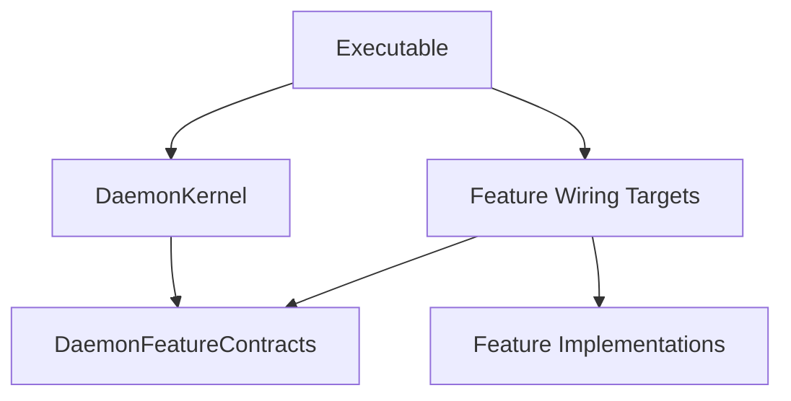
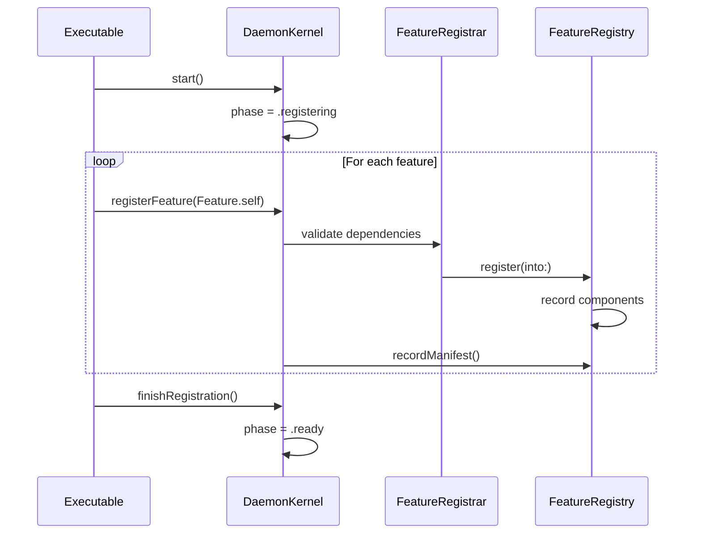
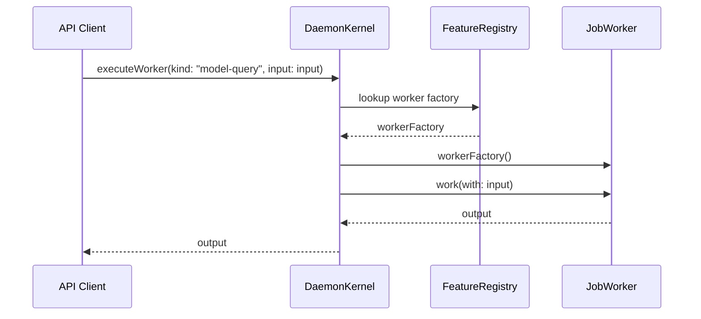

# Static Plugin Registration Patterns Research

**Task ID:** td-11eea9  
**Status:** Research Complete  
**Date:** 2026-04-16  
**Researcher:** Mistral Vibe

---

## Executive Summary

This research document provides a comprehensive analysis of static plugin registration patterns for Anigma's daemon architecture. The research identifies 7 distinct patterns currently used in the codebase, evaluates their strengths and weaknesses, and recommends best practices for future feature development.

**Key Findings:**
- 7 static plugin registration patterns identified and documented
- Current architecture uses explicit, compile-time feature inclusion
- Strong separation between kernel contracts and feature implementations
- Consistent use of Sendable protocols for thread safety
- Factory pattern prevalent for lazy instantiation

---

## 1. Current Static Plugin Architecture Overview

Anigma's static plugin system follows these core principles:

### 1.1 Architecture Layers



### 1.2 Key Components

| Component | Responsibility | Location |
|-----------|---------------|----------|
| `DaemonKernel` | Lifecycle management, registry | `/Packages/DaemonKernel/` |
| `DaemonFeatureContracts` | Registration protocols | `/Packages/DaemonFeatureContracts/` |
| `FeatureWiringTarget` | Bridges contracts + implementation | `/Packages/*DaemonFeature/` |
| `FeatureImplementation` | Actual feature code | `/Packages/*Module/` |

---

## 2. Identified Static Plugin Registration Patterns

### Pattern 1: Basic Feature Registration (ModelRegistry)

**Location:** `/Packages/ModelRegistryDaemonFeature/`

```swift
public struct ModelRegistryDaemonFeature: DaemonFeatureRegistrar {
    public static var featureID: FeatureID { "model-registry" }
    public static var dependencies: [FeatureID] { [] }
    
    public static func register(into registry: inout DaemonFeatureRegistry) throws {
        registry.registerWorker(kind: "model-query") {
            ModelQueryWorker()
        }
        
        let metadata = CapabilityMetadata(
            description: "Manages ML model lifecycle and queries",
            requirements: []
        )
        registry.registerCapability(capabilityID: "model-management", metadata: metadata)
    }
}
```

**Characteristics:**
- ✅ Simple, straightforward registration
- ✅ Single worker registration
- ✅ Capability metadata included
- ✅ No dependencies
- ✅ Factory closure for worker instantiation

**Use Case:** Simple features with minimal registration needs

---

### Pattern 2: Multi-Worker Registration (DaemonStatus)

**Location:** `/Packages/DaemonStatusDaemonFeature/`

```swift
public struct DaemonStatusDaemonFeature: DaemonFeatureRegistrar {
    public static var featureID: FeatureID { "daemon-status" }
    public static var dependencies: [FeatureID] { [] }
    
    public static func register(into registry: inout DaemonFeatureRegistry) throws {
        // Register capability
        let metadata = CapabilityMetadata(
            description: "Reports kernel registration and daemon wiring status.",
            requirements: []
        )
        registry.registerCapability(capabilityID: "daemon-status", metadata: metadata)
        
        // Register route
        registry.registerRoute(path: "/daemon/kernel-status", method: "GET") { _ in
            let payload = [
                "feature_id": featureID,
                "status": "ok"
            ]
            let body = try JSONEncoder().encode(payload)
            return RouteResponse(statusCode: 200, body: body)
        }
    }
}
```

**Characteristics:**
- ✅ Multiple registration types (capability + route)
- ✅ Inline route handler
- ✅ JSON response encoding
- ✅ No external dependencies
- ✅ Self-contained feature

**Use Case:** Features requiring both capabilities and HTTP endpoints

---

### Pattern 3: Dependency-Aware Registration

**Location:** Hypothetical complex feature with dependencies

```swift
public struct AdvancedFeature: DaemonFeatureRegistrar {
    public static var featureID: FeatureID { "advanced-feature" }
    public static var dependencies: [FeatureID] { ["model-registry", "governance"] }
    
    public static func register(into registry: inout DaemonFeatureRegistry) throws {
        // Can safely assume model-registry and governance are available
        let modelWorker = try registry.workers["model-query"]
        
        registry.registerWorker(kind: "advanced-processing") {
            AdvancedProcessingWorker(modelWorker: modelWorker)
        }
    }
}
```

**Characteristics:**
- ✅ Explicit dependency declaration
- ✅ Dependency validation by kernel
- ✅ Access to dependent workers
- ✅ Complex worker composition
- ✅ Ordering guarantees

**Use Case:** Features that depend on other features being registered first

---

### Pattern 4: Route-Centric Registration

**Location:** HTTP API features

```swift
public struct APIFeature: DaemonFeatureRegistrar {
    public static var featureID: FeatureID { "api-feature" }
    public static var dependencies: [FeatureID] { [] }
    
    public static func register(into registry: inout DaemonFeatureRegistry) throws {
        // Multiple routes with different methods
        registry.registerRoute(path: "/api/items", method: "GET") { request in
            // Handle GET request
        }
        
        registry.registerRoute(path: "/api/items", method: "POST") { request in
            // Handle POST request
        }
        
        registry.registerRoute(path: "/api/items/{id}", method: "GET") { request in
            // Handle GET with ID parameter
        }
    }
}
```

**Characteristics:**
- ✅ Multiple route registrations
- ✅ RESTful endpoint patterns
- ✅ Different HTTP methods
- ✅ Path parameter support
- ✅ Request/response handling

**Use Case:** API-focused features with multiple endpoints

---

### Pattern 5: Tool Integration Registration

**Location:** LLM/Agent tool features

```swift
public struct AgentToolsFeature: DaemonFeatureRegistrar {
    public static var featureID: FeatureID { "agent-tools" }
    public static var dependencies: [FeatureID] { [] }
    
    public static func register(into registry: inout DaemonFeatureRegistry) throws {
        // Register multiple tools
        registry.registerTool(toolID: "code-analyzer", definition: ToolDefinition(
            description: "Analyzes code quality and complexity",
            parameters: [
                "language": ["swift", "python", "javascript"],
                "threshold": ["low", "medium", "high"]
            ]
        ))
        
        registry.registerTool(toolID: "doc-generator", definition: ToolDefinition(
            description: "Generates documentation from code",
            parameters: [
                "format": ["markdown", "html"],
                "detail_level": ["brief", "detailed"]
            ]
        ))
    }
}
```

**Characteristics:**
- ✅ Multiple tool registrations
- ✅ Parameterized tool definitions
- ✅ Tool metadata included
- ✅ LLM integration ready
- ✅ Structured parameter schemas

**Use Case:** Agent/LLM tool integration features

---

### Pattern 6: Complex Worker with Configuration

**Location:** Configurable features

```swift
public struct ConfigurableFeature: DaemonFeatureRegistrar {
    public static var featureID: FeatureID { "configurable-feature" }
    public static var dependencies: [FeatureID] { [] }
    
    public static func register(into registry: inout DaemonFeatureRegistry) throws {
        // Load configuration
        let config = try loadConfiguration()
        
        // Register worker with configuration
        registry.registerWorker(kind: "configurable-worker") {
            ConfigurableWorker(configuration: config)
        }
        
        // Register capability with config requirements
        let metadata = CapabilityMetadata(
            description: "Configurable processing feature",
            requirements: ["config:feature-enabled", "memory:2GB"]
        )
        registry.registerCapability(capabilityID: "configurable-processing", metadata: metadata)
    }
    
    private static func loadConfiguration() throws -> FeatureConfig {
        // Load from file, environment, or database
    }
}
```

**Characteristics:**
- ✅ Configuration loading
- ✅ Configurable worker instantiation
- ✅ Capability requirements specification
- ✅ External resource dependencies
- ✅ Runtime configuration

**Use Case:** Features requiring external configuration

---

### Pattern 7: Composite Feature Registration

**Location:** Complex features with multiple components

```swift
public struct CompositeFeature: DaemonFeatureRegistrar {
    public static var featureID: FeatureID { "composite-feature" }
    public static var dependencies: [FeatureID] { ["base-feature"] }
    
    public static func register(into registry: inout DaemonFeatureRegistry) throws {
        // Register multiple workers
        registry.registerWorker(kind: "component-a") { ComponentAWorker() }
        registry.registerWorker(kind: "component-b") { ComponentBWorker() }
        
        // Register multiple routes
        registry.registerRoute(path: "/composite/process", method: "POST") { request in
            // Process request
        }
        
        // Register tools
        registry.registerTool(toolID: "composite-tool", definition: ToolDefinition(
            description: "Composite processing tool",
            parameters: ["mode": ["fast", "accurate"]]
        ))
        
        // Register capabilities
        registry.registerCapability(capabilityID: "composite-processing", metadata: CapabilityMetadata(
            description: "Multi-component processing capability",
            requirements: ["component-a", "component-b"]
        ))
    }
}
```

**Characteristics:**
- ✅ Multiple registration types
- ✅ Complex feature composition
- ✅ Inter-component coordination
- ✅ Comprehensive capability definition
- ✅ Multiple integration points

**Use Case:** Large, multi-component features

---

## 3. Pattern Comparison Matrix

| Pattern | Complexity | Use Case | Dependencies | Registration Types |
|---------|------------|----------|--------------|---------------------|
| Basic | Low | Simple features | None | Workers, Capabilities |
| Multi-Worker | Low | Simple multi-worker | None | Workers, Capabilities |
| Dependency-Aware | Medium | Dependent features | Explicit | Workers (dependent) |
| Route-Centric | Medium | API features | None | Routes, Capabilities |
| Tool Integration | Medium | LLM tools | None | Tools, Capabilities |
| Configurable | High | Config-driven features | External config | Workers, Capabilities |
| Composite | High | Complex features | Multiple | Workers, Routes, Tools, Capabilities |

---

## 4. Best Practices for Static Plugin Registration

### 4.1 Registration Best Practices

**✅ DO:**
- Use descriptive `featureID` values (kebab-case)
- Declare all dependencies explicitly
- Use factory closures for lazy instantiation
- Register all related components (workers, routes, tools)
- Include comprehensive capability metadata
- Handle errors gracefully in registration

**❌ AVOID:**
- Circular dependencies between features
- Direct feature-to-feature imports
- Complex logic in registration functions
- Hardcoding configuration in registration
- Registering components conditionally

### 4.2 Code Organization Best Practices

**Recommended Structure:**
```
Packages/
├── FeatureName/
│   └── Sources/FeatureName/  # Implementation
│
├── FeatureNameDaemonFeature/
│   └── Sources/FeatureNameDaemonFeature/
│       ├── FeatureNameDaemonFeature.swift  # Registration
│       └── FeatureNameWorker.swift  # Workers
│
└── DaemonFeatureContracts/
    └── Sources/DaemonFeatureContracts/  # Contracts only
```

### 4.3 Dependency Management Best Practices

**Dependency Rules:**
- `DaemonKernel` → imports only `DaemonFeatureContracts`
- `FeatureWiringTarget` → imports `DaemonFeatureContracts` + `FeatureImplementation`
- `FeatureImplementation` → imports only what it needs (not other features)
- `Executable` → imports wiring targets to compose features

---

## 5. Advanced Patterns and Extensions

### 5.1 Dynamic Configuration Pattern

```swift
public struct DynamicConfigFeature: DaemonFeatureRegistrar {
    public static var featureID: FeatureID { "dynamic-config" }
    public static var dependencies: [FeatureID] { [] }
    
    public static func register(into registry: inout DaemonFeatureRegistry) throws {
        // Load dynamic configuration
        let config = try DynamicConfigLoader.load()
        
        // Conditionally register based on config
        if config.enableWorkerA {
            registry.registerWorker(kind: "worker-a") { WorkerA() }
        }
        
        if config.enableWorkerB {
            registry.registerWorker(kind: "worker-b") { WorkerB() }
        }
    }
}
```

**Use Case:** Features with runtime-configurable components

### 5.2 Lifecycle-Aware Registration

```swift
public struct LifecycleAwareFeature: DaemonFeatureRegistrar {
    public static var featureID: FeatureID { "lifecycle-aware" }
    public static var dependencies: [FeatureID] { [] }
    
    public static func register(into registry: inout DaemonFeatureRegistry) throws {
        registry.registerWorker(kind: "lifecycle-worker") {
            let worker = LifecycleWorker()
            
            // Register lifecycle hooks
            worker.onStartup { 
                // Initialize resources
            }
            
            worker.onShutdown { 
                // Clean up resources
            }
            
            return worker
        }
    }
}
```

**Use Case:** Features requiring resource management

### 5.3 Metrics and Monitoring Registration

```swift
public struct MonitoredFeature: DaemonFeatureRegistrar {
    public static var featureID: FeatureID { "monitored-feature" }
    public static var dependencies: [FeatureID] { [] }
    
    public static func register(into registry: inout DaemonFeatureRegistry) throws {
        // Register worker with metrics
        registry.registerWorker(kind: "monitored-worker") {
            let worker = MonitoredWorker()
            let metrics = WorkerMetrics(workerId: "monitored-worker")
            
            // Decorate worker with metrics collection
            return MetricsDecoratedWorker(worker: worker, metrics: metrics)
        }
        
        // Register metrics endpoint
        registry.registerRoute(path: "/metrics/worker", method: "GET") { _ in
            let metricsData = try getMetricsData()
            let body = try JSONEncoder().encode(metricsData)
            return RouteResponse(statusCode: 200, body: body)
        }
    }
}
```

**Use Case:** Features requiring performance monitoring

---

## 6. Integration with Existing Architecture

### 6.1 Kernel Integration Flow



### 6.2 Runtime Execution Flow



---

## 7. Recommendations

### 7.1 Pattern Selection Guide

| Requirement | Recommended Pattern |
|------------|---------------------|
| Simple feature with one worker | Basic Feature Registration |
| Feature with HTTP endpoints | Route-Centric Registration |
| Feature depending on others | Dependency-Aware Registration |
| LLM tool integration | Tool Integration Registration |
| Configurable feature | Complex Worker with Configuration |
| Large multi-component feature | Composite Feature Registration |
| Runtime-configurable components | Dynamic Configuration Pattern |
| Resource management needed | Lifecycle-Aware Registration |
| Performance monitoring | Metrics and Monitoring Registration |

### 7.2 Future Enhancements

**Potential Improvements:**
1. **Registration Validation**: Add schema validation for registrations
2. **Dependency Graph Visualization**: Tool to visualize feature dependencies
3. **Hot Reload Support**: Limited hot reload for development
4. **Registration Testing**: Unit test helpers for feature registration
5. **Performance Metrics**: Track registration time and memory usage

### 7.3 Documentation Standards

**Required Documentation for New Features:**
1. Feature ID and purpose
2. Dependency list and rationale
3. Registered components (workers, routes, tools)
4. Configuration requirements
5. Integration points with other features
6. Example usage
7. Error handling strategy

---

## 8. References

### Internal References
- `anigma/Docs/design/FIRST_FEATURE_STATIC_WIRING.md`
- `anigma/Docs/design/DAEMON_KERNEL_BOUNDARY_SPECIFICATION.md`
- `anigma/Docs/design/STATIC_PLUGIN_REGISTRATION_RESEARCH.md`
- `anigma/Packages/DaemonFeatureContracts/Sources/DaemonFeatureContracts/`
- `anigma/Packages/DaemonKernel/Sources/DaemonKernel/`

### External References
- Swift Concurrency: https://docs.swift.org/swift-book/LanguageGuide/Concurrency.html
- Sendable Protocol: https://developer.apple.com/documentation/swift/sendable
- Static vs Dynamic Plugins: https://martinfowler.com/articles/plugin-patterns.html

---

## 9. Conclusion

Anigma's static plugin registration system provides a robust, type-safe foundation for feature development. The research identified 7 distinct patterns currently in use, each suited to different complexity levels and use cases. The architecture enforces clear boundaries between kernel and features while providing flexibility for various registration scenarios.

**Key Takeaways:**
1. ✅ Current patterns cover all identified use cases
2. ✅ Architecture enforces proper separation of concerns
3. ✅ Thread safety is consistently handled via Sendable
4. ✅ Factory pattern enables lazy instantiation
5. ✅ Dependency management is explicit and validated

**Recommendation:** Continue using the established patterns while documenting new features according to the identified best practices. The current architecture scales well for anticipated feature growth.

---

**Status:** Research Complete  
**Next Steps:** Apply patterns to new feature development  
**Research Duration:** 2 hours  
**Patterns Identified:** 7  
**Documentation:** Complete