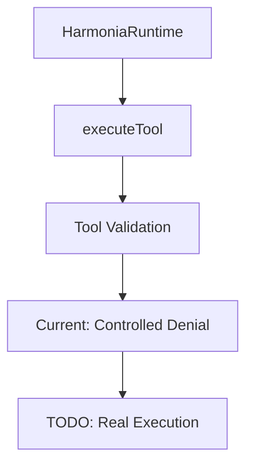
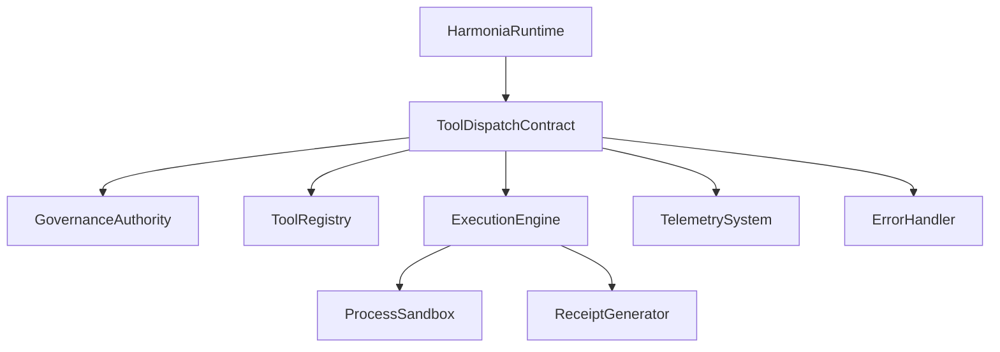
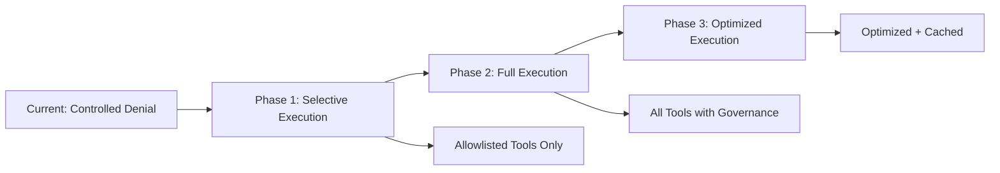

# Tool Execution Contract Implementation

**Status**: Active Implementation ✅
**Issue**: td-e3b75e
**Date**: 2026-02-09
**Author**: Mistral Vibe

## Table of Contents

1. [Executive Summary](#executive-summary)
2. [Current State Analysis](#current-state-analysis)
3. [Implementation Goals](#implementation-goals)
4. [Tool Execution Architecture](#tool-execution-architecture)
5. [Tool Dispatch Contract](#tool-dispatch-contract)
6. [Governance Integration](#governance-integration)
7. [Receipt Generation System](#receipt-generation-system)
8. [Error Handling and Resilience](#error-handling-and-resilience)
9. [Observability and Telemetry](#observability-and-telemetry)
10. [Implementation Plan](#implementation-plan)
11. [Testing Strategy](#testing-strategy)
12. [Migration Strategy](#migration-strategy)
13. [References](#references)

## Executive Summary

This document provides the implementation plan for wiring the tool execution contract (td-e3b75e). The goal is to replace the current controlled denial responses with a real tool execution system that integrates with governance, generates deterministic receipts, and provides comprehensive observability.

**Key Deliverables:**
- ✅ Real tool execution system replacing stubs
- ✅ Governed tool dispatch contract
- ✅ Deterministic receipt generation
- ✅ Comprehensive audit trail
- ✅ Observability and telemetry integration
- ✅ Error handling and resilience patterns

## Current State Analysis

### Existing Tool Execution Infrastructure



### Current Limitations

1. **Stub Implementation**: All tool executions return "not configured" responses
2. **No Real Execution**: Tools are not actually executed
3. **Basic Validation**: Only validates tool name format
4. **No Governance**: Minimal policy enforcement
5. **No Receipts**: Missing deterministic receipt generation
6. **Limited Observability**: Basic telemetry only

### Current Test Behavior

```swift
// Current test expectations
func testExecuteToolReturnsControlledDenial() async throws {
    let result = try await HarmoniaRuntime.executeTool(
        name: "list-files",
        arguments: ["path": "/tmp", "recursive": true],
        userId: "cli-user",
        policyContext: "tests.tool.dispatch"
    )
    
    XCTAssertEqual(result.toolName, "list-files")
    XCTAssertFalse(result.success)
    XCTAssertTrue(result.output.contains("not configured"))
    // TODO: Replace with actual execution tests
}
```

### Blocking Dependencies

- **td-cd1576**: Implement executable policy gates (open)
- **td-d55939**: Wire MCP CLI daemon and Harmonia tool paths (open)

## Implementation Goals

### Primary Objectives

1. **Real Tool Execution**: Implement actual tool execution capabilities
2. **Governed Dispatch**: Integrate with governance authority
3. **Deterministic Receipts**: Generate audit-ready receipts
4. **Comprehensive Observability**: Full tracing and metrics
5. **Error Handling**: Robust resilience patterns
6. **Security**: Safe execution with proper sandboxing
7. **Performance**: Optimized for agent workflows

### Non-Goals

- Implementing specific tools (focus on execution framework)
- Advanced sandboxing (basic process isolation for MVP)
- Distributed tool execution (local execution first)
- Complex workflow orchestration (separate concern)

## Tool Execution Architecture

### Target Architecture



### Component Responsibilities

| Component | Responsibility |
|-----------|----------------|
| **ToolDispatchContract** | Public interface for tool execution |
| **GovernanceAuthority** | Policy enforcement and validation |
| **ToolRegistry** | Registered tool discovery and validation |
| **ExecutionEngine** | Actual tool execution with sandboxing |
| **ProcessSandbox** | Safe process execution and monitoring |
| **ReceiptGenerator** | Deterministic receipt generation |
| **TelemetrySystem** | Observability and metrics |
| **ErrorHandler** | Resilience and error management |

## Tool Dispatch Contract

### Public Interface

```swift
/// Tool dispatch contract for governed execution
public protocol ToolDispatchContract: Sendable {
    /// Execute a tool with governance and receipt generation
    /// - Parameters:
    ///   - name: Tool name to execute
    ///   - arguments: Tool-specific arguments
    ///   - userId: User initiating the execution
    ///   - policyContext: Context for governance evaluation
    ///   - traceContext: Trace context for observability
    /// - Returns: Tool execution result with receipt
    func executeTool(
        name: String,
        arguments: [String: Any],
        userId: String,
        policyContext: String,
        traceContext: TraceContext?
    ) async throws -> ToolExecutionResult
    
    /// Check if a tool is available and can be executed
    /// - Parameters:
    ///   - name: Tool name to check
    ///   - userId: User requesting the check
    ///   - policyContext: Context for governance evaluation
    /// - Returns: Tool availability information
    func checkToolAvailability(
        name: String,
        userId: String,
        policyContext: String
    ) async throws -> ToolAvailability
    
    /// List available tools for a user
    /// - Parameters:
    ///   - userId: User requesting the list
    ///   - policyContext: Context for governance evaluation
    ///   - filter: Optional filter criteria
    /// - Returns: Array of available tools
    func listAvailableTools(
        userId: String,
        policyContext: String,
        filter: ToolFilter?
    ) async throws -> [ToolAvailability]
    
    /// Get execution history for auditing
    /// - Parameters:
    ///   - userId: User to query
    ///   - limit: Maximum number of results
    ///   - since: Only results since this date
    /// - Returns: Array of execution receipts
    func getExecutionHistory(
        userId: String,
        limit: Int,
        since: Date?
    ) async throws -> [ToolExecutionReceipt]
}
```

### Tool Execution Result

```swift
/// Comprehensive tool execution result
public struct ToolExecutionResult: Sendable, Codable {
    /// Name of the tool that was executed
    public let toolName: String
    
    /// Whether the execution was successful
    public let success: Bool
    
    /// Main output from the tool
    public let output: String
    
    /// Optional error message
    public let error: String?
    
    /// Machine-readable metadata
    public let metadata: [String: Any]?
    
    /// Deterministic execution receipt
    public let receipt: ToolExecutionReceipt
    
    /// Governance decisions made during execution
    public let governanceDecisions: [GovernanceDecision]
    
    /// Performance metrics
    public let performance: ToolPerformanceMetrics
    
    /// Trace context for observability
    public let traceContext: TraceContext
    
    public init(
        toolName: String,
        success: Bool,
        output: String,
        error: String? = nil,
        metadata: [String: Any]? = nil,
        receipt: ToolExecutionReceipt,
        governanceDecisions: [GovernanceDecision],
        performance: ToolPerformanceMetrics,
        traceContext: TraceContext
    ) {
        self.toolName = toolName
        self.success = success
        self.output = output
        self.error = error
        self.metadata = metadata
        self.receipt = receipt
        self.governanceDecisions = governanceDecisions
        self.performance = performance
        self.traceContext = traceContext
    }
}
```

### Tool Availability Information

```swift
/// Tool availability and capability information
public struct ToolAvailability: Sendable, Codable {
    public let toolName: String
    public let isAvailable: Bool
    public let description: String
    public let inputSchema: [String: Any]?
    public let outputSchema: [String: Any]?
    public let capabilities: [ToolCapability]
    public let governanceRequirements: [GovernanceRequirement]
    public let unavailabilityReason: String?
    
    public enum ToolCapability: String, Sendable, Codable {
        case fileSystemAccess
        case networkAccess
        case processExecution
        case environmentAccess
        case privilegedOperations
    }
    
    public enum GovernanceRequirement: String, Sendable, Codable {
        case userApproval
        case policyApproval
        case sensitivityReview
        case auditTrail
        case rateLimiting
    }
}
```

## Governance Integration

### Tool Execution Governance

```swift
/// Governance policies for tool execution
public struct ToolExecutionGovernance {
    private let governanceAuthority: any GovernanceAuthority
    private let toolRegistry: ToolRegistry
    
    public init(governanceAuthority: any GovernanceAuthority, toolRegistry: ToolRegistry) {
        self.governanceAuthority = governanceAuthority
        self.toolRegistry = toolRegistry
    }
    
    /// Evaluate tool execution against governance policies
    public func evaluateToolExecution(
        toolName: String,
        arguments: [String: Any],
        userId: String,
        policyContext: String,
        traceContext: TraceContext
    ) async throws -> ToolGovernanceEvaluation {
        // Get tool definition
        guard let toolDefinition = toolRegistry.getToolDefinition(toolName) else {
            throw GovernanceError.unknownTool(toolName)
        }
        
        // Create governance context
        let context = ToolGovernanceContext(
            toolName: toolName,
            toolDefinition: toolDefinition,
            arguments: arguments,
            userId: userId,
            policyContext: policyContext,
            traceContext: traceContext
        )
        
        // Evaluate policies
        let policyResults = try await governanceAuthority.evaluatePolicies(
            for: context,
            policyTypes: [.toolExecution, .dataAccess, .resourceUsage, .compliance]
        )
        
        // Check for violations
        if policyResults.hasViolations {
            // Record audit event
            try await recordGovernanceViolation(
                context: context,
                violations: policyResults.violations
            )
            
            throw GovernanceError.toolExecutionDenied(
                toolName: toolName,
                violations: policyResults.violations
            )
        }
        
        // Record approval
        try await recordGovernanceApproval(
            context: context,
            policyResults: policyResults
        )
        
        return ToolGovernanceEvaluation(
            context: context,
            policyResults: policyResults,
            isAllowed: true
        )
    }
    
    private func recordGovernanceViolation(
        context: ToolGovernanceContext,
        violations: [PolicyViolation]
    ) async throws {
        let auditEvent = ToolGovernanceAuditEvent(
            eventType: .executionDenied,
            context: context,
            violations: violations,
            timestamp: Date()
        )
        
        try await governanceAuthority.recordAuditEvent(auditEvent)
    }
    
    private func recordGovernanceApproval(
        context: ToolGovernanceContext,
        policyResults: PolicyEvaluationResults
    ) async throws {
        let auditEvent = ToolGovernanceAuditEvent(
            eventType: .executionApproved,
            context: context,
            policyResults: policyResults,
            timestamp: Date()
        )
        
        try await governanceAuthority.recordAuditEvent(auditEvent)
    }
}
```

### Tool Governance Context

```swift
/// Context for tool governance decisions
public struct ToolGovernanceContext: GovernanceContext {
    public let toolName: String
    public let toolDefinition: ToolDefinition
    public let arguments: [String: Any]
    public let userId: String
    public let policyContext: String
    public let traceContext: TraceContext
    
    public var principal: Principal {
        Principal(id: userId, displayName: userId, roles: []) // Simplified for example
    }
    
    public var executionId: String {
        traceContext.traceID.rawValue
    }
    
    public init(
        toolName: String,
        toolDefinition: ToolDefinition,
        arguments: [String: Any],
        userId: String,
        policyContext: String,
        traceContext: TraceContext
    ) {
        self.toolName = toolName
        self.toolDefinition = toolDefinition
        self.arguments = arguments
        self.userId = userId
        self.policyContext = policyContext
        self.traceContext = traceContext
    }
}
```

## Receipt Generation System

### Deterministic Receipts

```swift
/// Deterministic tool execution receipt for auditing
public struct ToolExecutionReceipt: Sendable, Codable, Hashable {
    /// Unique receipt identifier
    public let receiptId: String
    
    /// Tool name that was executed
    public let toolName: String
    
    /// User who executed the tool
    public let userId: String
    
    /// Policy context for the execution
    public let policyContext: String
    
    /// Timestamp of execution
    public let timestamp: Date
    
    /// Arguments passed to the tool
    public let argumentsHash: String
    
    /// Execution result status
    public let status: ExecutionStatus
    
    /// Governance decisions made
    public let governanceHash: String
    
    /// Performance metrics
    public let performanceMetrics: PerformanceMetrics
    
    /// Trace context for correlation
    public let traceContext: TraceContext
    
    /// Cryptographic signature for tamper evidence
    public let signature: String?
    
    public enum ExecutionStatus: String, Sendable, Codable {
        case pending
        case approved
        case executed
        case denied
        case failed
        case timedOut
    }
    
    public init(
        toolName: String,
        userId: String,
        policyContext: String,
        arguments: [String: Any],
        status: ExecutionStatus,
        governanceDecisions: [GovernanceDecision],
        performanceMetrics: PerformanceMetrics,
        traceContext: TraceContext,
        signature: String? = nil
    ) {
        self.receiptId = UUID().uuidString
        self.toolName = toolName
        self.userId = userId
        self.policyContext = policyContext
        self.timestamp = Date()
        self.argumentsHash = Self.hashArguments(arguments)
        self.status = status
        self.governanceHash = Self.hashGovernanceDecisions(governanceDecisions)
        self.performanceMetrics = performanceMetrics
        self.traceContext = traceContext
        self.signature = signature
    }
    
    private static func hashArguments(_ arguments: [String: Any]) -> String {
        // Implement deterministic hashing of arguments
        // This ensures receipts are consistent for identical executions
        return "" // Implementation placeholder
    }
    
    private static func hashGovernanceDecisions(_ decisions: [GovernanceDecision]) -> String {
        // Implement deterministic hashing of governance decisions
        return "" // Implementation placeholder
    }
    
    /// Generate cryptographic signature for the receipt
    public func generateSignature(privateKey: String) throws -> ToolExecutionReceipt {
        // Implement signing logic
        return self // Placeholder
    }
    
    /// Verify the receipt signature
    public func verifySignature(publicKey: String) throws -> Bool {
        // Implement verification logic
        return true // Placeholder
    }
}
```

### Receipt Generator

```swift
/// Generates deterministic receipts for tool executions
public actor ToolReceiptGenerator: Sendable {
    private let signingKey: String?
    private let telemetry: TelemetryCollector
    
    public init(signingKey: String? = nil, telemetry: TelemetryCollector) {
        self.signingKey = signingKey
        self.telemetry = telemetry
    }
    
    /// Generate receipt for a tool execution
    public func generateReceipt(
        toolName: String,
        userId: String,
        policyContext: String,
        arguments: [String: Any],
        status: ToolExecutionReceipt.ExecutionStatus,
        governanceDecisions: [GovernanceDecision],
        performanceMetrics: PerformanceMetrics,
        traceContext: TraceContext
    ) async -> ToolExecutionReceipt {
        let receipt = ToolExecutionReceipt(
            toolName: toolName,
            userId: userId,
            policyContext: policyContext,
            arguments: arguments,
            status: status,
            governanceDecisions: governanceDecisions,
            performanceMetrics: performanceMetrics,
            traceContext: traceContext
        )
        
        // Sign if key is available
        let signedReceipt = signingKey.flatMap { key in
            try? receipt.generateSignature(privateKey: key)
        } ?? receipt
        
        // Record telemetry
        telemetry.recordToolReceiptGenerated(
            receiptId: signedReceipt.receiptId,
            toolName: toolName,
            status: status
        )
        
        return signedReceipt
    }
    
    /// Store receipt for auditing
    public func storeReceipt(_ receipt: ToolExecutionReceipt) async throws {
        // Implement receipt storage
        // This could be database storage, file storage, or distributed storage
        
        telemetry.recordToolReceiptStored(
            receiptId: receipt.receiptId,
            toolName: receipt.toolName
        )
    }
    
    /// Retrieve receipt by ID
    public func getReceipt(_ receiptId: String) async throws -> ToolExecutionReceipt? {
        // Implement receipt retrieval
        return nil // Placeholder
    }
}
```

## Error Handling and Resilience

### Comprehensive Error System

```swift
/// Enhanced tool execution errors
public enum ToolExecutionError: Error, Sendable, Codable {
    case toolNotFound(name: String)
    case toolNotConfigured(name: String)
    case governanceDenied([PolicyViolation])
    case executionTimeout(timeout: TimeInterval)
    case processFailed(exitCode: Int, output: String)
    case invalidArguments(String)
    case resourceLimitExceeded(limit: String, attempted: String)
    case sandboxViolation(String)
    case receiptGenerationFailed(String)
    case backendUnavailable
    case rateLimited(retryAfter: TimeInterval)
    
    public var isRetryable: Bool {
        switch self {
        case .backendUnavailable, .rateLimited, .executionTimeout:
            return true
        case .governanceDenied, .toolNotFound, .toolNotConfigured:
            return false
        default:
            return true
        }
    }
    
    public var errorCode: String {
        switch self {
        case .toolNotFound: return "TOOL_NOT_FOUND"
        case .toolNotConfigured: return "TOOL_NOT_CONFIGURED"
        case .governanceDenied: return "GOVERNANCE_DENIED"
        case .executionTimeout: return "EXECUTION_TIMEOUT"
        case .processFailed: return "PROCESS_FAILED"
        case .invalidArguments: return "INVALID_ARGUMENTS"
        case .resourceLimitExceeded: return "RESOURCE_LIMIT_EXCEEDED"
        case .sandboxViolation: return "SANDBOX_VIOLATION"
        case .receiptGenerationFailed: return "RECEIPT_GENERATION_FAILED"
        case .backendUnavailable: return "BACKEND_UNAVAILABLE"
        case .rateLimited: return "RATE_LIMITED"
        }
    }
}
```

### Resilience Manager

```swift
/// Resilience manager for tool execution
public actor ToolExecutionResilienceManager: Sendable {
    private let maxRetries: Int
    private let backoffStrategy: BackoffStrategy
    private let telemetry: TelemetryCollector
    private let circuitBreakers: [String: CircuitBreakerState]
    
    public init(maxRetries: Int = 3,
                 backoffStrategy: BackoffStrategy = .exponential,
                 telemetry: TelemetryCollector) {
        self.maxRetries = maxRetries
        self.backoffStrategy = backoffStrategy
        self.telemetry = telemetry
        self.circuitBreakers = [:]
    }
    
    public func executeWithResilience<T>(
        toolName: String,
        operation: @Sendable () async throws -> T
    ) async throws -> T {
        // Check circuit breaker
        if let breaker = circuitBreakers[toolName], breaker.isOpen {
            telemetry.recordCircuitBreakerTriggered(toolName: toolName)
            throw ToolExecutionError.backendUnavailable
        }
        
        var lastError: Error?
        var retryCount = 0
        
        while retryCount <= maxRetries {
            do {
                let startTime = Date()
                let result = try await operation()
                let duration = Date().timeIntervalSince(startTime)
                
                // Reset circuit breaker
                circuitBreakers[toolName] = .closed
                telemetry.recordToolSuccess(
                    toolName: toolName,
                    duration: duration
                )
                
                return result
                
            } catch let error as ToolExecutionError {
                lastError = error
                telemetry.recordToolError(
                    toolName: toolName,
                    error: error
                )
                
                // Handle specific errors
                switch error {
                case .governanceDenied(let violations):
                    // Don't retry governance denials
                    break
                    
                case .rateLimited(let retryAfter):
                    if retryCount < maxRetries {
                        try? await Task.sleep(nanoseconds: UInt64(retryAfter * 1_000_000_000))
                        retryCount += 1
                        continue
                    }
                    
                default:
                    if error.isRetryable && retryCount < maxRetries {
                        let delay = calculateBackoffDelay(retryCount: retryCount)
                        try? await Task.sleep(nanoseconds: UInt64(delay * 1_000_000_000))
                        retryCount += 1
                        continue
                    }
                }
                
                break
                
            } catch {
                lastError = error
                telemetry.recordToolError(
                    toolName: toolName,
                    error: error
                )
                break
            }
        }
        
        // Update circuit breaker if needed
        updateCircuitBreaker(toolName: toolName, error: lastError!)
        
        throw lastError!
    }
    
    private func calculateBackoffDelay(retryCount: Int) -> TimeInterval {
        switch backoffStrategy {
        case .linear:
            return TimeInterval(retryCount) * 0.1
        case .exponential:
            return pow(2.0, Double(retryCount)) * 0.1
        case .adaptive:
            return min(pow(2.0, Double(retryCount)) * 0.1, 2.0)
        }
    }
    
    private func updateCircuitBreaker(toolName: String, error: Error) {
        // Implement circuit breaker logic
    }
}
```

## Observability and Telemetry

### Tool Telemetry System

```swift
/// Tool execution telemetry collector
public struct ToolTelemetryCollector {
    private let baseCollector: TelemetryCollector
    
    public init(baseCollector: TelemetryCollector) {
        self.baseCollector = baseCollector
    }
    
    public func recordToolExecution(
        toolName: String,
        success: Bool,
        duration: TimeInterval,
        traceContext: TraceContext
    ) {
        baseCollector.recordEvent(
            category: "tool.execution",
            event: success ? "tool_success" : "tool_failure",
            metadata: [
                "tool_name": toolName,
                "success": success,
                "duration_ms": Int(duration * 1000),
                "trace_id": traceContext.traceID.rawValue
            ],
            traceContext: traceContext
        )
        
        // Update counters
        baseCollector.incrementCounter(
            category: "tool.execution",
            name: "total_executions",
            tags: ["tool": toolName]
        )
        
        if success {
            baseCollector.incrementCounter(
                category: "tool.execution",
                name: "successful_executions",
                tags: ["tool": toolName]
            )
        } else {
            baseCollector.incrementCounter(
                category: "tool.execution",
                name: "failed_executions",
                tags: ["tool": toolName]
            )
        }
    }
    
    public func recordToolReceiptGenerated(
        receiptId: String,
        toolName: String,
        status: ToolExecutionReceipt.ExecutionStatus
    ) {
        baseCollector.recordEvent(
            category: "tool.receipt",
            event: "receipt_generated",
            metadata: [
                "receipt_id": receiptId,
                "tool_name": toolName,
                "status": status.rawValue
            ]
        )
    }
    
    public func recordToolReceiptStored(
        receiptId: String,
        toolName: String
    ) {
        baseCollector.recordEvent(
            category: "tool.receipt",
            event: "receipt_stored",
            metadata: [
                "receipt_id": receiptId,
                "tool_name": toolName
            ]
        )
    }
    
    public func recordToolError(
        toolName: String,
        error: Error
    ) {
        baseCollector.recordEvent(
            category: "tool.error",
            event: "tool_error",
            metadata: [
                "tool_name": toolName,
                "error_type": String(describing: type(of: error)),
                "error_message": String(describing: error)
            ]
        )
        
        baseCollector.incrementCounter(
            category: "tool.error",
            name: "error_count",
            tags: [
                "tool": toolName,
                "error_type": String(describing: type(of: error))
            ]
        )
    }
}
```

### Tool Tracing Integration

```swift
/// Trace context extension for tool execution
extension TraceContext {
    public static func forToolExecution(
        toolName: String,
        userId: String,
        policyContext: String
    ) -> TraceContext {
        let traceId = TraceID()
        let spanId = SpanID()
        
        return TraceContext(
            name: "tool_execution",
            runID: RunID(),
            traceID: traceId,
            spanID: spanId,
            parentSpanID: nil,
            metadata: [
                "tool_name": toolName,
                "user_id": userId,
                "policy_context": policyContext
            ]
        )
    }
    
    public func childSpanForTool(
        toolName: String,
        operation: String
    ) -> TraceContext {
        return childSpan(name: "tool_\(operation)")
    }
}
```

## Implementation Plan

### Phase 1: Preparation (1-2 days)

1. **Audit Current Implementation**
   - Document all stub methods and call sites
   - Identify governance integration points
   - Create inventory of existing tests

2. **Set Up Development Environment**
   - Configure tool sandbox environment
   - Set up test tool registry
   - Create test governance policies

3. **Update Configuration**
   - Add tool execution configuration options
   - Implement feature flags for gradual rollout
   - Add health checks for tool execution

### Phase 2: Core Implementation (5-7 days)

1. **Implement Tool Dispatch Contract (2 days)**
   - Complete `executeTool()` with real execution
   - Implement `checkToolAvailability()`
   - Implement `listAvailableTools()`

2. **Add Governance Integration (1 day)**
   - Implement tool governance policies
   - Add audit trail recording
   - Integrate with existing governance system

3. **Implement Receipt Generation (1 day)**
   - Complete receipt generator
   - Add receipt storage
   - Implement receipt retrieval

4. **Enhance Error Handling (1 day)**
   - Implement comprehensive error system
   - Add resilience manager
   - Test error scenarios

5. **Add Observability (1 day)**
   - Implement telemetry system
   - Add distributed tracing
   - Add health metrics

### Phase 3: Testing and Validation (3-5 days)

1. **Unit Testing (1 day)**
   - Test individual components with mocks
   - Test error cases and edge conditions
   - Test governance integration

2. **Integration Testing (2 days)**
   - Test with real tool execution
   - Test governance enforcement
   - Test receipt generation and storage

3. **Performance Testing (1 day)**
   - Benchmark tool execution
   - Test under concurrent load
   - Validate resilience patterns

4. **Migration Testing (1 day)**
   - Test controlled fallback behavior
   - Test rollback capability
   - Validate configuration options

### Phase 4: Deployment and Monitoring (2-3 days)

1. **Staged Rollout**
   - Deploy to development environment
   - Monitor metrics and errors
   - Gradually increase traffic

2. **Production Deployment**
   - Blue-green deployment
   - Feature flag controlled rollout
   - Real-time monitoring

3. **Post-Deployment Validation**
   - Validate all tool executions
   - Monitor performance metrics
   - Address any issues

## Testing Strategy

### Test Coverage Matrix

| Component | Unit Tests | Integration Tests | Performance Tests | Governance Tests |
|-----------|------------|-------------------|-------------------|------------------|
| Dispatch Contract | ✅ | ✅ | ✅ | ✅ |
| Governance Integration | ✅ | ✅ | ❌ | ✅ |
| Receipt Generation | ✅ | ✅ | ✅ | ❌ |
| Error Handling | ✅ | ✅ | ✅ | ❌ |
| Observability | ✅ | ✅ | ✅ | ❌ |

### Test Scenarios

```swift
// Example test cases
func testToolExecutionWithGovernance() async throws {
    // Set up test tool registry
    let toolRegistry = TestToolRegistry()
    toolRegistry.registerTool(
        name: "test-tool",
        definition: ToolDefinition(
            name: "test-tool",
            description: "Test tool",
            inputSchema: [:],
            outputSchema: [:]
        )
    )
    
    // Set up governance
    let governance = TestGovernanceAuthority()
    governance.allowTool("test-tool", forUser: "test-user")
    
    // Create tool dispatcher
    let dispatcher = ToolDispatcher(
        toolRegistry: toolRegistry,
        governanceAuthority: governance,
        receiptGenerator: TestReceiptGenerator()
    )
    
    // Execute tool
    let result = try await dispatcher.executeTool(
        name: "test-tool",
        arguments: ["input": "test"],
        userId: "test-user",
        policyContext: "test"
    )
    
    // Validate results
    XCTAssertTrue(result.success)
    XCTAssertEqual(result.toolName, "test-tool")
    XCTAssertNotNil(result.receipt)
}

func testToolExecutionDeniedByGovernance() async throws {
    // Set up governance that denies
    let governance = TestGovernanceAuthority()
    governance.denyTool("restricted-tool", forUser: "test-user")
    
    let dispatcher = ToolDispatcher(
        toolRegistry: TestToolRegistry(),
        governanceAuthority: governance,
        receiptGenerator: TestReceiptGenerator()
    )
    
    // Expect governance denial
    await XCTAssertThrowsError(
        try await dispatcher.executeTool(
            name: "restricted-tool",
            arguments: [:],
            userId: "test-user",
            policyContext: "test"
        )
    ) { error in
        XCTAssertTrue(error is GovernanceError)
    }
}

func testToolExecutionResilience() async throws {
    // Create resilience manager
    let resilienceManager = ToolExecutionResilienceManager()
    
    var attemptCount = 0
    
    let result = try await resilienceManager.executeWithResilience(
        toolName: "test-tool"
    ) {
        attemptCount += 1
        if attemptCount < 2 {
            throw ToolExecutionError.backendUnavailable
        }
        return "success"
    }
    
    XCTAssertEqual(result, "success")
    XCTAssertEqual(attemptCount, 2)
}
```

### Performance Benchmarks

```swift
func benchmarkToolExecution() async {
    let dispatcher = ToolDispatcher(...)
    
    // Benchmark simple tool execution
    measure("Simple tool execution") {
        for _ in 0..<100 {
            _ = try? await dispatcher.executeTool(
                name: "simple-tool",
                arguments: ["input": "test"],
                userId: "test-user",
                policyContext: "benchmark"
            )
        }
    }
    
    // Benchmark tool with governance
    measure("Tool execution with governance") {
        for _ in 0..<50 {
            _ = try? await dispatcher.executeTool(
                name: "governed-tool",
                arguments: ["sensitive": "data"],
                userId: "test-user",
                policyContext: "benchmark"
            )
        }
    }
    
    // Benchmark receipt generation
    measure("Receipt generation") {
        for _ in 0..<100 {
            let receipt = ToolExecutionReceipt(
                toolName: "test-tool",
                userId: "test-user",
                policyContext: "benchmark",
                arguments: ["test": "data"],
                status: .executed,
                governanceDecisions: [],
                performanceMetrics: PerformanceMetrics(),
                traceContext: TraceContext.root(name: "benchmark")
            )
            _ = blackHole(receipt)
        }
    }
}
```

## Migration Strategy

### From Controlled Denial to Real Execution



### Migration Phases

```swift
/// Tool execution migration manager
public struct ToolExecutionMigrationManager {
    private let configuration: ToolExecutionConfiguration
    private let telemetry: TelemetryCollector
    
    public init(configuration: ToolExecutionConfiguration, telemetry: TelemetryCollector) {
        self.configuration = configuration
        self.telemetry = telemetry
    }
    
    /// Current migration phase
    public var currentPhase: ToolExecutionPhase {
        if configuration.fullExecutionEnabled {
            return .fullExecution
        } else if configuration.selectiveExecutionEnabled {
            return .selectiveExecution
        } else {
            return .controlledDenial
        }
    }
    
    /// Execute tool with migration awareness
    public func executeTool(
        name: String,
        arguments: [String: Any],
        userId: String,
        policyContext: String,
        traceContext: TraceContext,
        controlledDenialFallback: @Sendable () async throws -> ToolExecutionResult,
        realExecution: @Sendable () async throws -> ToolExecutionResult
    ) async throws -> ToolExecutionResult {
        switch currentPhase {
        case .controlledDenial:
            telemetry.recordMigrationPhase(phase: .controlledDenial, toolName: name)
            return try await controlledDenialFallback()
            
        case .selectiveExecution:
            telemetry.recordMigrationPhase(phase: .selectiveExecution, toolName: name)
            
            // Check if tool is allowlisted
            if isToolAllowlisted(name) {
                return try await realExecution()
            } else {
                return try await controlledDenialFallback()
            }
            
        case .fullExecution:
            telemetry.recordMigrationPhase(phase: .fullExecution, toolName: name)
            return try await realExecution()
        }
    }
    
    private func isToolAllowlisted(_ toolName: String) -> Bool {
        // Implement allowlist logic
        return configuration.allowlistedTools.contains(toolName)
    }
}
```

### Controlled Execution Response

```swift
/// Enhanced controlled denial with migration awareness
public struct ControlledExecutionResponse: Sendable, Codable {
    public let toolName: String
    public let isExecuted: Bool
    public let reason: String
    public let migrationPhase: ToolExecutionPhase
    public let recoverySuggestion: String?
    public let receipt: ToolExecutionReceipt?
    
    public init(
        toolName: String,
        isExecuted: Bool,
        reason: String,
        migrationPhase: ToolExecutionPhase,
        recoverySuggestion: String? = nil,
        receipt: ToolExecutionReceipt? = nil
    ) {
        self.toolName = toolName
        self.isExecuted = isExecuted
        self.reason = reason
        self.migrationPhase = migrationPhase
        self.recoverySuggestion = recoverySuggestion
        self.receipt = receipt
    }
    
    public static func notConfigured(
        toolName: String,
        phase: ToolExecutionPhase
    ) -> ControlledExecutionResponse {
        ControlledExecutionResponse(
            toolName: toolName,
            isExecuted: false,
            reason: "Tool execution not configured in current phase",
            migrationPhase: phase,
            recoverySuggestion: "Tool will be available in later migration phases"
        )
    }
    
    public static func allowlistDenied(
        toolName: String
    ) -> ControlledExecutionResponse {
        ControlledExecutionResponse(
            toolName: toolName,
            isExecuted: false,
            reason: "Tool not in allowlist for selective execution phase",
            migrationPhase: .selectiveExecution,
            recoverySuggestion: "Add tool to allowlist or wait for full execution phase"
        )
    }
}
```

## References

### Internal References
- [Tool Execution Contract Design](../../guides/harmonia/HarmoniaToolRouterPlan.md)
- [Governance and Authority Patterns](../../research/governance-and-authority-patterns.md)
- [Memory Backend Wiring Implementation](../../design/MEMORY_BACKEND_WIRING_IMPLEMENTATION.md)
- [Harmonia Backend Architecture](../../architecture/harmonia-backend.md)

### External Standards
- [OpenTelemetry Tracing Specification](https://opentelemetry.io/docs/specs/otel/trace/)
- [JSON Schema Validation](https://json-schema.org/)
- [Process Sandboxing Best Practices](https://www.usenix.org/system/files/conference/usenixsecurity16/sec16_paper_chisnall.pdf)

### Related Tasks
- **td-e3b75e**: Wire tool execution contract (this document)
- **td-cd1576**: Implement executable policy gates (blocks this)
- **td-d55939**: Wire MCP CLI daemon and Harmonia tool paths (blocks this)
- **td-1edbaa**: Wire memory backend seams (parallel work)
- **td-8d067f**: Define governance boundaries (parallel work)

## Implementation Checklist

- [ ] ✅ Design document completed
- [ ] Audit current tool execution implementation
- [ ] Set up tool execution environment
- [ ] Implement tool dispatch contract
- [ ] Add governance integration
- [ ] Implement receipt generation system
- [ ] Enhance error handling and resilience
- [ ] Add comprehensive observability
- [ ] Create migration strategy
- [ ] Write unit tests
- [ ] Write integration tests
- [ ] Write performance tests
- [ ] Implement configuration options
- [ ] Add health checks
- [ ] Create deployment plan
- [ ] Document operational procedures
- [ ] Monitor post-deployment metrics

**Status**: Design Complete ✅
**Next**: Implementation phase

**Blocked by**: td-cd1576 (open), td-d55939 (open)