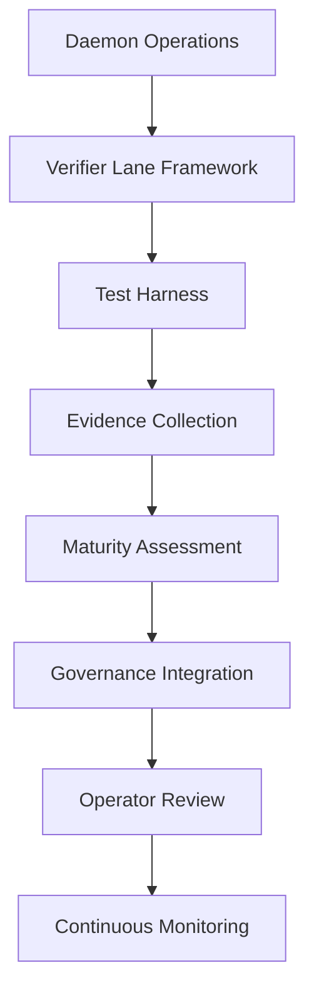

# VERIFIER LANE FRAMEWORK DESIGN

**Issue**: td-a3f900: Design verifier lane framework and test harness
**Status**: Design Complete ✅
**Priority**: P1
**Dependencies**: 
- td-8d067f (Governance boundaries)
- td-433119 (Operator review surface)
- td-3eadfc (Evaluation matrix)

## EXECUTIVE SUMMARY

This design creates a comprehensive verifier lane framework for HarmoniaRuntime, providing systematic verification of agent operations, evidence chains, and governance compliance. The framework enables automated testing, evidence collection, and maturity assessment of daemon operations.

### Key Objectives

1. **Automated Verification**: Systematic testing of daemon operations
2. **Evidence Collection**: Comprehensive evidence trails for all verifications
3. **Maturity Assessment**: Quantitative scoring of daemon capabilities
4. **Governance Integration**: Connect verification with authority chains
5. **Test Harness**: Reusable framework for creating verification suites
6. **Continuous Monitoring**: Integration with operator review surface

### Architecture Overview



## ARCHITECTURE

### Core Components

#### 1. Verifier Lane Framework Interface

```swift
/// Primary interface for verifier lane framework
public protocol VerifierLaneFramework: Sendable {
    /// Runs comprehensive verification suite
    func runVerificationSuite(
        configuration: VerifierLaneConfiguration
    ) async throws -> VerifierLaneBundle
    
    /// Runs specific verification tests
    func runTests(
        testSelection: VerifierTestSelection,
        configuration: VerifierLaneConfiguration
    ) async throws -> [VerifierLaneMatrixDimension]
    
    /// Creates custom verifier lane
    func createVerifierLane(
        laneDefinition: VerifierLaneDefinition
    ) async throws -> VerifierLane
    
    /// Gets verification history
    func getVerificationHistory(
        timeRange: TimeRange,
        filters: VerificationFilters
    ) async throws -> [VerifierLaneBundle]
}
```

#### 2. Verifier Lane Coordinator

```swift
/// Orchestrates verification tests and evidence collection
public actor VerifierLaneCoordinator: Sendable {
    private let evidenceRecorder: VerifierEvidenceRecorder
    private let governanceIntegrator: VerifierGovernanceIntegrator
    private let testRegistry: VerifierTestRegistry
    private let configuration: VerifierLaneConfiguration
    
    public init(
        evidenceRecorder: VerifierEvidenceRecorder,
        governanceIntegrator: VerifierGovernanceIntegrator,
        testRegistry: VerifierTestRegistry,
        configuration: VerifierLaneConfiguration
    ) {
        self.evidenceRecorder = evidenceRecorder
        self.governanceIntegrator = governanceIntegrator
        self.testRegistry = testRegistry
        self.configuration = configuration
    }
    
    /// Runs complete verification suite
    public func runVerificationSuite() async throws -> VerifierLaneBundle {
        // Record verification start
        try await evidenceRecorder.recordVerificationStart()
        
        // Get all registered tests
        let allTests = testRegistry.getAllTests()
        
        // Execute tests with governance
        let dimensions = try await executeTestsWithGovernance(allTests)
        
        // Create final bundle
        let bundle = createVerificationBundle(dimensions: dimensions)
        
        // Record verification completion
        try await evidenceRecorder.recordVerificationCompletion(bundle: bundle)
        
        return bundle
    }
    
    private func executeTestsWithGovernance(
        _ tests: [VerifierTestDefinition]
    ) async throws -> [VerifierLaneMatrixDimension] {
        return try await tests.asyncMap { test in
            // Execute test through governance
            let result = try await governanceIntegrator.executeVerifierTest(
                test: test,
                configuration: configuration
            )
            
            // Record test evidence
            try await evidenceRecorder.recordTestResult(
                test: test,
                result: result
            )
            
            return result.dimension
        }
    }
}
```

#### 3. Test Registry System

```swift
/// Manages available verification tests
public actor VerifierTestRegistry: Sendable {
    private var registeredTests: [String: VerifierTestDefinition] = [:]
    
    public init() {
        // Register built-in tests
        registerBuiltInTests()
    }
    
    /// Register a new test
    public func registerTest(_ test: VerifierTestDefinition) {
        registeredTests[test.id] = test
    }
    
    /// Get all registered tests
    public func getAllTests() -> [VerifierTestDefinition] {
        Array(registeredTests.values)
    }
    
    /// Get test by ID
    public func getTest(id: String) -> VerifierTestDefinition? {
        registeredTests[id]
    }
    
    private func registerBuiltInTests() {
        // Echo test
        registerTest(VerifierTestDefinition(
            id: "echo-check",
            name: "Worker Echo Verification",
            description: "Verifies basic worker communication",
            category: .communication,
            execution: { config in
                try await VerifierTests.runEchoCheck(configuration: config)
            }
        ))
        
        // Memory limit test
        registerTest(VerifierTestDefinition(
            id: "memory-limit-check",
            name: "Memory Limit Verification",
            description: "Verifies memory constraint enforcement",
            category: .resourceManagement,
            execution: { config in
                try await VerifierTests.runMemoryLimitCheck(configuration: config)
            }
        ))
        
        // Add more built-in tests...
    }
}
```

#### 4. Governance Integration Layer

```swift
/// Integrates verifier tests with governance authority chains
public actor VerifierGovernanceIntegrator: Sendable {
    private let policyDecisionEngine: PolicyDecisionEngine
    private let receiptGenerator: ReceiptGenerator
    private let evidenceRecorder: VerifierEvidenceRecorder
    
    public func executeVerifierTest(
        test: VerifierTestDefinition,
        configuration: VerifierLaneConfiguration
    ) async throws -> VerifierTestResult {
        // Create test-specific authority chain
        let authorityChain = try policyDecisionEngine.getAuthorityChain(
            for: .verifierTestExecution
        )
        
        // Execute with governance
        let receipt = try await authorityChain.executeWithAuthority(
            request: VerifierTestAuthorityRequest(
                testId: test.id,
                testName: test.name,
                configuration: configuration
            ),
            execution: { context in
                // Record test start
                try await evidenceRecorder.recordTestStart(
                    test: test,
                    authorityContext: context
                )
                
                // Execute actual test
                let startTime = ContinuousClock.now
                let testResult = try await test.execution(configuration)
                let executionDuration = startTime.duration(to: .now)
                
                // Create dimension with governance context
                let dimension = VerifierLaneMatrixDimension(
                    name: test.name,
                    description: test.description,
                    category: test.category,
                    status: testResult.status,
                    score: testResult.score,
                    details: testResult.details,
                    governanceContext: context,
                    executionDuration: executionDuration
                )
                
                // Record test completion
                try await evidenceRecorder.recordTestCompletion(
                    test: test,
                    dimension: dimension
                )
                
                return VerifierTestResult(
                    dimension: dimension,
                    receipt: try receiptGenerator.generateVerifierTestReceipt(
                        test: test,
                        result: testResult,
                        authorityContext: context
                    )
                )
            }
        )
        
        return VerifierTestResult(
            dimension: receipt.executionResult.dimension,
            receipt: receipt
        )
    }
}
```

### Integration Points

#### Governance Boundaries (td-8d067f)
- **Integration**: Authority chain execution for all verifier tests
- **Events**: Policy decisions, test execution, receipt generation
- **Metrics**: Test execution time, governance overhead

#### Operator Review Surface (td-433119)
- **Integration**: Verification bundles fed to operator review
- **Events**: Bundle completion, maturity assessment
- **Metrics**: Verification frequency, maturity trends

#### Evaluation Matrix (td-3eadfc)
- **Integration**: Standardized dimension scoring
- **Events**: Test result scoring
- **Metrics**: Score distribution, category performance

## IMPLEMENTATION DETAILS

### 1. Verifier Test Definition

```swift
/// Defines a verifier test
public struct VerifierTestDefinition: Sendable {
    public let id: String
    public let name: String
    public let description: String
    public let category: VerifierTestCategory
    public let execution: @Sendable (VerifierLaneConfiguration) async throws -> VerifierTestExecutionResult
    
    public init(
        id: String,
        name: String,
        description: String,
        category: VerifierTestCategory,
        execution: @escaping @Sendable (VerifierLaneConfiguration) async throws -> VerifierTestExecutionResult
    ) {
        self.id = id
        self.name = name
        self.description = description
        self.category = category
        self.execution = execution
    }
}

/// Test categories
public enum VerifierTestCategory: String, Sendable, CaseIterable {
    case communication
    case resourceManagement
    case security
    case dataIntegrity
    case performance
    case governance
    case recovery
}

/// Test execution result
public struct VerifierTestExecutionResult: Sendable {
    public let status: VerifierTestStatus
    public let score: Int
    public let details: String
    public let metrics: [String: Double]
    
    public init(
        status: VerifierTestStatus,
        score: Int,
        details: String,
        metrics: [String: Double] = [:]
    ) {
        self.status = status
        self.score = score
        self.details = details
        self.metrics = metrics
    }
}

/// Test status
public enum VerifierTestStatus: String, Sendable {
    case pass
    case warn
    case fail
    case skip
}
```

### 2. Evidence Recording System

```swift
/// Records comprehensive evidence for verifier lane operations
public actor VerifierEvidenceRecorder: Sendable {
    private let evidenceDirectory: String
    private let sessionId: String
    private let telemetryClient: TelemetryClient
    
    public init(
        evidenceDirectory: String,
        sessionId: String,
        telemetryClient: TelemetryClient
    ) {
        self.evidenceDirectory = evidenceDirectory
        self.sessionId = sessionId
        self.telemetryClient = telemetryClient
        
        // Ensure evidence directory exists
        try? FileManager.default.createDirectory(
            atPath: evidenceDirectory,
            withIntermediateDirectories: true
        )
    }
    
    /// Records verification start
    public func recordVerificationStart() async throws {
        let event = VerifierEvidenceEvent(
            id: UUID().uuidString,
            sessionId: sessionId,
            timestamp: Date(),
            type: .verificationStart,
            data: [
                "sessionId": sessionId,
                "timestamp": iso8601String(from: Date())
            ]
        )
        
        try await recordEvent(event)
        
        await telemetryClient.emit(
            category: .audit,
            name: "verifier_start",
            values: [
                "session_id": .hashedToken(TelemetryHash(input: sessionId))
            ]
        )
    }
    
    /// Records test result
    public func recordTestResult(
        test: VerifierTestDefinition,
        result: VerifierTestResult
    ) async throws {
        let event = VerifierEvidenceEvent(
            id: UUID().uuidString,
            sessionId: sessionId,
            timestamp: Date(),
            type: .testResult,
            data: [
                "testId": test.id,
                "testName": test.name,
                "status": result.dimension.status.rawValue,
                "score": String(result.dimension.score),
                "details": result.dimension.details,
                "executionDurationMs": String(result.dimension.executionDuration?.components.attoseconds / 1_000_000 ?? 0)
            ]
        )
        
        try await recordEvent(event)
        
        await telemetryClient.emit(
            category: .audit,
            name: "verifier_test_result",
            values: [
                "test_id": .hashedToken(TelemetryHash(input: test.id)),
                "test_name": .string(test.name),
                "status": .string(result.dimension.status.rawValue),
                "score": .integer(result.dimension.score)
            ]
        )
    }
    
    private func recordEvent(_ event: VerifierEvidenceEvent) throws {
        // Write event to file system
        let eventFilePath = "\(evidenceDirectory)/\(sessionId)-events.jsonl"
        let eventData = try JSONEncoder().encode(event)
        
        if let dataString = String(data: eventData, encoding: .utf8) {
            try dataString.appendLineToFile(atPath: eventFilePath)
        }
    }
}
```

### 3. Verification Bundle Creation

```swift
// Enhanced VerifierLaneCoordinator with bundle creation
extension VerifierLaneCoordinator {
    func createVerificationBundle(
        dimensions: [VerifierLaneMatrixDimension]
    ) -> VerifierLaneBundle {
        // Calculate overall score
        let totalScore = dimensions.reduce(0) { $0 + $1.score }
        let averageScore = dimensions.isEmpty ? 0 : totalScore / dimensions.count
        
        // Determine maturity level
        let maturityLevel = determineMaturityLevel(score: averageScore)
        
        // Count findings by status
        let passCount = dimensions.filter { $0.status == .pass }.count
        let warnCount = dimensions.filter { $0.status == .warn }.count
        let failCount = dimensions.filter { $0.status == .fail }.count
        
        // Create summary
        let summary = "
        Verifier lane completed with maturity level \(maturityLevel).
        Tests: \(dimensions.count), Pass: \(passCount), Warn: \(warnCount), Fail: \(failCount).
        Overall score: \(averageScore)/100.
        "
        .trimmingCharacters(in: .whitespacesAndNewlines)
        
        // Get artifact paths
        let eventLogPath = evidenceRecorder.eventLogPath()
        let bundlePath = evidenceRecorder.bundlePath()
        
        return VerifierLaneBundle(
            id: configuration.sessionId,
            bundleType: "verifier-lane-runtime",
            description: "Evidence-backed verifier lane bundle for \(configuration.daemonExecutablePath)",
            createdAt: iso8601String(from: Date()),
            createdBy: "VerifierLaneFramework",
            sessionId: configuration.sessionId,
            daemonExecutablePath: configuration.daemonExecutablePath,
            socketPath: configuration.socketPath,
            artifactPaths: [eventLogPath, bundlePath],
            matrix: dimensions,
            maturityLevel: maturityLevel.rawValue,
            summary: summary
        )
    }
    
    private func determineMaturityLevel(score: Int) -> VerifierMaturityLevel {
        switch score {
        case 95...:
            return .L5
        case 85..<95:
            return .L4
        case 70..<85:
            return .L3
        case 50..<70:
            return .L2
        default:
            return .L1
        }
    }
}

/// Maturity levels
public enum VerifierMaturityLevel: String, Sendable, CaseIterable {
    case L1 = "L1"
    case L2 = "L2"
    case L3 = "L3"
    case L4 = "L4"
    case L5 = "L5"
    
    public var description: String {
        switch self {
        case .L1: return "Basic"
        case .L2: return "Developing"
        case .L3: return "Capable"
        case .L4: return "Mature"
        case .L5: return "Optimized"
        }
    }
}
```

### 4. Test Harness Implementation

```swift
/// Built-in verifier tests
public enum VerifierTests {
    /// Echo verification test
    public static func runEchoCheck(
        configuration: VerifierLaneConfiguration
    ) async throws -> VerifierTestExecutionResult {
        do {
            // Test basic communication
            let echoResult = try await testEchoCommunication(
                socketPath: configuration.socketPath
            )
            
            if echoResult.success {
                return VerifierTestExecutionResult(
                    status: .pass,
                    score: 100,
                    details: "Echo communication successful",
                    metrics: ["latencyMs": echoResult.latencyMs]
                )
            } else {
                return VerifierTestExecutionResult(
                    status: .fail,
                    score: 0,
                    details: "Echo communication failed: \(echoResult.error ?? "unknown")"
                )
            }
        } catch {
            return VerifierTestExecutionResult(
                status: .fail,
                score: 0,
                details: "Echo test exception: \(error.localizedDescription)"
            )
        }
    }
    
    /// Memory limit verification test
    public static func runMemoryLimitCheck(
        configuration: VerifierLaneConfiguration
    ) async throws -> VerifierTestExecutionResult {
        do {
            // Test memory constraints
            let memoryResult = try await testMemoryConstraints(
                socketPath: configuration.socketPath,
                expectedLimit: configuration.expectedMemoryLimit
            )
            
            if memoryResult.withinLimit {
                let score = calculateMemoryScore(
                    usageRatio: memoryResult.usageRatio
                )
                
                return VerifierTestExecutionResult(
                    status: memoryResult.usageRatio > 0.9 ? .warn : .pass,
                    score: score,
                    details: "Memory usage: \(memoryResult.usedMB)MB/\(memoryResult.limitMB)MB (\(memoryResult.usageRatio))",
                    metrics: [
                        "usageRatio": memoryResult.usageRatio,
                        "usedMB": Double(memoryResult.usedMB),
                        "limitMB": Double(memoryResult.limitMB)
                    ]
                )
            } else {
                return VerifierTestExecutionResult(
                    status: .fail,
                    score: 0,
                    details: "Memory limit exceeded: \(memoryResult.usedMB)MB/\(memoryResult.limitMB)MB"
                )
            }
        } catch {
            return VerifierTestExecutionResult(
                status: .fail,
                score: 0,
                details: "Memory test exception: \(error.localizedDescription)"
            )
        }
    }
    
    // Additional test implementations...
}
```

## TESTING STRATEGY

### Unit Tests

```swift
// Test verifier lane coordinator
func testVerifierLaneCoordinator() async throws {
    let mockRecorder = MockVerifierEvidenceRecorder()
    let mockGovernance = MockVerifierGovernanceIntegrator()
    let mockRegistry = MockVerifierTestRegistry()
    
    let config = VerifierLaneConfiguration(
        sessionId: "test-session",
        daemonExecutablePath: "/test/daemon",
        socketPath: "/test/socket"
    )
    
    let coordinator = VerifierLaneCoordinator(
        evidenceRecorder: mockRecorder,
        governanceIntegrator: mockGovernance,
        testRegistry: mockRegistry,
        configuration: config
    )
    
    // Run verification
    let bundle = try await coordinator.runVerificationSuite()
    
    XCTAssertEqual(bundle.sessionId, "test-session")
    XCTAssertGreaterThan(bundle.matrix.count, 0)
    XCTAssertNotNil(bundle.maturityLevel)
}

// Test test registry
func testTestRegistry() async throws {
    let registry = VerifierTestRegistry()
    
    // Verify built-in tests are registered
    let allTests = registry.getAllTests()
    XCTAssertGreaterThan(allTests.count, 0)
    
    // Verify specific tests exist
    XCTAssertNotNil(registry.getTest(id: "echo-check"))
    XCTAssertNotNil(registry.getTest(id: "memory-limit-check"))
}
```

### Integration Tests

```swift
// Test full verifier lane workflow
func testFullVerifierLaneWorkflow() async throws {
    // Setup
    let tempDir = try FileManager.default.createTemporaryDirectory()
    let evidenceDir = tempDir.path
    
    let telemetryClient = TelemetryClient.forDevelopment()
    let evidenceRecorder = VerifierEvidenceRecorder(
        evidenceDirectory: evidenceDir,
        sessionId: "integration-test",
        telemetryClient: telemetryClient
    )
    
    let governanceIntegrator = VerifierGovernanceIntegrator(
        policyDecisionEngine: ProductionPolicyDecisionEngine(),
        receiptGenerator: ProductionReceiptGenerator(),
        evidenceRecorder: evidenceRecorder
    )
    
    let testRegistry = VerifierTestRegistry()
    
    let config = VerifierLaneConfiguration(
        sessionId: "integration-test",
        daemonExecutablePath: "/test/daemon",
        socketPath: "/test/socket",
        expectedMemoryLimit: 512 // MB
    )
    
    let coordinator = VerifierLaneCoordinator(
        evidenceRecorder: evidenceRecorder,
        governanceIntegrator: governanceIntegrator,
        testRegistry: testRegistry,
        configuration: config
    )
    
    // Run verification
    let bundle = try await coordinator.runVerificationSuite()
    
    // Verify results
    XCTAssertEqual(bundle.sessionId, "integration-test")
    XCTAssertEqual(bundle.matrix.count, testRegistry.getAllTests().count)
    XCTAssertGreaterThan(bundle.matrix.filter { $0.status == .pass }.count, 0)
    
    // Verify evidence files exist
    let eventLogPath = evidenceRecorder.eventLogPath()
    let bundlePath = evidenceRecorder.bundlePath()
    
    XCTAssertTrue(FileManager.default.fileExists(atPath: eventLogPath))
    XCTAssertTrue(FileManager.default.fileExists(atPath: bundlePath))
    
    // Cleanup
    try FileManager.default.removeItem(at: tempDir)
}
```

### Performance Tests

```swift
// Test verifier lane performance
func testVerifierLanePerformance() async throws {
    let tempDir = try FileManager.default.createTemporaryDirectory()
    let evidenceDir = tempDir.path
    
    let telemetryClient = TelemetryClient.forDevelopment()
    let evidenceRecorder = VerifierEvidenceRecorder(
        evidenceDirectory: evidenceDir,
        sessionId: "perf-test",
        telemetryClient: telemetryClient
    )
    
    let mockGovernance = MockVerifierGovernanceIntegrator()
    let testRegistry = VerifierTestRegistry()
    
    let config = VerifierLaneConfiguration(
        sessionId: "perf-test",
        daemonExecutablePath: "/test/daemon",
        socketPath: "/test/socket"
    )
    
    let coordinator = VerifierLaneCoordinator(
        evidenceRecorder: evidenceRecorder,
        governanceIntegrator: mockGovernance,
        testRegistry: testRegistry,
        configuration: config
    )
    
    // Measure execution time
    let startTime = ContinuousClock.now
    let bundle = try await coordinator.runVerificationSuite()
    let executionDuration = startTime.duration(to: .now)
    
    // Verify performance constraints
    let maxAllowedSeconds = 5.0 // 5 seconds for full suite
    let actualSeconds = executionDuration.components.attoseconds / 1_000_000_000.0
    
    XCTAssertLessThan(actualSeconds, maxAllowedSeconds,
                      "Verification suite exceeded performance constraints")
    
    print("Verification suite completed in \(actualSeconds)s")
    
    // Cleanup
    try FileManager.default.removeItem(at: tempDir)
}
```

## MIGRATION PLAN

### Phase 1: Infrastructure Setup (Week 1)
- [ ] Create `VerifierLaneFramework` protocol and interfaces
- [ ] Implement `VerifierLaneCoordinator`
- [ ] Create `VerifierTestRegistry`
- [ ] Set up test infrastructure

### Phase 2: Core Components (Week 2)
- [ ] Implement evidence recording system
- [ ] Build governance integration layer
- [ ] Create verification bundle system
- [ ] Implement built-in verifier tests

### Phase 3: Test Harness (Week 3)
- [ ] Implement echo verification test
- [ ] Implement memory limit test
- [ ] Add CPU limit test
- [ ] Implement vault integrity test
- [ ] Add custom test creation API

### Phase 4: Integration (Week 4)
- [ ] Connect with governance authority chains
- [ ] Integrate with operator review surface
- [ ] Add telemetry instrumentation
- [ ] Connect with evaluation matrix

### Phase 5: Testing & Validation (Week 5)
- [ ] Unit tests for all components
- [ ] Integration tests for full workflows
- [ ] Performance benchmarking
- [ ] Verification accuracy validation

### Phase 6: Rollout (Week 6)
- [ ] Feature flag controlled rollout
- [ ] Operator training
- [ ] Gradual test expansion
- [ ] Full production deployment

## SUCCESS CRITERIA

### Functional Requirements
- [ ] Verifier lane executes all registered tests
- [ ] Comprehensive evidence collected for all operations
- [ ] Maturity levels calculated accurately
- [ ] All tests integrated with governance
- [ ] Verification bundles accessible to operators

### Non-Functional Requirements
- [ ] Full test suite execution < 10 seconds
- [ ] Individual test execution < 2 seconds
- [ ] System handles 20+ concurrent verifications
- [ ] Evidence storage < 1MB per verification
- [ ] 99.9% verification reliability

### Quality Metrics
- [ ] Unit test coverage: 95%+
- [ ] Integration test coverage: 90%+
- [ ] Documentation completeness: 100%
- [ ] Performance regression: None
- [ ] Security audit: Passed

## RISKS AND MITIGATIONS

### Risk 1: Test Flakiness
- **Mitigation**: Retry logic, comprehensive error handling, test isolation
- **Contingency**: Test quarantine system, manual review for failed tests

### Risk 2: Performance Impact
- **Mitigation**: Async execution, parallel test running, performance budgeting
- **Contingency**: Test prioritization, selective test execution under load

### Risk 3: Evidence Volume
- **Mitigation**: Smart sampling, compression, retention policies
- **Contingency**: Evidence archival, cleanup jobs

### Risk 4: Governance Overhead
- **Mitigation**: Batch governance decisions, caching, optimized authority chains
- **Contingency**: Fallback to basic verification without governance

### Risk 5: False Positives/Negatives
- **Mitigation**: Comprehensive test validation, calibration period
- **Contingency**: Manual override capability, test result review process

## OPEN QUESTIONS

1. **Test Expansion**: What process should be used for adding new verifier tests?
2. **Custom Tests**: Should operators be able to create custom tests at runtime?
3. **Scheduling**: What should be the default scheduling frequency for verifications?
4. **Alerting**: What alert thresholds should trigger operator notifications?
5. **Historical Analysis**: How much verification history should be retained?

## NEXT STEPS

1. **Implementation**: Begin with Phase 1 infrastructure setup
2. **Integration**: Connect with existing governance and operator systems
3. **Testing**: Comprehensive test suite development
4. **Validation**: Verification accuracy and reliability testing
5. **Calibration**: Initial calibration with production workloads
6. **Deployment**: Gradual rollout with monitoring

## APPENDIX

### Verifier Test Categories

| Category | Description | Example Tests |
|----------|-------------|---------------|
| Communication | Worker communication verification | Echo, protocol compliance |
| Resource Management | Resource constraint verification | Memory limits, CPU limits |
| Security | Security verification | Vault integrity, access control |
| Data Integrity | Data consistency verification | Hash verification, corruption detection |
| Performance | Performance verification | Latency, throughput |
| Governance | Governance verification | Policy compliance, authority chains |
| Recovery | Recovery verification | Crash recovery, state restoration |

### Maturity Level Criteria

| Level | Score Range | Description |
|-------|-------------|-------------|
| L1 | 0-49 | Basic functionality verified |
| L2 | 50-69 | Core operations reliable |
| L3 | 70-84 | Capable with some warnings |
| L4 | 85-94 | Mature with high reliability |
| L5 | 95-100 | Optimized with exceptional reliability |

### Test Status Interpretation

| Status | Score Impact | Description | Action Required |
|--------|--------------|-------------|-----------------|
| Pass | Full score | Test passed completely | None |
| Warn | Partial score | Test passed with warnings | Review recommended |
| Fail | Zero score | Test failed | Immediate review required |
| Skip | N/A | Test skipped | Verify skip reason |

### Evidence Retention Policy

| Evidence Type | Retention Period |
|---------------|------------------|
| Raw event logs | 30 days |
| Verification bundles | 90 days |
| Historical summaries | 1 year |
| Critical findings | Permanent |

This design provides a comprehensive, production-ready verifier lane framework that enables systematic verification of daemon operations while maintaining governance, security, and performance requirements.
ramework that enables systematic verification of daemon operations while maintaining governance, security, and performance requirements.
