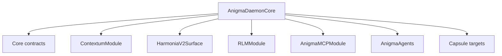
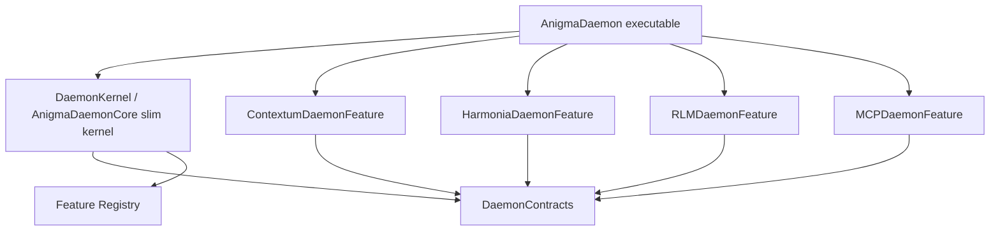

# Static Plugin Architecture Stabilization

Status: planning and execution policy. TD remains the source of truth for live status, blockers, and approval.

Last reviewed: 2026-04-10

## Summary

Static plugin architecture is the second backend stabilization phase after compilation surface reduction.

The goal is not dynamic `.dylib` loading. The goal is a modular-monolith shape where:

- core targets own contracts, lifecycle, registries, and governance
- feature targets own implementation
- feature wiring targets register workers, routes, tools, schemas, workflows, and capabilities
- executable/composition targets decide which feature wiring modules are included
- reusable core targets do not import every feature implementation

This preserves Anigma's local-first single-process simplicity while reducing compile-time fan-out and Signal 4 exposure.

## Why This Phase Comes After Compilation Surface Reduction

Static plugins should not be built on top of unstable or over-wide surfaces. If Anigma moves directly from the current graph into plugin registration, it risks freezing today's bad boundaries into new plugin contracts.

Execution order:

1. Stabilize compilation surfaces.
2. Split `HarmoniaV2Surface` contracts from implementation.
3. Freeze/govern high fan-in foundation modules.
4. Budget/shrink high fan-out aggregators.
5. Then introduce static feature registration and composition-root wiring.

## Research Backing

The relevant architecture pattern is a modular monolith with enforced boundaries:

- Microsoft’s multi-agent reference architecture describes modular monoliths as one deployment/codebase with independent modules, but warns that strict discipline is required to avoid accidental dependencies. It recommends well-defined interfaces, dependency direction, isolated state/configuration, and per-agent tracing.
- Modular-monolith architecture enforcement literature emphasizes using the compiler and project/module boundaries to prevent incorrect dependencies, and warns against “everything public.”
- Dependency-composition guidance emphasizes fulfilling dependency contracts while minimizing code sharing so modules remain discrete and type-safe.
- SwiftPM makes target dependencies explicit in `Package.swift`; target dependency lists, `exclude`, and `sources` are therefore Anigma's practical enforcement levers for static plugin boundaries.
- Migration research shows that moving from a monolith to a modular monolith is itself a meaningful migration step with performance and effort tradeoffs. Anigma should treat this as stabilization work, not a cosmetic refactor.

## Current Architecture Problem

Today, `AnigmaDaemonCore` is a high fan-out target. It directly imports or depends on many feature implementations. The daemon has registries, but they are mostly static registries inside the same broad target.

Current shape:



The result:

- `AnigmaDaemonCore` becomes a compile-time aggregator.
- Any feature import can invalidate the daemon target.
- Worker/route/capability registration expands the daemon's exposed surface.
- Signal 4 risk concentrates in aggregator targets.
- Feature work encourages new imports into core.

## Target Architecture

Target shape:



The executable remains statically linked. The important change is that reusable core targets stop depending on every feature implementation.

## Target Module Roles

### Contracts Targets

Contracts targets define stable interfaces and data shapes:

- job kind descriptors
- route descriptors
- worker factory protocols
- capability descriptors
- feature manifest types
- schema/workflow registration contracts
- operator surface contracts

Rules:

- no feature implementation imports
- no database implementation imports unless the contract is explicitly persistence-owned
- no ML/runtime-heavy imports
- no UI imports
- minimal `Foundation` plus stable Anigma primitives/contracts only

### Kernel Targets

Kernel targets own lifecycle:

- daemon lifecycle
- registry bootstrapping
- queue execution
- health/operator endpoints
- governance handoff
- config validation

Rules:

- depend on contracts and foundation modules
- do not import feature implementations directly
- execute registered features through protocols
- expose inspection surfaces for registered features

### Feature Implementation Targets

Feature implementation targets own domain behavior:

- `ContextumModule`
- `RLMModule`
- `HarmoniaV2LocalClient`
- `AnigmaMCPModule`
- document/capsule modules

Rules:

- depend on their own implementation needs
- do not become shared surfaces
- expose only contracts or narrow adapters

### Feature Wiring Targets

Feature wiring targets bridge implementation into the kernel:

- `ContextumDaemonFeature`
- `HarmoniaDaemonFeature`
- `RLMDaemonFeature`
- `MCPDaemonFeature`
- `DocumentPipelineDaemonFeature`

Rules:

- import the feature implementation and daemon contracts
- register workers/routes/tools/capabilities
- have low fan-in
- are imported by executable/composition roots only

### Executable Composition Targets

Executable targets decide which static feature set ships:

- `AnigmaDaemon`
- CLI executables
- app host executable
- test harness executables

Rules:

- high fan-out is acceptable here if fan-in stays near zero
- no reusable APIs should be defined here
- feature inclusion should be explicit and auditable

## Registration Contract Shape

Anigma should prefer a small registration protocol:

```swift
public protocol DaemonFeatureRegistrar: Sendable {
    static var featureID: String { get }
    static var dependencies: [String] { get }

    static func register(into registry: inout DaemonFeatureRegistry) throws
}
```

Registered capabilities should be descriptors and factories, not global singletons:

```swift
public struct WorkerRegistration: Sendable {
    public let kind: String
    public let factory: @Sendable () -> any JobWorker
}
```

The exact API can differ, but the invariant is non-negotiable: `DaemonKernel` sees descriptors and factories through contracts; it does not import feature implementation modules.

## Migration Plan

### Phase 0: Preconditions

- `td-f9576a` minimum surface gates are complete.
- `HarmoniaV2Surface` contracts are split from implementation.
- V1 foundation and aggregator lanes have initial policy/budget evidence.

### Phase 1: Define Static Plugin Contracts

- Define daemon feature descriptor and registrar contracts.
- Define route, worker, schema, tool, and capability registration descriptors.
- Define registration parity validation.
- Define operator inspection of registered features.

### Phase 2: Create Kernel Boundary

- Identify the slim daemon kernel surface.
- Move static feature imports out of reusable daemon core where possible.
- Keep lifecycle, queue, config, health, and registry in the kernel.

### Phase 3: Convert One Feature Vertically

Start with one feature lane. Recommended first candidate:

- `HarmoniaDaemonFeature`, if it follows the `HarmoniaV2Surface` split
- or a smaller worker-only feature if safer

Exit evidence:

- feature implementation is not imported by the daemon kernel
- feature wiring target registers through contracts
- executable composition includes the feature
- build graph fan-out decreases or no longer grows

### Phase 4: Convert V1 Aggregators

Apply the pattern to:

- `AnigmaDaemonCore`
- `HarmoniaModule`
- `HarmoniaCLI`
- `RLMModule`
- `AnigmaMCPModule`
- `ContextumModule`

This does not mean every module becomes a plugin. It means broad reusable surfaces stop importing feature implementation directly.

### Phase 5: Enforce With Tooling

- Add package graph checks for forbidden dependencies.
- Add fan-out budgets for kernel and contract targets.
- Add CI/reporting that fails when core imports feature implementation without an explicit TD exception.
- Refresh the compilation surface and Signal 4 matrices after each conversion.

## Acceptance Criteria For The Stabilization Phase

- A daemon/kernel target can compile without importing all V1 feature implementations.
- Feature wiring targets exist for at least one converted backend feature.
- Worker/route/capability registration flows through contracts.
- Package graph enforcement prevents new feature imports into kernel/contracts.
- The executable composition root explicitly lists included feature wiring targets.
- TD records exceptions when a static import is temporarily required.
- Before/after fan-in/fan-out evidence shows reduced or bounded compile surface.

## Anti-Patterns

- Calling a hardcoded list of concrete workers inside `AnigmaDaemonCore` a plugin architecture.
- Moving imports from one giant target to another giant reusable target.
- Creating contracts that import database/runtime/ML implementations.
- Allowing feature modules to depend on each other directly instead of contracts/events.
- Defining reusable APIs in executable composition targets.
- Introducing dynamic plugin loading before the static boundaries are stable.

## Relationship To Current TD

- Must follow: `td-f9576a` compilation surface reduction.
- Should begin after: `td-f846b9`, `td-34082e`, and `td-93f670` have enough evidence to avoid encoding unstable surfaces.
- Should gate: broad backend wiring, daemon feature expansion, and stub-to-full work that would add new imports to V0/V1 surfaces.

## Sources

- [Microsoft Multi-agent Reference Architecture: Agents as a modular monolith](https://microsoft.github.io/multi-agent-reference-architecture/docs/design-options/Modular-Monolith.html)
- [Kamil Grzybek: Modular Monolith Architecture Enforcement](https://www.kamilgrzybek.com/blog/posts/modular-monolith-architecture-enforcement)
- [Martin Fowler: Dependency Composition](https://martinfowler.com/articles/dependency-composition.html)
- [Swift Package Manager PackageDescription](https://docs.swift.org/package-manager/PackageDescription/PackageDescription.html)
- [Stepwise Migration of a Monolith to a Microservices Architecture](https://arxiv.org/abs/2201.07226)
