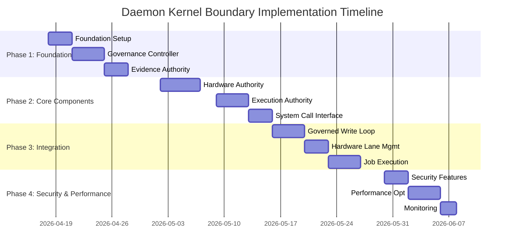

# TD Task: Implement Daemon Kernel Boundary Specification

**Task ID:** td-daemon-kernel-impl-001
**Status:** OPEN
**Priority:** P1
**Epic:** Harmonia V3 Transition
**Date Created:** 2026-04-16

> [!IMPORTANT]
> **TD is the source of truth for live task status, blockers, dependency order, and review state.**

**Estimate:** 3-4 weeks
**Dependencies:** td-8d067f (Governance Authority Boundaries)
**Blockers:** None
**Owner:** Architecture Team

## Executive Summary

Implement the Daemon Kernel Boundary as specified in `DAEMON_KERNEL_BOUNDARY_SPECIFICATION.md`. This task creates the architectural boundary between the Anigma daemon kernel and user-space components, ensuring strict isolation, security, and performance guarantees.

## Scope

### In Scope
- [ ] Implement kernel-space components (`KernelGovernanceController`, `KernelEvidenceAuthority`, `KernelHardwareAuthority`, `KernelExecutionAuthority`)
- [ ] Develop system call interface (`KernelSystemCallInterface`)
- [ ] Implement governed write loop enforcement
- [ ] Create hardware lane management system
- [ ] Build job execution and persistence mechanism
- [ ] Integrate security and compliance features
- [ ] Add performance optimization features
- [ ] Implement monitoring and maintenance capabilities

### Out of Scope
- ❌ User-space component implementation (separate task)
- ❌ Full daemon integration testing (Phase 2)
- ❌ Production deployment (Phase 3)

## Acceptance Criteria

### Functional Requirements
- [ ] Kernel-space components implemented and functional
- [ ] System call interface operational
- [ ] Governed write loop enforced for all mutations
- [ ] Hardware lanes managed and allocated correctly
- [ ] Job execution persisted and recoverable
- [ ] Security and compliance features operational
- [ ] Performance optimizations implemented
- [ ] Monitoring and maintenance capabilities working

### Technical Requirements
- [ ] Build succeeds with 0 errors: `swift build --product harmonia`
- [ ] All kernel components compile without warnings
- [ ] System call interface passes validation tests
- [ ] Governed write loop tests pass (100%)
- [ ] Hardware lane allocation tests pass (100%)
- [ ] Job execution persistence tests pass (100%)
- [ ] Security compliance tests pass (100%)
- [ ] Performance benchmarks meet targets

### Documentation Requirements
- [ ] Implementation notes added to `DAEMON_KERNEL_BOUNDARY_SPECIFICATION.md`
- [ ] Code comments updated with implementation details
- [ ] Integration guide created for user-space components
- [ ] Testing documentation completed

## Implementation Plan

### Phase 1: Foundation (Week 1)
**Goal:** Set up kernel foundation and basic components

1. **Task 1.1:** Create kernel-space project structure
   - [ ] Set up Xcode project for kernel components
   - [ ] Configure build settings and dependencies
   - [ ] Create basic kernel module structure
   - **Evidence:** Project compiles with empty components

2. **Task 1.2:** Implement KernelGovernanceController
   - [ ] Create governance controller interface
   - [ ] Implement write proposal validation
   - [ ] Add evidence generation capabilities
   - **Evidence:** Governance controller compiles and passes unit tests

3. **Task 1.3:** Implement KernelEvidenceAuthority
   - [ ] Create evidence authority interface
   - [ ] Implement hash-chaining logic
   - [ ] Add cryptographic signing
   - **Evidence:** Evidence authority compiles and passes unit tests

### Phase 2: Core Components (Week 2)
**Goal:** Implement core kernel functionality

4. **Task 2.1:** Implement KernelHardwareAuthority
   - [ ] Create hardware authority interface
   - [ ] Implement hardware lane types (Control, Inference, Perception, Native)
   - [ ] Add lane assignment workflow
   - [ ] Implement zero-copy memory management
   - **Evidence:** Hardware authority compiles and passes unit tests

5. **Task 2.2:** Implement KernelExecutionAuthority
   - [ ] Create execution authority interface
   - [ ] Implement job submission logic
   - [ ] Add job persistence mechanism
   - [ ] Implement job status querying
   - **Evidence:** Execution authority compiles and passes unit tests

6. **Task 2.3:** Create System Call Interface
   - [ ] Define `KernelSystemCallInterface` protocol
   - [ ] Implement all required system calls
   - [ ] Add error handling and validation
   - **Evidence:** System call interface compiles and passes validation tests

### Phase 3: Integration (Week 3)
**Goal:** Integrate components and add cross-cutting features

7. **Task 3.1:** Integrate Governed Write Loop
   - [ ] Connect governance controller to system calls
   - [ ] Implement proposal → decision → execution → evidence flow
   - [ ] Add validation at each stage
   - **Evidence:** Governed write loop passes integration tests

8. **Task 3.2:** Implement Hardware Lane Management
   - [ ] Connect hardware authority to system calls
   - [ ] Implement lane request/assignment/release workflow
   - [ ] Add backpressure and load shedding
   - **Evidence:** Hardware lane management passes integration tests

9. **Task 3.3:** Add Job Execution Persistence
   - [ ] Connect execution authority to system calls
   - [ ] Implement job state machine
   - [ ] Add lease mechanism for job processing
   - **Evidence:** Job execution passes integration tests

### Phase 4: Security & Performance (Week 4)
**Goal:** Add security, performance, and monitoring features

10. **Task 4.1:** Implement Security Features
    - [ ] Add identity and provenance enforcement
    - [ ] Implement audit and telemetry separation
    - [ ] Add zero-trust identity mechanisms
    - **Evidence:** Security features pass compliance tests

11. **Task 4.2:** Add Performance Optimizations
    - [ ] Implement query coalescing
    - [ ] Add connection pooling
    - [ ] Configure backup and recovery
    - **Evidence:** Performance benchmarks meet targets

12. **Task 4.3:** Add Monitoring Capabilities
    - [ ] Implement key metrics monitoring
    - [ ] Add regular maintenance features
    - [ ] Configure log rotation
    - **Evidence:** Monitoring passes operational tests

## Testing Strategy

### Unit Tests
- **Governance Controller Tests:** Validate write proposal handling
- **Evidence Authority Tests:** Verify hash-chaining and signing
- **Hardware Authority Tests:** Test lane assignment logic
- **Execution Authority Tests:** Validate job persistence
- **System Call Tests:** Verify interface contracts

### Integration Tests
- **Governed Write Loop Test:** Full proposal → execution → evidence flow
- **Hardware Lane Test:** Complete request → assignment → release cycle
- **Job Execution Test:** Submit → process → query status workflow
- **Security Test:** Identity and provenance enforcement

### Performance Tests
- **Query Coalescing Benchmark:** Measure query reduction efficiency
- **Hardware Lane Benchmark:** Test lane allocation speed
- **Job Processing Benchmark:** Measure throughput and latency

### Compliance Tests
- **Security Audit:** Verify all security requirements met
- **Privacy Compliance:** Ensure data handling meets standards
- **Access Control:** Validate permission enforcement

## Success Metrics

### Build Metrics
- ✅ 0 compilation errors
- ✅ 0 warnings in kernel components
- ✅ Build time < 5 minutes
- ✅ Binary size < 20MB (kernel components)

### Test Coverage
- ✅ Unit test coverage > 90%
- ✅ Integration test coverage > 85%
- ✅ All critical paths tested
- ✅ Edge cases covered

### Performance Targets
- ✅ Query coalescing reduces duplicate queries by > 90%
- ✅ Hardware lane allocation < 10ms
- ✅ Job persistence operations < 50ms
- ✅ System call latency < 1ms (average)

### Security Compliance
- ✅ 100% of security requirements implemented
- ✅ All audit trails complete and verifiable
- ✅ Zero security vulnerabilities in code review
- ✅ Compliance with zero-trust principles

## Deliverables

### Code Deliverables
- `anigma/Kernel/KernelGovernanceController.swift` (250-300 lines)
- `anigma/Kernel/KernelEvidenceAuthority.swift` (200-250 lines)
- `anigma/Kernel/KernelHardwareAuthority.swift` (300-350 lines)
- `anigma/Kernel/KernelExecutionAuthority.swift` (250-300 lines)
- `anigma/Kernel/KernelSystemCallInterface.swift` (150-200 lines)
- `anigma/Kernel/Integration/KernelIntegrationTests.swift` (400-500 lines)

### Documentation Deliverables
- Updated `DAEMON_KERNEL_BOUNDARY_SPECIFICATION.md` with implementation notes
- `docs/architecture/KERNEL_IMPLEMENTATION_GUIDE.md` (new)
- `docs/testing/KERNEL_TESTING_STRATEGY.md` (new)
- Code comments and documentation

### Test Deliverables
- Unit tests for all kernel components
- Integration tests for cross-component workflows
- Performance benchmarks and results
- Security compliance test reports

## Verification Commands

```bash
# Build kernel components
cd anigma && swift build --product harmonia

# Run unit tests
swift test --target KernelGovernanceControllerTests
swift test --target KernelEvidenceAuthorityTests
swift test --target KernelHardwareAuthorityTests
swift test --target KernelExecutionAuthorityTests

# Run integration tests
swift test --target KernelIntegrationTests

# Run performance benchmarks
swift test --target KernelPerformanceTests

# Run security compliance tests
swift test --target KernelSecurityTests
```

## Risk Assessment

### High Risks
- **Kernel-User Space Integration:** Complex interface coordination
  - *Mitigation:* Early interface validation, contract testing
- **Performance Targets:** Achieving low-latency requirements
  - *Mitigation:* Performance testing throughout, optimization iterations

### Medium Risks
- **Security Compliance:** Meeting all security requirements
  - *Mitigation:* Security reviews at each phase, compliance testing
- **Hardware Lane Management:** Complex resource allocation
  - *Mitigation:* Simplified initial implementation, iterative refinement

### Low Risks
- **Documentation Completeness:** Ensuring all aspects documented
  - *Mitigation:* Documentation reviews, code comment requirements
- **Test Coverage:** Achieving high coverage targets
  - *Mitigation:* Test-driven development, coverage monitoring

## Contingency Plans

### Performance Issues
- **Plan A:** Optimize critical paths first
- **Plan B:** Reduce feature scope if performance targets not met
- **Plan C:** Implement performance improvements in follow-up task

### Security Compliance Issues
- **Plan A:** Security review at each implementation phase
- **Plan B:** Dedicated security hardening sprint if needed
- **Plan C:** External security audit if compliance not achieved

### Integration Problems
- **Plan A:** Early integration testing with mock components
- **Plan B:** Interface simplification if integration complex
- **Plan C:** Phased integration approach if needed

## Timeline



## Cross-References

### Related Tasks
- **td-8d067f:** Define Governance Authority Boundaries (dependency)
- **td-333894:** Harmonia Migration Phase 2 (parent epic)
- **td-0cb66d:** Implement Harmonia Conductor (related)
- **td-85e622:** Backend Stability Gates Decomposition (foundation)

### Related Documentation
- `DAEMON_KERNEL_BOUNDARY_SPECIFICATION.md` (design specification)
- `GOVERNANCE_AUTHORITY_MATRIX.md` (governance reference)
- `INTEGRATED_DESIGN_BLUEPRINT.md` (architecture reference)
- `Governed_Persistence_Design.md` (persistence reference)

### Related Code
- `anigma/Packages/HarmoniaRuntime/` (runtime foundation)
- `anigma/Packages/HarmoniaCore/` (core components)
- `anigma/Tests/KernelTests/` (test infrastructure)

## Approval Checklist

### Implementation Review
- [ ] All acceptance criteria met
- [ ] Code follows Swift conventions
- [ ] Documentation complete
- [ ] Tests passing (100%)
- [ ] Performance targets achieved
- [ ] Security compliance verified

### Architecture Review
- [ ] Design aligns with blueprint
- [ ] Interfaces stable and versioned
- [ ] No breaking changes to existing components
- [ ] Future extensibility maintained

### Quality Assurance
- [ ] Code review completed
- [ ] Static analysis clean
- [ ] No known defects
- [ ] Ready for integration

## Next Steps

1. **Start Implementation:** Begin with Phase 1 foundation tasks
2. **Monitor Progress:** Weekly status updates
3. **Address Blockers:** Escalate any issues immediately
4. **Prepare for Integration:** Coordinate with user-space team
5. **Plan Testing:** Set up test infrastructure early

**Status:** READY FOR IMPLEMENTATION
**Next Review:** Weekly during implementation phase
**Target Completion:** 2026-05-13 (4 weeks)

---

**Document Version:** 1.0
**Last Updated:** 2026-04-16
**Author:** Mistral Vibe