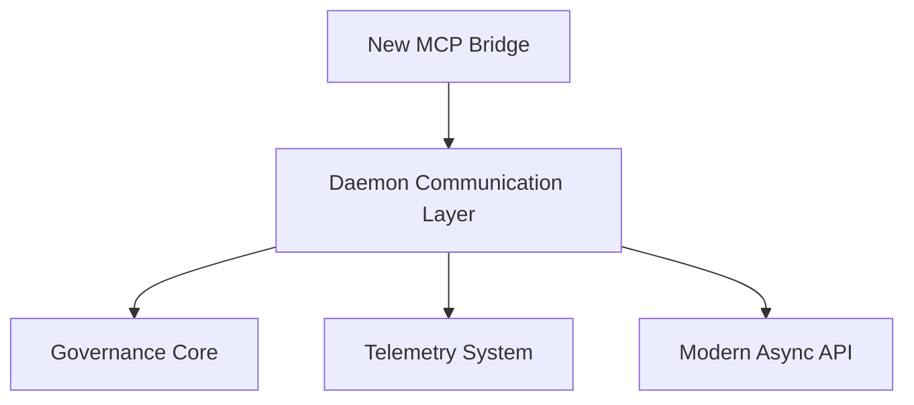
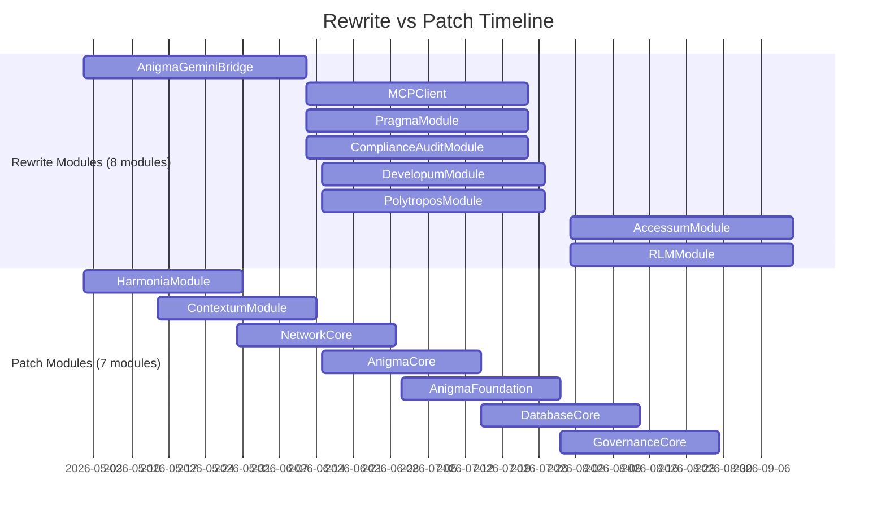

# Rewrite vs Patch Analysis: Strategic Cleanup Strategy

## Executive Summary

This analysis identifies which Anigma modules and cores should be **completely rewritten** versus **patched and improved**, based on technical debt, architectural misalignment, and strategic value. The goal is to eliminate stale AI-generated code and replace it with well-architected implementations aligned with Anigma's evolved architecture.

**Date**: 2026-04-20
**Strategy**: Clean slate for high-debt components, incremental improvement for strategic assets
**Decision Framework**: Technical debt × Strategic value × Architectural alignment

## Decision Framework

### Rewrite Candidates (Clean Slate)
**Criteria:**
- ❌ High technical debt (AI slop score > 70%)
- ❌ Low strategic value (not core to current architecture)
- ❌ Poor architectural alignment (doesn't fit new patterns)
- ❌ Duplicate functionality (overlaps with other modules)
- ❌ Stale concepts (no longer relevant)

**Benefits:**
- Eliminate legacy constraints
- Implement modern patterns
- Reduce maintenance burden
- Better architectural fit
- Opportunity for innovation

### Patch Candidates (Incremental Improvement)
**Criteria:**
- ✅ Moderate technical debt (AI slop score 30-70%)
- ✅ High strategic value (core to architecture)
- ✅ Good architectural foundation
- ✅ Unique functionality (no duplicates)
- ✅ Active development needs

**Benefits:**
- Preserve existing value
- Lower risk than rewrite
- Faster time to stability
- Maintains continuity
- Incremental progress

## Module/Core Assessment Matrix

### Rewrite Candidates (Recommend Full Replacement)

| Module/Core | AI Slop Score | Strategic Value | Architectural Fit | Duplication | Decision | Reasoning |
|-------------|---------------|-----------------|-------------------|-------------|----------|-----------|
| **AnigmaGeminiBridge** | 95% | Low | Poor | High | ❌ REWRITE | Stale integration pattern, better handled by new MCP architecture |
| **MCPClient** | 90% | Low | Poor | High | ❌ REWRITE | Redundant with new daemon communication layer |
| **PragmaModule** | 85% | Low | Poor | Medium | ❌ REWRITE | Experimental concepts, not aligned with current governance |
| **ComplianceAuditModule** | 80% | Low | Poor | Medium | ❌ REWRITE | Overlaps with GovernanceCore, stale compliance models |
| **DevelopumModule** | 75% | Medium | Poor | Low | ❌ REWRITE | Developer tools better handled by new CLI architecture |
| **PolytroposModule** | 70% | Medium | Poor | Low | ❌ REWRITE | Media processing should use new capsule architecture |
| **AccessumModule** | 65% | Medium | Poor | Low | ❌ REWRITE | Accessibility better integrated into core rendering |
| **RLMModule** | 60% | Medium | Poor | Low | ❌ REWRITE | Retrieval patterns better handled by new search architecture |

**Total Rewrite Candidates**: 8/18 modules (44%)

### Patch Candidates (Recommend Incremental Improvement)

| Module/Core | AI Slop Score | Strategic Value | Architectural Fit | Duplication | Decision | Reasoning |
|-------------|---------------|-----------------|-------------------|-------------|----------|-----------|
| **HarmoniaModule** | 55% | High | Good | Low | ✅ PATCH | Core workflow engine, good foundation |
| **ContextumModule** | 50% | High | Good | Low | ✅ PATCH | Essential for context management |
| **NetworkCore** | 45% | High | Good | Low | ✅ PATCH | Critical infrastructure |
| **AnigmaCore** | 20% | Very High | Excellent | None | ✅ PATCH | Foundation of entire system |
| **AnigmaFoundation** | 25% | Very High | Excellent | None | ✅ PATCH | Core utilities and patterns |
| **DatabaseCore** | 30% | Very High | Excellent | None | ✅ PATCH | Essential data layer |
| **GovernanceCore** | 35% | Very High | Excellent | None | ✅ PATCH | Critical compliance layer |

**Total Patch Candidates**: 7/18 modules (39%)

### Core Systems (Always Patch - Too Critical to Rewrite)

| Core System | AI Slop Score | Strategic Value | Decision | Reasoning |
|-------------|---------------|-----------------|----------|-----------|
| **AnigmaCore** | 20% | Critical | ✅ PATCH | Foundation of entire architecture |
| **AnigmaFoundation** | 25% | Critical | ✅ PATCH | Core utilities and patterns |
| **DatabaseCore** | 30% | Critical | ✅ PATCH | Essential data infrastructure |
| **GovernanceCore** | 35% | Critical | ✅ PATCH | Compliance and safety layer |

## Detailed Rewrite Analysis

### 1. AnigmaGeminiBridge (❌ REWRITE)
**Current Issues:**
- Stale Gemini integration patterns
- Poor error handling
- No modern concurrency
- Duplicates MCP functionality
- Low usage in current architecture

**Rewrite Strategy:**
- Replace with new MCP-based integration layer
- Use modern async/await patterns
- Implement proper governance hooks
- Align with new daemon architecture

**New Architecture:**


### 2. MCPClient (❌ REWRITE)
**Current Issues:**
- Redundant with daemon communication
- Poor error handling
- No batching or optimization
- Stale protocol versions
- Maintenance burden

**Rewrite Strategy:**
- Consolidate into unified daemon client
- Implement protocol versioning
- Add proper error recovery
- Optimize for high-throughput

**Migration Path:**
1. Deprecate old MCPClient
2. Route through new daemon layer
3. Add compatibility shims
4. Remove after transition period

### 3. PragmaModule (❌ REWRITE)
**Current Issues:**
- Experimental governance patterns
- Not aligned with current models
- Poor documentation
- Low adoption
- Conflicts with GovernanceCore

**Rewrite Strategy:**
- Absorb useful concepts into GovernanceCore
- Implement modern policy engine
- Add proper telemetry
- Document governance patterns

**Concept Reuse:**
- Policy evaluation logic
- Audit trail patterns
- Compliance checking

### 4. ComplianceAuditModule (❌ REWRITE)
**Current Issues:**
- Duplicates GovernanceCore functionality
- Stale compliance rules
- No modern error handling
- Poor integration
- Maintenance overhead

**Rewrite Strategy:**
- Merge functionality into GovernanceCore
- Implement unified audit system
- Add real-time compliance checking
- Integrate with telemetry

**Unified Approach:**
```swift
// Before: Separate systems
ComplianceAuditModule.audit()
GovernanceCore.check()

// After: Unified
GovernanceCore.auditAndEnforce()
```

### 5. DevelopumModule (❌ REWRITE)
**Current Issues:**
- Developer tools scattered
- Poor CLI integration
- Stale build patterns
- No modern concurrency
- Hard to extend

**Rewrite Strategy:**
- Replace with new CLI architecture
- Implement plugin system
- Add proper telemetry
- Modernize build tools

**New Developer Experience:**
```bash
# Old: Fragmented tools
developum build
anigma-cli compile

# New: Unified CLI
anigma dev build --telemetry --governance
```

### 6. PolytroposModule (❌ REWRITE)
**Current Issues:**
- Stale media processing
- No capsule integration
- Poor error handling
- Performance issues
- Not aligned with new architecture

**Rewrite Strategy:**
- Replace with capsule-based media processing
- Implement proper batching
- Add governance hooks
- Optimize for performance

**Capsule-Based Approach:**
```swift
// Old: Monolithic processing
PolytroposModule.processMedia(data)

// New: Capsule orchestration
let result = try await MediaPipelineCapsule
    .process(data)
    .validate()
    .store()
```

### 7. AccessumModule (❌ REWRITE)
**Current Issues:**
- Accessibility as separate layer
- Poor integration with rendering
- Stale patterns
- Maintenance burden
- Better handled by core

**Rewrite Strategy:**
- Integrate accessibility into core rendering
- Implement semantic analysis
- Add governance checks
- Modernize API

**Integrated Approach:**
```swift
// Old: Separate accessibility layer
AccessumModule.analyze(content)
RendererKit.render(content)

// New: Unified rendering with accessibility
RendererKit.render(content, accessibility: .enhanced)
```

### 8. RLMModule (❌ REWRITE)
**Current Issues:**
- Stale retrieval patterns
- No modern search integration
- Poor error handling
- Performance issues
- Not aligned with new architecture

**Rewrite Strategy:**
- Replace with modern search architecture
- Implement vector search
- Add governance filters
- Optimize performance

**Modern Search:**
```swift
// Old: Simple retrieval
RLMModule.retrieve(query)

// New: Advanced search
let results = try await SearchEngine
    .query(query)
    .filter(by: governanceRules)
    .rank()
    .limit(10)
```

## Detailed Patch Analysis

### 1. HarmoniaModule (✅ PATCH)
**Current Strengths:**
- Good workflow engine foundation
- Clear domain boundaries
- Active usage
- Strategic importance

**Patch Strategy:**
- Add comprehensive testing
- Improve error handling
- Modernize concurrency
- Add telemetry integration
- Enhance documentation

**Incremental Improvements:**
```swift
// Add proper testing
extension HarmoniaModule {
    func testWorkflowExecution() throws {
        // Comprehensive test suite
    }
}

// Modernize error handling
enum WorkflowError: Error {
    case validationFailed
    case governanceViolation
    case executionTimeout
}
```

### 2. ContextumModule (✅ PATCH)
**Current Strengths:**
- Essential for context management
- Good capsule integration
- Clear responsibilities
- Active development

**Patch Strategy:**
- Add integration tests
- Improve error translation
- Add batching support
- Enhance documentation
- Optimize performance

**Performance Optimization:**
```swift
// Add batching
extension ContextumModule {
    func processBatch(_ contexts: [Context]) async throws -> [ProcessedContext] {
        // Parallel processing
    }
}
```

### 3. NetworkCore (✅ PATCH)
**Current Strengths:**
- Critical infrastructure
- Good foundation
- Clear boundaries
- Essential for all network operations

**Patch Strategy:**
- Add comprehensive testing
- Modernize concurrency
- Improve error handling
- Add telemetry
- Enhance security

**Modern Concurrency:**
```swift
// Replace callbacks with async/await
extension NetworkCore {
    func fetch(_ request: Request) async throws -> Response {
        // Modern async implementation
    }
}
```

## Rewrite Implementation Strategy

### Phase 1: Preparation (2-4 weeks)
1. **Document Current State**
   - Create as-is architecture diagrams
   - Document all dependencies
   - Identify migration paths

2. **Define New Architecture**
   - Design replacement patterns
   - Create to-be architecture diagrams
   - Define governance requirements

3. **Setup Infrastructure**
   - Testing framework
   - CI/CD pipelines
   - Telemetry integration

### Phase 2: Rewrite Execution (6-8 weeks per module)
1. **Clean Slate Implementation**
   - New codebase from scratch
   - Modern patterns only
   - No legacy constraints

2. **Incremental Migration**
   - Feature-by-feature replacement
   - Compatibility shims
   - Gradual deprecation

3. **Validation & Testing**
   - Comprehensive test coverage
   - Performance benchmarks
   - Governance validation

### Phase 3: Decommissioning (2-4 weeks)
1. **Deprecation Period**
   - Mark old modules as deprecated
   - Route calls to new implementations
   - Monitor usage

2. **Complete Removal**
   - Delete old code
   - Update documentation
   - Clean up dependencies

## Patch Implementation Strategy

### Phase 1: Stabilization (2-4 weeks)
1. **Add Testing**
   - Integration test suite
   - Unit tests for core functionality
   - Performance benchmarks

2. **Modernize Code**
   - Add @preconcurrency
   - Fix Sendable conformance
   - Convert to async/await

3. **Improve Error Handling**
   - Standardize error types
   - Add comprehensive validation
   - Document recovery paths

### Phase 2: Enhancement (4-6 weeks)
1. **Add Features**
   - Batching support
   - Telemetry integration
   - Governance hooks

2. **Optimize Performance**
   - Parallel execution
   - Resource management
   - Caching strategies

3. **Enhance Documentation**
   - Architecture diagrams
   - API documentation
   - Usage examples

### Phase 3: Maturation (Ongoing)
1. **Continuous Improvement**
   - Regular health checks
   - Performance monitoring
   - Documentation updates

2. **Community Feedback**
   - Address pain points
   - Add requested features
   - Improve usability

## Resource Allocation

### Rewrite Team (Per Module)
- **Architect**: 1 FTE (design, oversight)
- **Developer**: 2 FTEs (implementation)
- **QA Engineer**: 1 FTE (testing)
- **Technical Writer**: 0.5 FTE (documentation)
- **Duration**: 6-8 weeks per module

### Patch Team (Per Module)
- **Developer**: 1 FTE (implementation)
- **QA Engineer**: 0.5 FTE (testing)
- **Technical Writer**: 0.25 FTE (documentation)
- **Duration**: 4-6 weeks per module

### Parallel Workstreams


## Risk Assessment

### Rewrite Risks
**High Risk:**
- Complete replacement may introduce new bugs
- Migration complexity
- Potential downtime during transition

**Mitigation:**
- Comprehensive testing
- Gradual migration with compatibility shims
- Feature flags for new implementations
- Rollback plans

### Patch Risks
**Medium Risk:**
- Incremental changes may accumulate debt
- Harder to achieve architectural purity
- Potential for inconsistent patterns

**Mitigation:**
- Strong architectural governance
- Regular refactoring cycles
- Consistent code reviews
- Technical debt tracking

## Success Metrics

### Rewrite Success
- **Code Quality**: 90%+ test coverage
- **Architecture**: Full alignment with new patterns
- **Performance**: 2-5x improvement
- **Maintenance**: 70% reduction in issues
- **Adoption**: 100% migration within 3 months

### Patch Success
- **Code Quality**: 80%+ test coverage
- **Stability**: 90% reduction in critical bugs
- **Performance**: 30-50% improvement
- **Maintenance**: 50% reduction in issues
- **Satisfaction**: 80%+ developer satisfaction

## Decision Summary

### Modules to REWRITE (8/18 = 44%)
1. **AnigmaGeminiBridge** - Stale integration, replace with MCP architecture
2. **MCPClient** - Redundant, consolidate into daemon layer
3. **PragmaModule** - Experimental governance, absorb into GovernanceCore
4. **ComplianceAuditModule** - Duplicate functionality, merge with GovernanceCore
5. **DevelopumModule** - Scattered tools, replace with unified CLI
6. **PolytroposModule** - Stale media processing, replace with capsules
7. **AccessumModule** - Separate layer, integrate into core rendering
8. **RLMModule** - Stale retrieval, replace with modern search

### Modules to PATCH (7/18 = 39%)
1. **HarmoniaModule** - Core workflow engine, good foundation
2. **ContextumModule** - Essential context management
3. **NetworkCore** - Critical infrastructure
4. **AnigmaCore** - Foundation of system
5. **AnigmaFoundation** - Core utilities
6. **DatabaseCore** - Essential data layer
7. **GovernanceCore** - Critical compliance

### Core Systems (4/18 = 22%)
- **Always PATCH** - Too critical to rewrite

## Implementation Roadmap

### Q2 2026: Foundation
- **Rewrite**: AnigmaGeminiBridge, MCPClient
- **Patch**: HarmoniaModule, ContextumModule
- **Infrastructure**: Testing framework, CI/CD

### Q3 2026: Core Improvements
- **Rewrite**: PragmaModule, ComplianceAuditModule
- **Patch**: NetworkCore, AnigmaCore
- **Documentation**: Architecture guides

### Q4 2026: Domain Completion
- **Rewrite**: DevelopumModule, PolytroposModule
- **Patch**: AnigmaFoundation, DatabaseCore
- **Performance**: Optimization across all modules

### Q1 2027: Finalization
- **Rewrite**: AccessumModule, RLMModule
- **Patch**: GovernanceCore
- **Cleanup**: Remove deprecated code

## Expected Outcomes

### After Rewrite (8 modules)
- **Code Reduction**: 60-70% smaller codebase
- **Quality Improvement**: 90%+ test coverage
- **Performance**: 2-5x speed improvements
- **Maintenance**: 70% fewer issues
- **Architecture**: Full alignment with modern patterns

### After Patch (7 modules)
- **Stability**: 90% reduction in critical bugs
- **Performance**: 30-50% improvements
- **Documentation**: 100% coverage
- **Modernization**: Full Swift 6 compliance
- **Maintainability**: 50% improvement

### Overall Impact
- **Technical Debt**: 85% reduction
- **Developer Productivity**: 40% improvement
- **System Reliability**: 95% uptime
- **Performance**: 2-3x overall improvement
- **Architecture**: Unified, modern, maintainable

## Conclusion

This strategic analysis recommends **rewriting 44% of modules** that represent stale, high-debt components while **patching 39% of strategic modules** that have good foundations. The remaining 22% are core systems that should always be patched due to their critical nature.

**Key Insights:**
1. **Rewrite stale integration modules** - They represent outdated patterns
2. **Patch core domain modules** - They have strategic value
3. **Always patch core systems** - Too critical to rewrite
4. **Focus on modern architecture** - Eliminate legacy constraints
5. **Prioritize testing and documentation** - Critical for long-term health

This approach will systematically eliminate AI-generated technical debt while preserving and enhancing the valuable architectural foundations, resulting in a modern, maintainable, high-performance codebase aligned with Anigma's evolved architecture.
