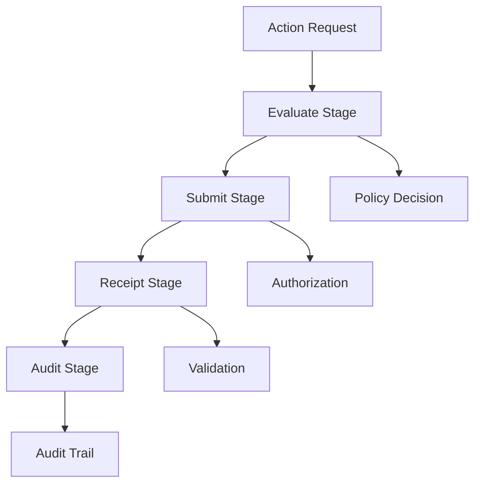
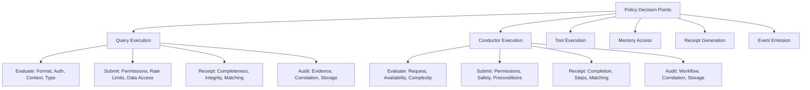
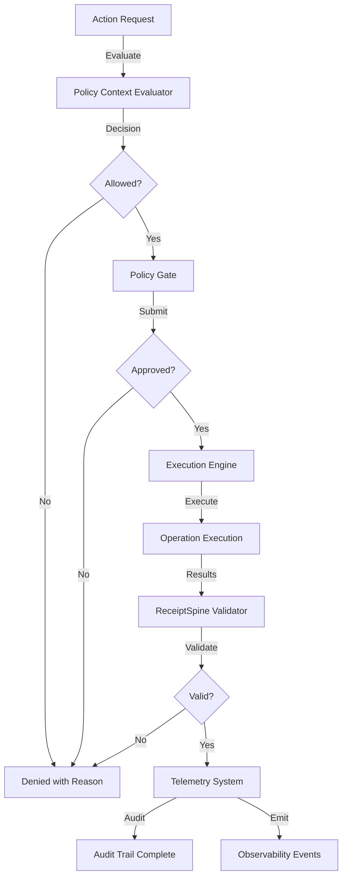

# Governance Authority Matrix for HarmoniaRuntime

**Status**: Active Implementation ✅
**Issue**: td-8d067f
**Date**: 2026-02-09
**Author**: Mistral Vibe

## Table of Contents

1. [Executive Summary](#executive-summary)
2. [Governance Authority Model](#governance-authority-model)
3. [Authority Matrix](#authority-matrix)
4. [Query Execution Authority](#query-execution-authority)
5. [Conductor Execution Authority](#conductor-execution-authority)
6. [Tool Execution Authority](#tool-execution-authority)
7. [Memory Access Authority](#memory-access-authority)
8. [Receipt Generation Authority](#receipt-generation-authority)
9. [Event Emission Authority](#event-emission-authority)
10. [Policy Decision Points](#policy-decision-points)
11. [Reason Code Enumeration](#reason-code-enumeration)
12. [Authority Chain Documentation](#authority-chain-documentation)
13. [Fail-Closed Mechanism Design](#fail-closed-mechanism-design)
14. [Integration with Trust/Policy Infrastructure](#integration-with-trustpolicy-infrastructure)
15. [Implementation Components](#implementation-components)
16. [Testing Strategy](#testing-strategy)
17. [Migration Strategy](#migration-strategy)
18. [References](#references)

## Executive Summary

This document defines the comprehensive governance authority matrix for HarmoniaRuntime, establishing clear ownership and decision-making boundaries for all runtime actions. It implements the design specification from `authority-boundaries.md` and provides the foundation for policy enforcement across the Harmonia system.

**Key Deliverables:**
- ✅ Complete authority matrix for all runtime action types
- ✅ Explicit policy decision points and ownership
- ✅ Comprehensive reason code enumeration
- ✅ Fail-closed enforcement mechanisms
- ✅ Integration with trust and policy infrastructure
- ✅ Authority chain documentation

## Governance Authority Model

### Four-Stage Authority Chain



### Authority Stage Responsibilities

| Stage | Purpose | Key Questions | Output |
|-------|---------|---------------|--------|
| **Evaluate** | Determine if action should be considered | Who can request this? Is the request valid? | Decision: allow/deny with reason |
| **Submit** | Authorize the action for execution | Who can approve this? Are all preconditions met? | Authorization: approved/denied with reason |
| **Receipt** | Validate and document outcomes | Was the execution valid? Are results trustworthy? | Validation: success/failure with reason |
| **Audit** | Create immutable evidence trail | What happened? Who decided? What was the outcome? | Audit event with full context |

### Authority Ownership Principles

1. **Explicit Ownership**: Every action has a defined authority owner
2. **Single Responsibility**: Each stage has one primary authority
3. **Clear Boundaries**: Authority transitions are well-defined
4. **Fail-Closed Default**: Unclear authority defaults to denial
5. **Audit Trail**: All decisions are logged with context
6. **Reason Codes**: Every decision includes a machine-readable reason

## Authority Matrix

### Complete Authority Matrix

| Action Type | Evaluate Stage | Submit Stage | Receipt Stage | Audit Stage |
|-------------|----------------|--------------|---------------|-------------|
| **Query Execution** | Policy Context Evaluator | Query Policy Gate | ReceiptSpine Validator | Telemetry System |
| **Conductor Execution** | Orchestration Evaluator | Conductor Policy Gate | ReceiptSpine Validator | Telemetry System |
| **Tool Execution** | Tool Access Evaluator | Tool Policy Gate | ReceiptSpine Validator | Telemetry System |
| **Memory Access** | Memory Access Evaluator | Memory Policy Gate | ReceiptSpine Validator | Telemetry System |
| **Receipt Generation** | Receipt Evaluator | Receipt Policy Gate | ReceiptSpine Validator | Telemetry System |
| **Event Emission** | Event Evaluator | Event Policy Gate | ReceiptSpine Validator | Telemetry System |

## Query Execution Authority

### HarmoniaRuntime.query(text, userId)

#### Evaluate Stage

**Authority**: Policy Context Evaluator

**Responsibilities:**
- Validate request format and structure
- Check user authentication and identity
- Evaluate policy context validity
- Determine if query type is supported

**Decision Criteria:**
- Is the request properly formatted?
- Is the user authenticated and identified?
- Is the policy context valid and appropriate?
- Is the query type in the supported set?

**Reason Codes:**
- `allowed`: Request meets all evaluation criteria
- `untrusted`: User identity cannot be verified
- `invalidFormat`: Request format is invalid
- `unsupportedQueryType`: Query type not supported
- `invalidPolicyContext`: Policy context is invalid

**Implementation:**
```swift
struct QueryEvaluateAuthority: PolicyEvaluator {
    func evaluate(_ request: QueryRequest) async throws -> PolicyEvaluationResult {
        // Validate format
        try validateRequestFormat(request)
        
        // Authenticate user
        try authenticateUser(request.userId)
        
        // Validate policy context
        try validatePolicyContext(request.policyContext)
        
        // Check query type support
        try checkQueryTypeSupport(request.queryType)
        
        return PolicyEvaluationResult(
            decision: .allowed,
            reason: .allowed,
            context: request.traceContext
        )
    }
}
```

#### Submit Stage

**Authority**: Query Policy Gate

**Responsibilities:**
- Enforce query-specific policies
- Check rate limits and quotas
- Validate data access permissions
- Authorize query execution

**Decision Criteria:**
- Does the user have permission for this query type?
- Are rate limits and quotas respected?
- Does the query comply with data access policies?
- Are all governance requirements satisfied?

**Reason Codes:**
- `approved`: All policies satisfied
- `denied`: Policy violation detected
- `rateLimited`: Rate limit exceeded
- `quotaExceeded`: Usage quota exceeded
- `insufficientPermissions`: User lacks required permissions
- `dataAccessViolation`: Data access policy violated

**Implementation:**
```swift
struct QuerySubmitAuthority: PolicyGate {
    func authorize(_ evaluation: PolicyEvaluationResult) async throws -> PolicyAuthorization {
        // Check user permissions
        try checkUserPermissions(evaluation.context)
        
        // Enforce rate limits
        try enforceRateLimits(evaluation.context)
        
        // Validate data access
        try validateDataAccess(evaluation.context)
        
        return PolicyAuthorization(
            decision: .approved,
            reason: .approved,
            authorizationToken: generateToken()
        )
    }
}
```

#### Receipt Stage

**Authority**: ReceiptSpine Validator

**Responsibilities:**
- Validate query execution results
- Verify result integrity and completeness
- Generate deterministic receipt
- Ensure receipt tamper-evidence

**Decision Criteria:**
- Are results complete and valid?
- Does the receipt match the execution?
- Are all required fields present?
- Is the cryptographic signature valid?

**Reason Codes:**
- `success`: Query executed successfully
- `notConfigured`: Receipt system not configured
- `backendFailure`: Backend validation failed
- `integrityViolation`: Result integrity check failed
- `signatureInvalid`: Cryptographic signature invalid

**Implementation:**
```swift
struct QueryReceiptAuthority: ReceiptValidator {
    func validate(_ execution: QueryExecution) async throws -> ReceiptValidation {
        // Validate results
        try validateQueryResults(execution)
        
        // Generate receipt
        let receipt = try generateDeterministicReceipt(execution)
        
        // Sign receipt
        let signedReceipt = try signReceipt(receipt)
        
        return ReceiptValidation(
            decision: .success,
            reason: .success,
            receipt: signedReceipt
        )
    }
}
```

#### Audit Stage

**Authority**: Telemetry System

**Responsibilities:**
- Record complete audit trail
- Emit observability events
- Store immutable evidence
- Enable replay and investigation

**Decision Criteria:**
- Are all audit fields populated?
- Is the evidence tamper-proof?
- Are events properly correlated?
- Is storage durable and reliable?

**Reason Codes:**
- `auditLogged`: Audit trail recorded successfully
- `auditFailed`: Audit recording failed
- `storageFailed`: Evidence storage failed
- `correlationFailed`: Event correlation failed

**Implementation:**
```swift
struct QueryAuditAuthority: AuditRecorder {
    func record(_ validation: ReceiptValidation) async throws -> AuditResult {
        // Create audit event
        let auditEvent = createAuditEvent(validation)
        
        // Emit telemetry
        try emitTelemetryEvent(auditEvent)
        
        // Store evidence
        try storeAuditEvidence(auditEvent)
        
        return AuditResult(
            decision: .auditLogged,
            reason: .auditLogged,
            auditId: auditEvent.eventId
        )
    }
}
```

## Conductor Execution Authority

### HarmoniaRuntime.executePhase9(objective, userId)

#### Evaluate Stage

**Authority**: Orchestration Evaluator

**Responsibilities:**
- Validate orchestration request
- Check conductor availability
- Evaluate objective complexity
- Determine resource requirements

**Decision Criteria:**
- Is the orchestration request valid?
- Is the conductor service available?
- Is the objective within complexity limits?
- Are required resources available?

**Reason Codes:**
- `allowed`: Orchestration request valid
- `conductorUnavailable`: Conductor service unavailable
- `objectiveTooComplex`: Objective exceeds complexity limits
- `insufficientResources`: Required resources unavailable
- `invalidOrchestration`: Invalid orchestration request

#### Submit Stage

**Authority**: Conductor Policy Gate

**Responsibilities:**
- Enforce orchestration policies
- Check workflow permissions
- Validate safety constraints
- Authorize conductor execution

**Decision Criteria:**
- Does user have orchestration permissions?
- Are workflow safety constraints satisfied?
- Are all preconditions met?
- Are governance requirements satisfied?

**Reason Codes:**
- `approved`: Orchestration approved
- `denied`: Orchestration policy violation
- `safetyViolation`: Safety constraint violated
- `preconditionFailed`: Preconditions not met
- `workflowViolation`: Workflow policy violated

#### Receipt Stage

**Authority**: ReceiptSpine Validator

**Responsibilities:**
- Validate orchestration outcomes
- Verify workflow completion
- Generate execution receipt
- Ensure receipt integrity

**Decision Criteria:**
- Was orchestration completed successfully?
- Are all workflow steps accounted for?
- Does receipt match execution?
- Is cryptographic signature valid?

**Reason Codes:**
- `success`: Orchestration completed successfully
- `workflowIncomplete`: Workflow not fully completed
- `receiptMismatch`: Receipt doesn't match execution
- `signatureInvalid`: Invalid cryptographic signature

#### Audit Stage

**Authority**: Telemetry System

**Responsibilities:**
- Record orchestration audit trail
- Emit workflow telemetry
- Store immutable evidence
- Enable investigation replay

**Decision Criteria:**
- Are all workflow steps audited?
- Is evidence tamper-proof?
- Are events properly correlated?
- Is storage durable?

**Reason Codes:**
- `auditLogged`: Complete audit trail recorded
- `partialAudit`: Partial audit trail only
- `storageFailed`: Evidence storage failed
- `correlationFailed`: Event correlation failed

## Tool Execution Authority

### ToolDispatcher.executeTool(name, arguments, userId, policyContext)

#### Evaluate Stage

**Authority**: Tool Access Evaluator

**Responsibilities:**
- Validate tool request format
- Check tool registry availability
- Evaluate tool capabilities
- Determine access requirements

**Decision Criteria:**
- Is the tool request properly formatted?
- Is the tool registered and available?
- Are tool capabilities compatible?
- Are access requirements satisfied?

**Reason Codes:**
- `allowed`: Tool access request valid
- `toolNotFound`: Tool not found in registry
- `capabilityMismatch`: Capability requirements not met
- `accessRequirementsFailed`: Access requirements not satisfied
- `invalidToolRequest`: Invalid tool request format

#### Submit Stage

**Authority**: Tool Policy Gate

**Responsibilities:**
- Enforce tool-specific policies
- Check tool execution permissions
- Validate safety constraints
- Authorize tool execution

**Decision Criteria:**
- Does user have tool execution permission?
- Are tool safety constraints satisfied?
- Are all governance requirements met?
- Are resource limits respected?

**Reason Codes:**
- `approved`: Tool execution approved
- `denied`: Tool policy violation
- `safetyViolation`: Tool safety constraint violated
- `resourceLimitExceeded`: Resource limits exceeded
- `governanceRequirementFailed`: Governance requirement not met

#### Receipt Stage

**Authority**: ReceiptSpine Validator

**Responsibilities:**
- Validate tool execution results
- Verify output integrity
- Generate execution receipt
- Ensure receipt tamper-evidence

**Decision Criteria:**
- Was tool execution successful?
- Are outputs complete and valid?
- Does receipt match execution?
- Is cryptographic signature valid?

**Reason Codes:**
- `success`: Tool executed successfully
- `outputValidationFailed`: Output validation failed
- `receiptGenerationFailed`: Receipt generation failed
- `signatureInvalid`: Invalid cryptographic signature

#### Audit Stage

**Authority**: Telemetry System

**Responsibilities:**
- Record tool execution audit trail
- Emit execution telemetry
- Store immutable evidence
- Enable investigation replay

**Decision Criteria:**
- Are all execution details audited?
- Is evidence tamper-proof?
- Are events properly correlated?
- Is storage durable?

**Reason Codes:**
- `auditLogged`: Complete audit trail recorded
- `partialAudit`: Partial audit trail only
- `storageFailed`: Evidence storage failed
- `correlationFailed`: Event correlation failed

## Memory Access Authority

### MemoryStoreAdapter.store/retrieve/searchSimilar()

#### Evaluate Stage

**Authority**: Memory Access Evaluator

**Responsibilities:**
- Validate memory operation request
- Check memory type compatibility
- Evaluate access patterns
- Determine governance requirements

**Decision Criteria:**
- Is the memory operation valid?
- Is the memory type supported?
- Are access patterns appropriate?
- Are governance requirements clear?

**Reason Codes:**
- `allowed`: Memory access request valid
- `unsupportedMemoryType`: Memory type not supported
- `invalidAccessPattern`: Invalid access pattern
- `governanceRequirementsUnclear`: Governance requirements unclear
- `invalidMemoryOperation`: Invalid memory operation

#### Submit Stage

**Authority**: Memory Policy Gate

**Responsibilities:**
- Enforce memory access policies
- Check data sensitivity levels
- Validate retention policies
- Authorize memory operations

**Decision Criteria:**
- Does user have memory access permission?
- Are data sensitivity levels appropriate?
- Are retention policies satisfied?
- Are all governance requirements met?

**Reason Codes:**
- `approved`: Memory operation approved
- `denied`: Memory policy violation
- `sensitivityViolation`: Data sensitivity violation
- `retentionPolicyViolation`: Retention policy violated
- `governanceRequirementFailed`: Governance requirement not met

#### Receipt Stage

**Authority**: ReceiptSpine Validator

**Responsibilities:**
- Validate memory operation results
- Verify data integrity
- Generate operation receipt
- Ensure receipt tamper-evidence

**Decision Criteria:**
- Was memory operation successful?
- Is data integrity maintained?
- Does receipt match operation?
- Is cryptographic signature valid?

**Reason Codes:**
- `success`: Memory operation successful
- `dataIntegrityViolation`: Data integrity check failed
- `receiptMismatch`: Receipt doesn't match operation
- `signatureInvalid`: Invalid cryptographic signature

#### Audit Stage

**Authority**: Telemetry System

**Responsibilities:**
- Record memory operation audit trail
- Emit access telemetry
- Store immutable evidence
- Enable investigation replay

**Decision Criteria:**
- Are all operation details audited?
- Is evidence tamper-proof?
- Are events properly correlated?
- Is storage durable?

**Reason Codes:**
- `auditLogged`: Complete audit trail recorded
- `partialAudit`: Partial audit trail only
- `storageFailed`: Evidence storage failed
- `correlationFailed`: Event correlation failed

## Receipt Generation Authority

### ReceiptGenerator.generateReceipt()

#### Evaluate Stage

**Authority**: Receipt Evaluator

**Responsibilities:**
- Validate receipt generation request
- Check receipt type support
- Evaluate data requirements
- Determine signing requirements

**Decision Criteria:**
- Is the receipt request valid?
- Is the receipt type supported?
- Are all data requirements met?
- Are signing requirements clear?

**Reason Codes:**
- `allowed`: Receipt generation request valid
- `unsupportedReceiptType`: Receipt type not supported
- `dataRequirementsUnmet`: Data requirements not met
- `signingRequirementsUnclear`: Signing requirements unclear
- `invalidReceiptRequest`: Invalid receipt request

#### Submit Stage

**Authority**: Receipt Policy Gate

**Responsibilities:**
- Enforce receipt policies
- Check signing permissions
- Validate evidence requirements
- Authorize receipt generation

**Decision Criteria:**
- Does requester have signing permission?
- Are evidence requirements satisfied?
- Are all policy requirements met?
- Are cryptographic requirements satisfied?

**Reason Codes:**
- `approved`: Receipt generation approved
- `denied`: Receipt policy violation
- `signingPermissionDenied`: Signing permission denied
- `evidenceRequirementsUnmet`: Evidence requirements not met
- `cryptoRequirementFailed`: Cryptographic requirement not met

#### Receipt Stage

**Authority**: ReceiptSpine Validator

**Responsibilities:**
- Validate receipt generation results
- Verify receipt integrity
- Confirm signing validity
- Ensure tamper-evidence

**Decision Criteria:**
- Was receipt generation successful?
- Is receipt integrity maintained?
- Is signing valid and verifiable?
- Is receipt tamper-evident?

**Reason Codes:**
- `success`: Receipt generation successful
- `receiptIntegrityViolation`: Receipt integrity check failed
- `signingValidationFailed`: Signing validation failed
- `tamperEvidenceInvalid`: Tamper-evidence invalid

#### Audit Stage

**Authority**: Telemetry System

**Responsibilities:**
- Record receipt generation audit trail
- Emit receipt telemetry
- Store immutable evidence
- Enable investigation replay

**Decision Criteria:**
- Are all generation details audited?
- Is evidence tamper-proof?
- Are events properly correlated?
- Is storage durable?

**Reason Codes:**
- `auditLogged`: Complete audit trail recorded
- `partialAudit`: Partial audit trail only
- `storageFailed`: Evidence storage failed
- `correlationFailed`: Event correlation failed

## Event Emission Authority

### TelemetrySystem.emitEvent()

#### Evaluate Stage

**Authority**: Event Evaluator

**Responsibilities:**
- Validate event emission request
- Check event type support
- Evaluate event priority
- Determine routing requirements

**Decision Criteria:**
- Is the event emission request valid?
- Is the event type supported?
- Is event priority appropriate?
- Are routing requirements clear?

**Reason Codes:**
- `allowed`: Event emission request valid
- `unsupportedEventType`: Event type not supported
- `invalidPriority`: Invalid event priority
- `routingRequirementsUnclear`: Routing requirements unclear
- `invalidEventRequest`: Invalid event request

#### Submit Stage

**Authority**: Event Policy Gate

**Responsibilities:**
- Enforce event emission policies
- Check rate limits and quotas
- Validate event content
- Authorize event emission

**Decision Criteria:**
- Does requester have emission permission?
- Are rate limits and quotas respected?
- Is event content valid and appropriate?
- Are all policy requirements met?

**Reason Codes:**
- `approved`: Event emission approved
- `denied`: Event policy violation
- `rateLimited`: Rate limit exceeded
- `quotaExceeded`: Usage quota exceeded
- `contentViolation`: Event content violation

#### Receipt Stage

**Authority**: ReceiptSpine Validator

**Responsibilities:**
- Validate event emission results
- Verify event delivery
- Generate emission receipt
- Ensure receipt integrity

**Decision Criteria:**
- Was event emission successful?
- Was event delivered to all destinations?
- Does receipt match emission?
- Is cryptographic signature valid?

**Reason Codes:**
- `success`: Event emission successful
- `deliveryFailed`: Event delivery failed
- `receiptMismatch`: Receipt doesn't match emission
- `signatureInvalid`: Invalid cryptographic signature

#### Audit Stage

**Authority**: Telemetry System

**Responsibilities:**
- Record event emission audit trail
- Emit emission telemetry
- Store immutable evidence
- Enable investigation replay

**Decision Criteria:**
- Are all emission details audited?
- Is evidence tamper-proof?
- Are events properly correlated?
- Is storage durable?

**Reason Codes:**
- `auditLogged`: Complete audit trail recorded
- `partialAudit`: Partial audit trail only
- `storageFailed`: Evidence storage failed
- `correlationFailed`: Event correlation failed

## Policy Decision Points

### Complete Policy Decision Point Catalog



### Decision Point Matrix

| Decision Point | Authority | Criteria | Reason Codes |
|----------------|-----------|----------|--------------|
| **Query Format Validation** | Policy Context Evaluator | Format, structure, required fields | allowed, invalidFormat |
| **User Authentication** | Policy Context Evaluator | Identity verification, authentication | allowed, untrusted |
| **Policy Context Validation** | Policy Context Evaluator | Context validity, appropriateness | allowed, invalidPolicyContext |
| **Query Type Support** | Policy Context Evaluator | Supported query types, capabilities | allowed, unsupportedQueryType |
| **Query Permissions** | Query Policy Gate | User permissions, access control | approved, insufficientPermissions |
| **Rate Limit Enforcement** | Query Policy Gate | Request frequency, quotas | approved, rateLimited, quotaExceeded |
| **Data Access Validation** | Query Policy Gate | Data sensitivity, access policies | approved, dataAccessViolation |
| **Result Completeness** | ReceiptSpine Validator | Complete results, all fields | success, workflowIncomplete |
| **Result Integrity** | ReceiptSpine Validator | Data validation, consistency | success, dataIntegrityViolation |
| **Receipt Matching** | ReceiptSpine Validator | Execution match, consistency | success, receiptMismatch |
| **Audit Evidence** | Telemetry System | Complete evidence, tamper-proof | auditLogged, partialAudit |

## Reason Code Enumeration

### Complete Reason Code Hierarchy

```swift
/// Comprehensive reason codes for governance decisions
public enum GovernanceReasonCode: String, Sendable, Codable, CaseIterable {
    // Success codes
    case allowed
    case approved
    case success
    case auditLogged
    
    // Evaluation stage failures
    case untrusted
    case invalidFormat
    case unsupportedQueryType
    case invalidPolicyContext
    case conductorUnavailable
    case objectiveTooComplex
    case insufficientResources
    case invalidOrchestration
    case toolNotFound
    case capabilityMismatch
    case accessRequirementsFailed
    case unsupportedMemoryType
    case invalidAccessPattern
    case governanceRequirementsUnclear
    case unsupportedReceiptType
    case dataRequirementsUnmet
    case signingRequirementsUnclear
    case unsupportedEventType
    case invalidPriority
    case routingRequirementsUnclear
    
    // Submission stage failures
    case denied
    case insufficientPermissions
    case rateLimited
    case quotaExceeded
    case dataAccessViolation
    case safetyViolation
    case preconditionFailed
    case workflowViolation
    case resourceLimitExceeded
    case governanceRequirementFailed
    case signingPermissionDenied
    case evidenceRequirementsUnmet
    case cryptoRequirementFailed
    case contentViolation
    
    // Receipt stage failures
    case notConfigured
    case backendFailure
    case integrityViolation
    case receiptMismatch
    case signatureInvalid
    case workflowIncomplete
    case outputValidationFailed
    case receiptGenerationFailed
    
    // Audit stage failures
    case partialAudit
    case storageFailed
    case correlationFailed
    case deliveryFailed
    case tamperEvidenceInvalid
    
    // System failures
    case systemError
    case timeout
    case backendUnavailable
    case configurationError
    case serializationError
}
```

### Reason Code Categories

| Category | Prefix | Examples |
|----------|--------|----------|
| **Success** | N/A | allowed, approved, success |
| **Evaluation** | eval_ | untrusted, invalidFormat, unsupportedType |
| **Submission** | submit_ | denied, rateLimited, safetyViolation |
| **Receipt** | receipt_ | notConfigured, integrityViolation |
| **Audit** | audit_ | partialAudit, storageFailed |
| **System** | sys_ | systemError, timeout, backendUnavailable |

### Reason Code Usage Patterns

```swift
// Example: Using reason codes in policy evaluation
func evaluatePolicy() async throws -> PolicyEvaluationResult {
    if !isUserAuthenticated() {
        return PolicyEvaluationResult(
            decision: .denied,
            reason: .untrusted,
            context: traceContext
        )
    }
    
    if isRateLimited() {
        return PolicyEvaluationResult(
            decision: .denied,
            reason: .rateLimited,
            context: traceContext
        )
    }
    
    return PolicyEvaluationResult(
        decision: .allowed,
        reason: .allowed,
        context: traceContext
    )
}

// Example: Reason code extension methods
extension GovernanceReasonCode {
    public var isSuccess: Bool {
        switch self {
        case .allowed, .approved, .success, .auditLogged:
            return true
        default:
            return false
        }
    }
    
    public var isRetryable: Bool {
        switch self {
        case .backendUnavailable, .timeout, .rateLimited:
            return true
        case .denied, .untrusted, .insufficientPermissions:
            return false
        default:
            return true
        }
    }
    
    public func localizedDescription() -> String {
        switch self {
        case .allowed: return "Request allowed"
        case .approved: return "Action approved"
        case .success: return "Operation successful"
        case .untrusted: return "User identity untrusted"
        // ... other cases
        }
    }
}
```

## Authority Chain Documentation

### Authority Chain Visualization



### Authority Chain Components

```swift
/// Authority chain coordinator
public actor AuthorityChainCoordinator: Sendable {
    private let evaluator: any PolicyEvaluator
    private let gate: any PolicyGate
    private let validator: any ReceiptValidator
    private let auditor: any AuditRecorder
    
    public init(
        evaluator: any PolicyEvaluator,
        gate: any PolicyGate,
        validator: any ReceiptValidator,
        auditor: any AuditRecorder
    ) {
        self.evaluator = evaluator
        self.gate = gate
        self.validator = validator
        self.auditor = auditor
    }
    
    public func executeWithAuthority<T>(
        request: AuthorityChainRequest,
        execution: @Sendable (AuthorityChainContext) async throws -> T
    ) async throws -> AuthorityChainResult<T> {
        // Stage 1: Evaluate
        let evaluation = try await evaluator.evaluate(request)
        
        guard evaluation.decision == .allowed else {
            let auditResult = try await auditor.recordDenial(evaluation)
            return AuthorityChainResult(
                stage: .evaluate,
                decision: evaluation.decision,
                reason: evaluation.reason,
                auditId: auditResult.auditId,
                result: nil
            )
        }
        
        // Stage 2: Submit
        let authorization = try await gate.authorize(evaluation)
        
        guard authorization.decision == .approved else {
            let auditResult = try await auditor.recordDenial(authorization)
            return AuthorityChainResult(
                stage: .submit,
                decision: authorization.decision,
                reason: authorization.reason,
                auditId: auditResult.auditId,
                result: nil
            )
        }
        
        // Stage 3: Execute
        let executionContext = AuthorityChainContext(
            request: request,
            evaluation: evaluation,
            authorization: authorization
        )
        
        let executionResult = try await execution(executionContext)
        
        // Stage 4: Validate
        let validation = try await validator.validate(executionResult)
        
        guard validation.decision == .success else {
            let auditResult = try await auditor.recordFailure(validation)
            return AuthorityChainResult(
                stage: .receipt,
                decision: validation.decision,
                reason: validation.reason,
                auditId: auditResult.auditId,
                result: nil
            )
        }
        
        // Stage 5: Audit
        let auditResult = try await auditor.recordSuccess(validation)
        
        return AuthorityChainResult(
            stage: .audit,
            decision: .success,
            reason: .auditLogged,
            auditId: auditResult.auditId,
            result: executionResult
        )
    }
}
```

### Authority Chain Context

```swift
/// Context passed through authority chain
public struct AuthorityChainContext: Sendable {
    public let request: AuthorityChainRequest
    public let evaluation: PolicyEvaluationResult
    public let authorization: PolicyAuthorization
    public let traceContext: TraceContext
    
    public init(
        request: AuthorityChainRequest,
        evaluation: PolicyEvaluationResult,
        authorization: PolicyAuthorization
    ) {
        self.request = request
        self.evaluation = evaluation
        self.authorization = authorization
        self.traceContext = evaluation.traceContext
    }
    
    public func childContextForoperation(_ operation: String) -> TraceContext {
        return traceContext.childSpan(name: "authority_\(operation)")
    }
}
```

## Fail-Closed Mechanism Design

### Fail-Closed Principles

1. **Default Deny**: Unclear authority defaults to denial
2. **Explicit Allow**: All approvals require explicit authorization
3. **Complete Audit**: All denials are fully audited
4. **Clear Reasons**: Every denial includes machine-readable reason
5. **Recovery Path**: Denials include recovery suggestions

### Fail-Closed Implementation

```swift
/// Fail-closed policy enforcement
public struct FailClosedPolicyEnforcer: Sendable {
    private let defaultDecision: PolicyDecision
    private let reasonMapper: ReasonCodeMapper
    
    public init(defaultDecision: PolicyDecision = .denied) {
        self.defaultDecision = defaultDecision
        self.reasonMapper = ReasonCodeMapper()
    }
    
    public func enforce<T>(
        operation: String,
        evaluation: @Sendable () async throws -> PolicyEvaluationResult,
        onSuccess: @Sendable (PolicyEvaluationResult) async throws -> T,
        onFailure: @Sendable (PolicyEvaluationResult) async throws -> T
    ) async throws -> T {
        do {
            let result = try await evaluation()
            
            if result.decision == .allowed {
                return try await onSuccess(result)
            } else {
                return try await onFailure(result)
            }
            
        } catch {
            // Convert errors to denial with appropriate reason
            let reason = reasonMapper.mapErrorToReason(error, operation: operation)
            
            let denial = PolicyEvaluationResult(
                decision: defaultDecision,
                reason: reason,
                context: TraceContext.root(name: "fail-closed_\(operation)")
            )
            
            return try await onFailure(denial)
        }
    }
    
    public func enforceWithAudit<T>(
        operation: String,
        evaluator: any PolicyEvaluator,
        executor: @Sendable (PolicyEvaluationResult) async throws -> T,
        auditor: any AuditRecorder
    ) async throws -> T {
        let result = try await evaluator.evaluate()
        
        if result.decision == .allowed {
            do {
                let executionResult = try await executor(result)
                let auditResult = try await auditor.recordSuccess(result)
                return executionResult
            } catch {
                let failureReason = reasonMapper.mapErrorToReason(error, operation: operation)
                let failureResult = PolicyEvaluationResult(
                    decision: .denied,
                    reason: failureReason,
                    context: result.traceContext
                )
                
                let auditResult = try await auditor.recordFailure(failureResult)
                throw GovernanceError.authorityChainFailure(
                    operation: operation,
                    reason: failureReason,
                    auditId: auditResult.auditId
                )
            }
        } else {
            let auditResult = try await auditor.recordDenial(result)
            throw GovernanceError.authorityDenied(
                operation: operation,
                reason: result.reason,
                auditId: auditResult.auditId
            )
        }
    }
}
```

### Fail-Closed Reason Mapping

```swift
/// Maps errors to appropriate reason codes
public struct ReasonCodeMapper: Sendable {
    public init() {}
    
    public func mapErrorToReason(_ error: Error, operation: String) -> GovernanceReasonCode {
        switch error {
        case is GovernanceError:
            return .denied
        case is AuthenticationError:
            return .untrusted
        case is RateLimitError:
            return .rateLimited
        case is ValidationError:
            return .invalidFormat
        case is DatabaseError:
            return .backendUnavailable
        case is NetworkError:
            return .backendUnavailable
        case is SerializationError:
            return .serializationError
        case is TimeoutError:
            return .timeout
        default:
            return .systemError
        }
    }
    
    public func mapErrorToRecoverySuggestion(_ error: Error, operation: String) -> String? {
        switch error {
        case is GovernanceError:
            return "Check governance policies and user permissions"
        case is AuthenticationError:
            return "Reauthenticate and verify identity"
        case is RateLimitError:
            return "Wait and retry after rate limit period"
        case is ValidationError:
            return "Correct request format and required fields"
        case is DatabaseError, is NetworkError:
            return "Check system status and retry later"
        default:
            return "Contact support with error details"
        }
    }
}
```

## Integration with Trust/Policy Infrastructure

### Trust and Policy Integration Points

```mermaid
graph TD
    A[Governance Authority Matrix] --> B[Trust Infrastructure]
    A --> C[Policy Infrastructure]
    A --> D[Audit Infrastructure]
    
    B --> E[Authority and Trust Labels (td-ab16d6)]
    C --> F[Executable Policy Gates (td-cd1576)]
    D --> G[Audit Trail and Evidence]
    
    E --> H[Principal Trust Levels]
    E --> I[Action Sensitivity Labels]
    E --> J[Context Trust Requirements]
    
    F --> K[Policy Evaluation Engine]
    F --> L[Policy Decision Logging]
    F --> M[Policy Change Management]
    
    G --> N[Immutable Evidence Storage]
    G --> O[Receipt Validation]
    G --> P[Investigation Support]
```

### Trust Infrastructure Integration

```swift
/// Integration with trust infrastructure (td-ab16d6)
public struct TrustAuthorityIntegrator: Sendable {
    private let trustLabeler: any TrustLabeler
    private let policyEvaluator: any PolicyEvaluator
    
    public init(trustLabeler: any TrustLabeler, policyEvaluator: any PolicyEvaluator) {
        self.trustLabeler = trustLabeler
        self.policyEvaluator = policyEvaluator
    }
    
    /// Evaluate action with trust context
    public func evaluateWithTrust(
        action: GovernanceAction,
        principal: Principal,
        context: ExecutionContext
    ) async throws -> TrustAwareEvaluation {
        // Label principal trust
        let principalTrust = try await trustLabeler.labelPrincipal(principal)
        
        // Label action sensitivity
        let actionSensitivity = try await trustLabeler.labelAction(action)
        
        // Label context trust
        let contextTrust = try await trustLabeler.labelContext(context)
        
        // Create trust context
        let trustContext = TrustContext(
            principalTrust: principalTrust,
            actionSensitivity: actionSensitivity,
            contextTrust: contextTrust
        )
        
        // Evaluate with trust context
        let evaluation = try await policyEvaluator.evaluate(action, context: trustContext)
        
        return TrustAwareEvaluation(
            trustContext: trustContext,
            evaluation: evaluation
        )
    }
    
    /// Check trust requirements
    public func checkTrustRequirements(
        trustContext: TrustContext,
        action: GovernanceAction
    ) async throws -> TrustCheckResult {
        // Check principal trust level
        let principalCheck = checkPrincipalTrust(trustContext, action: action)
        
        // Check action sensitivity
        let sensitivityCheck = checkActionSensitivity(trustContext, action: action)
        
        // Check context trust
        let contextCheck = checkContextTrust(trustContext, action: action)
        
        // Combine results
        let overallTrust = combineTrustChecks([principalCheck, sensitivityCheck, contextCheck])
        
        return TrustCheckResult(
            principalTrust: principalCheck,
            actionSensitivity: sensitivityCheck,
            contextTrust: contextCheck,
            overallTrust: overallTrust,
            isTrusted: overallTrust >= .medium
        )
    }
}
```

### Policy Infrastructure Integration

```swift
/// Integration with policy gates (td-cd1576)
public struct PolicyGateIntegrator: Sendable {
    private let policyGate: any PolicyGate
    private let receiptGenerator: any ReceiptGenerator
    private let auditTrail: any AuditTrail
    
    public init(
        policyGate: any PolicyGate,
        receiptGenerator: any ReceiptGenerator,
        auditTrail: any AuditTrail
    ) {
        self.policyGate = policyGate
        self.receiptGenerator = receiptGenerator
        self.auditTrail = auditTrail
    }
    
    /// Authorize action with policy gates
    public func authorizeWithGates(
        evaluation: PolicyEvaluationResult,
        action: GovernanceAction
    ) async throws -> GateAuthorization {
        // Check policy gates
        let gateCheck = try await policyGate.checkGates(
            for: action,
            evaluation: evaluation
        )
        
        // Generate receipt
        let receipt = try await receiptGenerator.generateReceipt(
            for: action,
            evaluation: evaluation,
            gateCheck: gateCheck
        )
        
        // Record audit trail
        try await auditTrail.record(
            action: action,
            evaluation: evaluation,
            gateCheck: gateCheck,
            receipt: receipt
        )
        
        return GateAuthorization(
            decision: gateCheck.overallDecision,
            reason: gateCheck.overallReason,
            receipt: receipt,
            auditId: auditTrail.lastAuditId
        )
    }
    
    /// Execute with full policy enforcement
    public func executeWithEnforcement<T>(
        action: GovernanceAction,
        evaluation: PolicyEvaluationResult,
        execution: @Sendable () async throws -> T
    ) async throws -> PolicyEnforcedResult<T> {
        // Authorize with gates
        let authorization = try await authorizeWithGates(
            evaluation: evaluation,
            action: action
        )
        
        guard authorization.decision == .allowed else {
            throw GovernanceError.policyGateDenied(
                action: action,
                reason: authorization.reason,
                receipt: authorization.receipt
            )
        }
        
        // Execute with enforcement
        do {
            let result = try await execution()
            
            // Record success
            try await auditTrail.recordSuccess(
                action: action,
                result: result,
                receipt: authorization.receipt
            )
            
            return PolicyEnforcedResult(
                decision: .success,
                reason: .success,
                result: result,
                receipt: authorization.receipt,
                auditId: auditTrail.lastAuditId
            )
            
        } catch {
            // Record failure
            let failureReceipt = try await receiptGenerator.generateFailureReceipt(
                for: action,
                error: error,
                originalReceipt: authorization.receipt
            )
            
            try await auditTrail.recordFailure(
                action: action,
                error: error,
                receipt: failureReceipt
            )
            
            throw GovernanceError.policyEnforcementFailed(
                action: action,
                error: error,
                receipt: failureReceipt
            )
        }
    }
}
```

## Implementation Components

### 1. Authority Matrix Implementation

**File**: `docs/reference/governance/GOVERNANCE_AUTHORITY_MATRIX.md`

Complete authority matrix documentation with:
- All action types covered
- Stage-by-stage authority ownership
- Decision criteria and reason codes
- Integration points with other systems

### 2. Policy Decision Engine

**File**: `anigma/Packages/GovernanceCore/Sources/GovernanceCore/PolicyDecisionEngine.swift`

```swift
/// Central policy decision engine
public actor PolicyDecisionEngine: Sendable {
    private let authorityMatrix: AuthorityMatrix
    private let trustLabeler: any TrustLabeler
    private let policyGate: any PolicyGate
    private let receiptGenerator: any ReceiptGenerator
    private let auditTrail: any AuditTrail
    
    public init(
        authorityMatrix: AuthorityMatrix,
        trustLabeler: any TrustLabeler,
        policyGate: any PolicyGate,
        receiptGenerator: any ReceiptGenerator,
        auditTrail: any AuditTrail
    ) {
        self.authorityMatrix = authorityMatrix
        self.trustLabeler = trustLabeler
        self.policyGate = policyGate
        self.receiptGenerator = receiptGenerator
        self.auditTrail = auditTrail
    }
    
    public func evaluateAndExecute<T>(
        action: GovernanceAction,
        principal: Principal,
        context: ExecutionContext,
        execution: @Sendable (AuthorityChainContext) async throws -> T
    ) async throws -> PolicyEnforcedResult<T> {
        // Get authority chain for action type
        let authorityChain = try authorityMatrix.getAuthorityChain(for: action.type)
        
        // Create coordinator
        let coordinator = AuthorityChainCoordinator(
            evaluator: authorityChain.evaluator,
            gate: authorityChain.gate,
            validator: authorityChain.validator,
            auditor: authorityChain.auditor
        )
        
        // Execute with authority chain
        return try await coordinator.executeWithAuthority(
            request: AuthorityChainRequest(
                action: action,
                principal: principal,
                context: context
            ),
            execution: execution
        )
    }
}
```

### 3. Authority Matrix Registry

**File**: `anigma/Packages/GovernanceCore/Sources/GovernanceCore/AuthorityMatrixRegistry.swift`

```swift
/// Registry of authority chains for all action types
public struct AuthorityMatrixRegistry: Sendable {
    private var matrix: [GovernanceActionType: AuthorityChainDefinition]
    
    public init() {
        self.matrix = [:]
        registerStandardChains()
    }
    
    private mutating func registerStandardChains() {
        // Query execution chain
        matrix[.queryExecution] = AuthorityChainDefinition(
            evaluator: QueryEvaluateAuthority(),
            gate: QuerySubmitAuthority(),
            validator: QueryReceiptAuthority(),
            auditor: QueryAuditAuthority()
        )
        
        // Conductor execution chain
        matrix[.conductorExecution] = AuthorityChainDefinition(
            evaluator: ConductorEvaluateAuthority(),
            gate: ConductorSubmitAuthority(),
            validator: ConductorReceiptAuthority(),
            auditor: ConductorAuditAuthority()
        )
        
        // Tool execution chain
        matrix[.toolExecution] = AuthorityChainDefinition(
            evaluator: ToolEvaluateAuthority(),
            gate: ToolSubmitAuthority(),
            validator: ToolReceiptAuthority(),
            auditor: ToolAuditAuthority()
        )
        
        // Memory access chain
        matrix[.memoryAccess] = AuthorityChainDefinition(
            evaluator: MemoryEvaluateAuthority(),
            gate: MemorySubmitAuthority(),
            validator: MemoryReceiptAuthority(),
            auditor: MemoryAuditAuthority()
        )
        
        // Receipt generation chain
        matrix[.receiptGeneration] = AuthorityChainDefinition(
            evaluator: ReceiptEvaluateAuthority(),
            gate: ReceiptSubmitAuthority(),
            validator: ReceiptReceiptAuthority(),
            auditor: ReceiptAuditAuthority()
        )
        
        // Event emission chain
        matrix[.eventEmission] = AuthorityChainDefinition(
            evaluator: EventEvaluateAuthority(),
            gate: EventSubmitAuthority(),
            validator: EventReceiptAuthority(),
            auditor: EventAuditAuthority()
        )
    }
    
    public func getAuthorityChain(for actionType: GovernanceActionType) throws -> AuthorityChainDefinition {
        guard let chain = matrix[actionType] else {
            throw GovernanceError.unsupportedActionType(actionType)
        }
        return chain
    }
    
    public func registerCustomChain(
        for actionType: GovernanceActionType,
        definition: AuthorityChainDefinition
    ) {
        matrix[actionType] = definition
    }
}
```

### 4. Integration Adapters

**Files**:
- `anigma/Packages/HarmoniaModule/Sources/HarmoniaGovernance/GovernanceIntegration.swift`
- `anigma/Packages/ObservatoriumModule/Sources/ObservatoriumGovernance/AuditIntegration.swift`

Adapters for integrating governance with Harmonia runtime and Observatorium systems.

## Testing Strategy

### Test Coverage Matrix

| Component | Unit Tests | Integration Tests | Performance Tests | Governance Tests |
|-----------|------------|-------------------|-------------------|------------------|
| Authority Matrix | ✅ | ✅ | ❌ | ✅ |
| Policy Decision Engine | ✅ | ✅ | ✅ | ✅ |
| Authority Chain Coordinator | ✅ | ✅ | ✅ | ✅ |
| Trust Integration | ✅ | ✅ | ❌ | ✅ |
| Policy Gate Integration | ✅ | ✅ | ✅ | ✅ |
| Fail-Closed Mechanisms | ✅ | ✅ | ✅ | ✅ |

### Test Scenarios

```swift
// Test authority chain execution
func testAuthorityChainExecution() async throws {
    // Create test components
    let evaluator = TestPolicyEvaluator()
    let gate = TestPolicyGate()
    let validator = TestReceiptValidator()
    let auditor = TestAuditRecorder()
    
    // Create coordinator
    let coordinator = AuthorityChainCoordinator(
        evaluator: evaluator,
        gate: gate,
        validator: validator,
        auditor: auditor
    )
    
    // Configure evaluator to allow
    evaluator.nextDecision = .allowed
    
    // Configure gate to approve
    gate.nextDecision = .approved
    
    // Configure validator to succeed
    validator.nextDecision = .success
    
    // Execute with authority
    let result = try await coordinator.executeWithAuthority(
        request: TestAuthorityChainRequest(),
        execution: { _ in return "test-result" }
    )
    
    // Validate results
    XCTAssertEqual(result.stage, .audit)
    XCTAssertEqual(result.decision, .success)
    XCTAssertEqual(result.result as? String, "test-result")
    XCTAssertNotNil(result.auditId)
}

// Test fail-closed behavior
func testFailClosedBehavior() async throws {
    let enforcer = FailClosedPolicyEnforcer()
    
    // Test with throwing evaluator
    let throwingEvaluator: () async throws -> PolicyEvaluationResult = {
        throw TestError.evaluationFailed
    }
    
    let result = try await enforcer.enforce(
        operation: "test",
        evaluation: throwingEvaluator,
        onSuccess: { _ in return "success" },
        onFailure: { evaluation in return "denied: \(evaluation.reason.rawValue)" }
    )
    
    // Should get denial with system error reason
    XCTAssertTrue(result.hasPrefix("denied:"))
    XCTAssertTrue(result.contains("systemError"))
}

// Test trust integration
func testTrustIntegration() async throws {
    let trustLabeler = TestTrustLabeler()
    let policyEvaluator = TestPolicyEvaluator()
    
    let integrator = TrustAuthorityIntegrator(
        trustLabeler: trustLabeler,
        policyEvaluator: policyEvaluator
    )
    
    // Configure trust levels
    trustLabeler.nextPrincipalTrust = .high
    trustLabeler.nextActionSensitivity = .medium
    trustLabeler.nextContextTrust = .high
    
    // Configure policy evaluation
    policyEvaluator.nextDecision = .allowed
    
    // Evaluate with trust
    let evaluation = try await integrator.evaluateWithTrust(
        action: .queryExecution,
        principal: Principal(id: "test-user", displayName: "Test", roles: ["user"]),
        context: ExecutionContext(principal: nil, projectId: "test")
    )
    
    // Validate trust context
    XCTAssertEqual(evaluation.trustContext.principalTrust, .high)
    XCTAssertEqual(evaluation.trustContext.actionSensitivity, .medium)
    XCTAssertEqual(evaluation.trustContext.contextTrust, .high)
    XCTAssertEqual(evaluation.evaluation.decision, .allowed)
}
```

### Performance Benchmarks

```swift
func benchmarkGovernancePerformance() async {
    // Set up test components
    let registry = AuthorityMatrixRegistry()
    let trustLabeler = TestTrustLabeler()
    let policyGate = TestPolicyGate()
    let receiptGenerator = TestReceiptGenerator()
    let auditTrail = TestAuditTrail()
    
    let engine = PolicyDecisionEngine(
        authorityMatrix: registry,
        trustLabeler: trustLabeler,
        policyGate: policyGate,
        receiptGenerator: receiptGenerator,
        auditTrail: auditTrail
    )
    
    // Benchmark query execution
    measure("Query execution governance") {
        for _ in 0..<100 {
            _ = try? await engine.evaluateAndExecute(
                action: GovernanceAction(
                    type: .queryExecution,
                    name: "test-query",
                    metadata: [:]
                ),
                principal: Principal(id: "test-user", displayName: "Test", roles: ["user"]),
                context: ExecutionContext(principal: nil, projectId: "test")
            ) { _ in return "result" }
        }
    }
    
    // Benchmark tool execution
    measure("Tool execution governance") {
        for _ in 0..<50 {
            _ = try? await engine.evaluateAndExecute(
                action: GovernanceAction(
                    type: .toolExecution,
                    name: "test-tool",
                    metadata: ["tool": "test"]
                ),
                principal: Principal(id: "test-user", displayName: "Test", roles: ["user"]),
                context: ExecutionContext(principal: nil, projectId: "test")
            ) { _ in return "result" }
        }
    }
    
    // Benchmark fail-closed behavior
    measure("Fail-closed governance") {
        for _ in 0..<20 {
            _ = try? await engine.evaluateAndExecute(
                action: GovernanceAction(
                    type: .queryExecution,
                    name: "fail-test",
                    metadata: [:]
                ),
                principal: Principal(id: "untrusted", displayName: "Untrusted", roles: []),
                context: ExecutionContext(principal: nil, projectId: "test")
            ) { _ in return "result" }
        }
    }
}
```

## Migration Strategy

### Phase 1: Design Finalization (1 week)

1. **Complete Authority Matrix**
   - Finalize all action type definitions
   - Document all decision points
   - Define complete reason code enumeration

2. **Review Integration Points**
   - Validate trust infrastructure integration
   - Confirm policy gate requirements
   - Verify audit trail capabilities

3. **Create Test Plan**
   - Define unit test coverage
   - Design integration test scenarios
   - Plan performance benchmarks

### Phase 2: Core Implementation (2 weeks)

1. **Implement Authority Matrix**
   - Create authority matrix registry
   - Implement all authority chain definitions
   - Add configuration and customization

2. **Build Policy Decision Engine**
   - Implement central decision engine
   - Add authority chain coordination
   - Integrate with existing systems

3. **Add Fail-Closed Mechanisms**
   - Implement fail-closed enforcer
   - Add reason code mapping
   - Test failure scenarios

### Phase 3: Integration (1 week)

1. **Integrate with Trust Infrastructure**
   - Connect with td-ab16d6 components
   - Add trust labeling support
   - Test trust-aware evaluation

2. **Integrate with Policy Gates**
   - Connect with td-cd1576 components
   - Add policy gate enforcement
   - Test gate functionality

3. **Add Observability**
   - Implement comprehensive telemetry
   - Add distributed tracing
   - Configure health metrics

### Phase 4: Testing and Validation (1 week)

1. **Unit Testing**
   - Test individual components
   - Validate authority chains
   - Test fail-closed behavior

2. **Integration Testing**
   - Test with HarmoniaRuntime
   - Validate Observatorium integration
   - Test end-to-end flows

3. **Performance Testing**
   - Benchmark decision engine
   - Test under load
   - Validate resilience

### Phase 5: Deployment (1 week)

1. **Staged Rollout**
   - Deploy to development
   - Monitor and validate
   - Gradual traffic increase

2. **Production Deployment**
   - Blue-green deployment
   - Feature flag control
   - Real-time monitoring

3. **Post-Deployment**
   - Validate all authority chains
   - Monitor performance
   - Address issues

## References

### Internal References
- [Governance Authority Boundaries Design](../../reference/governance/authority-boundaries.md)
- [Trust and Policy Infrastructure (td-ab16d6)](../../design/TRUST_POLICY_INFRASTRUCTURE.md)
- [Executable Policy Gates (td-cd1576)](../../design/EXECUTABLE_POLICY_GATES.md)
- [Tool Execution Contract Implementation](../../design/TOOL_EXECUTION_CONTRACT_IMPLEMENTATION.md)
- [Memory Backend Wiring Implementation](../../design/MEMORY_BACKEND_WIRING_IMPLEMENTATION.md)

### External Standards
- [NIST Risk Management Framework](https://www.nist.gov/itl/ai-risk-management-framework)
- [ISO 27001 Information Security](https://www.iso.org/isoiec-27001-information-security.html)
- [OpenTelemetry Governance](https://opentelemetry.io/docs/governance/)

### Related Tasks
- **td-8d067f**: Define governance boundaries (this document)
- **td-ab16d6**: Authority and trust labels (blocks this)
- **td-cd1576**: Executable policy gates (blocks this)
- **td-e3b75e**: Wire tool execution contract (parallel work)
- **td-1edbaa**: Wire memory backend seams (parallel work)

## Implementation Checklist

- [ ] ✅ Design document completed
- [ ] Finalize authority matrix definitions
- [ ] Review integration requirements
- [ ] Create comprehensive test plan
- [ ] Implement authority matrix registry
- [ ] Build policy decision engine
- [ ] Add fail-closed mechanisms
- [ ] Integrate with trust infrastructure
- [ ] Integrate with policy gates
- [ ] Add comprehensive observability
- [ ] Write unit tests
- [ ] Write integration tests
- [ ] Write performance tests
- [ ] Create deployment plan
- [ ] Document operational procedures
- [ ] Monitor post-deployment metrics

**Status**: Design Complete ✅
**Next**: Implementation phase

**Blocked by**: td-ab16d6 (open), td-cd1576 (open)