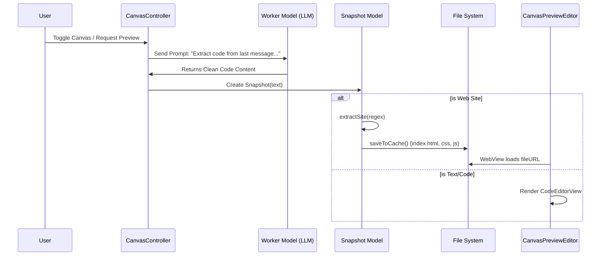

# Sidekick UI & System Analysis

## 1. User Interface (UI) Architecture
Sidekick uses a modern, modular **SwiftUI** architecture, organized primarily within the `Views` directory. The application follows a split-view design typical of macOS apps.

```mermaid
graph TD
    CMV[ConversationManagerView] -->|NavigationSplitView| Split[Split Layer]
    
    subgraph Sidebar
    Split -->|Content| CNLV[ConversationNavigationListView]
    Split -->|Footer| CSB[ConversationSidebarButtons]
    end
    
    subgraph Detail_Area [Detail Area]
    Split -->|Detail| HSplit[HSplitView]
    HSplit -->|Left| Chat[ConversationView]
    HSplit -- Conditional -->|Right| Canvas[CanvasView]
    end
    
    Canvas --> CPE[CanvasPreviewEditor]
    
    %% State Connections
    State[ConversationState] -.->|Observes| CMV
    State -.->|Controls Visibility| Canvas
```

### Core Orchestration (`ConversationManagerView`)
The `ConversationManagerView.swift` is the root container for the main application interface.
-   **Structure**: Uses a `NavigationSplitView` to separate the `conversationList` (sidebar) from the `conversationView` (detail).
-   **Dynamic Layout**: The `conversationView` leverages an `HSplitView`. This allows the Chat (`ConversationView`) and the Canvas (`CanvasView`) to sit side-by-side. The Canvas is conditionally rendered based on `ConversationState.useCanvas`.
-   **State Management**:
    -   It observes global objects: `AppState`, `ExpertManager`, `Model` (shared), and `ConversationState`.
    -   It acts as the central event hub, listening for NotificationCenter events like `notifications.newConversation` to trigger UI animations or state resets.
-   **Toolbar**: The toolbar is dynamic, hosting the `ModelSelectorDropdown`, `ExpertSelectionMenu`, and the `canvasToggle`. Uniquely, the toolbar background adapts to the "Expert Color" of the currently selected AI persona.

### Data Flow & Design Rationale
The UI is strictly reactive. It never "polls" for data. Instead, it relies on the `ObservableObject` pattern.
1.  **User Action**: A user clicks a conversation in the sidebar (`ConversationNavigationListView`).
2.  **State Update**: This updates `ConversationState.selectedConversationId`.
3.  **UI Reaction**: `ConversationManagerView` (observing this state) forces the `HSplitView` to reload the `ConversationView` with the new ID.
4.  **Canvas Sync**: A persistent standard is that switching conversations *closes* the Canvas (`useCanvas = false`) to prevent showing mismatched content, ensuring a clean context switch.

## 2. Canvas & Web Renderer
The **Canvas** system is a sophisticated "Live Preview" mechanism managed by `CanvasController`. It bridges the gap between raw LLM text output and rendered content.



### Logic Controller (`CanvasController`)
-   **Extraction Workflow**: The `extractSnapshot` method is the heart of this system.
    1.  **Trigger**: When a user requests a preview (or auto-trigger), it identifies the most recent Assistant message.
    2.  **Prompt Engineering**: It constructs a specialized prompt to a "Worker Model" (a smaller, faster LLM) asking it to *only* extract the code/content from the previous message, stripping away conversational filler.
    3.  **Refinement**: It strips "Reasoning Traces" (`<think>` blocks) from the worker's output to ensure clean code.
    4.  **Creation**: It instantiates a `Snapshot` object with this clean content and attaches it to the Message.

### View Layer
-   **Container**: `CanvasView` observes the controller. If extraction is in progress, it likely shows a loading state. Once ready, it displays the `CanvasPreviewEditor`.
-   **Editor/Renderer**: `CanvasPreviewEditor` routes the content based on type:
    -   **Text/Code**: Uses `SnapshotTextEditor`, which wraps the `CodeEditorView` package for syntax highlighting. It syncs edits back to the `Snapshot` model bi-directionally using `loadSnapshotText` and `saveSnapshotText`.
    -   **Web**: Uses `WebView` (via `WebViewKit`), loading content directly from a local cache structure.

### Web Content Extraction (`Snapshot.Site`)
-   **Regex Parsing**: The `extractSite(from:)` method uses the regex `""```(\\w+)?\\n([\\s\\S]*?)```""` to parse code blocks. It specifically looks for `html`, `css`, and `js`/`javascript` language tags to populate the site model.
-   **Local Caching**: The `saveToCache()` method creates a sandboxed directory structure in `~/Library/Caches/.../Canvas/{UUID}/`.
    -   **Security & Paths**: By writing `index.html`, `styles.css`, and `script.js` to a real directory, the `WKWebView` can handle relative paths (e.g., `<link rel="stylesheet" href="styles.css">`) natively without complex interception logic.
    -   **Persistence**: This cache persists across sessions, allowing users to revisit old conversations and still see the rendered output.

## 3. Document Exporter
Sidekick features a robust document export system, primarily focused on exporting the content visible in the Canvas (Snapshots).

### Export Logic (`SnapshotExportButton`)
The `SnapshotExportButton` provides specific modal sheets based on the content type:

1.  **Text Export**:
    -   **UI**: `TextExportView` allows the user to define a filename and extension (defaulting to .md).
    -   **Implementation**: It writes the raw `Snapshot.text` string to the target URL using `atomically: true` and `utf8` encoding. This handles standard code files (Python, Swift) or Markdown documents.

2.  **Site Export**:
    -   **UI**: `SiteExportView` asks for a folder name.
    -   **Implementation**:
        -   Calls `snapshot.site?.export(name:outputDirUrl:)`.
        -   This method first ensures the site is fully materialized in the local cache (`saveToCache()`).
        -   It then uses `FileManager.default.copyItem` to duplicate the *entire cached directory* to the user's destination. This ensures that the exported site is a self-contained, working unit with all its assets.

## 4. Settings & Inference Wiring
The settings system connects user preferences directly to the underlying `llama-server` process management.

```mermaid
graph LR
    subgraph UI Layer
    ISV[InferenceSettingsView] -->|Modifies| AppStore[@AppStorage]
    AppStore -->|Notification| NC[NotificationCenter]
    end

    subgraph Logic Layer
    NC -->|'ChangedInferenceConfig'| Model[Model.shared]
    Model -->|Read Settings| IS[InferenceSettings Static]
    end

    subgraph Backend
    Model -->|Restart| Server[LlamaServer Process]
    IS -->|Args: GPU, Context, Threads| Server
    end
```

### Inference Configuration (`InferenceSettingsView`)
This is the most complex settings page, managing the local AI backend.
-   **Model Management**: Users can select file paths for:
    -   **Main Model**: The primary LLM.
    -   **Worker Model**: A smaller model for fast tasks (like the Canvas extraction described above). Separating this allows the heavy "Main Model" to focus on chat, while a quantization-friendly "Worker" handles background utility tasks swiftly.
    -   **Draft Model**: For Speculative Decoding (speeding up inference).
    -   **Projector**: A CLIP/Vision projector for multimodal capabilities.
-   **Advanced Parameters**:
    -   **Context Compression**: Configurable token thresholds that determine when the system should summarize tool outputs to save context window space. This is critical for "Agentic" workflows where tool outputs (like `ls -R`) can be huge.
    -   **Server Arguments**: A specialized `ServerArgumentsEditor` allows power users to inject raw command-line flags directly into the underlying `llama-server` process. This is a "safety valve" feature, ensuring that as `llama.cpp` evolves, Sidekick users can use new flags before the UI officially supports them.
-   **Performance**: Toggles for GPU acceleration and `useSpeculativeDecoding` directly modify the launch arguments for the inference engine.

### The Inference Loop (`Model+Inference.swift`)
The connection between UI and Backend is handled by the `listenThinkRespond` loop:
1.  **User Input**: `ConversationView` sends a message.
2.  **Processing**: `Model.shared` takes over.
    -   It builds a `MessageSubset` (optimizing context).
    -   It checks for "Tool Calls".
3.  **Agentic Loop**: If tools are called, it enters a `while` loop (max 30 iterations) in `handleFunctionCall`.
    -   It executes the tool.
    -   It feeds the result back to the LLM.
    -   **Circuit Breaking**: It monitors for "Malformed Tool Calls". If the model fails 3 times in a row, it breaks the loop to prevent infinite error generation.
4.  **Streaming**: Throughout this, it streams text via `handleCompletionProgress` callbacks, ensuring the UI remains responsive (`pendingMessage` updates in real-time).
