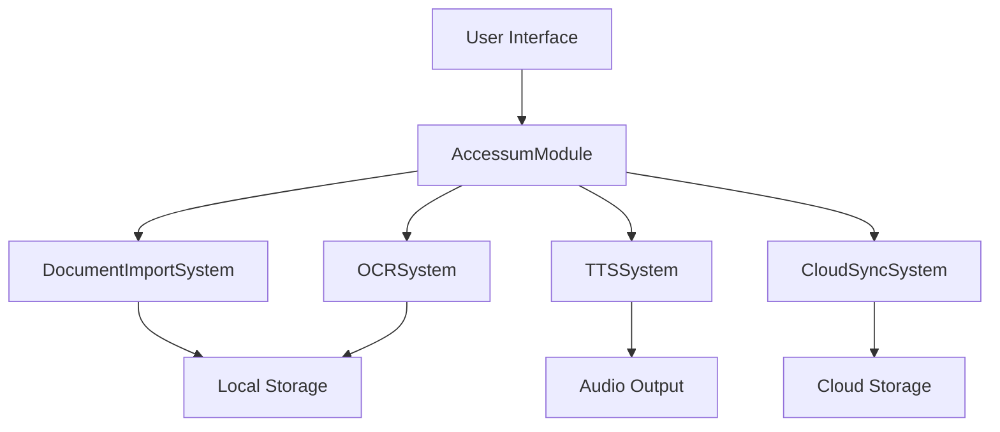

# AccessumModule

**Client-side accessibility workflow engine.**

`AccessumModule` provides the core logic and systems for the Apertum Accessum client application. it focuses on efficient, accessible workflows for end-users, including document ingestion, OCR processing, Text-to-Speech (TTS) preparation, and cloud synchronization.

## Architecture

Accessum translates high-level user actions into ECS-based processing flows:



## Core Components

### 1. ECS Components
- `DocumentComponent`: Metadata and state for imported documents (title, author, size).
- `OcrStateComponent`: Progress and results of OCR processing for a document.
- `AccessibilityProfileComponent`: User-specific preferences for adapting content (font size, contrast, speech rate).
- `ImportStateComponent`: Tracks the lifecycle of a document from source selection to local ingestion.

### 2. Client-Side Systems
- **DocumentImportSystem**: Handles different source types (File Picker, URL, Camera) and initiates the local ingestion process.
- **OCRSystem**: Coordinates OCR processing, often leveraging `CapabilityCore` and `PlatformCore` for high-performance extraction.
- **TTSSystem**: Manages state for Text-to-Speech playback, including highlighting current text and handling user transport controls.
- **CloudSyncSystem**: Safely synchronizes accessible documents and user profiles across devices while maintaining privacy and offline-first availability.

### 3. Workflows
Standardized sequences for common user tasks:
- `DocumentImportWorkflow`: The complete path from selecting a file to having it ready for reading.
- `OcrProcessingWorkflow`: Background extraction of text from image-based PDFs or photos.

## Usage

### Registering with ECS
```swift
import AccessumModule

try await AccessumModule.register(
    world: world,
    registry: workflowRegistry,
    telemetry: telemetryClient
)
```

### Initiating an Import
```swift
// Components are often created in the UI layer and added to the world
let entityId = await world.createEntity()
await world.addComponent(entityId, DocumentComponent(title: "LectureNotes.pdf"))
await world.addComponent(entityId, ImportStateComponent(source: .localFile(url: sourceURL)))

// The DocumentImportSystem will detect this and begin processing
```

## Resilience & Performance

- **Offline-First**: Designed to work without network connectivity; the `SyncSystem` handles eventual consistency with the cloud.
- **Background Processing**: Heavy operations like OCR are conducted using low-priority background threads to keep the UI responsive.
- **Telemetry**: Integrated with `TelemetryCore` to monitor operation success rates and performance metrics.

## Dependencies

- **AnigmaCore**: Core ECS framework and entity management.
- **TelemetryCore**: Performance monitoring and error reporting.
- **DatabaseCore**: Local persistence of document metadata and state.

## See Also

- [User Accessibility Guidelines](../../Docs/ux/accessibility-guidelines.md)
- [Client Integration Manual](../../Docs/apps/accessum-integration.md)
