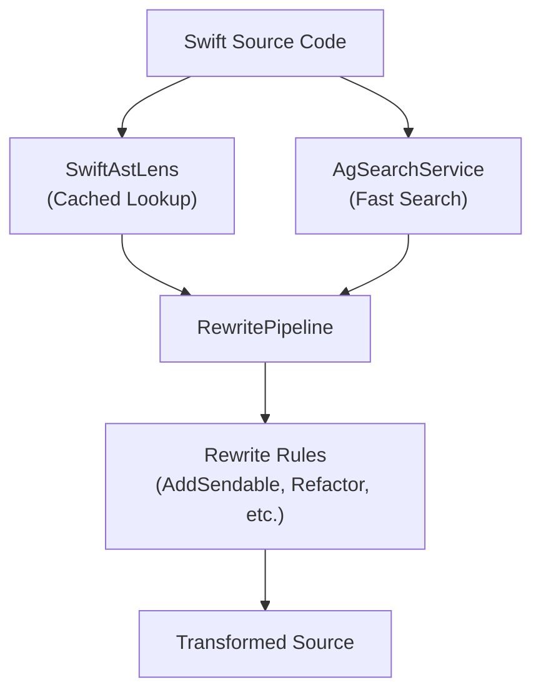

# AnigmaASTServices

**High-performance Swift AST analysis and transformation services.**

`AnigmaASTServices` provides a clean, efficient façade over `SwiftSyntax` for analyzing and rewriting Swift source code. It is designed to minimize the performance overhead of AST operations while providing high-level tools for architectural analysis, code search, and automated refactoring.

## Architecture

The module abstracts complex AST operations into a structured analysis and rewrite pipeline:



## Core Components

### 1. SwiftAstLens (Analysis)
An intelligent caching layer over `SwiftSyntax`.
- **Fast Lookup**: Efficiently retrieves class, struct, and function definitions without re-parsing the entire tree for every query.
- **Reference Resolution**: Identifies relationships between different code symbols within a file.
- **Caching**: Minimizes redundant parsing operations across the rewrite pipeline.

### 2. AgSearchService (Search)
A "pre-filter" service for fast code searching.
- **Heuristic Search**: Uses light-weight parsing and regex pre-filters to quickly identify files that *might* match a pattern before committing to full AST analysis.
- **Integration**: Feeds candidates into the `RewritePipeline` for deep inspection and modification.

### 3. Rewrite Infrastructure
- **RewritePipeline**: Manages the application of multiple transformations to a source file, ensuring that the AST remains valid between passes.
- **RewriteRule**: A protocol-based interface for individual transformations. Instances include the `AddSendableToValueTypesRule`, which automatically identifies and corrects missing concurrency markings.
- **ASTFacade**: A high-level entry point that simplifies common tasks like finding all subclasses of a specific type or renaming a private property.

## Usage

### Analyzing a File
```swift
import AnigmaASTServices

let lens = try SwiftAstLens(sourceFile: URL(fileURLWithPath: "MyFile.swift"))
let classes = lens.findClasses(inheritingFrom: "System")

for cls in classes {
    print("Found system: \(cls.name)")
}
```

### Running a Rewrite Pipeline
```swift
let pipeline = RewritePipeline()
pipeline.addRule(AddSendableToValueTypesRule())

let (result, changed) = try pipeline.rewrite(
    sourceText: originalCode, 
    fileName: "Models.swift"
)

if changed {
    try result.write(to: outputURL, atomically: true, encoding: .utf8)
}
```

### Fast Code Search
```swift
let searchService = AgSearchService()
let candidates = try await searchService.search(
    query: "World.registerSystem",
    in: sourcesDirectory
)

// Process candidates with full AST analysis
```

## Performance & Safety

- **SwiftSyntax Façade**: Prevents leakages of heavy `SwiftSyntax` types into the broader application build chain, keeping compile times manageable.
- **Buffered Rewriting**: Transformations are applied to an in-memory representation, ensuring that file I/O only occurs once the entire pipeline is complete.
- **Strict Concurrency**: Fully enabled across the module to ensure safe multi-threaded code analysis.

## Dependencies

- **SwiftSyntax**: The underlying Apple-provided AST parser.
- **AnigmaCore**: Basic architectural types.
- **Foundation**: File and string handling.

## See Also

- [Architectural Analysis Guide](../../Docs/analysis/ast-analysis.md)
- [Writing Custom Rewrite Rules](../../Docs/refactoring/rewrite-rules.md)
