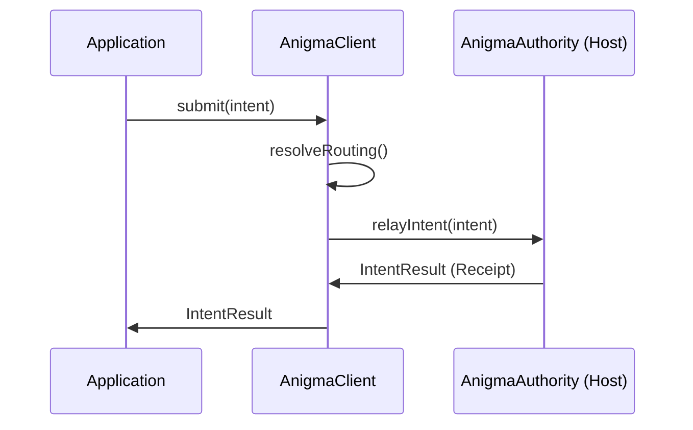

# AnigmaClientKit

**The client-side SDK for interacting with the Anigma ecosystem.**

`AnigmaClientKit` provides the public interface for applications to communicate with an Anigma Authority. It simplifies intent creation, routing, and response handling.

## Architecture



## Core Components

### AnigmaClient
The primary entry point for client-side operations.

```swift
public final class AnigmaClient: Sendable {
    public func submit(_ intent: ActionIntent) async throws -> IntentResult
}
```

### AuthorityRouting
Logic for locating and connecting to an available `AnigmaAuthority`.

## Key Features

- **Declarative Intents**: Send structured actions rather than direct API calls.
- **Automatic Routing**: Locates the appropriate authority for a given intent domain.
- **Receipt Handling**: Integrated support for processing cryptographically signed receipts.
- **SDK Surface**: Ultra-thin API surface to minimize client-side overhead.

## Usage

```swift
import AnigmaClientKit

let client = AnigmaClient()
let result = try await client.submit(
    ActionIntent(
        action: "accessum.ocr.process",
        parameters: ["file": "document.pdf"]
    )
)

if result.isSuccess {
    print("OCR completed successfully.")
}
```

## Thread Safety

- **Sendable**: All public types are `Sendable`.
- **Stateless**: The client is designed to be stateless, with state managed by the Authority.

## Dependencies

- **ContractsCore**: Action schemas and intent definitions.
- **AnigmaPrimitives**: Base types.

## See Also

- [AnigmaHostKit](../AnigmaHostKit/README.md) - The authoritative side of the communication.
- [ContractsCore](../ContractsCore/README.md) - Definitions for all valid intents.

## License

Part of the Anigma project. See LICENSE for details.
