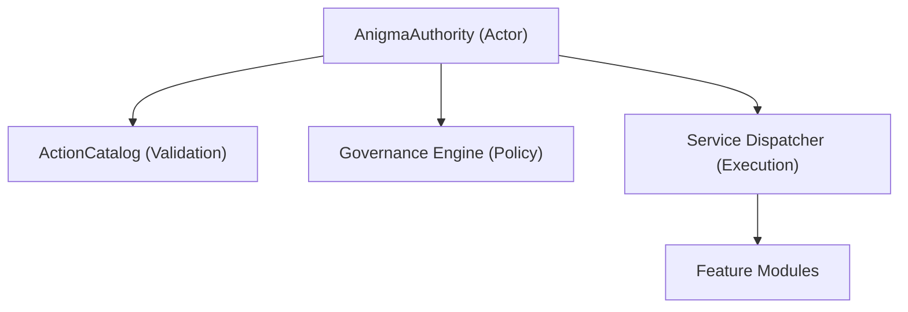

# AnigmaHostKit

**The authoritative host SDK for the Anigma ecosystem.**

`AnigmaHostKit` provides the infrastructure for hosting an Anigma Authority. It handles intent validation, declarative routing, and governance enforcement on the host side.

## Architecture



## Core Components

### AnigmaAuthority
The central authority that validates and routes intents. It ensures that every incoming action conforms to the declarative schema and security policies.

```swift
public actor AnigmaAuthority {
    public func validateAndRouteIntent(_ intent: ActionIntent) async -> IntentResult
}
```

## Key Features

- **Schema Validation**: Guarantees that intents match the expected parameters and types.
- **Governed Routing**: Enforces security policies before any service is invoked.
- **Authoritative Truth**: Provides a single point of truth for the current state of the hosted environment.
- **Service Integration**: Seamlessly maps intents to concrete service implementations.

## Usage

```swift
import AnigmaHostKit

let authority = AnigmaAuthority()
// The authority is typically initialized with a set of registered services and a governance policy.
```

## Thread Safety

- **Actors**: `AnigmaAuthority` is an actor, ensuring serialized processing of intents.
- **Sendability**: All results and intents are `Sendable`.

## Dependencies

- **ContractsCore**: The source of truth for action definitions (`ActionCatalog`).
- **AnigmaCore**: Basic infrastructure and governance hooks.
- **GovernanceCore**: Policy enforcement mechanisms.

## See Also

- [AnigmaClientKit](../AnigmaClientKit/README.md) - The client-side counterpart.
- [ContractsCore](../ContractsCore/README.md) - Action definitions and catalogs.

## License

Part of the Anigma project. See LICENSE for details.
