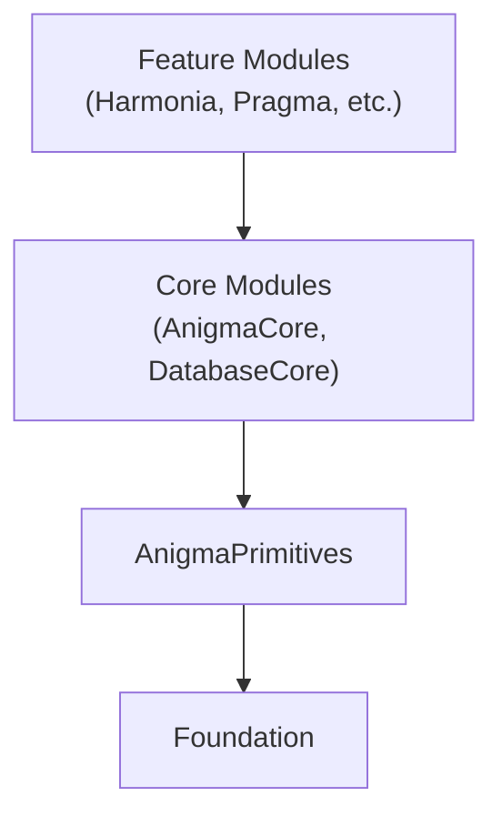

# AnigmaPrimitives

**The immutable contract layer for the Anigma ecosystem.**

`AnigmaPrimitives` is the single dependency-free home for every contract that must be shared across the Sigma spine. It provides the fundamental types, enums, and protocols that define the repository's core logic without introducing implementation baggage.

## Architecture

`AnigmaPrimitives` sits at the very bottom of the dependency graph:



## Core Principles

1. **Dependency-Free**: May depend only on `Foundation`.
2. **Contract Only**: Only publishes enums, DTOs (Data Transfer Objects), and protocols.
3. **Immutable**: Intentional friction for changes to ensure stability across the ecosystem.
4. **Shared Reality**: If two modules need to talk about the same concept (e.g., a "Trust Tier"), it belongs here.

## Key Components

### Governance Primitives
Fundamental enums that express the shared policy surface:
- `TrustTier`: Defines security clearance levels.
- `GovernanceMode`: Defines how policies are enforced.

### Migration Contracts
Low-level DTOs used for transport between the engine and its wrappers:
- `MigrationTaskRow`: Database representation of a migration task.
- `MigrationTraceSink`: Protocol for recording execution traces.

### Tooling Primitives
Thin helpers that hide implementation details while exposing safe interfaces:
- `BLAKE3Digest`: Protocol for BLAKE3 hashing operations.
- `SQLiteDestructor`: Safe binding helpers for C-level SQLite details.

## Usage

### Defining a Contract
When adding a new shared concept, ensure it is internal-logic free:

```swift
/// Shared trust tier used for governance checks.
public enum TrustTier: Int, Codable, Sendable {
    case untrusted = 0
    case validated = 1
    case verified = 2
}
```

### Implementing a Primitive Gateway
Modules implement protocols defined here to ensure interface consistency:

```swift
/// Protocol for a system that can process migration tasks.
public protocol MigrationEngine: Actor {
    func execute(task: MigrationTaskRow) async throws -> MigrationResult
}
```

## Module Guidelines

### ✅ Allowed Contents
- Shared enums (e.g., `Severity`, `TrustTier`).
- Transport structs/DTOs.
- Policy-defining protocols.
- Foundation-only extensions.

### ❌ Forbidden Contents
- Database connection handling or GRDB logic.
- CLI argument parsing or implementation.
- `SwiftSyntax` or external library dependencies.
- Business logic or complex computations.

## Thread Safety

- All types defined in primitives **must** conform to `Sendable`.
- Reference types should be avoided; prefer `struct` and `enum`.
- Strict concurrency mode is enabled.

## Dependencies

- **Foundation**: Standard library only.

## See Also

- [AnigmaCore](../AnigmaCore/README.md) - Foundation implementation.
- [ContractsCore](../ContractsCore/README.md) - Versioned implementation of shared contracts.
