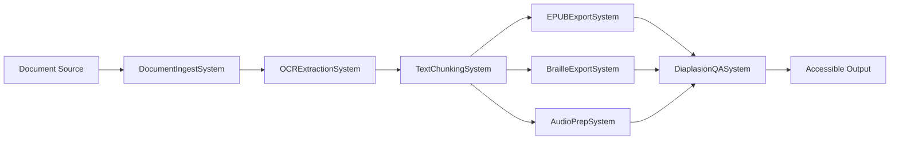

# DiaplasionModule

**The accessible media transformation engine of the Anigma ecosystem.**

`DiaplasionModule` (from Greek *διάπλασις* – reshaping / remolding) is responsible for taking source documents and transforming them into accessible alternative formats. It provides the pipelines for OCR extraction, semantic text chunking, and exporting to EPUB, Braille, and audio-ready formats.

## Architecture

Diaplasion operates through a series of ECS systems that form a transformation pipeline:



## Core Components

### 1. ECS Components
- `DocumentSourceComponent`: Reference to the original source document and its format.
- `IngestedDocumentComponent`: Extracted page images and metadata ready for OCR.
- `OCRResultComponent`: The raw text results from OCR extraction with confidence scores.
- `ChunkedTextComponent`: Semantically grouped text segments for easier navigation and processing.
- `AccessibleOutputComponent`: References to the final generated accessible files.

### 2. Pipeline Systems
- **DocumentIngestSystem**: Loads source files and prepares them (e.g., rasterizing PDF pages at high DPI).
- **OCRExtractionSystem**: Performs high-accuracy OCR on images using platform-specific capabilities.
- **TextChunkingSystem**: Groups raw text into logical chapters, sections, and paragraphs.
- **Export Systems**: Generates the final files (EPUB 3, UEB Grade 2 Braille, Audio-ready SSML).
- **DiaplasionQASystem**: Validates that the output meets accessibility standards (compliance check).

### 3. Workflows
Pre-defined automation pipelines for common transformations:
- `DocumentToEPUBWorkflow`: Full pipeline for converting a document to an accessible EPUB.
- `DocumentToBrailleWorkflow`: Full pipeline for generating Braille-ready files (BRF/PEF).
- `DocumentToAudioWorkflow`: Prepares text for optimal Text-to-Speech (TTS) usage.
- `MultiFormatWorkflow`: Generates multiple accessible versions in a single pass.

## Usage

### Registering with ECS
```swift
import DiaplasionModule

try await DiaplasionModule.register(
    world: world,
    registry: workflowRegistry,
    runner: workflowRunner
)
```

### Manual Pipeline Execution
If you need to perform an operation outside of a formal workflow:

```swift
let pipeline = DiaplasionModule.createOCRPipeline(
    renderDPI: 300.0,
    recognitionLevel: .accurate
)

// Add systems to a temporary world or execution context
for system in pipeline {
    await world.registerSystem(system)
}
```

### Transformation Jobs
```swift
let jobId = DiaplasionJobType.documentToEPUB
// Use this with the JobSystem to track progress and results.
```

## Thread Safety

- **Stateless Systems**: Most systems in Diaplasion are stateless, operating solely on the components they find in the ECS world.
- **Parallel Processing**: Transformation of individual pages can often occur in parallel across multiple worker threads.
- **Strict Concurrency**: Fully enabled across the module.

## Dependencies

- **AnigmaCore**: ECS, components, and fundamental systems.
- **CapabilityCore**: High-level interfaces for PDF rendering and OCR.
- **PlatformCore**: Concrete implementations of transformation capabilities.

## See Also

- [Alt-Media Specifications](../../Docs/accessibility/alt-media-spec.md)
- [Workflow Guide](../../Docs/pipelines/diaplasion-workflows.md)
