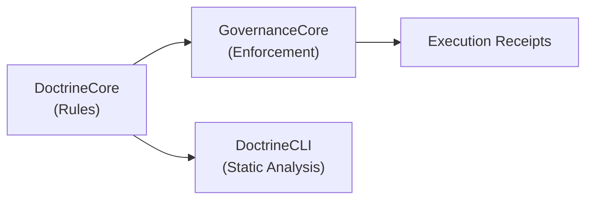

# DoctrineCore

**Architectural and security doctrine definitions for Anigma.**

`DoctrineCore` defines the "doctrines" (rules, constraints, and principles) that govern the development and runtime behavior of the Anigma platform. It provides the core types for defining rules that can be evaluated during execution to prevent architectural regression or security violations.

## Concepts

`DoctrineCore` acts as the library of architectural standards. These rules are then enforced by systems in `GovernanceCore` or checked statically by the `DoctrineCLI`.



### Doctrine Rule
A single rule definition that specifies a constraint and its violation severity.

```swift
public struct DoctrineRule: Codable, Sendable {
    public let id: String
    public let name: String
    public let description: String
    public let severity: DoctrineSeverity
}
```

### Doctrine Set
A collection of rules that apply to a specific context, module, or trust tier.

## Built-in Severities

- **Notice**: Minor architectural advisory. No execution impact.
- **Warning**: Potential regression. Logged as a non-breaking event.
- **Error**: Significant violation. Blocks non-critical automated flows.
- **Critical**: Security or catastrophic violation. Triggers emergency halt or denial of service.

## Usage

Doctrines are defined in `DoctrineCore` and evaluated during critical operations (like repository migrations or tool executions).

```swift
let strictConcurrencyDoctrine = DoctrineRule(
    id: "ARCH-001",
    name: "Strict Concurrency",
    description: "Target must have SWIFT_STRICT_CONCURRENCY set to complete.",
    severity: .error
)
```

## Thread Safety

- **Sendable**: All doctrine types are `Sendable` immutable structs.
- **Immutability**: Once defined, rules are treated as immutable constants.

## Dependencies

- **AnigmaPrimitives**: Base enums and trust tier definitions.

## See Also

- [GovernanceCore](../GovernanceCore/README.md) - The engine that evaluates these doctrines.
- [SecurityEventsManager](../SecurityEventsManager/README.md) - Monitors for doctrine violations.
- [DoctrineCLI](../../Sources/DoctrineCLI/README.md) - Static analysis tool for doctrine enforcement.

## License

Part of the Anigma project. See LICENSE for details.
