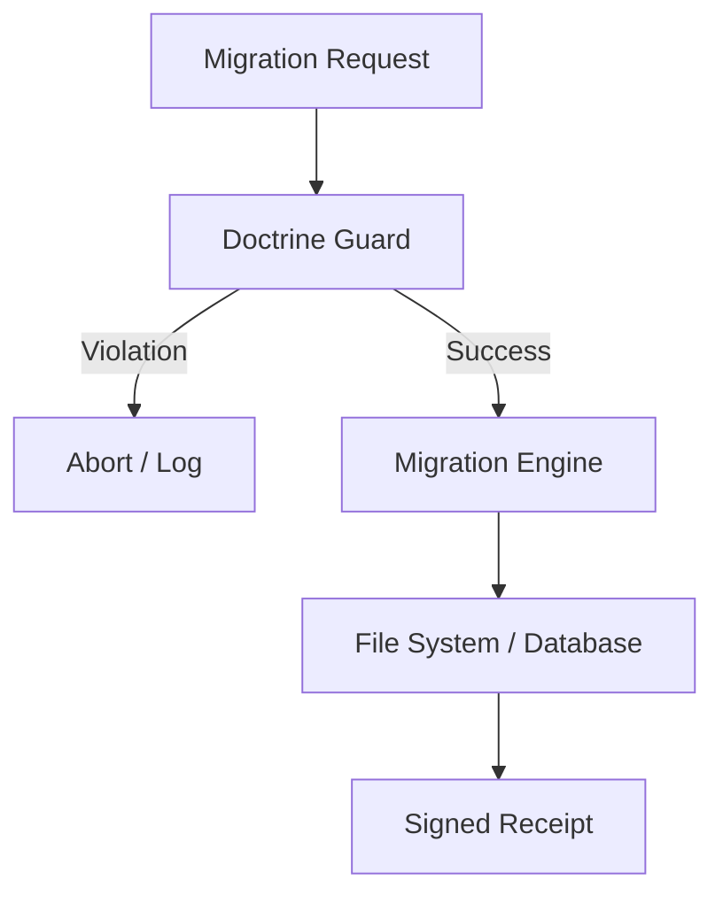

# GovernedMigrationCore

**Automated, doctrine-enforced migrations for the Anigma repository.**

`GovernedMigrationCore` is responsible for applying large-scale architectural or data changes across the codebase. It ensures that all migrations are performed safely, transparently, and in alignment with the platform's architectural doctrines.

## Architecture



## Core Components

### GovernedMigrationEngine
The central orchestrator for migration tasks.

### DoctrineGuard
Performs pre-migration checks against `DoctrineCore` rules to prevent violations during the migration process.

### MigrationReceipt
A cryptographically signed record of a completed migration.

## Key Features

- **Gated Execution**: Migrations cannot proceed if they violate critical doctrines (e.g., introducing non-Sendable shared state).
- **Atomic Operations**: Ensures that migrations are applied completely or not at all.
- **Auditable History**: Logs every migration task with a full trace of changes.
- **Rollback Support**: (Planned) Logic for reverting failed migrations.

## Usage

```swift
import GovernedMigrationCore

let engine = GovernedMigrationEngine()
try await engine.execute(migration: StrictConcurrencyMigration())
```

## Thread Safety

- **Actors**: `GovernedMigrationEngine` is an actor.
- **Safety**: Designed to prevent concurrent migrations on the same target.

## Dependencies

- **DoctrineCore**: For rule enforcement.
- **ExecutionCore**: For receipt generation.
- **AnigmaASTServices**: For source code analysis and transformation.

## See Also

- [DoctrineCore](../DoctrineCore/README.md)
- [AnigmaASTServices](../AnigmaASTServices/README.md)

## License

Part of the Anigma project. See LICENSE for details.
