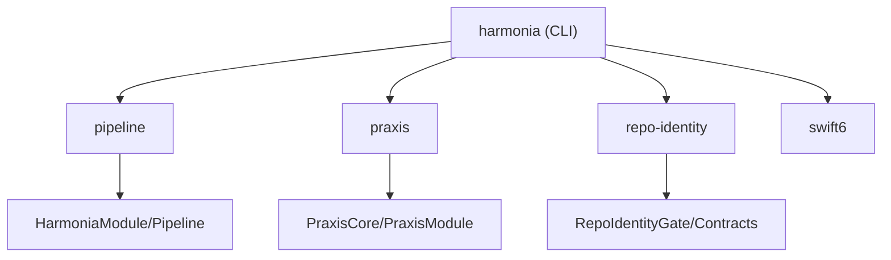

# HarmoniaCLI

**The primary command-line interface for the Anigma ecosystem.**

`HarmoniaCLI` (aliased as `harmonia`) is the unified entry point for administrative, diagnostic, and developer operations. It consolidates management of pipelines, praxis sessions, and repository identity.

## Architecture

`HarmoniaCLI` uses a subcommand-based structure powered by `swift-argument-parser`. It bridges human-readable commands to the underlying core modules.



## Global Options

| Option | Description |
|--------|-------------|
| `--format` | Output format (text or json). Defaults to `json`. |
| `--help` | Show help information. |

## Subcommands

### 1. pipeline
Manage and inspect transformation pipelines.
```bash
harmonia pipeline status
```

### 2. praxis
Manage execution sessions and boundary tickets.
```bash
harmonia praxis session list
```

### 3. repo-identity
Verify or update the repository trust identity.
```bash
harmonia repo-identity status
```

### 4. swift6
Execute Swift 6 compatibility and concurrency checks.
```bash
harmonia swift6 build
harmonia swift6 test
```

## Integration Patterns

### Automated Scripting
`HarmoniaCLI` is designed to be wrapped by shell scripts (like `Scripts/harmonia.sh`). It outputs deterministic JSON, making it ideal for integration into CI/CD pipelines.

```bash
# Example from harmful.sh
output=$(harmonia --format json praxis session create)
session_id=$(echo $output | jq -r .payload.sessionId)
```

## Thread Safety

- All commands that mutate state do so through actors in the underlying core modules.
- CLI execution is sequential per invocation.

## Dependencies

- **AnigmaCore**: Basic infrastructure.
- **HarmoniaModule**: Shared logic and pipeline drivers.
- **PraxisModule**: Execution session management.
- **ArgumentParser**: CLI framework.

## License

Part of the Anigma project. See LICENSE for details.
