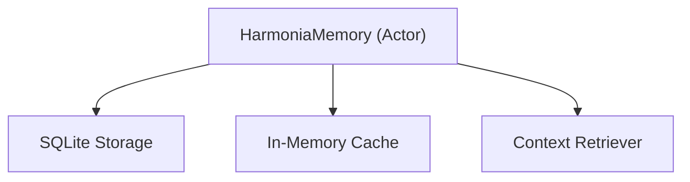

# HarmoniaMemory

**Persisted context and short-term memory for the Harmonia module.**

`HarmoniaMemory` provides a structured way to store and retrieve contextual information, session state, and historical data used by the Harmonia capability. It leverages SQLite for persistence and exposes an ECS-aligned interface for memory operations.

## Architecture



## Core Components

### HarmoniaMemoryStore
The central actor managing the persistent memory store.

### MemoryRecord
A structured unit of memory, including timestamps, tags, and content.

## Key Features

- **Persistent Context**: Retain information across sessions using SQLite.
- **Fast Retrieval**: Optimized indexing for quick context lookup.
- **ECS Integration**: Stores memory as entities with relevant components for easy queryability.
- **Short-term vs Long-term**: Built-in support for different memory lifecycle policies.

## Usage

```swift
import HarmoniaMemory

let memory = HarmoniaMemoryStore()
await memory.store(record: MemoryRecord(
    content: "User preferred high contrast mode.",
    tags: ["ui-ref", "accessibility"]
))
```

## Thread Safety

- **Actors**: All memory stores are implemented as actors.
- **Database Isolation**: Handled via `DatabaseCore`'s thread-safe connection pool.

## Dependencies

- **DatabaseCore**: For SQLite persistence.
- **AnigmaCore**: For ECS integration.
- **HarmoniaModule**: The primary consumer of this module.

## See Also

- [HarmoniaModule](../HarmoniaModule/README.md) - The module that uses this memory system.
- [DatabaseCore](../DatabaseCore/README.md) - The underlying persistence layer.

## License

Part of the Anigma project. See LICENSE for details.
