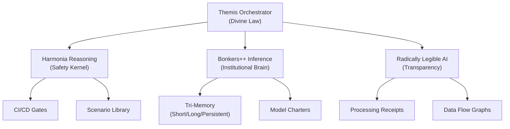

# HarmoniaModule

**The agentic core and reasoning kernel of the Anigma ecosystem.**

`HarmoniaModule` provides the high-level intelligence and governance necessary for autonomous code orchestration. It integrates reasoning analysis, institutional inference, and radical transparency to ensure that AI-driven operations are safe, compliant, and legible.

## Architecture

Harmonia is built on a tiered intelligence architecture:



## Core Components

### 1. Harmonia Reasoning Kernel
The "preflight brain" that analyzes structural changes before they are applied.
- **Safety Analysis**: Evaluates workflow safety and blocks dangerous operations.
- **CI/CD Gates**: Enforces quality and security gates during the development lifecycle.
- **Scenario Library**: A collection of adversarial scenarios used for regression testing.

### 2. Bonkers++ Inference System
An institution-grade inference engine designed for regulated environments (like CCSF DSPS).
- **Institutional Charters**: Defines the "constitution" for model behavior and learning.
- **Tri-Memory Architecture**: Manages context across Short-Term (Lethe), Long-Term (Mnemosyne), and Persistent (Archeion) storage.
- **Behavior Governance**: Real-time enforcement of agent constraints (Eunomia).

### 3. Radically Legible AI (Transparency)
Ensures every AI operation is auditable and understandable to humans.
- **Aletheia Receipts**: Cryptographically signed records of exactly what happened during an inference task.
- **Data Flow Transparency**: Visualizes how data moved through the system.
- **Reasoning Traces**: Provides structured explanations for AI decisions.

### 4. Themis Architecture
The unified, canonical entry point for all governed inference in Anigma.
- **Themis**: Governance and divine law.
- **Moirae**: Self-tuning routing and selection (the fates).
- **Arete**: Learning impact measurement (excellence).
- **Eris**: Adversarial testing and strife.

## Usage

### Registering with ECS
```swift
import HarmoniaModule

try await HarmoniaModule.register(
    world: world,
    registry: workflowRegistry,
    telemetryClient: telemetry
)
```

### Using Themis Orchestrator
```swift
// Create orchestrator for CCSF DSPS
let themis = await HarmoniaModule.createCCSFDSPSThemis()

// Start a governed session
let session = await themis.startSession(
    tenantId: "ccsf",
    principalId: "staff_01",
    domain: .dsps
)

// Run a governed task
let result = try await themis.runTask(myTask, session: session)
print("Task Receipt ID: \(result.receipt.id)")
```

### Safety Analysis
```swift
let infra = await HarmoniaModule.createReasoningInfrastructure(auditLog: auditLog)
let safetyReport = try await infra.reasoningService.analyzeWorkflowSafety(workflow)

if safetyReport.verdict == .blocked {
    print("Operation blocked: \(safetyReport.reason)")
}
```

## Thread Safety

`HarmoniaModule` is designed for high-concurrency environments:
- **Registry & Orchestrators**: Are implemented as `actors`.
- **Inference Sessions**: Are isolated and thread-safe.
- **Strict Concurrency**: Fully enabled across the module.

## Dependencies

- **AnigmaCore**: ECS and fundamental governance.
- **TelemetryCore**: Metrics and event logging.
- **ExecutionCore**: Workflow execution and phase gates.
- **DoctrineCore**: Architectural constraints.

## See Also

- [Themis Governance Guide](../../Docs/governance/themis-architecture.md)
- [Radically Legible AI Specification](../../Docs/transparency/radically-legible-ai.md)
- [Bonkers++ Inference Manual](../../Docs/inference/bonkers-manual.md)
