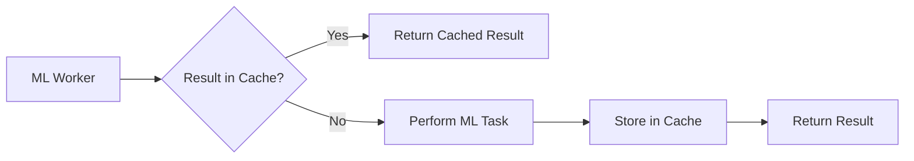

# MLOutputCache

**Caching system for expensive ML operation results.**

`MLOutputCache` provides a simple, high-performance mechanism for caching the results of ML processing (like vector embeddings or OCR results) to avoid redundant computations.

## Architecture



## Core Components

### MLResultCache
A specialized storage handler for ML-specific outputs.

## Key Features

- **High-Performance Caching**: Optimized for storage and retrieval of large tensors/vectors.
- **Deduplication**: Uses content-based hashing to identify identical inputs.
- **Configurable Eviction**: Support for TTL and size-based cache eviction policies.
- **Deterministic**: Ensures that the same input always yields the same cached output.

## Usage

```swift
import MLOutputCache

let cache = MLResultCache()
if let cached = await cache.get(for: inputHash) {
    return cached
}
```

## Thread Safety

- **Actors**: `MLResultCache` is an actor.
- **Sendability**: All cached values are `Sendable`.

## Dependencies

- **AnigmaPrimitives**: For hashing protocols.
- **DatabaseCore**: (Optional) For persistent caching.

## See Also

- [VectorumModule](../VectorumModule/README.md) - Uses caching for vector embeddings.
- [MLWorkerCommon](../MLWorkerCommon/README.md) - Common types for ML operations.

## License

Part of the Anigma project. See LICENSE for details.
