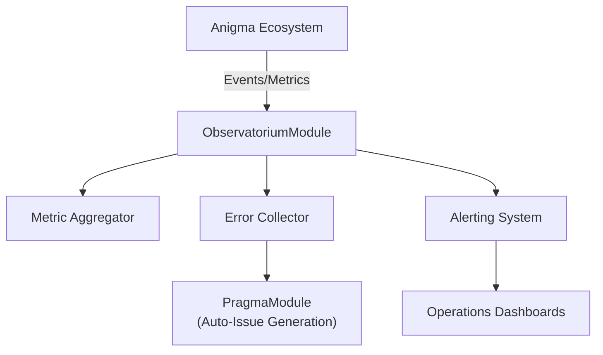

# ObservatoriumModule

**The observability and telemetry domain for the Anigma ecosystem.**

`ObservatoriumModule` (from Latin *observatorium* – "observation place") provides unified support for monitoring system health, tracking performance metrics, and managing operational telemetry. It is designed to handle high-volume data while ensuring privacy through structured redaction and providing actionable insights for institutional operations.

## Architecture

Observatorium acts as a central sink for telemetry and operational data across all modules:



## Core Components

### 1. Unified Telemetry
Captures structured events from across the system with automated redaction of sensitive information.
- **Metric Categories**: `system`, `performance`, `domain`, `user`, `error`, `security`.
- **Flexible Units**: Supports `count`, `milliseconds`, `bytes`, `percentages`, and more.

### 2. Operational Metrics (SLAs)
Tracks domain-specific Service Level Agreements (SLAs) critical for institutional workflows:
- **Alt-Media Turnaround**: Time taken from document ingestion to accessible output.
- **Case Handling Latency**: Processing time for academic record requests.
- **Inference Reliability**: Success rates and latency of AI-driven operations.

### 3. Error Aggregation & Alerting
- **Error Clustering**: Groups similar errors to avoid alert fatigue and identify systemic issues.
- **Auto-Issue Promotion**: Automatically creates work items in `PragmaModule` when specific error thresholds are exceeded.
- **Alert Severity**: Managed through `info`, `warning`, `error`, and `critical` levels.

## Core Types

### Identifiers
- `MetricId`: Unique identifier for a metric definition.
- `TelemetryEventId`: Unique identifier for an individual telemetry event.
- `ErrorRecordId`: Tracks a specific error occurrence.
- `AlertId`: Manages active alerts within the system.

### Metric Configuration
- `MetricCategory`: Logical grouping for filtering and reporting.
- `MetricUnit`: Defines the value representation (e.g., `.milliseconds`).
- `AlertSeverity`: Comparable ranking for situational awareness.

## Usage

### Module Initialization
```swift
import ObservatoriumModule

// Initialize during application bootstrap
await ObservatoriumModule.initialize()
```

### Recording a Metric
```swift
// Record a performance metric
await telemetry.recordMetric(
    name: "pdf_render_latency",
    value: 452.0,
    unit: .milliseconds,
    category: .performance
)
```

### Handling Critical Errors
```swift
if errorCount > threshold {
    // Automatically promote to a Pragma issue for investigation
    await observatorium.promoteToIssue(
        errorRecord: record,
        priority: .critical
    )
}
```

## Thread Safety

- **Non-Blocking Ingestion**: All telemetry recording is non-blocking and uses background actors to prevent bottlenecking the main application flow.
- **Thread-Safe Aggregators**: Metric collectors are implemented as `actors` to safely handle high-concurrency event streams.
- **Strict Concurrency**: Fully enabled across the module to ensure telemetry integrity.

## Dependencies

- **AnigmaCore**: Core ECS and system primitives.
- **TelemetryCore**: Low-level event processing and redaction.
- **Foundation**: Core data types and UUIDs.

## See Also

- [Operations Dashboard Guide](../../Docs/ops/dashboards.md)
- [Metric Redaction Policy](../../Docs/privacy/telemetry-redaction.md)
