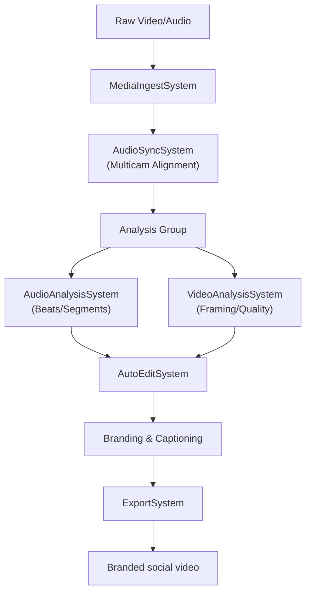

# PolytroposModule

**The live-event to social-video transformation engine.**

`PolytroposModule` (from Greek *πολύτροπος* – "of many turns, versatile, resourceful") is designed to transform multi-camera footage of live events (concerts, DJ sets, conferences, etc.) into branded, captioned, and social-media-ready clips with minimal manual intervention. It leverages audio-based synchronization and automated "Auto-Edit" logic to orchestrate complex video productions within the ECS.

## Architecture

Polytropos utilizes an analysis-driven pipeline to make editing decisions:



## Core Components

### 1. ECS Components
- `ProjectComponent`: The top-level container for an entire event shoot.
- `MediaAssetComponent`: Individual source files (e.g., Camera A, Camera B, Soundboard Audio).
- `MulticamClusterComponent`: A group of assets that have been synchronized in time.
- `TimelineComponent`: The virtual sequence of clips, transitions, and effects.
- `BrandingProfileComponent`: Artist-specific visual identity (logos, fonts, colors).

### 2. Processing Systems
- **AudioSyncSystem**: Aligns multiple cameras by cross-correlating their audio tracks.
- **AudioAnalysisSystem**: Detects beats, applauses, and song transitions to identify "hook" moments.
- **VideoAnalysisSystem**: Evaluates framing, stability, and subject visibility to choose the best camera angle.
- **AutoEditSystem**: The core logic that selects cuts and builds a timeline based on analysis features.
- **ExportSystem**: Renders the final timeline, coordinating with backends like MLT or FFmpeg.

### 3. Workflows
Predefined pipelines for production:
- `FullEventWorkflow`: End-to-end processing from raw files to exported master.
- `QuickClipWorkflow`: A fast-path for generating 15-60 second clips for social stories.
- `ReExportWorkflow`: Updates branding or format on an existing edit without re-analysis.

## Usage

### Registering with ECS
```swift
import PolytroposModule

try await PolytroposModule.register(
    world: world,
    registry: workflowRegistry,
    enableLegacyBackends: true // Enables MLT/FFmpeg support
)
```

### Creating an Event Project
```swift
let world = World()
let projectId = await world.createEntity()
await world.addComponent(projectId, ProjectComponent(name: "Live at CCSF"))

// Ingest media files
for url in cameraFiles {
    let mediaEntity = await world.createEntity()
    await world.addComponent(mediaEntity, MediaAssetComponent(url: url))
    await world.setParent(child: mediaEntity, parent: projectId)
}
```

### Initiating an Auto-Edit
```swift
let job = Job(
    typeId: PolytroposJobType.autoEdit,
    inputRefs: [projectId]
)
await world.submit(job)
```

## Rendering Backends

Polytropos is backend-agnostic and can coordinate multiple render engines:
- **Native Render**: Uses platform APIs (AVFoundation/Metal) for maximum quality.
- **MLT (Media Lovin' Toolkit)**: A mature, frame-accurate engine for complex multicam edits.
- **FFmpeg**: Used for fast transcoding and generating lightweight proxies.

## Thread Safety

- **Task-Based Parallelism**: Heavy analysis and rendering tasks are conducted via the `JobSystem` to ensure background execution.
- **Cluster Isolation**: Multicam clusters can be processed in parallel without interference.
- **Strict Concurrency**: Fully enabled across the module.

## Dependencies

- **AnigmaCore**: ECS, Job system, and resource management.
- **DatabaseCore**: Storage for project metadata and analysis results.
- **ContractsCore**: Versioned media schemas and audit trails.

## See Also

- [Multicam Sync Technical Note](../../Docs/multimedia/multicam-sync.md)
- [Auto-Edit Logic Documentation](../../Docs/ai/auto-edit.md)
