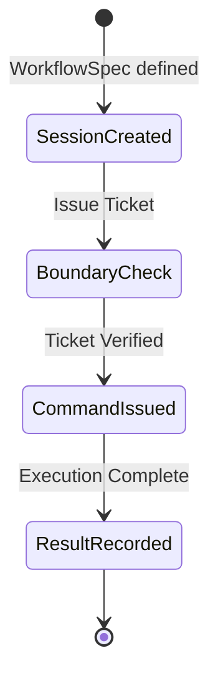

# PraxisCore

**Workflow execution and boundary management for Anigma.**

`PraxisCore` provides the mechanisms for managing execution sessions, workflow specifications, and repository identity gating. It defines how commands are issued, ticketed, and verified at module and trust boundaries.

## Architecture

`PraxisCore` sits at the intersection of execution management and security gating.



## Core Components

### 1. Workflow Specifications
Defines the structure, dependencies, and requirements of an automated workflow.

```swift
public struct WorkflowSpec: Codable, Sendable {
    public let id: String
    public let steps: [WorkflowStep]
    public let executionConstraints: [DoctrineRule]
}
```

### 2. Boundary Ticket Service
The security gatekeeper for crossing module or trust boundaries.

```swift
public actor BoundaryTicketService {
    public func issueTicket(for operation: String, context: TicketContext) async throws -> Ticket
    public func verifyTicket(_ ticket: Ticket) async -> Bool
}
```

### 3. Session Indexing
Maintains an indexed history of execution sessions for audit and replay.

## Core Features

- **Identity Gating**: Ensures only authorized principals can cross session boundaries.
- **Workflow State Management**: Track progress and constraints across multi-step operations.
- **Boundary Ticket System**: Cryptographically-backed tickets for intra-system communication.
- **Stack Management**: Logic for managing execution stacks and recursion limits.

## Usage Examples

### Issuing a Boundary Ticket
```swift
import PraxisCore

let service = BoundaryTicketService()
let ticket = try await service.issueTicket(
    for: "repository_write",
    context: TicketContext(principal: "Harmonia", trustTier: .verified)
)
```

## Thread Safety

- **Actors**: `BoundaryTicketService`, `PraxisSessionIndex`, and `StackManager` are all actors.
- **Sendability**: All contracts and specs conform to `Sendable`.
- **Isolation**: Strict boundary isolation enforced through the ticketing system.

## Dependencies

- **ExecutionCore**: Foundation for signed receipts.
- **AnigmaCore**: ECS and base primitives.
- **GovernanceCore**: Policy definitions.

## See Also

- [PraxisModule](../PraxisModule/README.md) - Concrete implementations and drivers.
- [ExecutionCore](../ExecutionCore/README.md) - Receipt generation and verification.

## License

Part of the Anigma project. See LICENSE for details.
