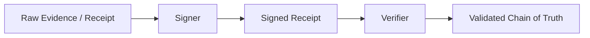

# ProvenanceSigning

**Cryptographic provenance and process integrity for Anigma.**

`ProvenanceSigning` provides the cryptographic foundation for ensuring the authenticity and integrity of system actions. It allows the system to sign receipts, verify software origins, and maintain an auditable chain of evidence.

## Architecture



## Core Components

### ProvenanceSigner
Provides methods for generating cryptographic signatures for structured data.

### ProvenanceVerifier
Validates signatures against known public keys or trust roots.

## Key Features

- **Receipt Signing**: Every critical operation generates a signed receipt.
- **Auditable Trace**: Reconstruct the exact state and origin of any system action.
- **Hardware Integration Hooks**: Prepared for integration with Secure Enclave or HSMs.
- **Multi-Algorithm Support**: Support for modern signature schemes (e.g., Ed25519).

## Usage

```swift
import ProvenanceSigning

let signer = ProvenanceSigner(privateKey: key)
let receipt = Receipt(operation: "file_commit", hash: "sha256:...")
let signedReceipt = try signer.sign(receipt)
```

## Thread Safety

- **Sendable**: All signing and verification models are `Sendable`.
- **Stateless Verification**: Verification is a pure function of the data and the public key.

## Dependencies

- **AnigmaPrimitives**: Base hashing protocols.
- **SecurityEventsManager**: For reporting signature failures.

## See Also

- [ExecutionCore](../ExecutionCore/README.md) - Uses provenance for receipt generation.
- [ContractsCore](../ContractsCore/README.md) - Defines the evidence contracts.

## License

Part of the Anigma project. See LICENSE for details.
