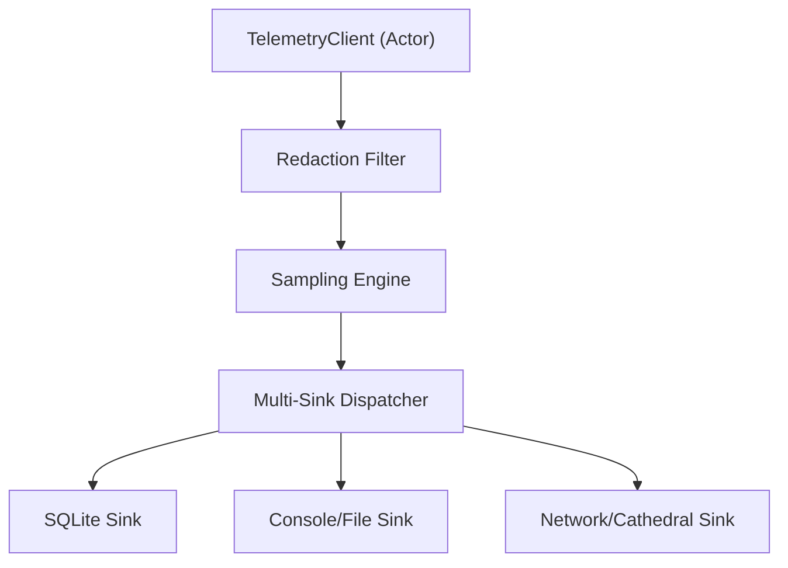

# TelemetryCore

**Structured telemetry, event logging, and observability for Anigma.**

`TelemetryCore` provides a unified system for recording events, metrics, and structured data across the platform. It includes support for data redaction (privacy), sampling (performance), and multiple sink types (persistence, network, console).

## Architecture

`TelemetryCore` uses a multi-sink pipeline to route structured events through privacy and performance filters.



## Core Features

- **Multi-Sink**: Emit events to multiple targets simultaneously (SQLite, log files, cloud).
- **Redaction**: Automatic protection of sensitive data through configurable `RedactionPolicy`.
- **Sampling**: Integrated sampling rates to control data volume in high-throughput systems.
- **Structured Data**: Uses `TelemetryValue` for type-safe but flexible metadata.
- **Privacy First**: Designed for FERPA-safe student data handling through local-first hashing and redaction.

## Core Types

### TelemetryEvent
The atomic unit of information in the telemetry system.

```swift
public struct TelemetryEvent: Codable, Sendable {
    public let eventID: UUID
    public let type: String
    public let timestamp: Date
    public let metadata: [String: TelemetryValue]
}
```

### TelemetryClient
The central actor for event submission, ensuring thread-safe processing.

```swift
public actor TelemetryClient {
    public func record(type: String, metadata: [String: TelemetryValue] = [:]) async
    public func addSink(_ sink: any TelemetrySink) async
}
```

## Usage Examples

### Basic Event Recording
```swift
import TelemetryCore

let telemetry = TelemetryClient()
await telemetry.record(type: "file_created", metadata: [
    "path": .string("/docs/paper.pdf"),
    "size": .integer(1024)
])
```

### Configured Redaction
```swift
let policy = RedactionPolicy(patterns: [
    "email": "[A-Z0-9._%+-]+@[A-Z0-9.-]+\\.[A-Z]{2,}"
])

let client = TelemetryClient(redactionPolicy: policy)
// All recorded events will be filtered for email patterns before reaching sinks.
```

## Thread Safety

- **Actors**: `TelemetryClient` and most `TelemetrySink` implementations are actors.
- **Immutability**: `TelemetryEvent` and related value types are `Sendable` structs.
- **Strict Concurrency**: Fully enabled across the module.

## Dependencies

- **AnigmaPrimitives**: Core hashing and base types.
- **AnigmaCore**: Basic foundations and logging interfaces.

## See Also

- [ObservatoriumModule](../ObservatoriumModule/README.md) - System-wide observability and dashboard.
- [ExecutionCore](../ExecutionCore/README.md) - Telemetry-gated execution receipts.

## License

Part of the Anigma project. See LICENSE for details.
