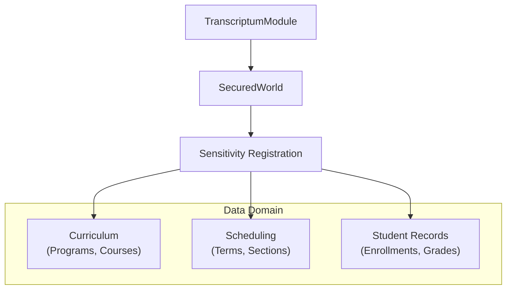

# TranscriptumModule

**The academic records domain for the Anigma ecosystem.**

`TranscriptumModule` (from Latin *transcriptum* – "transcript, written copy") provides foundational support for managing institutional academic records. it is designed to handle complex curricula, student enrollments, and performance records while ensuring strict compliance with privacy regulations like FERPA (Family Educational Rights and Privacy Act).

## Architecture

Transcriptum operates as a high-security overlay within the Anigma ecosystem, leveraging the `SecuredWorld` for data sensitivity enforcement:



## Core Components

### 1. Curriculum & Scheduling
- `ProgramComponent`: Defines a course of study or degree path.
- `CourseComponent`: Fundamental academic unit with title, units, and description.
- `TermComponent`: Defines an academic period (e.g., Summer 2025).
- `CourseSectionComponent`: A specific instance of a course with scheduling and instructor data.

### 2. Student Records (FERPA-Restricted)
- `EnrollmentComponent`: Links a student entity to a specific course section.
- `GradeRecordComponent`: Stores performance data and credits earned.
- `StudentAcademicProfileComponent`: Aggregates standing, GPA, and progress towards a degree.
- `DegreeAwardComponent`: Records completed degrees and certifications.

### 3. Domain Identifiers
The module uses dedicated value types for common academic identifiers to ensure type safety:
- `StudentRecordId`: Typically the student ID number.
- `CourseId`: e.g., "CS-101".
- `TermId`: e.g., "2025SP".
- `SectionId`: e.g., "CS-101-001-2025SP".

## Usage

### Module Initialization
```swift
import TranscriptumModule

// Initialize with a SecuredWorld to register data sensitivities
await TranscriptumModule.initialize(with: securedWorld)
```

### Institutional Integration
Transcriptum can be used either as an overlay for external Student Information Systems (SIS) or as the primary system of record.

- **SIS Overlay**: Mirrors data from an external DB (like Ellucian Banner or Oracle PeopleSoft) and adds Anigma-specific annotations (e.g., accessibility needs).
- **System of Record**: Manages the complete lifecycle of curriculum and student records natively in `DatabaseCore`.

### FERPA Compliance
All components containing student data are registered with the `.restricted` sensitivity tier:

```swift
// Example from initialization
await world.registerComponentSensitivity(
    EnrollmentComponent.self,
    sensitivity: .restricted,
    categories: ["academic", "student_record", "ferpa"]
)
```

## Thread Safety

- **Identity-First**: Most data structures are immutably defined as `structs`.
- **Governed Mutation**: All changes to student records must flow through governance-controlled systems.
- **Strict Concurrency**: Fully enabled across the module to ensure safe academic data handling.

## Dependencies

- **AnigmaCore**: Core ECS and sensitivity management (`SecuredWorld`).
- **Foundation**: Core types and UUIDs.

## See Also

- [FERPA Compliance Technical Note](../../Docs/compliance/ferpa-implementation.md)
- [Course Catalog Schema](../../Docs/academic/catalog-schema.md)
