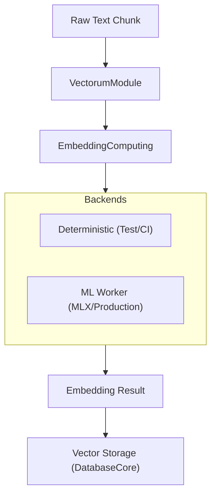

# VectorumModule

**Semantic search and vector embedding services.**

`VectorumModule` provides the infrastructure for computing, storing, and retrieving vector embeddings of text data. These embeddings are the foundation for semantic search, similarity matching, and advanced retrieval-augmented generation (RAG) workflows in the Anigma ecosystem.

## Architecture

Vectorum bridges the gap between raw text and high-dimensional vector space:



## Core Components

### 1. Embedding Computing
The system responsible for transforming text into numerical vectors.
- `EmbeddingComputing` (Protocol): The standard interface for all embedding backends.
- `DeterministicEmbeddingComputer`: A high-performance, predictable backend that uses hashing to generate vectors. Ideal for CI testing and deterministic pipelines.
- `MLWorkerEmbeddingComputer`: An adapter that delegates tasks to the `MLWorkerExecutable` (using MLX-optimized models like BERT or Mistral-Embed). *Note: Currently in stub mode.*

### 2. Result Modeling
- `EmbeddingResult`: A standardized container for computed vectors, input hashes, and model metadata.

## Usage

### Computing Embeddings (Deterministic)
```swift
import VectorumModule

let computer = DeterministicEmbeddingComputer(dimension: 384)
let result = try await computer.computeEmbeddings(
    modelID: "all-minilm-v6",
    inputs: ["Hello world", "Anigma Core is great"],
    normalize: true
)

print("First vector: \(result.vectors[0])")
```

### Integrated Search Flow
Vectorum is typically used in conjunction with `DatabaseCore` to perform vector similarity searches (K-Nearest Neighbors):

```swift
// 1. Compute query vector
let queryVector = try await computer.computeEmbeddings(...)

// 2. Perform search in Database
let matches = try await db.searchNear(vector: queryVector, limit: 10)
```

## Future Roadmap

- **ML Worker Integration**: Complete the subprocess wiring for native Apple Silicon acceleration via MLX.
- **Vector Indexing**: Integrate HNSW (Hierarchical Navigable Small World) or IVF-Flat indexing for high-speed retrieval over millions of vectors.
- **Semantic Caching**: Cache computed embeddings in `MLOutputCache` to avoid redundant computation.

## Thread Safety

- **Stateless Computers**: Embedding computers are designed as stateless providers, making them inherently thread-safe.
- **Async Execution**: All embedding operations are asynchronous, preventing blocking of the main thread during heavy computation.

## Dependencies

- **ContractsCore**: Core DTOs and key derivation utilities.
- **Foundation**: Basic data types and task management.

## See Also

- [Semantic Search Specification](../../Docs/retrieval/semantic-search.md)
- [ML Worker Documentation](../../Docs/inference/ml-worker.md)
